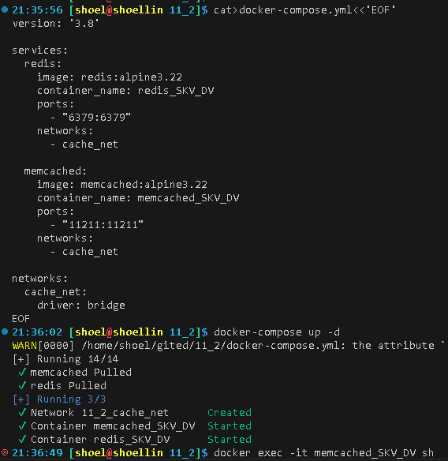
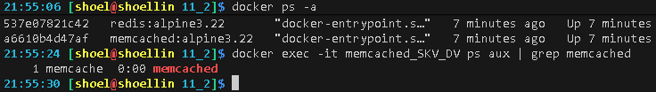
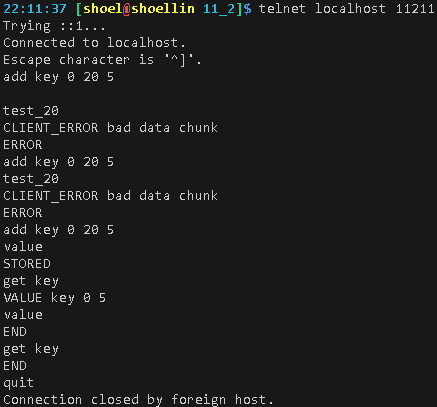
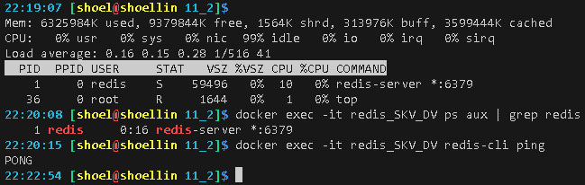
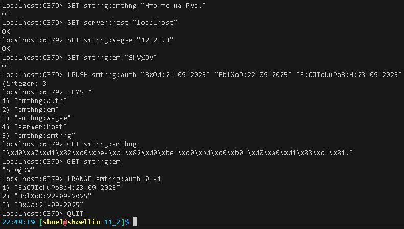
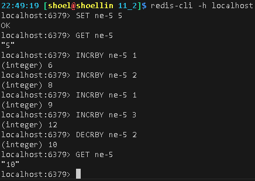

# Домашнее задание к занятию «`Кеширование Redis/memcached`» `Скворцов Денис`

### Инструкция по выполнению домашнего задания

1. Сделайте fork [репозитория c шаблоном решения](https://github.com/netology-code/sys-pattern-homework) к себе в Github и переименуйте его по названию или номеру занятия, например, https://github.com/имя-вашего-репозитория/gitlab-hw или https://github.com/имя-вашего-репозитория/8-03-hw).
2. Выполните клонирование этого репозитория к себе на ПК с помощью команды `git clone`.
3. Выполните домашнее задание и заполните у себя локально этот файл README.md:
   - впишите вверху название занятия и ваши фамилию и имя;
   - в каждом задании добавьте решение в требуемом виде: текст/код/скриншоты/ссылка;
   - для корректного добавления скриншотов воспользуйтесь инструкцией [«Как вставить скриншот в шаблон с решением»](https://github.com/netology-code/sys-pattern-homework/blob/main/screen-instruction.md);
   - при оформлении используйте возможности языка разметки md. Коротко об этом можно посмотреть в [инструкции по MarkDown](https://github.com/netology-code/sys-pattern-homework/blob/main/md-instruction.md).
4. После завершения работы над домашним заданием сделайте коммит (`git commit -m "comment"`) и отправьте его на Github (`git push origin`).
5. Для проверки домашнего задания преподавателем в личном кабинете прикрепите и отправьте ссылку на решение в виде md-файла в вашем Github.
6. Любые вопросы задавайте в чате учебной группы и/или в разделе «Вопросы по заданию» в личном кабинете.

Желаем успехов в выполнении домашнего задания.

---

### Задание 1. Кеширование 

Приведите примеры проблем, которые может решить кеширование. 

*Приведите ответ в свободной форме.*

Общие проблемы, решаемые сервисами кеширования при наличии большого количества часто запрашиваемых данных и не статичных данных:
* Снижение нагрузки, тем самым высвобождаем ресурсы для основных функций систем за счет уменьшения количества прямых запросов к этим системам. 
* Ускорение времени отклика для клиентских запросов, благодаря быстрому доступу к часто запрашиваемым данным в системе кеширования при возможно минимамльном обращении к данным функциональной системы.
* Выделение сервисов кеширования в отдельные системы дает возможность в масштабируемость, что позволяет подстраиваться под увеличение пользовательского трафика на рабочую систему.
---

### Задание 2. Memcached

Установите и запустите memcached.

*Приведите скриншот systemctl status memcached, где будет видно, что memcached запущен.*

##### ввиду того что запустил образ alpine BusyBox без OpenRC 
##### службы управляются напрямую через процессы

```bash
sudo pacman -Syu inetutils

sudo systemctl enable --now  docker.service

cat>docker-compose.yml<<'EOF'
version: '3.8'

services:
  redis:
    image: redis:alpine3.22
    container_name: redis_SKV_DV
    ports:
      - "6379:6379"
    networks:
      - cache_net

  memcached:
    image: memcached:alpine3.22
    container_name: memcached_SKV_DV
    ports:
      - "11211:11211"
    networks:
      - cache_net

networks:
  cache_net:
    driver: bridge
EOF

docker-compose up -d

docker ps -a

docker exec -it memcached_SKV_DV ps aux | grep memcached

docker exec -it memcached_SKV_DV ps top
```

---

### Задание 3. Удаление по TTL в Memcached

Запишите в memcached несколько ключей с любыми именами и значениями, для которых выставлен TTL 5. 

*Приведите скриншот, на котором видно, что спустя 5 секунд ключи удалились из базы.*


```bash
telnet localhost 11211

add key 0 20 5

value

get key

get key

quit
```

---

### Задание 4. Запись данных в Redis

Запишите в Redis несколько ключей с любыми именами и значениями. 

*Через redis-cli достаньте все записанные ключи и значения из базы, приведите скриншот этой операции.*
 

```bash
sudo pacman -S redis

docker ps -a

docker exec -it redis_SKV_DV top

docker exec -it redis_SKV_DV ps aux | grep redis

docker exec -it redis_SKV_DV redis-cli ping

redis-cli -h localhost

SET server:host "localhost"

SET smthng:smthng "Что-то на Рус."

SET smthng:a-g-e "1232353"

SET smthng:em "SKV@DV"

LPUSH smthng:auth "BxOd:21-09-2025" "BblXoD:22-09-2025" "3a6JIoKuPoBaH:23-09-2025"

KEYS *

GET smthng:smthng

LRANGE smthng:auth 0 -1

QUIT
```
---

## Дополнительные задания (со звёздочкой*)
Эти задания дополнительные, то есть не обязательные к выполнению, и никак не повлияют на получение вами зачёта по этому домашнему заданию. Вы можете их выполнить, если хотите глубже разобраться в материале.

### Задание 5*. Работа с числами 

Запишите в Redis ключ key5 со значением типа "int" равным числу 5. Увеличьте его на 5, чтобы в итоге в значении лежало число 10.  

*Приведите скриншот, где будут проделаны все операции и будет видно, что значение key5 стало равно 10.*


```bash
redis-cli -h localhost

SET ne-5 5

GET ne-5

INCRBY ne-5 1

INCRBY ne-5 2

INCRBY ne-5 1

INCRBY ne-5 3

DECRBY ne-5 2

GET ne-5

quit
```
---