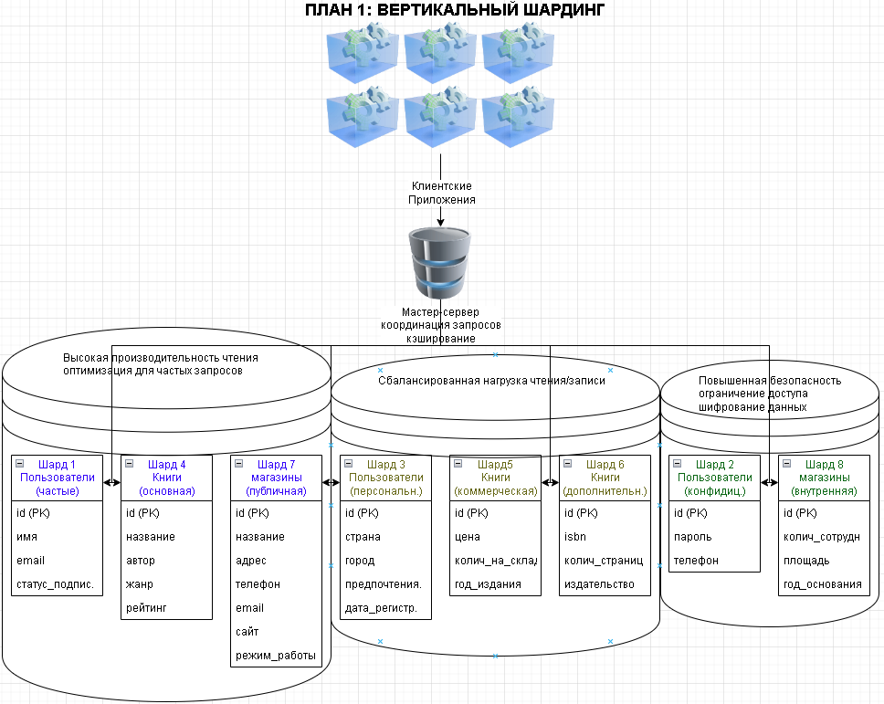
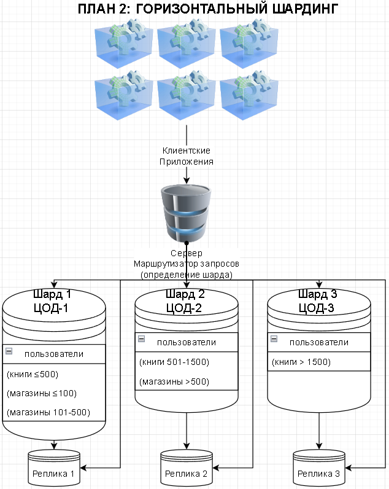

# Домашнее задание к занятию «`Репликация и масштабирование. Часть 2`» `Скворцов Денис`

### Инструкция по выполнению домашнего задания

1. Сделайте fork [репозитория c шаблоном решения](https://github.com/netology-code/sys-pattern-homework) к себе в Github и переименуйте его по названию или номеру занятия, например, https://github.com/имя-вашего-репозитория/gitlab-hw или https://github.com/имя-вашего-репозитория/8-03-hw).
2. Выполните клонирование этого репозитория к себе на ПК с помощью команды `git clone`.
3. Выполните домашнее задание и заполните у себя локально этот файл README.md:
   - впишите вверху название занятия и ваши фамилию и имя;
   - в каждом задании добавьте решение в требуемом виде: текст/код/скриншоты/ссылка;
   - для корректного добавления скриншотов воспользуйтесь инструкцией [«Как вставить скриншот в шаблон с решением»](https://github.com/netology-code/sys-pattern-homework/blob/main/screen-instruction.md);
   - при оформлении используйте возможности языка разметки md. Коротко об этом можно посмотреть в [инструкции по MarkDown](https://github.com/netology-code/sys-pattern-homework/blob/main/md-instruction.md).
4. После завершения работы над домашним заданием сделайте коммит (`git commit -m "comment"`) и отправьте его на Github (`git push origin`).
5. Для проверки домашнего задания преподавателем в личном кабинете прикрепите и отправьте ссылку на решение в виде md-файла в вашем Github.
6. Любые вопросы задавайте в разделе «Вопросы по заданию» в личном кабинете.

Желаем успехов в выполнении домашнего задания.

---

## Задание 1

Опишите основные преимущества использования масштабирования методами:

- активный master-сервер и пассивный репликационный slave-сервер; 
- master-сервер и несколько slave-серверов;

*Дайте ответ в свободной форме.*

---

***Репликация баз данных подразумевает наличие основного (master) сервера, который распространяет все изменения на один или несколько реплицирующих (slave или replica) серверов. Реплики постоянно синхронизируются с master-сервером.***

---

### 1) Один master-сервер и один пассивный slave-сервер

В этой конфигурации slave-сервер копирует данные с master-сервера, но не принимает запросы на запись. Он представляет собой готовую к использованию копию master-сервера на случай его отказа.

**Преимущества:**

- **Повышенная отказоустойчивость и надёжность:** обеспечивается «горячее» резервирование данных. При выходе из строя master-сервера slave-сервер может быть оперативно переведён в роль master-сервера. Переход на реплику (`failover`) может быть как автоматизирован, так и выполнен вручную.  
- **Резервное копирование без остановки основного сервера:** резервные копии создаются с реплики, не нагружая при этом master-сервер.  

---

### 2) Один master-сервер и несколько slave-серверов

В этой схеме один master-сервер обрабатывает все запросы на запись, а несколько slave-серверов получают копии данных и, как правило, используются для обслуживания запросов на чтение.

**Преимущества:**

- **Распределение нагрузки чтения:** запросы на чтение (`SELECT`) могут направляться на один или несколько slave-серверов, что снижает нагрузку на master-сервер и позволяет ему сосредоточиться на операциях записи (`INSERT`/`UPDATE`/`DELETE`).  
- **Доступность операций чтения:** даже при отказе одного из slave-серверов остальные продолжают обрабатывать запросы на чтение.  
- **Масштабируемость пропускной способности чтения:** при росте нагрузки на чтение в систему можно добавлять новые реплики, увеличивая суммарную производительность.  
- **Повышенная отказоустойчивость:** наличие нескольких реплик повышает надёжность системы. Даже при выходе из строя одного или нескольких slave-серверов работа продолжается, а в случае отказа master-сервера любой из slave-серверов может быть повышен до его роли.  
- **Географическая доступность:** размещение slave-серверов в различных географических регионах позволяет сократить задержки (latency) для пользователей, расположенных ближе к этим репликам, особенно при выполнении операций чтения.

---

## Задание 2

Разработайте план для выполнения горизонтального и вертикального шардинга базы данных. База данных состоит из трёх таблиц: 

- пользователи, 
- книги, 
- магазины (столбцы произвольно). 

Опишите принципы построения системы и их разграничение или разбивку между базами данных.

*Пришлите блок-схему, где и что будет располагаться. Опишите, в каких режимах будут работать сервера.* 

### ПЛАН 1: ВЕРТИКАЛЬНЫЙ ШАРДИНГ

#### Принципы построения системы

Вертикальная фрагментация подразумевает разделение по таблицам в соответствии с функциональным назначением этих таблиц. Такой тип фрагментации обеспечивает оптимизацию запросов к базам данных в зависимости от типа выполняемых запросов. Дополнительно этот подход обеспечивает улучшенную безопасность базы данных.

##### Разбивка таблиц:

**Таблица "пользователи" разделена на 3 шарда:**
- **Шард 1 (часто используемые данные):** id, имя, email, статус_подписки
- **Шард 2 (конфиденциальные данные):** id, пароль, телефон
- **Шард 3 (персональные данные):** id, страна, город, предпочтения_чтения, дата_регистрации

**Таблица "книги" разделена на 3 шарда:**
- **Шард 4 (основная информация):** id, название, автор, жанр, рейтинг
- **Шард 5 (коммерческая информация):** id, цена, количество_на_складе, год
- **Шард 6 (дополнительная информация):** id, isbn, количество_страниц, издательство

**Таблица "магазины" разделена на 2 шарда:**
- **Шард 7 (публичная информация):** id, название, адрес, телефон, email, сайт, режим_работы
- **Шард 8 (внутренняя информация):** id, количество_сотрудников, площадь, год_основания

##### Режимы работы серверов

**Мастер-сервер:**
- Режим координации запросов
- Оптимизация и кэширование часто запрашиваемых данных
- Балансировка нагрузки между шардами
- Мониторинг состояния системы
- Режим работы: с активной репликацией для обеспечения высокой доступности

**Серверы шардов:**
- **Шард 1, 4, 7:** Высокая производительность чтения, оптимизация под запросы
- **Шард 2, 8:** Улучшенные функции безопасности и шифрование данных
- **Шард 3, 5, 6:** Сбалансированная нагрузка чтения/записи
- Масштабирование при пиковых нагрузках

### ПЛАН 2: ГОРИЗОНТАЛЬНЫЙ ШАРДИНГ

#### Принципы построения системы

Горизонтальный шардинг: данные при горизонтальной фрагментации разделяются по строкам на основе ключа шардирования. Такая техника обеспечивает наилучшие результаты для приложений с большими объемами данных.

##### Разбивка таблиц по ключам шардирования:

**Таблица "пользователи" (ключ: ЦОД-№):**
- **Шард 1:** Пользователи из ЦОД-1
- **Шард 2:** Пользователи из ЦОД-2
- **Шард 3:** Пользователи из ЦОД-3

**Таблица "книги" (ключ: цена):**
- **Шард 1:** Книги с ценой ≤ 500 руб
- **Шард 2:** Книги с ценой от 501 до 1500 руб
- **Шард 3:** Книги с ценой > 1500 руб

**Таблица "магазины" (ключ: площадь):**
- **Шард 1:** Магазины с площадью ≤ 100 м²
- **Шард 2:** Магазины с площадью от 101 до 500 м²
- **Шард 3:** Магазины с площадью > 500 м²

##### Режимы работы серверов

**Маршрутизатор запросов:**
- Режим работы: с активной репликацией для отказоустойчивости
- Анализ SQL-запросов для определения целевого шарда
- Кэширование маршрутов для часто выполняемых запросов
- Распределение нагрузки между шардами
- Обработка транзакций, затрагивающих несколько шардов
- Мониторинг распределения данных между шардами
- Ребалансинг при неравномерной нагрузке
- Управление схемой шардов

**Основные серверы шардов (Шард 1, 2, 3):**
- Режим горячего хранения: для активно используемых данных
- Обработка запросов только в своей зоне ответственности
- Локальная оптимизация индексов и хранения
- Режим работы: с высокой доступностью
- Горизонтальное масштабирование при росте данных

---

##### Особенности реализации

**Для вертикального шардинга:**
- Используется `Foreign Data Wrapper` для объединения данных
- Создаются `VIEW` для обеспечения прозрачности для приложения
- Реализуются правила маршрутизации (`RULES`) для автоматического распределения запросов
- Оптимизация индексов под специфику запросов к каждому шарду

**Для горизонтального шардинга:**
- Реализуется единый ключ шардирования для связанных таблиц
- Используется `consistent hashing` для распределения данных
- Создается каталог шардов для динамического определения местоположения данных
- Реализуется механизм двухфазного коммита для транзакций между шардами

##### Заключение

- Для экстремально больших объемов данных более предпочтителен горизонтальный шардинг. 
- Для специализированных запросов и безопасного хранения конфиденциальной информации оптимальным является вертикальный шардинг.

---