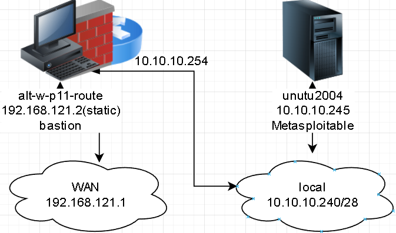
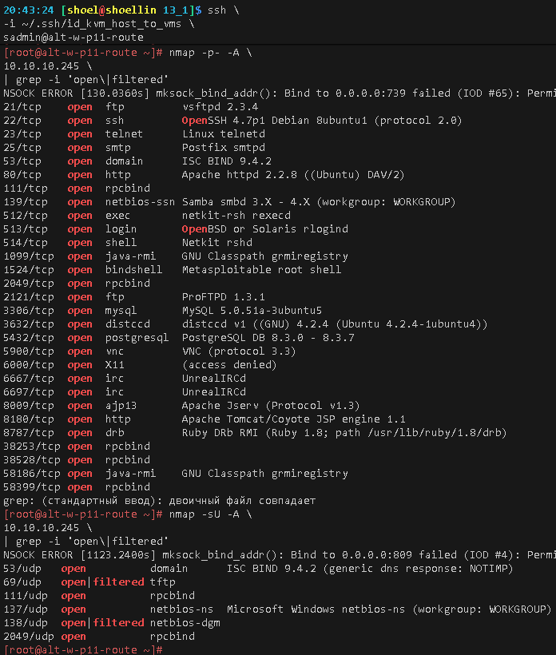
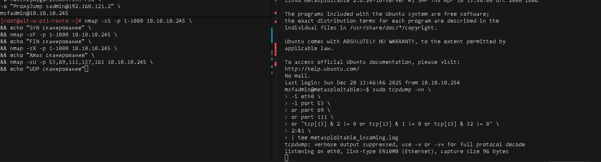

# Домашнее задание к занятию «`Уязвимости и атаки на информационные системы`» `Скворцов Денис`

### Инструкция по выполнению домашнего задания

1. Сделайте fork [репозитория c шаблоном решения](https://github.com/netology-code/sys-pattern-homework) к себе в Github и переименуйте его по названию или номеру занятия, например, https://github.com/имя-вашего-репозитория/gitlab-hw или https://github.com/имя-вашего-репозитория/8-03-hw).
2. Выполните клонирование этого репозитория к себе на ПК с помощью команды `git clone`.
3. Выполните домашнее задание и заполните у себя локально этот файл README.md:
   - впишите вверху название занятия и ваши фамилию и имя;
   - в каждом задании добавьте решение в требуемом виде: текст/код/скриншоты/ссылка;
   - для корректного добавления скриншотов воспользуйтесь инструкцией [«Как вставить скриншот в шаблон с решением»](https://github.com/netology-code/sys-pattern-homework/blob/main/screen-instruction.md);
   - при оформлении используйте возможности языка разметки md. Коротко об этом можно посмотреть в [инструкции по MarkDown](https://github.com/netology-code/sys-pattern-homework/blob/main/md-instruction.md).
4. После завершения работы над домашним заданием сделайте коммит (`git commit -m "comment"`) и отправьте его на Github (`git push origin`).
5. Для проверки домашнего задания преподавателем в личном кабинете прикрепите и отправьте ссылку на решение в виде md-файла в вашем Github.
6. Любые вопросы задавайте в чате учебной группы и/или в разделе «Вопросы по заданию» в личном кабинете.

Желаем успехов в выполнении домашнего задания.

------

### Задание 1

Скачайте и установите виртуальную машину Metasploitable: https://sourceforge.net/projects/metasploitable/.

Это типовая ОС для экспериментов в области информационной безопасности, с которой следует начать при анализе уязвимостей.

Просканируйте эту виртуальную машину, используя **nmap**.

Попробуйте найти уязвимости, которым подвержена эта виртуальная машина.

Сами уязвимости можно поискать на сайте https://www.exploit-db.com/.

Для этого нужно в поиске ввести название сетевой службы, обнаруженной на атакуемой машине, и выбрать подходящие по версии уязвимости.

Ответьте на следующие вопросы:

- Какие сетевые службы в ней разрешены?
- Какие уязвимости были вами обнаружены? (список со ссылками: достаточно трёх уязвимостей)
  
*Приведите ответ в свободной форме.*  

#### Была собрана пинтест лаборатория




#### При сканировании
```bash
nmap -p- -A \
10.10.10.245 \
| grep -i 'open\|filtered'
```
где:
* `-p-` Сканирует все 65535 TCP-порты
* `-A` Агрессивный набор опций сканирования (включает в себя `-sC`, `-sV`, `-O`, `--traceroute`)
* `-sV` Определяет версии служб, работающих на открытых портах
* `-sC` Запускает набор встроенных NSE-скриптов по умолчанию
* `-O` определение ОС
* `--traceroute` выполняет трассировку до хоста

```bash
nmap -sU -A \
10.10.10.245 \
| grep -i 'open\|filtered'
где:
* `-sU` для сканирования UDP-портов
* `-A` Агрессивный набор опций сканирования (включает в себя `-sC`, `-sV`, `-O`, `--traceroute`)
* `-sV` Определяет версии служб, работающих на открытых портах
* `-sC` Запускает набор встроенных NSE-скриптов по умолчанию
* `-O` определение ОС
* `--traceroute` выполняет трассировку до хоста
```
#### Были выявлены следующие сетевые службы TCP и UDP


---

#### из 3х найденных уязвимостей

1. ISC BIND 9.4.2 - DNS Cache Poisoning (Kaminsky flaw) - RCE / domain hijacking (порт 53) CVE-2008-1447
    * Описание: Атакующий отправляет поддельные DNS-ответы, чтобы внедрить в кэш целевого резолвера ложные NS-записи для домена, полный контроль над разрешением имён (например, перенаправление example.com на сервер злоумышленника). Реализовано в Metasploit как auxiliary/spoof/dns/bailiwicked_domain.  
    * Уязвимая служба: ISC BIND 9.4.2  
    * Тип уязвимости: предсказуемый ID запроса + статические исходные порты, возможность подмены NS-записей в кэше резолвера  
    * Exploit-DB ID: https://www.exploit-db.com/exploits/6122


2. UnrealIRCd 3.2.8.1 Backdoor - RCE (порты 6667/6697) - CVE-2010-2075

    * Описание:  При отправке строки AB; wget http://... или AB; nc -e /bin/sh ... - выполняется произвольная команда от root.
    * Версия: затрагивает 3.2.8.1
    * Exploit-DB ID: https://www.exploit-db.com/exploits/16922

3. distccd v1 - Remote Command Execution (порт 3632) - CVE-2004-2687
    * Уязвимая служба: distccd v1
    * Описание:  Distccd предназначен для распределённой компиляции. В v1 нет аутентификации, можно передать команду через DIST-заголовок. Пример: DIST /bin/sh -c 'id > /tmp/pwned'
    * Exploit-DB: https://www.exploit-db.com/exploits/9915
---


### Задание 2

Проведите сканирование Metasploitable в режимах SYN, FIN, Xmas, UDP.

Запишите сеансы сканирования в Wireshark.

Ответьте на следующие вопросы:

- Чем отличаются эти режимы сканирования с точки зрения сетевого трафика?
- Как отвечает сервер?

#### `SYN` сканирование
```
nmap -sS -p 1-1000 10.10.10.245
```
   * Флаги в заголовке пакета `SYN=1`, `ACK=0`
   * Инициирует "половинное" `TCP`-соединение. 
   Если порт открыт - сервер отвечает `SYN`+`ACK`; если закрыт - `RST`. 
   Не завершает соединение.

#### `FIN` сканирование
```
nmap -sF -p 1-1000 10.10.10.245 
```
   * Флаги в заголовке пакета `FIN=1`
   * Отправляет пакет "завершения", не имея соединения.
   Большинство реализаций стека описанного в RFC 793 отвечают `RST` на `FIN` без соединения,
   хотя должен игнорироваться

#### `Xmas` сканирование
```
nmap -sX -p 1-1000 10.10.10.245 
```
   * Флаги в заголовке пакета `FIN=1`, `PSH=1`, `URG=1`
   * "Ёлочная" комбинация флагов. Как и `FIN`, 
   некорректен без установленного соединения. 
   Согласно RFC 793, реакция на полученный пакет с данными флагами может отличаться от ПО или оборудования различных вендоров.

#### `UDP` сканирование
```
nmap -sU -p 53,69,111,137,138,2049 10.10.10.245
```
   * UDP-датаграмма не содержит флагов присущих `TCP`
   * Сервер может:
         * ничего не ответить - порт, возможно, открыт (сервис молчит); 
         * отправить ICMP type 3 code 3 (Port Unreachable) - порт закрыт;
         * ответить UDP-пакетом - порт открыт;



*Приведите ответ в свободной форме.*
