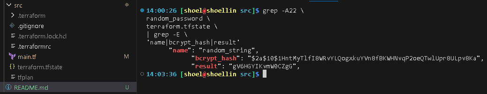

# Домашнее задание к занятию «Введение в Terraform» `Скворцов Денис`

### Цели задания

1. Установить и настроить Terrafrom.
2. Научиться использовать готовый код.

------

### Чек-лист готовности к домашнему заданию

1. Скачайте и установите **Terraform** версии >=1.12.0 . Приложите скриншот вывода команды ```terraform --version```.
2. Скачайте на свой ПК этот git-репозиторий. Исходный код для выполнения задания расположен в директории **01/src**.
3. Убедитесь, что в вашей ОС установлен docker.

------

### Инструменты и дополнительные материалы, которые пригодятся для выполнения задания

1. Репозиторий с ссылкой на зеркало для установки и настройки Terraform: [ссылка](https://github.com/netology-code/devops-materials).
2. Установка docker: [ссылка](https://docs.docker.com/engine/install/ubuntu/). 
------
### Внимание!! Обязательно предоставляем на проверку получившийся код в виде ссылки на ваш github-репозиторий!
------

### Задание 1

1. Перейдите в каталог [**src**](https://github.com/netology-code/ter-homeworks/tree/main/01/src). Скачайте все необходимые зависимости, использованные в проекте.
```bash
# Клонирование репозитория
git clone \
https://github.com/netology-code/ter-homeworks.git

# Удаление всех файлов и каталогов кроме каталога 01 и его содержимого
find ter-homeworks/ \
-mindepth 1 \
-not -path "*01*" \
-delete

# Перемещение нужного каталога в корневую директорию с новым именем 16_1
mv ter-homeworks/01 16_1

# Переход в каталог по последней переменной вывода последней команды (16_1)
cd !$
```
2. Изучите файл **.gitignore**. В каком terraform-файле, согласно этому .gitignore, допустимо сохранить личную, секретную информацию?(логины,пароли,ключи,токены итд)
```
По списку gitignore, 
в terraform-файле personal.auto.tfvars хранятся заданные пользователем данные,
а в tfstate будет сформирован при создании проекта и пользовательские данные будут отображены в этом файле.
```
3. Выполните код проекта. Найдите  в state-файле секретное содержимое созданного ресурса **random_password**, пришлите в качестве ответа конкретный ключ и его значение.
```bash
# вывод версии terraform программы на устройстве
terraform -v
```
```
Terraform v1.14.6
on linux_amd64
```
```bash
# Смена требований к версии terraform c 1.2.X, на 1.X
sed -i 's/1.12.0/1.12/' \
main.tf

# Проверка tf файлов проекта и создание файла запуска terraform
terraform init --upgrade \
&& terraform validate \
&& terraform fmt \
&& terraform plan -out=tfplan

# Применение файла запуска terraform
terraform apply "tfplan"

# Вывод результата типа блока ресурса random_password
grep -A22 \
random_password \
terraform.tfstate \
| grep -E \
'name|bcrypt_hash|result'
```
```
      "name": "random_string",
            "bcrypt_hash": "$2a$10$1HntMyTlfI8WRvYLQogxkuYVn8fBKWHNvqP2oeQTwlUpr8ULpv8Ka",
            "result": "gV6HGYIKvmW0CZgG",
```



4. Раскомментируйте блок кода, примерно расположенный на строчках 29–42 файла **main.tf**.
Выполните команду ```terraform validate```. Объясните, в чём заключаются намеренно допущенные ошибки. Исправьте их.
```bash
# Удаление знаков многострочных комментариев tf после 20 строки файла main.tf
sed -i '20,$ { s|/\*||g; s|\*/||g }' \
main.tf

# Проверка tf файлов проекта
terraform validate
```
```
У создаваемого ресурса resource "docker_image" отсутствует label, отвечающий за name, так как дальнейшие запросы ссылаются на этот блок идут на **.nginx.** (docker_image.nginx.image_id), то нужно добавить label с наименованием "nginx"

У наименования ресурса resource "docker_container" "1nginx" идет не соответствие синтаксиса HCL и не должно начинаться с цифры, только с буквы или нижнего подчеркивания

У блока resource "docker_container" в значении идентификатора name присутствует ссылка на блок resource "random_password" с не правильным обращением по имени

В том же блоке, обращение к аттрибуту содержащей "result" в том же идентификаторе написан с синтаксической ошибкой HCL, использована Заглавна буква "T" в "result", что не допустимо для данного ресурса
```
```bash
# Добавление label name "nginx" ресурсу "docker_image" 
sed -i 's|ge" {|ge" "nginx" {|' \
main.tf

# Исправление HCL синтаксиса name Должен начинаться с буквы или нижнего подчеркивания 
sed -i 's/1ng/n1g/' \
main.tf

# Исправление ошибок обращения к наименованию ресурса "random_password" и HCL синтаксис обращению к выводу аттрибута result 
sed -i 's|_FAKE.resulT|.result|' \
main.tf

# Проверка tf файлов проекта
terraform validate
```
```
Success! The configuration is valid.
```

5. Выполните код. В качестве ответа приложите: исправленный фрагмент кода и вывод команды ```docker ps```.
```h
resource "docker_image" "nginx" {
  name         = "nginx:latest"
  keep_locally = true
}

resource "docker_container" "n1ginx" {
  image = docker_image.nginx.image_id
  name  = "example_${random_password.random_string.result}"

  ports {
    internal = 80
    external = 9090
  }
}
```
```bash
# Запуск службы докер в системе
sudo systemctl \
start \
docker

# Проверка tf файлов проекта и создание файла запуска terraform
terraform init --upgrade \
&& terraform validate \
&& terraform fmt \
&& terraform plan -out=tfplan

# Применение файла запуска terraform
terraform apply "tfplan"

docker ps -a
```
```
CONTAINER ID   IMAGE          COMMAND                  CREATED          STATUS          PORTS                  NAMES
0edfa1987890   fd204fe2f750   "/docker-entrypoint.…"   23 seconds ago   Up 22 seconds   0.0.0.0:9090->80/tcp   example_gV6HGYIKvmW0CZgG
```
6. Замените имя docker-контейнера в блоке кода на ```hello_world```. Не перепутайте имя контейнера и имя образа. Мы всё ещё продолжаем использовать name = "nginx:latest". Выполните команду ```terraform apply -auto-approve```.
Объясните своими словами, в чём может быть опасность применения ключа  ```-auto-approve```. Догадайтесь или нагуглите зачем может пригодиться данный ключ? В качестве ответа дополнительно приложите вывод команды ```docker ps```.
```bash
# Замена замена идентификатора name в блоке ресурса "docker_container" для смены имени контейнера
sed -i 's|"example_${[^}]*}"$|"hello_world"|g' \
main.tf

# Автоматическое подтверждение внесенных изменений
terraform validate \
&& terraform apply \
-auto-approve
```
```
docker_container.n1ginx: Destroying... [id=0edfa19878901c80eae6931a4d01bb7638b155cbc9136badb508a49bdb1f5561]
docker_container.n1ginx: Destruction complete after 0s
docker_container.n1ginx: Creating...
docker_container.n1ginx: Creation complete after 0s [id=470be3b8812fb5d871bb3a20b3426113c0e5817202c087cea7e8a419d36bd30b]

Apply complete! Resources: 1 added, 0 changed, 1 destroyed.
```
```bash
# вывод созданного docker контейнера
docker ps -a
```
```
CONTAINER ID   IMAGE          COMMAND                  CREATED          STATUS          PORTS                  NAMES
470be3b8812f   fd204fe2f750   "/docker-entrypoint.…"   59 seconds ago   Up 58 seconds   0.0.0.0:9090->80/tcp   hello_world
```
```
-auto-approve отвечает за автоматическое подтверждение ЛЮБЫХ внесенных изменений в структуре tf проекта,
не все случаи, но в данном, смена имени контейнера, привела к удалению и пересозданию контейнеру.
Данные случаи могут скажем перезапустить часть работающих критически важных сервисов, а не всего стека,
изменить критически важные, используемые в режиме реального времени, данные и все что используется в продакшен среде.

Данный ключ с авто-подтверждение подходит для закрытых CI/CD проектов, для первоначального автоматического развертывания и в нестабильных тестовых инфраструктурах.
```
8. Уничтожьте созданные ресурсы с помощью **terraform**. Убедитесь, что все ресурсы удалены. Приложите содержимое файла **terraform.tfstate**.
```bash
# Уничтожение проекта
terraform destroy
```
```
random_password.random_string: Destroying... [id=none]
random_password.random_string: Destruction complete after 0s
docker_container.n1ginx: Destroying... [id=470be3b8812fb5d871bb3a20b3426113c0e5817202c087cea7e8a419d36bd30b]
docker_container.n1ginx: Destruction complete after 0s
docker_image.nginx: Destroying... [id=sha256:fd204fe2f75024354b1f979d38cc43def9e049cc2df1cda45074d1b84c4f9b3enginx:latest]
docker_image.nginx: Destruction complete after 0s

Destroy complete! Resources: 3 destroyed.
```
```bash
# Вывод состояния проекта tf
cat terraform.tfstate
```
```
{
  "version": 4,
  "terraform_version": "1.14.6",
  "serial": 12,
  "lineage": "0f8010ce-138c-ccb6-98cf-1f29524c8949",
  "outputs": {},
  "resources": [],
  "check_results": null
}
```
9. Объясните, почему при этом не был удалён docker-образ **nginx:latest**. Ответ **ОБЯЗАТЕЛЬНО НАЙДИТЕ В ПРЕДОСТАВЛЕННОМ КОДЕ**, а затем **ОБЯЗАТЕЛЬНО ПОДКРЕПИТЕ** строчкой из документации [**terraform провайдера docker**](https://library.tf/providers/kreuzwerker/docker/latest).  (ищите в классификаторе resource docker_image )
```
В блоке ресурса
```
```bash
resource "docker_image" "nginx" {
  name         = "nginx:latest"
  keep_locally = true
}
```
```
Присутствует аттрибут keep_locally в значении true.
C этим параметром образ докера был удалён только из terraform.tfstate, но не из внутреннего Docker хранилища.
Без этого аттрибута при terraform destroy также производится и удаление образа указанного в tf файле.

В документации присутствует описание этого необязательного параметра
```
```h
keep_locally (Boolean) If true, then the Docker image wont be deleted on destroy operation. If this is false, it will delete the image from the docker local storage on destroy operation.
```

------

## Дополнительное задание (со звёздочкой*)

**Настоятельно рекомендуем выполнять все задания со звёздочкой.** Они помогут глубже разобраться в материале.   
Задания со звёздочкой дополнительные, не обязательные к выполнению и никак не повлияют на получение вами зачёта по этому домашнему заданию. 

### Задание 2*

1. Создайте в облаке ВМ. Сделайте это через web-консоль, чтобы не слить по незнанию токен от облака в github(это тема следующей лекции). Если хотите - попробуйте сделать это через terraform, прочитав документацию yandex cloud. Используйте файл ```personal.auto.tfvars``` и гитигнор или иной, безопасный способ передачи токена!
2. Подключитесь к ВМ по ssh и установите стек docker.
3. Найдите в документации docker provider способ настроить подключение terraform на вашей рабочей станции к remote docker context вашей ВМ через ssh.
4. Используя terraform и  remote docker context, скачайте и запустите на вашей ВМ контейнер ```mysql:8``` на порту ```127.0.0.1:3306```, передайте ENV-переменные. Сгенерируйте разные пароли через random_password и передайте их в контейнер, используя интерполяцию из примера с nginx.(```name  = "example_${random_password.random_string.result}"```  , двойные кавычки и фигурные скобки обязательны!) 
```
    environment:
      - "MYSQL_ROOT_PASSWORD=${...}"
      - MYSQL_DATABASE=wordpress
      - MYSQL_USER=wordpress
      - "MYSQL_PASSWORD=${...}"
      - MYSQL_ROOT_HOST="%"
```

6. Зайдите на вашу ВМ , подключитесь к контейнеру и проверьте наличие секретных env-переменных с помощью команды ```env```. Запишите ваш финальный код в репозиторий.

### Правила приёма работы

Домашняя работа оформляется в отдельном GitHub-репозитории в файле README.md.
Выполненное домашнее задание пришлите ссылкой на .md-файл в вашем репозитории.

### Критерии оценки

Зачёт ставится, если:

* выполнены все задания,
* ответы даны в развёрнутой форме,
* приложены соответствующие скриншоты и файлы проекта,
* в выполненных заданиях нет противоречий и нарушения логики.

На доработку работу отправят, если:

* задание выполнено частично или не выполнено вообще,
* в логике выполнения заданий есть противоречия и существенные недостатки.

