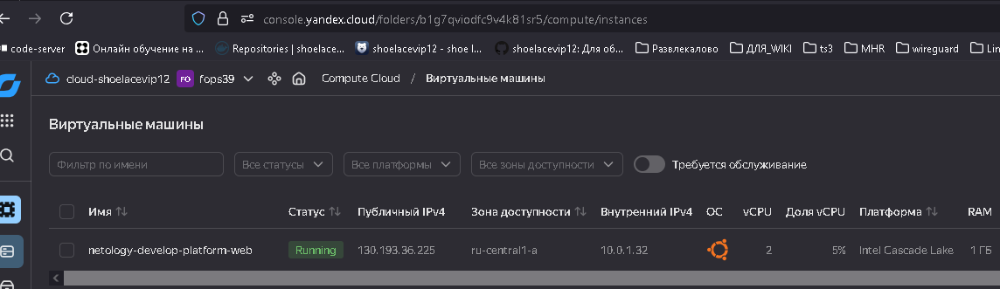
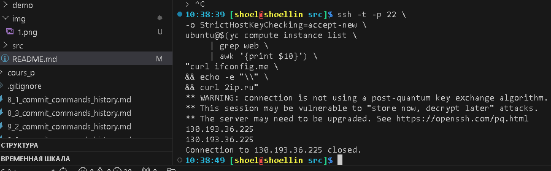
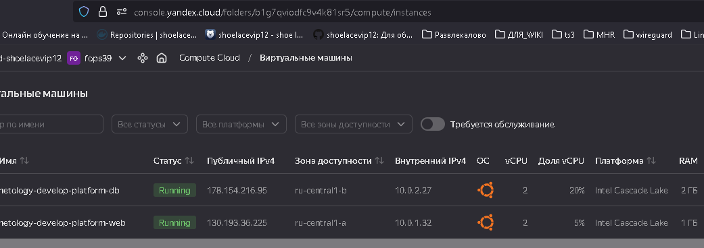

# Домашнее задание к занятию «`Основы Terraform. Yandex Cloud`» `Скворцов Денис`

### Цели задания

1. Создать свои ресурсы в облаке Yandex Cloud с помощью Terraform.
2. Освоить работу с переменными Terraform.


### Чек-лист готовности к домашнему заданию

1. Зарегистрирован аккаунт в Yandex Cloud. Использован промокод на грант.
2. Установлен инструмент Yandex CLI.
3. Исходный код для выполнения задания расположен в директории [**02/src**](https://github.com/netology-code/ter-homeworks/tree/main/02/src).


### Задание 0

1. Ознакомьтесь с [документацией к security-groups в Yandex Cloud](https://cloud.yandex.ru/docs/vpc/concepts/security-groups?from=int-console-help-center-or-nav). 
Этот функционал понадобится к следующей лекции.

------
### Внимание!! Обязательно предоставляем на проверку получившийся код в виде ссылки на ваш github-репозиторий!
------

### Задание 1
В качестве ответа всегда полностью прикладывайте ваш terraform-код в git.
Убедитесь что ваша версия **Terraform** ~>1.12.0

1. Изучите проект. В файле variables.tf объявлены переменные для Yandex provider.
2. Создайте сервисный аккаунт и ключ. [service_account_key_file](https://terraform-provider.yandexcloud.net).
```
# Создание сервисного аккаунта по ранее подключенному yandex cloud
yc iam \
service-account \
create \
--name skv-seracc
```
```
id: ajexxxxxxxxxxxx3micr
folder_id: b1g7qviodfc9v4k81sr5
created_at: "2026-03-10T19:04:52Z"
name: skv-seracc
```
```bash
# Добавление сервисного аккаунта в заранее созданную группу с правами admin на организацию
# Где:
# --id — id группы пользователей. Обязательный параметр.
# --organization-id — идентификатор организации. Обязательный параметр.
# --subject-id — идентификатор участника, которого добавляют в группу.

yc organization-manager group add-members \
--id ajexxxxxxxxxxxxxdk37 \
--organization-id bpxxxxxxxxxxxxxxxk2m \
--subject-id ajexxxxxxxxxxxx3micr

# Создание json ключа к сервисному аккаунту c использованием переменных в ~/.bashrc Для YC
yc iam key create \
--service-account-name $(yc iam \
                        service-account \
                        --folder-id  $YC_FOLDER_ID list \
                        | awk '/skv/{print $4}') \
--output ~/.authorized_key.json \
--folder-id $YC_FOLDER_ID
```
```
id: ajexxxxxxxxxxxx7o215
service_account_id: ajexxxxxxxxxxxx3micr
created_at: "2026-03-10T19:16:05.289441568Z"
key_algorithm: RSA_2048
```
```bash
# Проверка наличия файла
file ~/.authorized_key.json
```
```
/home/shoel/.authorized_key.json: JSON text data
```
4. Сгенерируйте новый или используйте свой текущий ssh-ключ. Запишите его открытую(public) часть в переменную **vms_ssh_public_root_key**.
```bash
# использование ранее сгенерированного ключа в файле tf для переменных variables.tf
sed -i "s|<your_ssh_ed25519_key>|\
$(cat ~/.ssh/id_lab16_1_fops39_ed25519.pub)|" \
variables.tf

# Смена требований к версии terraform c 1.2.X, на 1.X
sed -i 's/1.12.0/1.12/' \
providers.tf
```
5. Инициализируйте проект, выполните код. Исправьте намеренно допущенные синтаксические ошибки. Ищите внимательно, посимвольно. Ответьте, в чём заключается их суть.
```
При выполнении
```
```bash
terraform init --upgrade \
&& terraform validate \
&& terraform fmt \
&& terraform plan -out=tfplan
```
```
Прошла инициализация, валидация и авто-форматирование, 
но при формировании плана проекта произошло обращение к переменным cloud_id и folder_id,
default значение которых не было прописано, по этому terraform запросил ввести значение для этих переменных вручную.
Для исправления добавил значение default для этих переменных
```
```bash
# Добавление переменных значений default к переменным cloud_id и folder_id
sed -i '/\/cloud\/get-id"/a\
  default     = "'"$YC_CLOUD_ID"'"
' variables.tf

sed -i '/\/folder\/get-id"/a\
  default     = "'"$YC_FOLDER_ID"'"
' variables.tf
```
```
в файле
./src/main.tf

в описании развертываемой машины допущены 3 ошибки
```
```h
resource "yandex_compute_instance" "platform" {
  name        = "netology-develop-platform-web"
  platform_id = "standart-v4"
  resources {
    cores         = 1
    memory        = 1
    core_fraction = 5
  }
```
```
1-ая в platform_id = "standart-v4" 
ошибка в значении standart должно быть standard

2-ая в версии стандарта платформы,
согласно описанию 
```
[vm-platforms](https://yandex.cloud/ru/docs/compute/concepts/vm-platforms)

| Платформа   |
|---------------|
| (standard-v1) |
| (standard-v2) |
| (standard-v3) |
| (amd-v1)      |
| (standard-v4a)|
```
3-я использование количества ядер, 
для примера я использовал standard-v2, что требует указания 2 или 4 ядра.

Рабочей конфигурацией получается
```
в файле variables.tf добавление default для подключения к облаку
```h
variable "cloud_id" {
  type        = string
  description = "https://cloud.yandex.ru/docs/resource-manager/operations/cloud/get-id"
  default     = "b1gkumrn87pei2831blp"
}

variable "folder_id" {
  type        = string
  description = "https://cloud.yandex.ru/docs/resource-manager/operations/folder/get-id"
  default     = "b1g7qviodfc9v4k81sr5"
}
```
в файле ./src/main.tf нормализация требований к ресурсам под работу с yandex cloud
```h
resource "yandex_compute_instance" "platform" {
  name        = "netology-develop-platform-web"
  platform_id = "standard-v2"
  resources {
    cores         = 2
    memory        = 1
    core_fraction = 5
  }
```
```bash
terraform apply "tfplan"
```
```
yandex_vpc_network.develop: Creating...
yandex_vpc_network.develop: Creation complete after 2s [id=enpqg9435cc98d44nejr]
yandex_vpc_subnet.develop: Creating...
yandex_vpc_subnet.develop: Creation complete after 1s [id=e9b3k10opqqhntav0pkr]
yandex_compute_instance.platform: Creating...
yandex_compute_instance.platform: Still creating... [00m10s elapsed]
yandex_compute_instance.platform: Still creating... [00m20s elapsed]
yandex_compute_instance.platform: Still creating... [00m30s elapsed]
yandex_compute_instance.platform: Still creating... [00m40s elapsed]
yandex_compute_instance.platform: Creation complete after 47s [id=fhm73aafu6u53ojul9dn]

Apply complete! Resources: 3 added, 0 changed, 0 destroyed.
```
6. Подключитесь к консоли ВМ через ssh и выполните команду ``` curl ifconfig.me```.
Примечание: К OS ubuntu "out of a box, те из коробки" необходимо подключаться под пользователем ubuntu: ```"ssh ubuntu@vm_ip_address"```. Предварительно убедитесь, что ваш ключ добавлен в ssh-агент: ```eval $(ssh-agent) && ssh-add``` Вы познакомитесь с тем как при создании ВМ создать своего пользователя в блоке metadata в следующей лекции.;
```bash
# Добавление ключа к агенту для подключения по ssh
eval $(ssh-agent) \
&& ssh-add ~/.ssh/id_lab16_1_fops39_ed25519

# Подключение по ssh с подтверждением о новом хосте и получении о внешнем Ip через yandex console  
ssh -t -p 22 \
-o StrictHostKeyChecking=accept-new \
ubuntu@$(yc compute instance list \
     | grep web \
     | awk '{print $10}') \
"curl ifconfig.me \
&& echo -e "\\" \
&& curl 2ip.ru"
```
```
Warning: Permanently added '130.193.36.225' (ED25519) to the list of known hosts.
** WARNING: connection is not using a post-quantum key exchange algorithm.
** This session may be vulnerable to "store now, decrypt later" attacks.
** The server may need to be upgraded. See https://openssh.com/pq.html
130.193.36.225 
130.193.36.225
Connection to 130.193.36.225 closed.
```
8. Ответьте, как в процессе обучения могут пригодиться параметры ```preemptible = true``` и ```core_fraction=5``` в параметрах ВМ.
```
``preemptible = true`` отвечает за работоспособность машины по расписанию не более 24 часов,
после чего она просто останавливается и остается как не используемый ресурс.

``core_fraction=5`` относится к особенности работы в виртуальной среде.
В данном значении = 5 это гарантированный процент мощностей от 100%, указанных нами ресурсов CPU.
Т.Е. если физический сервер с нашей ВМ будет перегружен, то мы при любых обстоятельствах получим свои 5% указанных нами ресурсов.
```
В качестве решения приложите:

- скриншот ЛК Yandex Cloud с созданной ВМ, где видно внешний ip-адрес;
- скриншот консоли, curl должен отобразить тот же внешний ip-адрес;
- ответы на вопросы.




### Задание 2

1. Замените все хардкод-**значения** для ресурсов **yandex_compute_image** и **yandex_compute_instance** на **отдельные** переменные. К названиям переменных ВМ добавьте в начало префикс **vm_web_** .  Пример: **vm_web_name**.
2. Объявите нужные переменные в файле variables.tf, обязательно указывайте тип переменной. Заполните их **default** прежними значениями из main.tf. 
3. Проверьте terraform plan. Изменений быть не должно. 

```bash
# создадим неизменяемый, индексированный список переменных "vm_web_"
cat >> variables.tf <<'EOF'

variable "vm_web_" {
  type = tuple([
    string,
    string,
    string,
    number,
    number,
    number,
    bool
  ])
  default = [
    "ubuntu-2004-lts",
    "netology-develop-platform-web",
    "standard-v2",
    2,
    1,
    5,
    true
  ]
}
EOF

# Проверка прописанных переменных
terraform validate \
&& terraform fmt
```
```
Success! The configuration is valid.
```
```bash
# Изменим содержимое main.tf ресурса yandex_compute_image переменной family, подставив индекс=0 переменной vm_web_
sed -i 's/"ubuntu-2004-lts"/var.vm_web_.0/' \
main.tf

# Изменим содержимое main.tf ресурса yandex_compute_instance переменной name, подставив индекс=1 переменной vm_web_
sed -i 's/"netology-develop-platform-web"/var.vm_web_.1/' \
main.tf

# Изменим содержимое main.tf ресурса yandex_compute_instance переменной platform_id, подставив индекс=2 переменной vm_web_
sed -i 's/"standard-v2"/var.vm_web_.2/' \
main.tf

# Изменим содержимое main.tf ресурса yandex_compute_instance переменной cores, подставив индекс=3 переменной vm_web_
sed -i 's/res[[:space:]]*= 2/res = var.vm_web_.3/' \
main.tf

# Изменим содержимое main.tf ресурса yandex_compute_instance переменной memory, подставив индекс=4 переменной vm_web_
sed -i 's/ory[[:space:]]*= 1/ory = var.vm_web_.4/' \
main.tf

# Изменим содержимое main.tf ресурса yandex_compute_instance переменной core_fraction, подставив индекс=5 переменной vm_web_
sed -i 's/ion[[:space:]]*= 5/ion = var.vm_web_.5/' \
main.tf

# Изменим содержимое main.tf ресурса scheduling_policy переменной preemptible, подставив индекс=6 переменной vm_web_
sed -i 's/ble[[:space:]]*= true/ble = var.vm_web_.6/' \
main.tf

# Проверка прописанных переменных
terraform validate \
&& terraform fmt \
&& terraform plan -out=tfplan
```
```
Success! The configuration is valid.

main.tf
data.yandex_compute_image.ubuntu: Reading...
yandex_vpc_network.develop: Refreshing state... [id=enpqg9435cc98d44nejr]
data.yandex_compute_image.ubuntu: Read complete after 0s [id=fd8vn6ra61c01hq58q75]
yandex_vpc_subnet.develop: Refreshing state... [id=e9b3k10opqqhntav0pkr]
yandex_compute_instance.platform: Refreshing state... [id=fhm73aafu6u53ojul9dn]

No changes. Your infrastructure matches the configuration.

Terraform has compared your real infrastructure against your configuration and found no differences, so no changes are needed.
```

### Задание 3

1. Создайте в корне проекта файл 'vms_platform.tf' . Перенесите в него все переменные первой ВМ.
2. Скопируйте блок ресурса и создайте с его помощью вторую ВМ в файле main.tf: **"netology-develop-platform-db"** ,  ```cores  = 2, memory = 2, core_fraction = 20```. Объявите её переменные с префиксом **vm_db_** в том же файле ('vms_platform.tf').  ВМ должна работать в зоне "ru-central1-b"
3. Примените изменения.


```bash
# создаем новый файл переменных для новой ВМ,где:
## добавлена нова переменная для работы в зоне "ru-central1-b"
## изменены переменные под cores=2, memory=2 и core_fraction=20
cat > vms_platform.tf <<'EOF'

variable "vm_db_" {
  type = tuple([
    string,
    string,
    list(string),
    string,
    string,
    number,
    number,
    number,
    bool
  ])
  default = [
    "skv-locnet-b",
    "ru-central1-b",
    ["10.0.2.0/26"],
    "netology-develop-platform-db",
    "standard-v2",
    2,
    2,
    20,
    true
  ]
}
EOF


# создание нового ресурса со своим набором переменных netology-develop-platform-db в главном файле 
cat >> main.tf <<'EOF'

# Подсеть zone B
resource "yandex_vpc_subnet" "skv-locnet-b" {
  name           = var.vm_db_.0
  zone           = var.vm_db_.1
  network_id     = yandex_vpc_network.develop.id
  v4_cidr_blocks = var.vm_db_.2
}

# ВМ netology-develop-platform-db
resource "yandex_compute_instance" "platform2" {
  name        = var.vm_db_.3
  platform_id = var.vm_db_.4
  zone        = var.vm_db_.1
  resources {
    cores         = var.vm_db_.5
    memory        = var.vm_db_.6
    core_fraction = var.vm_db_.7
  }
  boot_disk {
    initialize_params {
      image_id = data.yandex_compute_image.ubuntu.image_id
    }
  }
  scheduling_policy {
    preemptible = var.vm_db_.8
  }
  network_interface {
    subnet_id = yandex_vpc_subnet.skv-locnet-b.id
    nat       = true
  }

  metadata = {
    serial-port-enable = 1
    ssh-keys           = "ubuntu:${var.vms_ssh_root_key}"
  }

}
EOF

# Проверка прописанных переменных
terraform validate \
&& terraform fmt
```
```
Success! The configuration is valid.
```

```bash
# Создание плана изменений
terraform plan -out=tfplan
```
```
....
# yandex_compute_instance.platform2 will be created
....
Plan: 2 to add, 0 to change, 0 to destroy.
....
```
```
# Подтверждение и создание нового ресурса
terraform apply "tfplan"
```
```bash
# Подтверждение и создание нового ресурса
terraform apply "tfplan"
```
```
yandex_vpc_subnet.skv-locnet-b: Creating...
yandex_compute_instance.platform2: Creating...
yandex_vpc_subnet.skv-locnet-b: Creation complete after 1s [id=e2l9kt5490nqchm59qi3]
....
yandex_compute_instance.platform2: Creation complete after 45s [id=epd8klpvsaue50udi9u3]

Apply complete! Resources: 2 added, 0 changed, 0 destroyed.
```



### Задание 4

1. Объявите в файле outputs.tf **один** output , содержащий: instance_name, external_ip, fqdn для каждой из ВМ в удобном лично для вас формате.(без хардкода!!!)
2. Примените изменения.

В качестве решения приложите вывод значений ip-адресов команды ```terraform output```.


### Задание 5

1. В файле locals.tf опишите в **одном** local-блоке имя каждой ВМ, используйте интерполяцию ${..} с НЕСКОЛЬКИМИ переменными по примеру из лекции.
2. Замените переменные внутри ресурса ВМ на созданные вами local-переменные.
3. Примените изменения.


### Задание 6

1. Вместо использования трёх переменных  ".._cores",".._memory",".._core_fraction" в блоке  resources {...}, объедините их в единую map-переменную **vms_resources** и  внутри неё конфиги обеих ВМ в виде вложенного map(object).  
   ```
   пример из terraform.tfvars:
   vms_resources = {
     web={
       cores=2
       memory=2
       core_fraction=5
       hdd_size=10
       hdd_type="network-hdd"
       ...
     },
     db= {
       cores=2
       memory=4
       core_fraction=20
       hdd_size=10
       hdd_type="network-ssd"
       ...
     }
   }
   ```
3. Создайте и используйте отдельную map(object) переменную для блока metadata, она должна быть общая для всех ваших ВМ.
   ```
   пример из terraform.tfvars:
   metadata = {
     serial-port-enable = 1
     ssh-keys           = "ubuntu:ssh-ed25519 AAAAC..."
   }
   ```  
  
5. Найдите и закоментируйте все, более не используемые переменные проекта.
6. Проверьте terraform plan. Изменений быть не должно.

------

## Дополнительное задание (со звёздочкой*)

**Настоятельно рекомендуем выполнять все задания со звёздочкой.**   
Они помогут глубже разобраться в материале. Задания со звёздочкой дополнительные, не обязательные к выполнению и никак не повлияют на получение вами зачёта по этому домашнему заданию. 


------
### Задание 7*

Изучите содержимое файла console.tf. Откройте terraform console, выполните следующие задания: 

1. Напишите, какой командой можно отобразить **второй** элемент списка test_list.
2. Найдите длину списка test_list с помощью функции length(<имя переменной>).
3. Напишите, какой командой можно отобразить значение ключа admin из map test_map.
4. Напишите interpolation-выражение, результатом которого будет: "John is admin for production server based on OS ubuntu-20-04 with X vcpu, Y ram and Z virtual disks", используйте данные из переменных test_list, test_map, servers и функцию length() для подстановки значений.

**Примечание**: если не догадаетесь как вычленить слово "admin", погуглите: "terraform get keys of map"

В качестве решения предоставьте необходимые команды и их вывод.

------

### Задание 8*
1. Напишите и проверьте переменную test и полное описание ее type в соответствии со значением из terraform.tfvars:
```
test = [
  {
    "dev1" = [
      "ssh -o 'StrictHostKeyChecking=no' ubuntu@62.84.124.117",
      "10.0.1.7",
    ]
  },
  {
    "dev2" = [
      "ssh -o 'StrictHostKeyChecking=no' ubuntu@84.252.140.88",
      "10.0.2.29",
    ]
  },
  {
    "prod1" = [
      "ssh -o 'StrictHostKeyChecking=no' ubuntu@51.250.2.101",
      "10.0.1.30",
    ]
  },
]
```
2. Напишите выражение в terraform console, которое позволит вычленить строку "ssh -o 'StrictHostKeyChecking=no' ubuntu@62.84.124.117" из этой переменной.
------

------

### Задание 9*

Используя инструкцию https://cloud.yandex.ru/ru/docs/vpc/operations/create-nat-gateway#tf_1, настройте для ваших ВМ nat_gateway. Для проверки уберите внешний IP адрес (nat=false) у ваших ВМ и проверьте доступ в интернет с ВМ, подключившись к ней через serial console. Для подключения предварительно через ssh измените пароль пользователя: ```sudo passwd ubuntu```

### Правила приёма работыДля подключения предварительно через ssh измените пароль пользователя: sudo passwd ubuntu
В качестве результата прикрепите ссылку на MD файл с описанием выполненой работы в вашем репозитории. Так же в репозитории должен присутсвовать ваш финальный код проекта.

**Важно. Удалите все созданные ресурсы**.


### Критерии оценки

Зачёт ставится, если:

* выполнены все задания,
* ответы даны в развёрнутой форме,
* приложены соответствующие скриншоты и файлы проекта,
* в выполненных заданиях нет противоречий и нарушения логики.

На доработку работу отправят, если:

* задание выполнено частично или не выполнено вообще,
* в логике выполнения заданий есть противоречия и существенные недостатки. 

