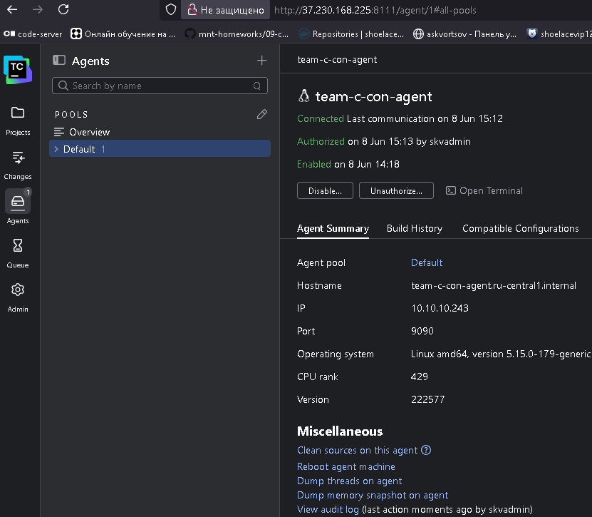

# Для домашнего задания 18.5 `Teamcity`
## commit_62, master Предварительная подготовка
```bash
# Переключение на мастер-ветку на случай работы в соседней ветке репозитория
git checkout master
```
<details>
<summary>переход на master</summary>

```log
Уже на «master»
```

</details>

```bash
# Просмотр имеющихся веток
git branch -v

# Клонирование репозитория
git clone \
https://github.com/netology-code/mnt-homeworks.git

# Удаление всех файлов и каталогов кроме каталога 09-ci-05-teamcity и его содержимого
find mnt-homeworks/ \
-mindepth 1 \
-not -path "*09-ci-05-teamcity*" \
-delete

# Перемещение нужного каталога в корневую директорию с новым именем 18_5
mv mnt-homeworks/09-ci-05-teamcity \
18_5

# Переход в каталог по последней переменной вывода последней команды (18_5)
cd !$
```

<details>
<summary>cd в рабочую директорию</summary>

```log
cd 18_5
```

</details>

```bash
# создание каталогов под скриншоты
mkdir img
```

```bash
# Удаление оставшейся оставшейся части клона репозитория
rm -rfv \
../mnt-homeworks
```

<details>
<summary>Удаление лишнего для Задания</summary>

```log
../mnt-homeworks
удалён каталог '../mnt-homeworks'
```

</details>

```bash
# Просмотр текущих удаленных репозиториев
git remote -v

# Проверка текущего локального состояния репозитория
git status

git rm -r --cached \
../

git remote -v

# Добавляем ключи агенту ssh от репозитория gitflic и github
eval $(ssh-agent) \
&& ssh-add ~/.ssh/id_gitflic_2026_ed25519 \
&& ssh-add ~/.ssh/id_github_2026_ed25519 \
&& ssh-agent -c

# Просмотр различий в рабочей директории и индексов
git diff \
&& git diff --staged

# Добавление всех изменений из текущей и вывод текущего состояния репозитория
git add . .. \
&& git status

git diff \
&& git diff --staged

# Просмотр истории коммитов в кратком формате
git log --oneline

# Создание коммита со всеми изменениями и отправка в удаленный репозиторий
git commit -am 'commit_62_1, master' \
&& git push \
--set-upstream \
study_fops39 \
master \
&& git push \
--set-upstream \
study_fops39_gitflic_ru \
master
```
## commit_1, `18_5-Teamcity`
```bash
# Просмотр истории коммитов в кратком формате
git log --oneline

# Переключение\формирование новой ветки git
git checkout -b 18_5-Teamcity

# Вывод всех веток
git branch -v

# Вывод списка удаленных репозиториев
git remote -v

# вывод текущего состояния репозитория
git status

# Просмотр истории коммитов в кратком формате
git log --oneline

# Добавляем ключи агенту ssh от репозитория gitflic и github
eval $(ssh-agent) \
&& ssh-add ~/.ssh/id_gitflic_2026_ed25519 \
&& ssh-add ~/.ssh/id_github_2026_ed25519 \
&& ssh-agent -c

# Просмотр различий в рабочей директории и индексов
git diff \
&& git diff --staged

git rm -r --cached \
./ ../

# Добавление всех изменений из текущей и вывод текущего состояния репозитория
git add . .. \
&& git status

# Создание коммита со всеми изменениями и отправка в удаленный репозиторий на новую ветку
git commit -am 'commit1, 18_5-Teamcity' \
&& git push \
--set-upstream \
study_fops39 \
18_5-Teamcity \
&& git push \
--set-upstream \
study_fops39_gitflic_ru \
18_5-Teamcity
```

## commit_2, `18_5-Teamcity`
```bash
# создание каталога для YC контейнера
mkdir tf

cd !$
```

<details>
<summary>TF Файл описания провайдера </summary>

```bash
cat > providers.tf <<'EOF'
terraform {
  required_providers {
    yandex = {
      source = "yandex-cloud/yandex"
    }
  }
  required_version = ">= 0.13"
}

provider "yandex" {
  zone = "<зона_доступности_по_умолчанию>"
}
EOF
```

</details>

<details>
<summary>TF Файл перменных </summary>

```bash
cat > variables.tf <<'EOF'
variable "cours-w-skv" {
  type    = string
  default = "cours-fops40-skv"
}

variable "cloud_id" {
  type    = string
  default = "b1g46dhqv17rkjcoc9k7"
}

variable "folder_id" {
  type    = string
  default = "b1g9l0vgsvf6cegkvj1c"
}

variable "host" {
  type = map(number)
  default = {
    cores         = 2
    memory        = 4
    core_fraction = 20
  }
}
EOF
```

</details>

<details>
<summary>TF Файл сети</summary>

```bash
cat > network.tf <<'EOF'
# Общая облачная сеть
resource "yandex_vpc_network" "skv" {
  name = "vpc-${var.cours-w-skv}"
}

# Подсеть zone A
resource "yandex_vpc_subnet" "skv-locnet-b" {
  name           = "localnet-${var.cours-w-skv}-ru-central1-b"
  zone           = "ru-central1-b"
  network_id     = yandex_vpc_network.skv.id
  v4_cidr_blocks = ["10.10.10.240/28"]
  route_table_id = yandex_vpc_route_table.route.id
}

# Сеть под NAT для исходящего трафика
resource "yandex_vpc_gateway" "nat-gateway" {
  name = "gateway-${var.cours-w-skv}"
  shared_egress_gateway {}
}

# Шлюз для выхода в WAN
resource "yandex_vpc_route_table" "route" {
  name       = "route-table-${var.cours-w-skv}"
  network_id = yandex_vpc_network.skv.id

  static_route {
    destination_prefix = "0.0.0.0/0"
    gateway_id         = yandex_vpc_gateway.nat-gateway.id
  }
}
EOF
```

</details>

<details>
<summary>TF Файл Групп доступности(sg)</summary>

```bash
cat > security_groups.tf <<'EOF'
# Security Group для LAN (внутреннее взаимодействие между сервисами)
resource "yandex_vpc_security_group" "LAN" {
  name       = "LAN-${var.cours-w-skv}"
  network_id = yandex_vpc_network.skv.id

  ingress {
    description    = "Разрешить весь трафик из внутренней сети"
    protocol       = "ANY"
    v4_cidr_blocks = ["10.10.10.240/28"]
    from_port      = 0
    to_port        = 65535
  }

  egress {
    description    = "Разрешить весь исходящий трафик"
    protocol       = "ANY"
    v4_cidr_blocks = ["0.0.0.0/0"]
    from_port      = 0
    to_port        = 65535
  }
}

# Security Group из вне для teamcity-сервер
resource "yandex_vpc_security_group" "host-sg" {
  name       = "team-sg-${var.cours-w-skv}"
  network_id = yandex_vpc_network.skv.id

  ingress {
    description    = "Разрешить веб-интерфейс TeamCity"
    protocol       = "TCP"
    port           = 8111
    v4_cidr_blocks = ["0.0.0.0/0"]
  }

  ingress {
    description    = "Разрешить ssh доступ"
    protocol       = "TCP"
    port           = 22
    v4_cidr_blocks = ["0.0.0.0/0"]
  }

  ingress {
    description    = "Разрешить под https"
    protocol       = "TCP"
    port           = 8443
    v4_cidr_blocks = ["0.0.0.0/0"]
  }

  ingress {
    description    = "Разрешить под https"
    protocol       = "TCP"
    port           = 443
    v4_cidr_blocks = ["0.0.0.0/0"]
  }

  egress {
    description    = "Разрешить весь исходящий трафик"
    protocol       = "ANY"
    v4_cidr_blocks = ["0.0.0.0/0"]
    from_port      = 0
    to_port        = 65535
  }
}

# Security Group из вне для VM
resource "yandex_vpc_security_group" "host-vm-sg" {
  name       = "client-sg-${var.cours-w-skv}"
  network_id = yandex_vpc_network.skv.id

  ingress {
    description    = "Разрешить ssh доступ"
    protocol       = "TCP"
    port           = 22
    v4_cidr_blocks = ["0.0.0.0/0"]
  }

  egress {
    description    = "Разрешить весь исходящий трафик"
    protocol       = "ANY"
    v4_cidr_blocks = ["0.0.0.0/0"]
    from_port      = 0
    to_port        = 65535
  }
}
EOF
```

</details>

<details>
<summary>TF Файл описания виртуальных ресурсов</summary>

```bash
cat > vms.tf <<'EOF'
resource "time_sleep" "wait_for_nat" {
  create_duration = "180s"
  depends_on = [
    yandex_compute_instance.team-c-vm-nexus,
    yandex_compute_instance.team-c-con-srv
  ]
}

# teamcity сервер
resource "yandex_compute_instance" "team-c-con-srv" {
  name        = "team-c-con-srv"
  hostname    = "team-c-con-srv"
  platform_id = "standard-v2"
  zone        = "ru-central1-b"

  resources {
    cores         = var.host.cores
    memory        = var.host.memory
    core_fraction = var.host.core_fraction
  }

  boot_disk {
    initialize_params {
      name       = "team-c-disk-srv"
      type       = "network-hdd"
      size       = 20
      block_size = 4096
      image_id   = "fd8r4e7rkb7mj8rc046f"
    }
    auto_delete = true
  }

  metadata = {
    user-data                    = file("./cloud-init.yml")
    serial-port-enable           = 1
    ssh-keys                     = "ubuntu:${file("~/.ssh/id_skv_VKR_vpn.pub")}"
    docker-container-declaration = "spec:\n  containers:\n  - image: jetbrains/teamcity-server\n"
  }

  scheduling_policy {
    preemptible = true
  }

  network_interface {
    subnet_id = yandex_vpc_subnet.skv-locnet-b.id
    # nat        = false
    nat        = true
    ip_address = "10.10.10.254"
    security_group_ids = [
      yandex_vpc_security_group.host-sg.id,
      yandex_vpc_security_group.LAN.id
    ]
  }
}

# teamcity агент
resource "yandex_compute_instance" "team-c-con-agent" {
  name        = "team-c-con-agent"
  hostname    = "team-c-con-agent"
  platform_id = "standard-v2"
  zone        = "ru-central1-b"

  resources {
    cores         = var.host.cores
    memory        = var.host.memory
    core_fraction = var.host.core_fraction
  }

  boot_disk {
    initialize_params {
      name       = "team-c-disk-agent"
      type       = "network-hdd"
      size       = 20
      block_size = 4096
      image_id   = "fd8r4e7rkb7mj8rc046f"
    }
    auto_delete = true
  }

  metadata = {
    user-data                    = file("./cloud-init.yml")
    serial-port-enable           = 1
    ssh-keys                     = "ubuntu:${file("~/.ssh/id_skv_VKR_vpn.pub")}"
    docker-container-declaration = "spec:\n  containers:\n  - image: jetbrains/teamcity-agent\n    env:\n    - name: SERVER_URL\n      value: http://${yandex_compute_instance.team-c-con-srv.network_interface[0].ip_address}:8111\n  restartPolicy: Always\n"
  }

  scheduling_policy {
    preemptible = true
  }

  network_interface {
    subnet_id          = yandex_vpc_subnet.skv-locnet-b.id
    nat                = false
    security_group_ids = [yandex_vpc_security_group.LAN.id]
  }
}

# Данные об образе ОС
data "yandex_compute_image" "centos_7_oslogin" {
  family = "centos-7-oslogin"
}

# VM nexus
resource "yandex_compute_instance" "team-c-vm-nexus" {
  name        = "team-c-vm-nexus"
  hostname    = "team-c-vm-nexus"
  platform_id = "standard-v2"
  zone        = "ru-central1-b"

  resources {
    cores         = var.host.cores
    memory        = var.host.memory
    core_fraction = var.host.core_fraction
  }

  boot_disk {
    initialize_params {
      image_id = data.yandex_compute_image.centos_7_oslogin.image_id
      type     = "network-hdd"
      size     = 20
    }
  }

  metadata = {
    user-data          = file("./cloud-init.yml")
    serial-port-enable = 1
    ssh-keys           = "ubuntu:${file("~/.ssh/id_skv_VKR_vpn.pub")}"
  }

  scheduling_policy {
    preemptible = true
  }

  network_interface {
    subnet_id = yandex_vpc_subnet.skv-locnet-b.id
    # nat       = false
    nat = true
    security_group_ids = [
      yandex_vpc_security_group.host-vm-sg.id,
      yandex_vpc_security_group.LAN.id
    ]
  }
}
EOF
```

</details>

```bash
# Проверка tf файлов проекта и создание файла запуска terraform
terraform init --upgrade \
&& terraform validate \
&& terraform fmt \
&& terraform plan -out=tfplan
```

<details>
<summary>вывод подготовки ресурсов </summary>

```log
Initializing provider plugins found in the configuration...
- Finding latest version of yandex-cloud/yandex...
- Finding latest version of hashicorp/time...
- Using previously-installed yandex-cloud/yandex v0.206.0
- Using previously-installed hashicorp/time v0.14.0

Initializing the backend...

Initializing provider plugins found in the state...
- Reusing previous version of yandex-cloud/yandex
- Using previously-installed yandex-cloud/yandex v0.206.0


Terraform has been successfully initialized!

You may now begin working with Terraform. Try running "terraform plan" to see
any changes that are required for your infrastructure. All Terraform commands
should now work.

If you ever set or change modules or backend configuration for Terraform,
rerun this command to reinitialize your working directory. If you forget, other
commands will detect it and remind you to do so if necessary.
Success! The configuration is valid.

data.yandex_compute_image.centos_7_oslogin: Reading...
data.yandex_compute_image.centos_7_oslogin: Read complete after 0s [id=fd8s0p0dif39lvss2uqr]

Terraform used the selected providers to generate the following execution plan. Resource actions are indicated with the following symbols:
  + create

Terraform will perform the following actions:

  # time_sleep.wait_for_nat will be created
  + resource "time_sleep" "wait_for_nat" {
      + create_duration = "180s"
      + id              = (known after apply)
    }

  # yandex_compute_instance.team-c-con-agent will be created
  + resource "yandex_compute_instance" "team-c-con-agent" {
      + created_at                = (known after apply)
      + folder_id                 = (known after apply)
      + fqdn                      = (known after apply)
      + gpu_cluster_id            = (known after apply)
      + hardware_generation       = (known after apply)
      + hostname                  = "team-c-con-agent"
      + id                        = (known after apply)
      + maintenance_grace_period  = (known after apply)
      + maintenance_policy        = (known after apply)
      + metadata                  = {
          + "docker-container-declaration" = <<-EOT
                spec:
                  containers:
                  - image: jetbrains/teamcity-agent
                    env:
                    - name: SERVER_URL
                      value: http://10.10.10.254:8111
                  restartPolicy: Always
            EOT
          + "serial-port-enable"           = "1"
          + "ssh-keys"                     = <<-EOT
                ubuntu:ssh-ed25519 AAAAC3NzaC1lZDI1NTE5AAAAIK/47mAS0sUnBDavx6pBJDYs23hzWPc3JGAlnpYWrPOo VKR_vpn
            EOT
          + "user-data"                    = <<-EOT
                #cloud-config
                users:
                  - name: skv
                    groups: sudo
                    shell: /bin/bash
                    sudo: ["ALL=(ALL) NOPASSWD:ALL"]
                    ssh_authorized_keys:
                      - ssh-ed25519 AAAAC3NzaC1lZDI1NTE5AAAAIK/47mAS0sUnBDavx6pBJDYs23hzWPc3JGAlnpYWrPOo VKR_vpn
            EOT
        }
      + name                      = "team-c-con-agent"
      + network_acceleration_type = "standard"
      + platform_id               = "standard-v2"
      + status                    = (known after apply)
      + zone                      = "ru-central1-b"

      + boot_disk {
          + auto_delete = true
          + device_name = (known after apply)
          + disk_id     = (known after apply)
          + mode        = (known after apply)

          + initialize_params {
              + block_size  = 4096
              + description = (known after apply)
              + image_id    = "fd8r4e7rkb7mj8rc046f"
              + name        = "team-c-disk-agent"
              + size        = 20
              + snapshot_id = (known after apply)
              + type        = "network-hdd"
            }
        }

      + metadata_options (known after apply)

      + network_interface {
          + index              = (known after apply)
          + ip_address         = (known after apply)
          + ipv4               = true
          + ipv6               = (known after apply)
          + ipv6_address       = (known after apply)
          + mac_address        = (known after apply)
          + nat                = false
          + nat_ip_address     = (known after apply)
          + nat_ip_version     = (known after apply)
          + security_group_ids = (known after apply)
          + subnet_id          = (known after apply)
        }

      + placement_policy (known after apply)

      + resources {
          + core_fraction = 20
          + cores         = 2
          + memory        = 4
        }

      + scheduling_policy {
          + preemptible = true
        }
    }

  # yandex_compute_instance.team-c-con-srv will be created
  + resource "yandex_compute_instance" "team-c-con-srv" {
      + created_at                = (known after apply)
      + folder_id                 = (known after apply)
      + fqdn                      = (known after apply)
      + gpu_cluster_id            = (known after apply)
      + hardware_generation       = (known after apply)
      + hostname                  = "team-c-con-srv"
      + id                        = (known after apply)
      + maintenance_grace_period  = (known after apply)
      + maintenance_policy        = (known after apply)
      + metadata                  = {
          + "docker-container-declaration" = <<-EOT
                spec:
                  containers:
                  - image: jetbrains/teamcity-server
            EOT
          + "serial-port-enable"           = "1"
          + "ssh-keys"                     = <<-EOT
                ubuntu:ssh-ed25519 AAAAC3NzaC1lZDI1NTE5AAAAIK/47mAS0sUnBDavx6pBJDYs23hzWPc3JGAlnpYWrPOo VKR_vpn
            EOT
          + "user-data"                    = <<-EOT
                #cloud-config
                users:
                  - name: skv
                    groups: sudo
                    shell: /bin/bash
                    sudo: ["ALL=(ALL) NOPASSWD:ALL"]
                    ssh_authorized_keys:
                      - ssh-ed25519 AAAAC3NzaC1lZDI1NTE5AAAAIK/47mAS0sUnBDavx6pBJDYs23hzWPc3JGAlnpYWrPOo VKR_vpn
            EOT
        }
      + name                      = "team-c-con-srv"
      + network_acceleration_type = "standard"
      + platform_id               = "standard-v2"
      + status                    = (known after apply)
      + zone                      = "ru-central1-b"

      + boot_disk {
          + auto_delete = true
          + device_name = (known after apply)
          + disk_id     = (known after apply)
          + mode        = (known after apply)

          + initialize_params {
              + block_size  = 4096
              + description = (known after apply)
              + image_id    = "fd8r4e7rkb7mj8rc046f"
              + name        = "team-c-disk-srv"
              + size        = 20
              + snapshot_id = (known after apply)
              + type        = "network-hdd"
            }
        }

      + metadata_options (known after apply)

      + network_interface {
          + index              = (known after apply)
          + ip_address         = "10.10.10.254"
          + ipv4               = true
          + ipv6               = (known after apply)
          + ipv6_address       = (known after apply)
          + mac_address        = (known after apply)
          + nat                = true
          + nat_ip_address     = (known after apply)
          + nat_ip_version     = (known after apply)
          + security_group_ids = (known after apply)
          + subnet_id          = (known after apply)
        }

      + placement_policy (known after apply)

      + resources {
          + core_fraction = 20
          + cores         = 2
          + memory        = 4
        }

      + scheduling_policy {
          + preemptible = true
        }
    }

  # yandex_compute_instance.team-c-vm-nexus will be created
  + resource "yandex_compute_instance" "team-c-vm-nexus" {
      + created_at                = (known after apply)
      + folder_id                 = (known after apply)
      + fqdn                      = (known after apply)
      + gpu_cluster_id            = (known after apply)
      + hardware_generation       = (known after apply)
      + hostname                  = "team-c-vm-nexus"
      + id                        = (known after apply)
      + maintenance_grace_period  = (known after apply)
      + maintenance_policy        = (known after apply)
      + metadata                  = {
          + "serial-port-enable" = "1"
          + "ssh-keys"           = <<-EOT
                ubuntu:ssh-ed25519 AAAAC3NzaC1lZDI1NTE5AAAAIK/47mAS0sUnBDavx6pBJDYs23hzWPc3JGAlnpYWrPOo VKR_vpn
            EOT
          + "user-data"          = <<-EOT
                #cloud-config
                users:
                  - name: skv
                    groups: sudo
                    shell: /bin/bash
                    sudo: ["ALL=(ALL) NOPASSWD:ALL"]
                    ssh_authorized_keys:
                      - ssh-ed25519 AAAAC3NzaC1lZDI1NTE5AAAAIK/47mAS0sUnBDavx6pBJDYs23hzWPc3JGAlnpYWrPOo VKR_vpn
            EOT
        }
      + name                      = "team-c-vm-nexus"
      + network_acceleration_type = "standard"
      + platform_id               = "standard-v2"
      + status                    = (known after apply)
      + zone                      = "ru-central1-b"

      + boot_disk {
          + auto_delete = true
          + device_name = (known after apply)
          + disk_id     = (known after apply)
          + mode        = (known after apply)

          + initialize_params {
              + block_size  = (known after apply)
              + description = (known after apply)
              + image_id    = "fd8s0p0dif39lvss2uqr"
              + name        = (known after apply)
              + size        = 20
              + snapshot_id = (known after apply)
              + type        = "network-hdd"
            }
        }

      + metadata_options (known after apply)

      + network_interface {
          + index              = (known after apply)
          + ip_address         = (known after apply)
          + ipv4               = true
          + ipv6               = (known after apply)
          + ipv6_address       = (known after apply)
          + mac_address        = (known after apply)
          + nat                = true
          + nat_ip_address     = (known after apply)
          + nat_ip_version     = (known after apply)
          + security_group_ids = (known after apply)
          + subnet_id          = (known after apply)
        }

      + placement_policy (known after apply)

      + resources {
          + core_fraction = 20
          + cores         = 2
          + memory        = 4
        }

      + scheduling_policy {
          + preemptible = true
        }
    }

  # yandex_vpc_gateway.nat-gateway will be created
  + resource "yandex_vpc_gateway" "nat-gateway" {
      + created_at = (known after apply)
      + folder_id  = (known after apply)
      + id         = (known after apply)
      + labels     = (known after apply)
      + name       = "gateway-cours-fops40-skv"

      + shared_egress_gateway {}
    }

  # yandex_vpc_network.skv will be created
  + resource "yandex_vpc_network" "skv" {
      + created_at                = (known after apply)
      + default_security_group_id = (known after apply)
      + folder_id                 = (known after apply)
      + id                        = (known after apply)
      + labels                    = (known after apply)
      + name                      = "vpc-cours-fops40-skv"
      + subnet_ids                = (known after apply)
    }

  # yandex_vpc_route_table.route will be created
  + resource "yandex_vpc_route_table" "route" {
      + created_at = (known after apply)
      + folder_id  = (known after apply)
      + id         = (known after apply)
      + labels     = (known after apply)
      + name       = "route-table-cours-fops40-skv"
      + network_id = (known after apply)

      + static_route {
          + destination_prefix = "0.0.0.0/0"
          + gateway_id         = (known after apply)
            # (1 unchanged attribute hidden)
        }
    }

  # yandex_vpc_security_group.LAN will be created
  + resource "yandex_vpc_security_group" "LAN" {
      + created_at = (known after apply)
      + folder_id  = (known after apply)
      + id         = (known after apply)
      + labels     = (known after apply)
      + name       = "LAN-cours-fops40-skv"
      + network_id = (known after apply)
      + status     = (known after apply)

      + egress {
          + description       = "Разрешить весь исходящий трафик"
          + from_port         = 0
          + id                = (known after apply)
          + labels            = (known after apply)
          + port              = -1
          + protocol          = "ANY"
          + to_port           = 65535
          + v4_cidr_blocks    = [
              + "0.0.0.0/0",
            ]
          + v6_cidr_blocks    = []
            # (2 unchanged attributes hidden)
        }

      + ingress {
          + description       = "Разрешить весь трафик из внутренней сети"
          + from_port         = 0
          + id                = (known after apply)
          + labels            = (known after apply)
          + port              = -1
          + protocol          = "ANY"
          + to_port           = 65535
          + v4_cidr_blocks    = [
              + "10.10.10.240/28",
            ]
          + v6_cidr_blocks    = []
            # (2 unchanged attributes hidden)
        }
    }

  # yandex_vpc_security_group.host-sg will be created
  + resource "yandex_vpc_security_group" "host-sg" {
      + created_at = (known after apply)
      + folder_id  = (known after apply)
      + id         = (known after apply)
      + labels     = (known after apply)
      + name       = "team-sg-cours-fops40-skv"
      + network_id = (known after apply)
      + status     = (known after apply)

      + egress {
          + description       = "Разрешить весь исходящий трафик"
          + from_port         = 0
          + id                = (known after apply)
          + labels            = (known after apply)
          + port              = -1
          + protocol          = "ANY"
          + to_port           = 65535
          + v4_cidr_blocks    = [
              + "0.0.0.0/0",
            ]
          + v6_cidr_blocks    = []
            # (2 unchanged attributes hidden)
        }

      + ingress {
          + description       = "Разрешить ssh доступ"
          + from_port         = -1
          + id                = (known after apply)
          + labels            = (known after apply)
          + port              = 22
          + protocol          = "TCP"
          + to_port           = -1
          + v4_cidr_blocks    = [
              + "0.0.0.0/0",
            ]
          + v6_cidr_blocks    = []
            # (2 unchanged attributes hidden)
        }
      + ingress {
          + description       = "Разрешить веб-интерфейс TeamCity"
          + from_port         = -1
          + id                = (known after apply)
          + labels            = (known after apply)
          + port              = 8111
          + protocol          = "TCP"
          + to_port           = -1
          + v4_cidr_blocks    = [
              + "0.0.0.0/0",
            ]
          + v6_cidr_blocks    = []
            # (2 unchanged attributes hidden)
        }
      + ingress {
          + description       = "Разрешить под https"
          + from_port         = -1
          + id                = (known after apply)
          + labels            = (known after apply)
          + port              = 443
          + protocol          = "TCP"
          + to_port           = -1
          + v4_cidr_blocks    = [
              + "0.0.0.0/0",
            ]
          + v6_cidr_blocks    = []
            # (2 unchanged attributes hidden)
        }
      + ingress {
          + description       = "Разрешить под https"
          + from_port         = -1
          + id                = (known after apply)
          + labels            = (known after apply)
          + port              = 8443
          + protocol          = "TCP"
          + to_port           = -1
          + v4_cidr_blocks    = [
              + "0.0.0.0/0",
            ]
          + v6_cidr_blocks    = []
            # (2 unchanged attributes hidden)
        }
    }

  # yandex_vpc_security_group.host-vm-sg will be created
  + resource "yandex_vpc_security_group" "host-vm-sg" {
      + created_at = (known after apply)
      + folder_id  = (known after apply)
      + id         = (known after apply)
      + labels     = (known after apply)
      + name       = "client-sg-cours-fops40-skv"
      + network_id = (known after apply)
      + status     = (known after apply)

      + egress {
          + description       = "Разрешить весь исходящий трафик"
          + from_port         = 0
          + id                = (known after apply)
          + labels            = (known after apply)
          + port              = -1
          + protocol          = "ANY"
          + to_port           = 65535
          + v4_cidr_blocks    = [
              + "0.0.0.0/0",
            ]
          + v6_cidr_blocks    = []
            # (2 unchanged attributes hidden)
        }

      + ingress {
          + description       = "Разрешить ssh доступ"
          + from_port         = -1
          + id                = (known after apply)
          + labels            = (known after apply)
          + port              = 22
          + protocol          = "TCP"
          + to_port           = -1
          + v4_cidr_blocks    = [
              + "0.0.0.0/0",
            ]
          + v6_cidr_blocks    = []
            # (2 unchanged attributes hidden)
        }
    }

  # yandex_vpc_subnet.skv-locnet-b will be created
  + resource "yandex_vpc_subnet" "skv-locnet-b" {
      + created_at     = (known after apply)
      + folder_id      = (known after apply)
      + id             = (known after apply)
      + labels         = (known after apply)
      + name           = "localnet-cours-fops40-skv-ru-central1-b"
      + network_id     = (known after apply)
      + route_table_id = (known after apply)
      + v4_cidr_blocks = [
          + "10.10.10.240/28",
        ]
      + v6_cidr_blocks = (known after apply)
      + zone           = "ru-central1-b"
    }

Plan: 11 to add, 0 to change, 0 to destroy.
```

</details>


```bash
# Запуск на создание ресурсов YC
terraform apply "tfplan"
```

<details>
<summary>лог содания </summary>

```log
yandex_vpc_gateway.nat-gateway: Creating...
yandex_vpc_network.skv: Creating...
yandex_vpc_gateway.nat-gateway: Creation complete after 0s [id=enpkq19g2dmmtg96i5ph]
yandex_vpc_network.skv: Creation complete after 1s [id=enp45nvj9sc3jjuga35t]
yandex_vpc_route_table.route: Creating...
yandex_vpc_security_group.LAN: Creating...
yandex_vpc_security_group.host-vm-sg: Creating...
yandex_vpc_security_group.host-sg: Creating...
yandex_vpc_route_table.route: Creation complete after 1s [id=enp10alq8avi5rv17vin]
yandex_vpc_subnet.skv-locnet-b: Creating...
yandex_vpc_security_group.LAN: Creation complete after 2s [id=enp9cg9910mdcpeguc1g]
yandex_vpc_subnet.skv-locnet-b: Creation complete after 1s [id=e2lvdmmgrr4f3tnhus7p]
yandex_vpc_security_group.host-vm-sg: Creation complete after 3s [id=enpvidoequq6hnabl18d]
yandex_compute_instance.team-c-vm-nexus: Creating...
yandex_vpc_security_group.host-sg: Creation complete after 5s [id=enpvmeu69h2rtt1qjifj]
yandex_compute_instance.team-c-con-srv: Creating...
yandex_compute_instance.team-c-vm-nexus: Creation complete after 55s [id=epd1sorcep9oq1svf4d7]
yandex_compute_instance.team-c-con-srv: Creation complete after 1m1s [id=epdqcl7kqto7tli23vm3]
time_sleep.wait_for_nat: Creating...
yandex_compute_instance.team-c-con-agent: Creating...
yandex_compute_instance.team-c-con-agent: Creation complete after 42s [id=epd9htmnnpllnefcofk2]
time_sleep.wait_for_nat: Creation complete after 3m0s [id=2026-06-08T14:14:43Z]
```

</details>

```bash
# Вывод запущенных ресурсов
yc compute instance list
```
|          ID          |       NAME       |    ZONE ID    | STATUS  |  EXTERNAL IP   | INTERNAL IP  |
|----------------------|------------------|---------------|---------|----------------|--------------|
| epd1sorcep9oq1svf4d7 | team-c-vm-nexus  | ru-central1-b | RUNNING | 158.160.9.223  | 10.10.10.250 |
| epd9htmnnpllnefcofk2 | team-c-con-agent | ru-central1-b | RUNNING |                | 10.10.10.243 |
| epdqcl7kqto7tli23vm3 | team-c-con-srv   | ru-central1-b | RUNNING | 37.230.168.225 | 10.10.10.254 |

### Первичная настройка и авторизация агента




### Для подготовки развертывания Nexus через Ansible
```bash
# вход в каталог с Ansible
cd ../infrastructure/

# Формируем локальный ansible.cfg
ansible-config init \
--disabled -t all \
> ansible.cfg

# Чистка от комментариев
sed -i \
-e '/^[[:space:]]*#/d' \
-e '/^[[:space:]]*$/d' \
-e '/^;/d' \
ansible.cfg

# указание рабочего каталога
sed -i '/\[defaults\]/ahome=./' \
ansible.cfg

# указание инвентаря
sed -i '/\[defaults\]/ainventory=./inventory/cicd/hosts.yml' \
ansible.cfg

# указание работы со средой python3.9
sed -i '/\[defaults\]/ainterpreter_python = /usr/local/bin/python3.9' \
ansible.cfg

# Указание поиска установленных коллекций для пользователя и системы Archlinux
sed -i '/\[defaults\]/acollections_paths = ~/.ansible/collections:/usr/lib/python3.14/site-packages/ansible_collections' \
ansible.cfg

# создание перменной bash с WAN IP nexus для редактирования файла инвентаря
NEXUS="$(yc compute instance list | awk '/team-c-vm-nexus/ {print $10}')"

# Подстановка Ip в hosts файл Ansible
sed -i "s/<nexushost>/$NEXUS/" \
inventory/cicd/hosts.yml

# Подстановка пользавотеля с правами в hosts файл Ansible
sed -i "s/<user>/skv/" \
inventory/cicd/hosts.yml

# Удаление блока установки пакетов через ansible
sed -i '/^\s*-\s*name:\s*Install JDK/,/^\s*state:\s*present\s*$/d' \
site.yml

# Регистрация SSH агентом проброшенного ключа на ресурсах YC
eval $(ssh-agent) \
&& ssh-add  ~/.ssh/id_skv_VKR_vpn
```

<details>
<summary>вывод активации агента</summary>

```log
Agent pid 6472
Identity added: ~/.ssh/id_skv_VKR_vpn (VKR_vpn)
```

</details>

```bash
# Установка всех необходимых пакетов для установки Python версии 3.9
# и обхода ошибки "unknown" package manager с установкой java через playbook
ssh -t \
-o StrictHostKeyChecking=accept-new \
skv@"$NEXUS" \
'sudo bash -c "yum makecache -y \
&& yum update -y \
&& yum -y install gcc openssl-devel bzip2-devel libffi-devel zlib-devel java-1.8.0-openjdk java-1.8.0-openjdk-devel"'
```

<details>
<summary>лог установки пакетов </summary>

```log
Loaded plugins: fastestmirror, versionlock
Loading mirror speeds from cached hostfile
base                                                                              | 3.6 kB  00:00:00     
extras                                                                            | 2.9 kB  00:00:00     
updates                                                                           | 2.9 kB  00:00:00     
Metadata Cache Created
Loaded plugins: fastestmirror, versionlock
Loading mirror speeds from cached hostfile
No packages marked for update
Loaded plugins: fastestmirror, versionlock
Loading mirror speeds from cached hostfile
Resolving Dependencies
--> Running transaction check
---> Package bzip2-devel.x86_64 0:1.0.6-13.el7 will be installed
---> Package gcc.x86_64 0:4.8.5-44.el7 will be installed
--> Processing Dependency: cpp = 4.8.5-44.el7 for package: gcc-4.8.5-44.el7.x86_64
--> Processing Dependency: glibc-devel >= 2.2.90-12 for package: gcc-4.8.5-44.el7.x86_64
--> Processing Dependency: libmpfr.so.4()(64bit) for package: gcc-4.8.5-44.el7.x86_64
--> Processing Dependency: libmpc.so.3()(64bit) for package: gcc-4.8.5-44.el7.x86_64
---> Package java-1.8.0-openjdk.x86_64 1:1.8.0.412.b08-1.el7_9 will be installed
--> Processing Dependency: java-1.8.0-openjdk-headless(x86-64) = 1:1.8.0.412.b08-1.el7_9 for package: 1:java-1.8.0-openjdk-1.8.0.412.b08-1.el7_9.x86_64
--> Processing Dependency: xorg-x11-fonts-Type1 for package: 1:java-1.8.0-openjdk-1.8.0.412.b08-1.el7_9.x86_64
--> Processing Dependency: libjvm.so(SUNWprivate_1.1)(64bit) for package: 1:java-1.8.0-openjdk-1.8.0.412.b08-1.el7_9.x86_64
--> Processing Dependency: libjpeg.so.62(LIBJPEG_6.2)(64bit) for package: 1:java-1.8.0-openjdk-1.8.0.412.b08-1.el7_9.x86_64
--> Processing Dependency: libjava.so(SUNWprivate_1.1)(64bit) for package: 1:java-1.8.0-openjdk-1.8.0.412.b08-1.el7_9.x86_64
--> Processing Dependency: libasound.so.2(ALSA_0.9.0rc4)(64bit) for package: 1:java-1.8.0-openjdk-1.8.0.412.b08-1.el7_9.x86_64
--> Processing Dependency: libasound.so.2(ALSA_0.9)(64bit) for package: 1:java-1.8.0-openjdk-1.8.0.412.b08-1.el7_9.x86_64
--> Processing Dependency: libXcomposite(x86-64) for package: 1:java-1.8.0-openjdk-1.8.0.412.b08-1.el7_9.x86_64
--> Processing Dependency: gtk2(x86-64) for package: 1:java-1.8.0-openjdk-1.8.0.412.b08-1.el7_9.x86_64
--> Processing Dependency: fontconfig(x86-64) for package: 1:java-1.8.0-openjdk-1.8.0.412.b08-1.el7_9.x86_64
--> Processing Dependency: libjvm.so()(64bit) for package: 1:java-1.8.0-openjdk-1.8.0.412.b08-1.el7_9.x86_64
--> Processing Dependency: libjpeg.so.62()(64bit) for package: 1:java-1.8.0-openjdk-1.8.0.412.b08-1.el7_9.x86_64
--> Processing Dependency: libjava.so()(64bit) for package: 1:java-1.8.0-openjdk-1.8.0.412.b08-1.el7_9.x86_64
--> Processing Dependency: libgif.so.4()(64bit) for package: 1:java-1.8.0-openjdk-1.8.0.412.b08-1.el7_9.x86_64
--> Processing Dependency: libasound.so.2()(64bit) for package: 1:java-1.8.0-openjdk-1.8.0.412.b08-1.el7_9.x86_64
--> Processing Dependency: libXtst.so.6()(64bit) for package: 1:java-1.8.0-openjdk-1.8.0.412.b08-1.el7_9.x86_64
--> Processing Dependency: libXrender.so.1()(64bit) for package: 1:java-1.8.0-openjdk-1.8.0.412.b08-1.el7_9.x86_64
--> Processing Dependency: libXi.so.6()(64bit) for package: 1:java-1.8.0-openjdk-1.8.0.412.b08-1.el7_9.x86_64
--> Processing Dependency: libXext.so.6()(64bit) for package: 1:java-1.8.0-openjdk-1.8.0.412.b08-1.el7_9.x86_64
--> Processing Dependency: libX11.so.6()(64bit) for package: 1:java-1.8.0-openjdk-1.8.0.412.b08-1.el7_9.x86_64
---> Package java-1.8.0-openjdk-devel.x86_64 1:1.8.0.412.b08-1.el7_9 will be installed
---> Package libffi-devel.x86_64 0:3.0.13-19.el7 will be installed
---> Package openssl-devel.x86_64 1:1.0.2k-26.el7_9 will be installed
--> Processing Dependency: krb5-devel(x86-64) for package: 1:openssl-devel-1.0.2k-26.el7_9.x86_64
---> Package zlib-devel.x86_64 0:1.2.7-21.el7_9 will be installed
--> Running transaction check
---> Package alsa-lib.x86_64 0:1.1.8-1.el7 will be installed
---> Package cpp.x86_64 0:4.8.5-44.el7 will be installed
---> Package fontconfig.x86_64 0:2.13.0-4.3.el7 will be installed
--> Processing Dependency: fontpackages-filesystem for package: fontconfig-2.13.0-4.3.el7.x86_64
--> Processing Dependency: dejavu-sans-fonts for package: fontconfig-2.13.0-4.3.el7.x86_64
---> Package giflib.x86_64 0:4.1.6-9.el7 will be installed
--> Processing Dependency: libSM.so.6()(64bit) for package: giflib-4.1.6-9.el7.x86_64
--> Processing Dependency: libICE.so.6()(64bit) for package: giflib-4.1.6-9.el7.x86_64
---> Package glibc-devel.x86_64 0:2.17-326.el7_9.3 will be installed
--> Processing Dependency: glibc-headers = 2.17-326.el7_9.3 for package: glibc-devel-2.17-326.el7_9.3.x86_64
--> Processing Dependency: glibc-headers for package: glibc-devel-2.17-326.el7_9.3.x86_64
---> Package gtk2.x86_64 0:2.24.31-1.el7 will be installed
--> Processing Dependency: pango >= 1.20.0-1 for package: gtk2-2.24.31-1.el7.x86_64
--> Processing Dependency: libtiff >= 3.6.1 for package: gtk2-2.24.31-1.el7.x86_64
--> Processing Dependency: libXrandr >= 1.2.99.4-2 for package: gtk2-2.24.31-1.el7.x86_64
--> Processing Dependency: atk >= 1.29.4-2 for package: gtk2-2.24.31-1.el7.x86_64
--> Processing Dependency: hicolor-icon-theme for package: gtk2-2.24.31-1.el7.x86_64
--> Processing Dependency: gtk-update-icon-cache for package: gtk2-2.24.31-1.el7.x86_64
--> Processing Dependency: libpangoft2-1.0.so.0()(64bit) for package: gtk2-2.24.31-1.el7.x86_64
--> Processing Dependency: libpangocairo-1.0.so.0()(64bit) for package: gtk2-2.24.31-1.el7.x86_64
--> Processing Dependency: libpango-1.0.so.0()(64bit) for package: gtk2-2.24.31-1.el7.x86_64
--> Processing Dependency: libgdk_pixbuf-2.0.so.0()(64bit) for package: gtk2-2.24.31-1.el7.x86_64
--> Processing Dependency: libcups.so.2()(64bit) for package: gtk2-2.24.31-1.el7.x86_64
--> Processing Dependency: libcairo.so.2()(64bit) for package: gtk2-2.24.31-1.el7.x86_64
--> Processing Dependency: libatk-1.0.so.0()(64bit) for package: gtk2-2.24.31-1.el7.x86_64
--> Processing Dependency: libXrandr.so.2()(64bit) for package: gtk2-2.24.31-1.el7.x86_64
--> Processing Dependency: libXinerama.so.1()(64bit) for package: gtk2-2.24.31-1.el7.x86_64
--> Processing Dependency: libXfixes.so.3()(64bit) for package: gtk2-2.24.31-1.el7.x86_64
--> Processing Dependency: libXdamage.so.1()(64bit) for package: gtk2-2.24.31-1.el7.x86_64
--> Processing Dependency: libXcursor.so.1()(64bit) for package: gtk2-2.24.31-1.el7.x86_64
---> Package java-1.8.0-openjdk-headless.x86_64 1:1.8.0.412.b08-1.el7_9 will be installed
--> Processing Dependency: tzdata-java >= 2023d for package: 1:java-1.8.0-openjdk-headless-1.8.0.412.b08-1.el7_9.x86_64
--> Processing Dependency: copy-jdk-configs >= 3.3 for package: 1:java-1.8.0-openjdk-headless-1.8.0.412.b08-1.el7_9.x86_64
--> Processing Dependency: pcsc-lite-libs(x86-64) for package: 1:java-1.8.0-openjdk-headless-1.8.0.412.b08-1.el7_9.x86_64
--> Processing Dependency: lksctp-tools(x86-64) for package: 1:java-1.8.0-openjdk-headless-1.8.0.412.b08-1.el7_9.x86_64
--> Processing Dependency: jpackage-utils for package: 1:java-1.8.0-openjdk-headless-1.8.0.412.b08-1.el7_9.x86_64
---> Package krb5-devel.x86_64 0:1.15.1-55.el7_9 will be installed
--> Processing Dependency: libkadm5(x86-64) = 1.15.1-55.el7_9 for package: krb5-devel-1.15.1-55.el7_9.x86_64
--> Processing Dependency: libverto-devel for package: krb5-devel-1.15.1-55.el7_9.x86_64
--> Processing Dependency: libselinux-devel for package: krb5-devel-1.15.1-55.el7_9.x86_64
--> Processing Dependency: libcom_err-devel for package: krb5-devel-1.15.1-55.el7_9.x86_64
--> Processing Dependency: keyutils-libs-devel for package: krb5-devel-1.15.1-55.el7_9.x86_64
---> Package libX11.x86_64 0:1.6.7-5.el7_9 will be installed
--> Processing Dependency: libX11-common >= 1.6.7-5.el7_9 for package: libX11-1.6.7-5.el7_9.x86_64
--> Processing Dependency: libxcb.so.1()(64bit) for package: libX11-1.6.7-5.el7_9.x86_64
---> Package libXcomposite.x86_64 0:0.4.4-4.1.el7 will be installed
---> Package libXext.x86_64 0:1.3.3-3.el7 will be installed
---> Package libXi.x86_64 0:1.7.9-1.el7 will be installed
---> Package libXrender.x86_64 0:0.9.10-1.el7 will be installed
---> Package libXtst.x86_64 0:1.2.3-1.el7 will be installed
---> Package libjpeg-turbo.x86_64 0:1.2.90-8.el7 will be installed
---> Package libmpc.x86_64 0:1.0.1-3.el7 will be installed
---> Package mpfr.x86_64 0:3.1.1-4.el7 will be installed
---> Package xorg-x11-fonts-Type1.noarch 0:7.5-9.el7 will be installed
--> Processing Dependency: ttmkfdir for package: xorg-x11-fonts-Type1-7.5-9.el7.noarch
--> Processing Dependency: ttmkfdir for package: xorg-x11-fonts-Type1-7.5-9.el7.noarch
--> Processing Dependency: mkfontdir for package: xorg-x11-fonts-Type1-7.5-9.el7.noarch
--> Processing Dependency: mkfontdir for package: xorg-x11-fonts-Type1-7.5-9.el7.noarch
--> Running transaction check
---> Package atk.x86_64 0:2.28.1-2.el7 will be installed
---> Package cairo.x86_64 0:1.15.12-4.el7 will be installed
--> Processing Dependency: libpixman-1.so.0()(64bit) for package: cairo-1.15.12-4.el7.x86_64
--> Processing Dependency: libGL.so.1()(64bit) for package: cairo-1.15.12-4.el7.x86_64
--> Processing Dependency: libEGL.so.1()(64bit) for package: cairo-1.15.12-4.el7.x86_64
---> Package copy-jdk-configs.noarch 0:3.3-11.el7_9 will be installed
---> Package cups-libs.x86_64 1:1.6.3-52.el7_9 will be installed
--> Processing Dependency: libavahi-common.so.3()(64bit) for package: 1:cups-libs-1.6.3-52.el7_9.x86_64
--> Processing Dependency: libavahi-client.so.3()(64bit) for package: 1:cups-libs-1.6.3-52.el7_9.x86_64
---> Package dejavu-sans-fonts.noarch 0:2.33-6.el7 will be installed
--> Processing Dependency: dejavu-fonts-common = 2.33-6.el7 for package: dejavu-sans-fonts-2.33-6.el7.noarch
---> Package fontpackages-filesystem.noarch 0:1.44-8.el7 will be installed
---> Package gdk-pixbuf2.x86_64 0:2.36.12-3.el7 will be installed
--> Processing Dependency: libjasper.so.1()(64bit) for package: gdk-pixbuf2-2.36.12-3.el7.x86_64
---> Package glibc-headers.x86_64 0:2.17-326.el7_9.3 will be installed
--> Processing Dependency: kernel-headers >= 2.2.1 for package: glibc-headers-2.17-326.el7_9.3.x86_64
--> Processing Dependency: kernel-headers for package: glibc-headers-2.17-326.el7_9.3.x86_64
---> Package gtk-update-icon-cache.x86_64 0:3.22.30-8.el7_9 will be installed
---> Package hicolor-icon-theme.noarch 0:0.12-7.el7 will be installed
---> Package javapackages-tools.noarch 0:3.4.1-11.el7 will be installed
--> Processing Dependency: python-javapackages = 3.4.1-11.el7 for package: javapackages-tools-3.4.1-11.el7.noarch
--> Processing Dependency: libxslt for package: javapackages-tools-3.4.1-11.el7.noarch
---> Package keyutils-libs-devel.x86_64 0:1.5.8-3.el7 will be installed
---> Package libICE.x86_64 0:1.0.9-9.el7 will be installed
---> Package libSM.x86_64 0:1.2.2-2.el7 will be installed
---> Package libX11-common.noarch 0:1.6.7-5.el7_9 will be installed
---> Package libXcursor.x86_64 0:1.1.15-1.el7 will be installed
---> Package libXdamage.x86_64 0:1.1.4-4.1.el7 will be installed
---> Package libXfixes.x86_64 0:5.0.3-1.el7 will be installed
---> Package libXinerama.x86_64 0:1.1.3-2.1.el7 will be installed
---> Package libXrandr.x86_64 0:1.5.1-2.el7 will be installed
---> Package libcom_err-devel.x86_64 0:1.42.9-19.el7 will be installed
---> Package libkadm5.x86_64 0:1.15.1-55.el7_9 will be installed
---> Package libselinux-devel.x86_64 0:2.5-15.el7 will be installed
--> Processing Dependency: libsepol-devel(x86-64) >= 2.5-10 for package: libselinux-devel-2.5-15.el7.x86_64
--> Processing Dependency: pkgconfig(libsepol) for package: libselinux-devel-2.5-15.el7.x86_64
--> Processing Dependency: pkgconfig(libpcre) for package: libselinux-devel-2.5-15.el7.x86_64
---> Package libtiff.x86_64 0:4.0.3-35.el7 will be installed
--> Processing Dependency: libjbig.so.2.0()(64bit) for package: libtiff-4.0.3-35.el7.x86_64
---> Package libverto-devel.x86_64 0:0.2.5-4.el7 will be installed
---> Package libxcb.x86_64 0:1.13-1.el7 will be installed
--> Processing Dependency: libXau.so.6()(64bit) for package: libxcb-1.13-1.el7.x86_64
---> Package lksctp-tools.x86_64 0:1.0.17-2.el7 will be installed
---> Package pango.x86_64 0:1.42.4-4.el7_7 will be installed
--> Processing Dependency: libthai(x86-64) >= 0.1.9 for package: pango-1.42.4-4.el7_7.x86_64
--> Processing Dependency: libXft(x86-64) >= 2.0.0 for package: pango-1.42.4-4.el7_7.x86_64
--> Processing Dependency: harfbuzz(x86-64) >= 1.4.2 for package: pango-1.42.4-4.el7_7.x86_64
--> Processing Dependency: fribidi(x86-64) >= 1.0 for package: pango-1.42.4-4.el7_7.x86_64
--> Processing Dependency: libthai.so.0(LIBTHAI_0.1)(64bit) for package: pango-1.42.4-4.el7_7.x86_64
--> Processing Dependency: libthai.so.0()(64bit) for package: pango-1.42.4-4.el7_7.x86_64
--> Processing Dependency: libharfbuzz.so.0()(64bit) for package: pango-1.42.4-4.el7_7.x86_64
--> Processing Dependency: libfribidi.so.0()(64bit) for package: pango-1.42.4-4.el7_7.x86_64
--> Processing Dependency: libXft.so.2()(64bit) for package: pango-1.42.4-4.el7_7.x86_64
---> Package pcsc-lite-libs.x86_64 0:1.8.8-8.el7 will be installed
---> Package ttmkfdir.x86_64 0:3.0.9-42.el7 will be installed
---> Package tzdata-java.noarch 0:2024a-1.el7 will be installed
---> Package xorg-x11-font-utils.x86_64 1:7.5-21.el7 will be installed
--> Processing Dependency: libfontenc.so.1()(64bit) for package: 1:xorg-x11-font-utils-7.5-21.el7.x86_64
--> Running transaction check
---> Package avahi-libs.x86_64 0:0.6.31-20.el7 will be installed
---> Package dejavu-fonts-common.noarch 0:2.33-6.el7 will be installed
---> Package fribidi.x86_64 0:1.0.2-1.el7_7.1 will be installed
---> Package harfbuzz.x86_64 0:1.7.5-2.el7 will be installed
--> Processing Dependency: libgraphite2.so.3()(64bit) for package: harfbuzz-1.7.5-2.el7.x86_64
---> Package jasper-libs.x86_64 0:1.900.1-33.el7 will be installed
---> Package jbigkit-libs.x86_64 0:2.0-11.el7 will be installed
---> Package kernel-headers.x86_64 0:3.10.0-1160.119.1.el7 will be installed
---> Package libXau.x86_64 0:1.0.8-2.1.el7 will be installed
---> Package libXft.x86_64 0:2.3.2-2.el7 will be installed
---> Package libfontenc.x86_64 0:1.1.3-3.el7 will be installed
---> Package libglvnd-egl.x86_64 1:1.0.1-0.8.git5baa1e5.el7 will be installed
--> Processing Dependency: libglvnd(x86-64) = 1:1.0.1-0.8.git5baa1e5.el7 for package: 1:libglvnd-egl-1.0.1-0.8.git5baa1e5.el7.x86_64
--> Processing Dependency: mesa-libEGL(x86-64) >= 13.0.4-1 for package: 1:libglvnd-egl-1.0.1-0.8.git5baa1e5.el7.x86_64
--> Processing Dependency: libGLdispatch.so.0()(64bit) for package: 1:libglvnd-egl-1.0.1-0.8.git5baa1e5.el7.x86_64
---> Package libglvnd-glx.x86_64 1:1.0.1-0.8.git5baa1e5.el7 will be installed
--> Processing Dependency: mesa-libGL(x86-64) >= 13.0.4-1 for package: 1:libglvnd-glx-1.0.1-0.8.git5baa1e5.el7.x86_64
---> Package libsepol-devel.x86_64 0:2.5-10.el7 will be installed
---> Package libthai.x86_64 0:0.1.14-9.el7 will be installed
---> Package libxslt.x86_64 0:1.1.28-6.el7 will be installed
---> Package pcre-devel.x86_64 0:8.32-17.el7 will be installed
---> Package pixman.x86_64 0:0.34.0-1.el7 will be installed
---> Package python-javapackages.noarch 0:3.4.1-11.el7 will be installed
--> Processing Dependency: python-lxml for package: python-javapackages-3.4.1-11.el7.noarch
--> Running transaction check
---> Package graphite2.x86_64 0:1.3.10-1.el7_3 will be installed
---> Package libglvnd.x86_64 1:1.0.1-0.8.git5baa1e5.el7 will be installed
---> Package mesa-libEGL.x86_64 0:18.3.4-12.el7_9 will be installed
--> Processing Dependency: mesa-libgbm = 18.3.4-12.el7_9 for package: mesa-libEGL-18.3.4-12.el7_9.x86_64
--> Processing Dependency: libxshmfence.so.1()(64bit) for package: mesa-libEGL-18.3.4-12.el7_9.x86_64
--> Processing Dependency: libwayland-server.so.0()(64bit) for package: mesa-libEGL-18.3.4-12.el7_9.x86_64
--> Processing Dependency: libwayland-client.so.0()(64bit) for package: mesa-libEGL-18.3.4-12.el7_9.x86_64
--> Processing Dependency: libglapi.so.0()(64bit) for package: mesa-libEGL-18.3.4-12.el7_9.x86_64
--> Processing Dependency: libgbm.so.1()(64bit) for package: mesa-libEGL-18.3.4-12.el7_9.x86_64
--> Processing Dependency: libdrm.so.2()(64bit) for package: mesa-libEGL-18.3.4-12.el7_9.x86_64
---> Package mesa-libGL.x86_64 0:18.3.4-12.el7_9 will be installed
--> Processing Dependency: libXxf86vm.so.1()(64bit) for package: mesa-libGL-18.3.4-12.el7_9.x86_64
---> Package python-lxml.x86_64 0:3.2.1-4.el7 will be installed
--> Running transaction check
---> Package libXxf86vm.x86_64 0:1.1.4-1.el7 will be installed
---> Package libdrm.x86_64 0:2.4.97-2.el7 will be installed
--> Processing Dependency: libpciaccess.so.0()(64bit) for package: libdrm-2.4.97-2.el7.x86_64
---> Package libwayland-client.x86_64 0:1.15.0-1.el7 will be installed
---> Package libwayland-server.x86_64 0:1.15.0-1.el7 will be installed
---> Package libxshmfence.x86_64 0:1.2-1.el7 will be installed
---> Package mesa-libgbm.x86_64 0:18.3.4-12.el7_9 will be installed
---> Package mesa-libglapi.x86_64 0:18.3.4-12.el7_9 will be installed
--> Running transaction check
---> Package libpciaccess.x86_64 0:0.14-1.el7 will be installed
--> Finished Dependency Resolution

Dependencies Resolved

=========================================================================================================
 Package                            Arch          Version                           Repository      Size
=========================================================================================================
Installing:
 bzip2-devel                        x86_64        1.0.6-13.el7                      base           218 k
 gcc                                x86_64        4.8.5-44.el7                      base            16 M
 java-1.8.0-openjdk                 x86_64        1:1.8.0.412.b08-1.el7_9           updates        325 k
 java-1.8.0-openjdk-devel           x86_64        1:1.8.0.412.b08-1.el7_9           updates        9.9 M
 libffi-devel                       x86_64        3.0.13-19.el7                     base            23 k
 openssl-devel                      x86_64        1:1.0.2k-26.el7_9                 updates        1.5 M
 zlib-devel                         x86_64        1.2.7-21.el7_9                    updates         50 k
Installing for dependencies:
 alsa-lib                           x86_64        1.1.8-1.el7                       base           425 k
 atk                                x86_64        2.28.1-2.el7                      base           263 k
 avahi-libs                         x86_64        0.6.31-20.el7                     base            62 k
 cairo                              x86_64        1.15.12-4.el7                     base           741 k
 copy-jdk-configs                   noarch        3.3-11.el7_9                      updates         22 k
 cpp                                x86_64        4.8.5-44.el7                      base           5.9 M
 cups-libs                          x86_64        1:1.6.3-52.el7_9                  updates        359 k
 dejavu-fonts-common                noarch        2.33-6.el7                        base            64 k
 dejavu-sans-fonts                  noarch        2.33-6.el7                        base           1.4 M
 fontconfig                         x86_64        2.13.0-4.3.el7                    base           254 k
 fontpackages-filesystem            noarch        1.44-8.el7                        base           9.9 k
 fribidi                            x86_64        1.0.2-1.el7_7.1                   base            79 k
 gdk-pixbuf2                        x86_64        2.36.12-3.el7                     base           570 k
 giflib                             x86_64        4.1.6-9.el7                       base            40 k
 glibc-devel                        x86_64        2.17-326.el7_9.3                  updates        1.1 M
 glibc-headers                      x86_64        2.17-326.el7_9.3                  updates        692 k
 graphite2                          x86_64        1.3.10-1.el7_3                    base           115 k
 gtk-update-icon-cache              x86_64        3.22.30-8.el7_9                   updates         27 k
 gtk2                               x86_64        2.24.31-1.el7                     base           3.4 M
 harfbuzz                           x86_64        1.7.5-2.el7                       base           267 k
 hicolor-icon-theme                 noarch        0.12-7.el7                        base            42 k
 jasper-libs                        x86_64        1.900.1-33.el7                    base           150 k
 java-1.8.0-openjdk-headless        x86_64        1:1.8.0.412.b08-1.el7_9           updates         33 M
 javapackages-tools                 noarch        3.4.1-11.el7                      base            73 k
 jbigkit-libs                       x86_64        2.0-11.el7                        base            46 k
 kernel-headers                     x86_64        3.10.0-1160.119.1.el7             updates        9.1 M
 keyutils-libs-devel                x86_64        1.5.8-3.el7                       base            37 k
 krb5-devel                         x86_64        1.15.1-55.el7_9                   updates        273 k
 libICE                             x86_64        1.0.9-9.el7                       base            66 k
 libSM                              x86_64        1.2.2-2.el7                       base            39 k
 libX11                             x86_64        1.6.7-5.el7_9                     updates        607 k
 libX11-common                      noarch        1.6.7-5.el7_9                     updates        165 k
 libXau                             x86_64        1.0.8-2.1.el7                     base            29 k
 libXcomposite                      x86_64        0.4.4-4.1.el7                     base            22 k
 libXcursor                         x86_64        1.1.15-1.el7                      base            30 k
 libXdamage                         x86_64        1.1.4-4.1.el7                     base            20 k
 libXext                            x86_64        1.3.3-3.el7                       base            39 k
 libXfixes                          x86_64        5.0.3-1.el7                       base            18 k
 libXft                             x86_64        2.3.2-2.el7                       base            58 k
 libXi                              x86_64        1.7.9-1.el7                       base            40 k
 libXinerama                        x86_64        1.1.3-2.1.el7                     base            14 k
 libXrandr                          x86_64        1.5.1-2.el7                       base            27 k
 libXrender                         x86_64        0.9.10-1.el7                      base            26 k
 libXtst                            x86_64        1.2.3-1.el7                       base            20 k
 libXxf86vm                         x86_64        1.1.4-1.el7                       base            18 k
 libcom_err-devel                   x86_64        1.42.9-19.el7                     base            32 k
 libdrm                             x86_64        2.4.97-2.el7                      base           151 k
 libfontenc                         x86_64        1.1.3-3.el7                       base            31 k
 libglvnd                           x86_64        1:1.0.1-0.8.git5baa1e5.el7        base            89 k
 libglvnd-egl                       x86_64        1:1.0.1-0.8.git5baa1e5.el7        base            44 k
 libglvnd-glx                       x86_64        1:1.0.1-0.8.git5baa1e5.el7        base           125 k
 libjpeg-turbo                      x86_64        1.2.90-8.el7                      base           135 k
 libkadm5                           x86_64        1.15.1-55.el7_9                   updates        180 k
 libmpc                             x86_64        1.0.1-3.el7                       base            51 k
 libpciaccess                       x86_64        0.14-1.el7                        base            26 k
 libselinux-devel                   x86_64        2.5-15.el7                        base           187 k
 libsepol-devel                     x86_64        2.5-10.el7                        base            77 k
 libthai                            x86_64        0.1.14-9.el7                      base           187 k
 libtiff                            x86_64        4.0.3-35.el7                      base           172 k
 libverto-devel                     x86_64        0.2.5-4.el7                       base            12 k
 libwayland-client                  x86_64        1.15.0-1.el7                      base            33 k
 libwayland-server                  x86_64        1.15.0-1.el7                      base            39 k
 libxcb                             x86_64        1.13-1.el7                        base           214 k
 libxshmfence                       x86_64        1.2-1.el7                         base           7.2 k
 libxslt                            x86_64        1.1.28-6.el7                      base           242 k
 lksctp-tools                       x86_64        1.0.17-2.el7                      base            88 k
 mesa-libEGL                        x86_64        18.3.4-12.el7_9                   updates        110 k
 mesa-libGL                         x86_64        18.3.4-12.el7_9                   updates        166 k
 mesa-libgbm                        x86_64        18.3.4-12.el7_9                   updates         39 k
 mesa-libglapi                      x86_64        18.3.4-12.el7_9                   updates         46 k
 mpfr                               x86_64        3.1.1-4.el7                       base           203 k
 pango                              x86_64        1.42.4-4.el7_7                    base           280 k
 pcre-devel                         x86_64        8.32-17.el7                       base           480 k
 pcsc-lite-libs                     x86_64        1.8.8-8.el7                       base            34 k
 pixman                             x86_64        0.34.0-1.el7                      base           248 k
 python-javapackages                noarch        3.4.1-11.el7                      base            31 k
 python-lxml                        x86_64        3.2.1-4.el7                       base           758 k
 ttmkfdir                           x86_64        3.0.9-42.el7                      base            48 k
 tzdata-java                        noarch        2024a-1.el7                       updates        187 k
 xorg-x11-font-utils                x86_64        1:7.5-21.el7                      base           104 k
 xorg-x11-fonts-Type1               noarch        7.5-9.el7                         base           521 k

Transaction Summary
=========================================================================================================
Install  7 Packages (+81 Dependent packages)

Total download size: 93 M
Installed size: 262 M
Downloading packages:
(1/88): atk-2.28.1-2.el7.x86_64.rpm                                               | 263 kB  00:00:00     
(2/88): alsa-lib-1.1.8-1.el7.x86_64.rpm                                           | 425 kB  00:00:00     
(3/88): avahi-libs-0.6.31-20.el7.x86_64.rpm                                       |  62 kB  00:00:00     
(4/88): bzip2-devel-1.0.6-13.el7.x86_64.rpm                                       | 218 kB  00:00:00     
(5/88): cairo-1.15.12-4.el7.x86_64.rpm                                            | 741 kB  00:00:00     
(6/88): dejavu-fonts-common-2.33-6.el7.noarch.rpm                                 |  64 kB  00:00:00     
(7/88): cpp-4.8.5-44.el7.x86_64.rpm                                               | 5.9 MB  00:00:00     
(8/88): dejavu-sans-fonts-2.33-6.el7.noarch.rpm                                   | 1.4 MB  00:00:00     
(9/88): fontpackages-filesystem-1.44-8.el7.noarch.rpm                             | 9.9 kB  00:00:00     
(10/88): fontconfig-2.13.0-4.3.el7.x86_64.rpm                                     | 254 kB  00:00:00     
(11/88): copy-jdk-configs-3.3-11.el7_9.noarch.rpm                                 |  22 kB  00:00:00     
(12/88): fribidi-1.0.2-1.el7_7.1.x86_64.rpm                                       |  79 kB  00:00:00     
(13/88): gdk-pixbuf2-2.36.12-3.el7.x86_64.rpm                                     | 570 kB  00:00:00     
(14/88): giflib-4.1.6-9.el7.x86_64.rpm                                            |  40 kB  00:00:00     
(15/88): cups-libs-1.6.3-52.el7_9.x86_64.rpm                                      | 359 kB  00:00:00     
(16/88): gcc-4.8.5-44.el7.x86_64.rpm                                              |  16 MB  00:00:00     
(17/88): glibc-headers-2.17-326.el7_9.3.x86_64.rpm                                | 692 kB  00:00:00     
(18/88): gtk-update-icon-cache-3.22.30-8.el7_9.x86_64.rpm                         |  27 kB  00:00:00     
(19/88): glibc-devel-2.17-326.el7_9.3.x86_64.rpm                                  | 1.1 MB  00:00:00     
(20/88): graphite2-1.3.10-1.el7_3.x86_64.rpm                                      | 115 kB  00:00:00     
(21/88): harfbuzz-1.7.5-2.el7.x86_64.rpm                                          | 267 kB  00:00:00     
(22/88): hicolor-icon-theme-0.12-7.el7.noarch.rpm                                 |  42 kB  00:00:00     
(23/88): jasper-libs-1.900.1-33.el7.x86_64.rpm                                    | 150 kB  00:00:00     
(24/88): gtk2-2.24.31-1.el7.x86_64.rpm                                            | 3.4 MB  00:00:00     
(25/88): java-1.8.0-openjdk-1.8.0.412.b08-1.el7_9.x86_64.rpm                      | 325 kB  00:00:00     
(26/88): java-1.8.0-openjdk-devel-1.8.0.412.b08-1.el7_9.x86_64.rpm                | 9.9 MB  00:00:00     
(27/88): kernel-headers-3.10.0-1160.119.1.el7.x86_64.rpm                          | 9.1 MB  00:00:00     
(28/88): java-1.8.0-openjdk-headless-1.8.0.412.b08-1.el7_9.x86_64.rpm             |  33 MB  00:00:00     
(29/88): javapackages-tools-3.4.1-11.el7.noarch.rpm                               |  73 kB  00:00:00     
(30/88): jbigkit-libs-2.0-11.el7.x86_64.rpm                                       |  46 kB  00:00:00     
(31/88): keyutils-libs-devel-1.5.8-3.el7.x86_64.rpm                               |  37 kB  00:00:00     
(32/88): libSM-1.2.2-2.el7.x86_64.rpm                                             |  39 kB  00:00:00     
(33/88): libICE-1.0.9-9.el7.x86_64.rpm                                            |  66 kB  00:00:00     
(34/88): krb5-devel-1.15.1-55.el7_9.x86_64.rpm                                    | 273 kB  00:00:00     
(35/88): libX11-1.6.7-5.el7_9.x86_64.rpm                                          | 607 kB  00:00:00     
(36/88): libX11-common-1.6.7-5.el7_9.noarch.rpm                                   | 165 kB  00:00:00     
(37/88): libXau-1.0.8-2.1.el7.x86_64.rpm                                          |  29 kB  00:00:00     
(38/88): libXcomposite-0.4.4-4.1.el7.x86_64.rpm                                   |  22 kB  00:00:00     
(39/88): libXcursor-1.1.15-1.el7.x86_64.rpm                                       |  30 kB  00:00:00     
(40/88): libXdamage-1.1.4-4.1.el7.x86_64.rpm                                      |  20 kB  00:00:00     
(41/88): libXext-1.3.3-3.el7.x86_64.rpm                                           |  39 kB  00:00:00     
(42/88): libXfixes-5.0.3-1.el7.x86_64.rpm                                         |  18 kB  00:00:00     
(43/88): libXft-2.3.2-2.el7.x86_64.rpm                                            |  58 kB  00:00:00     
(44/88): libXi-1.7.9-1.el7.x86_64.rpm                                             |  40 kB  00:00:00     
(45/88): libXinerama-1.1.3-2.1.el7.x86_64.rpm                                     |  14 kB  00:00:00     
(46/88): libXrandr-1.5.1-2.el7.x86_64.rpm                                         |  27 kB  00:00:00     
(47/88): libXrender-0.9.10-1.el7.x86_64.rpm                                       |  26 kB  00:00:00     
(48/88): libXtst-1.2.3-1.el7.x86_64.rpm                                           |  20 kB  00:00:00     
(49/88): libXxf86vm-1.1.4-1.el7.x86_64.rpm                                        |  18 kB  00:00:00     
(50/88): libcom_err-devel-1.42.9-19.el7.x86_64.rpm                                |  32 kB  00:00:00     
(51/88): libdrm-2.4.97-2.el7.x86_64.rpm                                           | 151 kB  00:00:00     
(52/88): libffi-devel-3.0.13-19.el7.x86_64.rpm                                    |  23 kB  00:00:00     
(53/88): libfontenc-1.1.3-3.el7.x86_64.rpm                                        |  31 kB  00:00:00     
(54/88): libglvnd-1.0.1-0.8.git5baa1e5.el7.x86_64.rpm                             |  89 kB  00:00:00     
(55/88): libglvnd-egl-1.0.1-0.8.git5baa1e5.el7.x86_64.rpm                         |  44 kB  00:00:00     
(56/88): libglvnd-glx-1.0.1-0.8.git5baa1e5.el7.x86_64.rpm                         | 125 kB  00:00:00     
(57/88): libjpeg-turbo-1.2.90-8.el7.x86_64.rpm                                    | 135 kB  00:00:00     
(58/88): libmpc-1.0.1-3.el7.x86_64.rpm                                            |  51 kB  00:00:00     
(59/88): libpciaccess-0.14-1.el7.x86_64.rpm                                       |  26 kB  00:00:00     
(60/88): libsepol-devel-2.5-10.el7.x86_64.rpm                                     |  77 kB  00:00:00     
(61/88): libselinux-devel-2.5-15.el7.x86_64.rpm                                   | 187 kB  00:00:00     
(62/88): libthai-0.1.14-9.el7.x86_64.rpm                                          | 187 kB  00:00:00     
(63/88): libtiff-4.0.3-35.el7.x86_64.rpm                                          | 172 kB  00:00:00     
(64/88): libverto-devel-0.2.5-4.el7.x86_64.rpm                                    |  12 kB  00:00:00     
(65/88): libwayland-client-1.15.0-1.el7.x86_64.rpm                                |  33 kB  00:00:00     
(66/88): libwayland-server-1.15.0-1.el7.x86_64.rpm                                |  39 kB  00:00:00     
(67/88): libxcb-1.13-1.el7.x86_64.rpm                                             | 214 kB  00:00:00     
(68/88): libkadm5-1.15.1-55.el7_9.x86_64.rpm                                      | 180 kB  00:00:00     
(69/88): libxshmfence-1.2-1.el7.x86_64.rpm                                        | 7.2 kB  00:00:00     
(70/88): libxslt-1.1.28-6.el7.x86_64.rpm                                          | 242 kB  00:00:00     
(71/88): lksctp-tools-1.0.17-2.el7.x86_64.rpm                                     |  88 kB  00:00:00     
(72/88): mesa-libEGL-18.3.4-12.el7_9.x86_64.rpm                                   | 110 kB  00:00:00     
(73/88): mesa-libgbm-18.3.4-12.el7_9.x86_64.rpm                                   |  39 kB  00:00:00     
(74/88): mesa-libGL-18.3.4-12.el7_9.x86_64.rpm                                    | 166 kB  00:00:00     
(75/88): mesa-libglapi-18.3.4-12.el7_9.x86_64.rpm                                 |  46 kB  00:00:00     
(76/88): openssl-devel-1.0.2k-26.el7_9.x86_64.rpm                                 | 1.5 MB  00:00:00     
(77/88): mpfr-3.1.1-4.el7.x86_64.rpm                                              | 203 kB  00:00:00     
(78/88): pango-1.42.4-4.el7_7.x86_64.rpm                                          | 280 kB  00:00:00     
(79/88): pcre-devel-8.32-17.el7.x86_64.rpm                                        | 480 kB  00:00:00     
(80/88): pcsc-lite-libs-1.8.8-8.el7.x86_64.rpm                                    |  34 kB  00:00:00     
(81/88): pixman-0.34.0-1.el7.x86_64.rpm                                           | 248 kB  00:00:00     
(82/88): python-javapackages-3.4.1-11.el7.noarch.rpm                              |  31 kB  00:00:00     
(83/88): python-lxml-3.2.1-4.el7.x86_64.rpm                                       | 758 kB  00:00:00     
(84/88): ttmkfdir-3.0.9-42.el7.x86_64.rpm                                         |  48 kB  00:00:00     
(85/88): xorg-x11-font-utils-7.5-21.el7.x86_64.rpm                                | 104 kB  00:00:00     
(86/88): xorg-x11-fonts-Type1-7.5-9.el7.noarch.rpm                                | 521 kB  00:00:00     
(87/88): tzdata-java-2024a-1.el7.noarch.rpm                                       | 187 kB  00:00:00     
(88/88): zlib-devel-1.2.7-21.el7_9.x86_64.rpm                                     |  50 kB  00:00:00     
---------------------------------------------------------------------------------------------------------
Total                                                                     15 MB/s |  93 MB  00:00:06     
Running transaction check
Running transaction test
Transaction test succeeded
Running transaction
  Installing : libjpeg-turbo-1.2.90-8.el7.x86_64                                                    1/88 
  Installing : mesa-libglapi-18.3.4-12.el7_9.x86_64                                                 2/88 
  Installing : mpfr-3.1.1-4.el7.x86_64                                                              3/88 
  Installing : libmpc-1.0.1-3.el7.x86_64                                                            4/88 
  Installing : libxslt-1.1.28-6.el7.x86_64                                                          5/88 
  Installing : 1:libglvnd-1.0.1-0.8.git5baa1e5.el7.x86_64                                           6/88 
  Installing : libxshmfence-1.2-1.el7.x86_64                                                        7/88 
  Installing : fontpackages-filesystem-1.44-8.el7.noarch                                            8/88 
  Installing : libICE-1.0.9-9.el7.x86_64                                                            9/88 
  Installing : libwayland-server-1.15.0-1.el7.x86_64                                               10/88 
  Installing : libSM-1.2.2-2.el7.x86_64                                                            11/88 
  Installing : dejavu-fonts-common-2.33-6.el7.noarch                                               12/88 
  Installing : dejavu-sans-fonts-2.33-6.el7.noarch                                                 13/88 
  Installing : fontconfig-2.13.0-4.3.el7.x86_64                                                    14/88 
  Installing : python-lxml-3.2.1-4.el7.x86_64                                                      15/88 
  Installing : python-javapackages-3.4.1-11.el7.noarch                                             16/88 
  Installing : javapackages-tools-3.4.1-11.el7.noarch                                              17/88 
  Installing : cpp-4.8.5-44.el7.x86_64                                                             18/88 
  Installing : jasper-libs-1.900.1-33.el7.x86_64                                                   19/88 
  Installing : avahi-libs-0.6.31-20.el7.x86_64                                                     20/88 
  Installing : 1:cups-libs-1.6.3-52.el7_9.x86_64                                                   21/88 
  Installing : libfontenc-1.1.3-3.el7.x86_64                                                       22/88 
  Installing : 1:xorg-x11-font-utils-7.5-21.el7.x86_64                                             23/88 
  Installing : libkadm5-1.15.1-55.el7_9.x86_64                                                     24/88 
  Installing : jbigkit-libs-2.0-11.el7.x86_64                                                      25/88 
  Installing : libtiff-4.0.3-35.el7.x86_64                                                         26/88 
  Installing : zlib-devel-1.2.7-21.el7_9.x86_64                                                    27/88 
  Installing : libthai-0.1.14-9.el7.x86_64                                                         28/88 
  Installing : alsa-lib-1.1.8-1.el7.x86_64                                                         29/88 
  Installing : libcom_err-devel-1.42.9-19.el7.x86_64                                               30/88 
  Installing : fribidi-1.0.2-1.el7_7.1.x86_64                                                      31/88 
  Installing : tzdata-java-2024a-1.el7.noarch                                                      32/88 
  Installing : hicolor-icon-theme-0.12-7.el7.noarch                                                33/88 
  Installing : ttmkfdir-3.0.9-42.el7.x86_64                                                        34/88 
  Installing : xorg-x11-fonts-Type1-7.5-9.el7.noarch                                               35/88 
  Installing : libwayland-client-1.15.0-1.el7.x86_64                                               36/88 
  Installing : pcre-devel-8.32-17.el7.x86_64                                                       37/88 
  Installing : copy-jdk-configs-3.3-11.el7_9.noarch                                                38/88 
  Installing : atk-2.28.1-2.el7.x86_64                                                             39/88 
  Installing : kernel-headers-3.10.0-1160.119.1.el7.x86_64                                         40/88 
  Installing : glibc-headers-2.17-326.el7_9.3.x86_64                                               41/88 
  Installing : glibc-devel-2.17-326.el7_9.3.x86_64                                                 42/88 
  Installing : graphite2-1.3.10-1.el7_3.x86_64                                                     43/88 
  Installing : harfbuzz-1.7.5-2.el7.x86_64                                                         44/88 
  Installing : libverto-devel-0.2.5-4.el7.x86_64                                                   45/88 
  Installing : pixman-0.34.0-1.el7.x86_64                                                          46/88 
  Installing : keyutils-libs-devel-1.5.8-3.el7.x86_64                                              47/88 
  Installing : libpciaccess-0.14-1.el7.x86_64                                                      48/88 
  Installing : libdrm-2.4.97-2.el7.x86_64                                                          49/88 
  Installing : mesa-libgbm-18.3.4-12.el7_9.x86_64                                                  50/88 
  Installing : libXau-1.0.8-2.1.el7.x86_64                                                         51/88 
  Installing : libxcb-1.13-1.el7.x86_64                                                            52/88 
  Installing : libsepol-devel-2.5-10.el7.x86_64                                                    53/88 
  Installing : libselinux-devel-2.5-15.el7.x86_64                                                  54/88 
  Installing : krb5-devel-1.15.1-55.el7_9.x86_64                                                   55/88 
  Installing : pcsc-lite-libs-1.8.8-8.el7.x86_64                                                   56/88 
  Installing : libX11-common-1.6.7-5.el7_9.noarch                                                  57/88 
  Installing : libX11-1.6.7-5.el7_9.x86_64                                                         58/88 
  Installing : libXext-1.3.3-3.el7.x86_64                                                          59/88 
  Installing : libXrender-0.9.10-1.el7.x86_64                                                      60/88 
  Installing : libXfixes-5.0.3-1.el7.x86_64                                                        61/88 
  Installing : libXi-1.7.9-1.el7.x86_64                                                            62/88 
  Installing : libXdamage-1.1.4-4.1.el7.x86_64                                                     63/88 
  Installing : libXcomposite-0.4.4-4.1.el7.x86_64                                                  64/88 
  Installing : gdk-pixbuf2-2.36.12-3.el7.x86_64                                                    65/88 
  Installing : gtk-update-icon-cache-3.22.30-8.el7_9.x86_64                                        66/88 
  Installing : libXtst-1.2.3-1.el7.x86_64                                                          67/88 
  Installing : libXcursor-1.1.15-1.el7.x86_64                                                      68/88 
  Installing : libXrandr-1.5.1-2.el7.x86_64                                                        69/88 
  Installing : libXft-2.3.2-2.el7.x86_64                                                           70/88 
  Installing : libXinerama-1.1.3-2.1.el7.x86_64                                                    71/88 
  Installing : libXxf86vm-1.1.4-1.el7.x86_64                                                       72/88 
  Installing : 1:libglvnd-glx-1.0.1-0.8.git5baa1e5.el7.x86_64                                      73/88 
  Installing : mesa-libGL-18.3.4-12.el7_9.x86_64                                                   74/88 
  Installing : giflib-4.1.6-9.el7.x86_64                                                           75/88 
  Installing : 1:libglvnd-egl-1.0.1-0.8.git5baa1e5.el7.x86_64                                      76/88 
  Installing : mesa-libEGL-18.3.4-12.el7_9.x86_64                                                  77/88 
  Installing : cairo-1.15.12-4.el7.x86_64                                                          78/88 
  Installing : pango-1.42.4-4.el7_7.x86_64                                                         79/88 
  Installing : gtk2-2.24.31-1.el7.x86_64                                                           80/88 
  Installing : lksctp-tools-1.0.17-2.el7.x86_64                                                    81/88 
  Installing : 1:java-1.8.0-openjdk-headless-1.8.0.412.b08-1.el7_9.x86_64                          82/88 
  Installing : 1:java-1.8.0-openjdk-1.8.0.412.b08-1.el7_9.x86_64                                   83/88 
  Installing : 1:java-1.8.0-openjdk-devel-1.8.0.412.b08-1.el7_9.x86_64                             84/88 
  Installing : 1:openssl-devel-1.0.2k-26.el7_9.x86_64                                              85/88 
  Installing : gcc-4.8.5-44.el7.x86_64                                                             86/88 
  Installing : bzip2-devel-1.0.6-13.el7.x86_64                                                     87/88 
  Installing : libffi-devel-3.0.13-19.el7.x86_64                                                   88/88 
  Verifying  : libXext-1.3.3-3.el7.x86_64                                                           1/88 
  Verifying  : libXi-1.7.9-1.el7.x86_64                                                             2/88 
  Verifying  : libXrender-0.9.10-1.el7.x86_64                                                       3/88 
  Verifying  : 1:xorg-x11-font-utils-7.5-21.el7.x86_64                                              4/88 
  Verifying  : libwayland-server-1.15.0-1.el7.x86_64                                                5/88 
  Verifying  : libffi-devel-3.0.13-19.el7.x86_64                                                    6/88 
  Verifying  : python-lxml-3.2.1-4.el7.x86_64                                                       7/88 
  Verifying  : bzip2-devel-1.0.6-13.el7.x86_64                                                      8/88 
  Verifying  : 1:openssl-devel-1.0.2k-26.el7_9.x86_64                                               9/88 
  Verifying  : 1:java-1.8.0-openjdk-headless-1.8.0.412.b08-1.el7_9.x86_64                          10/88 
  Verifying  : python-javapackages-3.4.1-11.el7.noarch                                             11/88 
  Verifying  : cpp-4.8.5-44.el7.x86_64                                                             12/88 
  Verifying  : libXcomposite-0.4.4-4.1.el7.x86_64                                                  13/88 
  Verifying  : lksctp-tools-1.0.17-2.el7.x86_64                                                    14/88 
  Verifying  : libX11-common-1.6.7-5.el7_9.noarch                                                  15/88 
  Verifying  : 1:cups-libs-1.6.3-52.el7_9.x86_64                                                   16/88 
  Verifying  : dejavu-sans-fonts-2.33-6.el7.noarch                                                 17/88 
  Verifying  : pcsc-lite-libs-1.8.8-8.el7.x86_64                                                   18/88 
  Verifying  : libsepol-devel-2.5-10.el7.x86_64                                                    19/88 
  Verifying  : libXau-1.0.8-2.1.el7.x86_64                                                         20/88 
  Verifying  : gtk-update-icon-cache-3.22.30-8.el7_9.x86_64                                        21/88 
  Verifying  : libpciaccess-0.14-1.el7.x86_64                                                      22/88 
  Verifying  : libICE-1.0.9-9.el7.x86_64                                                           23/88 
  Verifying  : keyutils-libs-devel-1.5.8-3.el7.x86_64                                              24/88 
  Verifying  : giflib-4.1.6-9.el7.x86_64                                                           25/88 
  Verifying  : libXtst-1.2.3-1.el7.x86_64                                                          26/88 
  Verifying  : mesa-libGL-18.3.4-12.el7_9.x86_64                                                   27/88 
  Verifying  : libXdamage-1.1.4-4.1.el7.x86_64                                                     28/88 
  Verifying  : pixman-0.34.0-1.el7.x86_64                                                          29/88 
  Verifying  : javapackages-tools-3.4.1-11.el7.noarch                                              30/88 
  Verifying  : libverto-devel-0.2.5-4.el7.x86_64                                                   31/88 
  Verifying  : 1:libglvnd-egl-1.0.1-0.8.git5baa1e5.el7.x86_64                                      32/88 
  Verifying  : jasper-libs-1.900.1-33.el7.x86_64                                                   33/88 
  Verifying  : graphite2-1.3.10-1.el7_3.x86_64                                                     34/88 
  Verifying  : kernel-headers-3.10.0-1160.119.1.el7.x86_64                                         35/88 
  Verifying  : libXfixes-5.0.3-1.el7.x86_64                                                        36/88 
  Verifying  : atk-2.28.1-2.el7.x86_64                                                             37/88 
  Verifying  : copy-jdk-configs-3.3-11.el7_9.noarch                                                38/88 
  Verifying  : libmpc-1.0.1-3.el7.x86_64                                                           39/88 
  Verifying  : libselinux-devel-2.5-15.el7.x86_64                                                  40/88 
  Verifying  : fontconfig-2.13.0-4.3.el7.x86_64                                                    41/88 
  Verifying  : gdk-pixbuf2-2.36.12-3.el7.x86_64                                                    42/88 
  Verifying  : glibc-headers-2.17-326.el7_9.3.x86_64                                               43/88 
  Verifying  : 1:java-1.8.0-openjdk-devel-1.8.0.412.b08-1.el7_9.x86_64                             44/88 
  Verifying  : 1:libglvnd-glx-1.0.1-0.8.git5baa1e5.el7.x86_64                                      45/88 
  Verifying  : krb5-devel-1.15.1-55.el7_9.x86_64                                                   46/88 
  Verifying  : pcre-devel-8.32-17.el7.x86_64                                                       47/88 
  Verifying  : libXcursor-1.1.15-1.el7.x86_64                                                      48/88 
  Verifying  : libwayland-client-1.15.0-1.el7.x86_64                                               49/88 
  Verifying  : fontpackages-filesystem-1.44-8.el7.noarch                                           50/88 
  Verifying  : ttmkfdir-3.0.9-42.el7.x86_64                                                        51/88 
  Verifying  : 1:java-1.8.0-openjdk-1.8.0.412.b08-1.el7_9.x86_64                                   52/88 
  Verifying  : hicolor-icon-theme-0.12-7.el7.noarch                                                53/88 
  Verifying  : tzdata-java-2024a-1.el7.noarch                                                      54/88 
  Verifying  : cairo-1.15.12-4.el7.x86_64                                                          55/88 
  Verifying  : pango-1.42.4-4.el7_7.x86_64                                                         56/88 
  Verifying  : fribidi-1.0.2-1.el7_7.1.x86_64                                                      57/88 
  Verifying  : libdrm-2.4.97-2.el7.x86_64                                                          58/88 
  Verifying  : libjpeg-turbo-1.2.90-8.el7.x86_64                                                   59/88 
  Verifying  : harfbuzz-1.7.5-2.el7.x86_64                                                         60/88 
  Verifying  : gcc-4.8.5-44.el7.x86_64                                                             61/88 
  Verifying  : libXrandr-1.5.1-2.el7.x86_64                                                        62/88 
  Verifying  : mesa-libgbm-18.3.4-12.el7_9.x86_64                                                  63/88 
  Verifying  : libxshmfence-1.2-1.el7.x86_64                                                       64/88 
  Verifying  : glibc-devel-2.17-326.el7_9.3.x86_64                                                 65/88 
  Verifying  : libSM-1.2.2-2.el7.x86_64                                                            66/88 
  Verifying  : mpfr-3.1.1-4.el7.x86_64                                                             67/88 
  Verifying  : libcom_err-devel-1.42.9-19.el7.x86_64                                               68/88 
  Verifying  : mesa-libEGL-18.3.4-12.el7_9.x86_64                                                  69/88 
  Verifying  : libXinerama-1.1.3-2.1.el7.x86_64                                                    70/88 
  Verifying  : libXxf86vm-1.1.4-1.el7.x86_64                                                       71/88 
  Verifying  : gtk2-2.24.31-1.el7.x86_64                                                           72/88 
  Verifying  : alsa-lib-1.1.8-1.el7.x86_64                                                         73/88 
  Verifying  : libtiff-4.0.3-35.el7.x86_64                                                         74/88 
  Verifying  : dejavu-fonts-common-2.33-6.el7.noarch                                               75/88 
  Verifying  : libX11-1.6.7-5.el7_9.x86_64                                                         76/88 
  Verifying  : libthai-0.1.14-9.el7.x86_64                                                         77/88 
  Verifying  : 1:libglvnd-1.0.1-0.8.git5baa1e5.el7.x86_64                                          78/88 
  Verifying  : libxcb-1.13-1.el7.x86_64                                                            79/88 
  Verifying  : libXft-2.3.2-2.el7.x86_64                                                           80/88 
  Verifying  : zlib-devel-1.2.7-21.el7_9.x86_64                                                    81/88 
  Verifying  : xorg-x11-fonts-Type1-7.5-9.el7.noarch                                               82/88 
  Verifying  : jbigkit-libs-2.0-11.el7.x86_64                                                      83/88 
  Verifying  : mesa-libglapi-18.3.4-12.el7_9.x86_64                                                84/88 
  Verifying  : libkadm5-1.15.1-55.el7_9.x86_64                                                     85/88 
  Verifying  : libxslt-1.1.28-6.el7.x86_64                                                         86/88 
  Verifying  : libfontenc-1.1.3-3.el7.x86_64                                                       87/88 
  Verifying  : avahi-libs-0.6.31-20.el7.x86_64                                                     88/88 

Installed:
  bzip2-devel.x86_64 0:1.0.6-13.el7                                                                      
  gcc.x86_64 0:4.8.5-44.el7                                                                              
  java-1.8.0-openjdk.x86_64 1:1.8.0.412.b08-1.el7_9                                                      
  java-1.8.0-openjdk-devel.x86_64 1:1.8.0.412.b08-1.el7_9                                                
  libffi-devel.x86_64 0:3.0.13-19.el7                                                                    
  openssl-devel.x86_64 1:1.0.2k-26.el7_9                                                                 
  zlib-devel.x86_64 0:1.2.7-21.el7_9                                                                     

Dependency Installed:
  alsa-lib.x86_64 0:1.1.8-1.el7                                                                          
  atk.x86_64 0:2.28.1-2.el7                                                                              
  avahi-libs.x86_64 0:0.6.31-20.el7                                                                      
  cairo.x86_64 0:1.15.12-4.el7                                                                           
  copy-jdk-configs.noarch 0:3.3-11.el7_9                                                                 
  cpp.x86_64 0:4.8.5-44.el7                                                                              
  cups-libs.x86_64 1:1.6.3-52.el7_9                                                                      
  dejavu-fonts-common.noarch 0:2.33-6.el7                                                                
  dejavu-sans-fonts.noarch 0:2.33-6.el7                                                                  
  fontconfig.x86_64 0:2.13.0-4.3.el7                                                                     
  fontpackages-filesystem.noarch 0:1.44-8.el7                                                            
  fribidi.x86_64 0:1.0.2-1.el7_7.1                                                                       
  gdk-pixbuf2.x86_64 0:2.36.12-3.el7                                                                     
  giflib.x86_64 0:4.1.6-9.el7                                                                            
  glibc-devel.x86_64 0:2.17-326.el7_9.3                                                                  
  glibc-headers.x86_64 0:2.17-326.el7_9.3                                                                
  graphite2.x86_64 0:1.3.10-1.el7_3                                                                      
  gtk-update-icon-cache.x86_64 0:3.22.30-8.el7_9                                                         
  gtk2.x86_64 0:2.24.31-1.el7                                                                            
  harfbuzz.x86_64 0:1.7.5-2.el7                                                                          
  hicolor-icon-theme.noarch 0:0.12-7.el7                                                                 
  jasper-libs.x86_64 0:1.900.1-33.el7                                                                    
  java-1.8.0-openjdk-headless.x86_64 1:1.8.0.412.b08-1.el7_9                                             
  javapackages-tools.noarch 0:3.4.1-11.el7                                                               
  jbigkit-libs.x86_64 0:2.0-11.el7                                                                       
  kernel-headers.x86_64 0:3.10.0-1160.119.1.el7                                                          
  keyutils-libs-devel.x86_64 0:1.5.8-3.el7                                                               
  krb5-devel.x86_64 0:1.15.1-55.el7_9                                                                    
  libICE.x86_64 0:1.0.9-9.el7                                                                            
  libSM.x86_64 0:1.2.2-2.el7                                                                             
  libX11.x86_64 0:1.6.7-5.el7_9                                                                          
  libX11-common.noarch 0:1.6.7-5.el7_9                                                                   
  libXau.x86_64 0:1.0.8-2.1.el7                                                                          
  libXcomposite.x86_64 0:0.4.4-4.1.el7                                                                   
  libXcursor.x86_64 0:1.1.15-1.el7                                                                       
  libXdamage.x86_64 0:1.1.4-4.1.el7                                                                      
  libXext.x86_64 0:1.3.3-3.el7                                                                           
  libXfixes.x86_64 0:5.0.3-1.el7                                                                         
  libXft.x86_64 0:2.3.2-2.el7                                                                            
  libXi.x86_64 0:1.7.9-1.el7                                                                             
  libXinerama.x86_64 0:1.1.3-2.1.el7                                                                     
  libXrandr.x86_64 0:1.5.1-2.el7                                                                         
  libXrender.x86_64 0:0.9.10-1.el7                                                                       
  libXtst.x86_64 0:1.2.3-1.el7                                                                           
  libXxf86vm.x86_64 0:1.1.4-1.el7                                                                        
  libcom_err-devel.x86_64 0:1.42.9-19.el7                                                                
  libdrm.x86_64 0:2.4.97-2.el7                                                                           
  libfontenc.x86_64 0:1.1.3-3.el7                                                                        
  libglvnd.x86_64 1:1.0.1-0.8.git5baa1e5.el7                                                             
  libglvnd-egl.x86_64 1:1.0.1-0.8.git5baa1e5.el7                                                         
  libglvnd-glx.x86_64 1:1.0.1-0.8.git5baa1e5.el7                                                         
  libjpeg-turbo.x86_64 0:1.2.90-8.el7                                                                    
  libkadm5.x86_64 0:1.15.1-55.el7_9                                                                      
  libmpc.x86_64 0:1.0.1-3.el7                                                                            
  libpciaccess.x86_64 0:0.14-1.el7                                                                       
  libselinux-devel.x86_64 0:2.5-15.el7                                                                   
  libsepol-devel.x86_64 0:2.5-10.el7                                                                     
  libthai.x86_64 0:0.1.14-9.el7                                                                          
  libtiff.x86_64 0:4.0.3-35.el7                                                                          
  libverto-devel.x86_64 0:0.2.5-4.el7                                                                    
  libwayland-client.x86_64 0:1.15.0-1.el7                                                                
  libwayland-server.x86_64 0:1.15.0-1.el7                                                                
  libxcb.x86_64 0:1.13-1.el7                                                                             
  libxshmfence.x86_64 0:1.2-1.el7                                                                        
  libxslt.x86_64 0:1.1.28-6.el7                                                                          
  lksctp-tools.x86_64 0:1.0.17-2.el7                                                                     
  mesa-libEGL.x86_64 0:18.3.4-12.el7_9                                                                   
  mesa-libGL.x86_64 0:18.3.4-12.el7_9                                                                    
  mesa-libgbm.x86_64 0:18.3.4-12.el7_9                                                                   
  mesa-libglapi.x86_64 0:18.3.4-12.el7_9                                                                 
  mpfr.x86_64 0:3.1.1-4.el7                                                                              
  pango.x86_64 0:1.42.4-4.el7_7                                                                          
  pcre-devel.x86_64 0:8.32-17.el7                                                                        
  pcsc-lite-libs.x86_64 0:1.8.8-8.el7                                                                    
  pixman.x86_64 0:0.34.0-1.el7                                                                           
  python-javapackages.noarch 0:3.4.1-11.el7                                                              
  python-lxml.x86_64 0:3.2.1-4.el7                                                                       
  ttmkfdir.x86_64 0:3.0.9-42.el7                                                                         
  tzdata-java.noarch 0:2024a-1.el7                                                                       
  xorg-x11-font-utils.x86_64 1:7.5-21.el7                                                                
  xorg-x11-fonts-Type1.noarch 0:7.5-9.el7                                                                

Complete!
Connection to 158.160.9.223 closed.
```

</details>

```bash
# Скачивание и распаковка
ssh -t \
-o StrictHostKeyChecking=accept-new \
skv@"$NEXUS" \
'sudo bash -c "wget https://www.python.org/ftp/python/3.9.9/Python-3.9.9.tgz \
&& tar xzf Python-3.9.9.tgz"'
```

<details>
<summary>Скачивание и расспаковка python3.9 </summary>

```log
--2026-06-08 17:08:08--  https://www.python.org/ftp/python/3.9.9/Python-3.9.9.tgz
Resolving www.python.org (www.python.org)... 151.101.64.223, 151.101.128.223, 151.101.192.223, ...
Connecting to www.python.org (www.python.org)|151.101.64.223|:443... connected.
HTTP request sent, awaiting response... 200 OK
Length: 25787134 (25M) [application/octet-stream]
Saving to: ‘Python-3.9.9.tgz’

100%[===============================================================>] 25,787,134  68.3MB/s   in 0.4s   

2026-06-08 17:08:08 (68.3 MB/s) - ‘Python-3.9.9.tgz’ saved [25787134/25787134]

Connection to 158.160.9.223 closed.
```

</details>

```bash
# компиляция исходников
ssh -t \
-o StrictHostKeyChecking=accept-new \
skv@"$NEXUS" \
'sudo bash -c "pushd /home/skv/Python-3.9.9 \
&& ./configure --enable-optimizations && make altinstall"'
```

<details>
<summary>лог компиляции </summary>

```log
/home/skv/Python-3.9.9 /home/skv
checking build system type... x86_64-pc-linux-gnu
checking host system type... x86_64-pc-linux-gnu
checking for python3.9... no
checking for python3... no
checking for python... python
checking for --enable-universalsdk... no
checking for --with-universal-archs... no
checking MACHDEP... "linux"
checking for gcc... gcc
checking whether the C compiler works... yes
checking for C compiler default output file name... a.out
checking for suffix of executables... 
checking whether we are cross compiling... no
checking for suffix of object files... o
checking whether we are using the GNU C compiler... yes
checking whether gcc accepts -g... yes
checking for gcc option to accept ISO C89... none needed
checking how to run the C preprocessor... gcc -E
checking for grep that handles long lines and -e... /bin/grep
checking for a sed that does not truncate output... /bin/sed
checking for --with-cxx-main=<compiler>... no
checking for g++... no
configure:

  By default, distutils will build C++ extension modules with "g++".
  If this is not intended, then set CXX on the configure command line.
  
checking for the platform triplet based on compiler characteristics... x86_64-linux-gnu
checking for -Wl,--no-as-needed... yes
checking for egrep... /bin/grep -E
checking for ANSI C header files... yes
checking for sys/types.h... yes
checking for sys/stat.h... yes
checking for stdlib.h... yes
checking for string.h... yes
checking for memory.h... yes
checking for strings.h... yes
checking for inttypes.h... yes
checking for stdint.h... yes
checking for unistd.h... yes
checking minix/config.h usability... no
checking minix/config.h presence... no
checking for minix/config.h... no
checking whether it is safe to define __EXTENSIONS__... yes
checking for the Android API level... not Android
checking for --with-suffix... 
checking for case-insensitive build directory... no
checking LIBRARY... libpython$(VERSION)$(ABIFLAGS).a
checking LINKCC... $(PURIFY) $(MAINCC)
checking EXPORTSYMS... 
checking for GNU ld... yes
checking for --enable-shared... no
checking for --enable-profiling... no
checking LDLIBRARY... libpython$(VERSION)$(ABIFLAGS).a
checking for ar... ar
checking for readelf... readelf
checking for a BSD-compatible install... /bin/install -c
checking for a thread-safe mkdir -p... /bin/mkdir -p
checking for --with-pydebug... no
checking for --with-trace-refs... no
checking for --with-assertions... no
checking for --enable-optimizations... yes
checking PROFILE_TASK... -m test --pgo
checking for --with-lto... no
checking for llvm-profdata... no
checking for -Wextra... yes
....
running install_scripts
copying build/scripts-3.9/pydoc3.9 -> /usr/local/bin
copying build/scripts-3.9/idle3.9 -> /usr/local/bin
copying build/scripts-3.9/2to3-3.9 -> /usr/local/bin
changing mode of /usr/local/bin/pydoc3.9 to 755
changing mode of /usr/local/bin/idle3.9 to 755
changing mode of /usr/local/bin/2to3-3.9 to 755
rm /usr/local/lib/python3.9/lib-dynload/_sysconfigdata__linux_x86_64-linux-gnu.py
rm -r /usr/local/lib/python3.9/lib-dynload/__pycache__
/bin/install -c -m 644 ./Misc/python.man \
        /usr/local/share/man/man1/python3.9.1
if test "xupgrade" != "xno"  ; then \
        case upgrade in \
                upgrade) ensurepip="--altinstall --upgrade" ;; \
                install|*) ensurepip="--altinstall" ;; \
        esac; \
         ./python -E -m ensurepip \
                $ensurepip --root=/ ; \
fi
WARNING: Value for scheme.headers does not match. Please report this to <https://github.com/pypa/pip/issues/10151>
distutils: /usr/local/include/python3.9/UNKNOWN
sysconfig: /home/skv/Python-3.9.9/Include/UNKNOWN
WARNING: Additional context:
user = False
home = None
root = '/'
prefix = None
Looking in links: /tmp/tmpapu2w93s
Processing /tmp/tmpapu2w93s/setuptools-58.1.0-py3-none-any.whl
Processing /tmp/tmpapu2w93s/pip-21.2.4-py3-none-any.whl
Installing collected packages: setuptools, pip
  WARNING: Value for scheme.headers does not match. Please report this to <https://github.com/pypa/pip/issues/10151>
  distutils: /usr/local/include/python3.9/setuptools
  sysconfig: /home/skv/Python-3.9.9/Include/setuptools
  WARNING: Value for scheme.headers does not match. Please report this to <https://github.com/pypa/pip/issues/10151>
  distutils: /usr/local/include/python3.9/pip
  sysconfig: /home/skv/Python-3.9.9/Include/pip
  WARNING: The script pip3.9 is installed in '/usr/local/bin' which is not on PATH.
  Consider adding this directory to PATH or, if you prefer to suppress this warning, use --no-warn-script-location.
Successfully installed pip-21.2.4 setuptools-58.1.0
WARNING: Running pip as the 'root' user can result in broken permissions and conflicting behaviour with the system package manager. It is recommended to use a virtual environment instead: https://pip.pypa.io/warnings/venv
Connection to 158.160.9.223 closed.
```

</details>

```bash
ssh -t \
-o StrictHostKeyChecking=accept-new \
skv@"$NEXUS" \
'python3.9 -V'
```

<details>
<summary>вывод об установленной среде</summary>

```log
Python 3.9.9
Connection to 158.160.9.223 closed.
```

</details>

```bash
# Для nfs сетевого хранилища и отключения сообщения
# "Ansible is being run in a world writable directory ...
# ignoring it as an ansible.cfg source"
export ANSIBLE_CONFIG=./ansible.cfg

# Запуск playbook
ansible-playbook ./site.yml
```

<details>
<summary>лог повторной отработки Ansible</summary>

```log
PLAY [Get Nexus installed] ******************************************************************************

TASK [Gathering Facts] **********************************************************************************
ok: [nexus-01]

TASK [Create Nexus group] *******************************************************************************
ok: [nexus-01]

TASK [Create Nexus user] ********************************************************************************
ok: [nexus-01]

TASK [Create Nexus directories] *************************************************************************
ok: [nexus-01] => (item=/home/nexus/log)
ok: [nexus-01] => (item=/home/nexus/sonatype-work/nexus3)
ok: [nexus-01] => (item=/home/nexus/sonatype-work/nexus3/etc)
ok: [nexus-01] => (item=/home/nexus/pkg)
ok: [nexus-01] => (item=/home/nexus/tmp)

TASK [Download Nexus] ***********************************************************************************
ok: [nexus-01]

TASK [Unpack Nexus] *************************************************************************************
skipping: [nexus-01]

TASK [Link to Nexus Directory] **************************************************************************
ok: [nexus-01]

TASK [Add NEXUS_HOME for Nexus user] ********************************************************************
ok: [nexus-01]

TASK [Add run_as_user to Nexus.rc] **********************************************************************
ok: [nexus-01]

TASK [Raise nofile limit for Nexus user] ****************************************************************
ok: [nexus-01]

TASK [Create Nexus service for SystemD] *****************************************************************
ok: [nexus-01]

TASK [Ensure Nexus service is enabled for SystemD] ******************************************************
ok: [nexus-01]

TASK [Create Nexus vmoptions] ***************************************************************************
ok: [nexus-01]

TASK [Create Nexus properties] **************************************************************************
ok: [nexus-01]

TASK [Lower Nexus disk space threshold] *****************************************************************
skipping: [nexus-01]

TASK [Start Nexus service if enabled] *******************************************************************
ok: [nexus-01]

TASK [Ensure Nexus service is restarted] ****************************************************************
skipping: [nexus-01]

TASK [Wait for Nexus port if started] *******************************************************************
ok: [nexus-01]

PLAY RECAP **********************************************************************************************
nexus-01                   : ok=15   changed=0    unreachable=0    failed=0    skipped=3    rescued=0    ignored=0
```

</details>


```bash
# Выход за пределы рабочей дирректории работы
cd ../../../


# создание форка GH
gh repo fork aragastmatb/example-teamcity
```


<details>
<summary>лог содания </summary>

```log

```

</details>