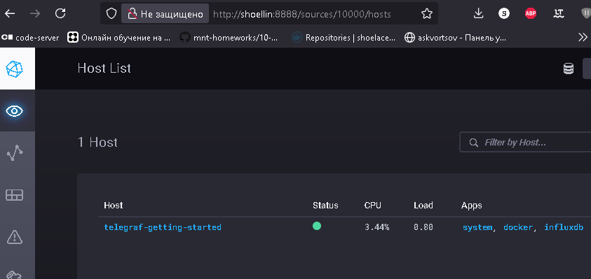
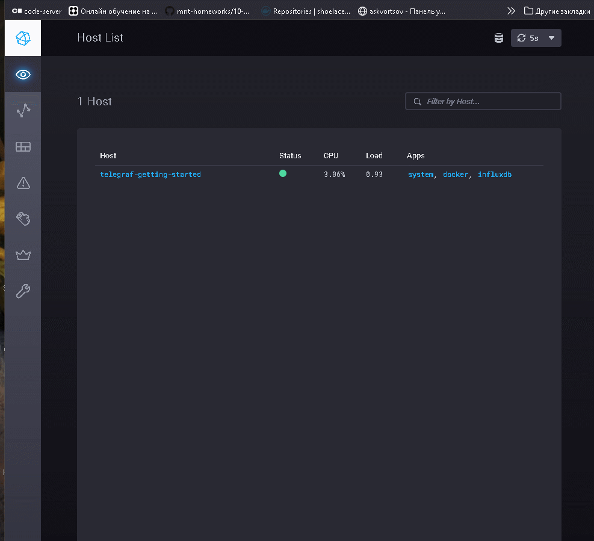

# Домашнее задание к занятию "`13.Системы мониторинга`" `Скворцов Денис`

## Обязательные задания

1. Вас пригласили настроить мониторинг на проект. На онбординге вам рассказали, что проект представляет из себя 
платформу для вычислений с выдачей текстовых отчетов, которые сохраняются на диск. Взаимодействие с платформой 
осуществляется по протоколу http. Также вам отметили, что вычисления загружают ЦПУ. Какой минимальный набор метрик вы
выведите в мониторинг и почему?

#

- Для минимального набора метрик в данном случае чтоит обратить внимание на:
     - Суммарную нагрузку CPU
       - так как обозначена нагрузка ЦПУ при вычислениях
     - Считывание объема оперативной памяти
       - Для отображения интенсивность использования ОЗУ на платформе; служит для отслеживания вероятности OOM
     - Считывание входящих/исходящих HTTP-запросов
       - Упоминалось работа платформы по протоколу `HTTP`; Позволит выявить объемы передаваемых данных/количество ошибок
     - Счетчик отчетов, сохраняемых на диск
       - Упоминалось "выдача текстовых отчетов"; эта метрика будет фиксировать выполнненные задания
     - Отслеживание состояние хранилищ по inod и занимаемому дисковому пространству
       - Для отслеживания занятости дискового пространства и ресурсов для записи новых отчетов
#

2. Менеджер продукта посмотрев на ваши метрики сказал, что ему непонятно что такое RAM/inodes/CPUla. Также он сказал, 
что хочет понимать, насколько мы выполняем свои обязанности перед клиентами и какое качество обслуживания. Что вы 
можете ему предложить?
#

-  По части вопроса о назначении метрик, если менджер имеет доступ до визуализации этих метрик, то как варинты:
     - Создать отдельную панель с Описанием здесь же или по ссылке на отдельную внутреннюю wiki-страницу
     - Если платформа визуализации метрик позволяет, выводить справку при наведении на легенду метрики или сделать из них кликабельную ссылку на описание метрики

-  По вопросу отслеживания метрик связанных с бизнес-процессами, имеет смымсл сформировать отслеживание соотношений, как пример для HTTP запросов:
     - SLA как уровень обслуживания - Соглавшение о доступность приложения в ~98% времени в месяц для пользователей
       - Количественная Сумма 2xx HTTP запросорв относительно суммы всех запросов `summ(2xx_requests) / summ(All_requests)`
     - SLO как надежность сервиса - Стремление к доступность приложения ~98,5% времени в месяц разрабочиками сервиса
       - Количественная сумма `2xx` и `3xx` HTTP запросов относительно суммы всех запросов `(2xx_requests + 3xx_requests) / summ(All_requests)`
     - SLI как реальный показатель качества сервиса - Оценка реальной доступности
       - Количественная сумма суммы`2xx`, суммы `3xx` и суммы `1xx` HTTP запросов относительно суммы всех запросов `(summ(2xx_requests) + summ(3xx_requests) + summ(1xx_requests)) / summ(All_requests)`

#
3. Вашей DevOps команде в этом году не выделили финансирование на построение системы сбора логов. Разработчики в свою 
очередь хотят видеть все ошибки, которые выдают их приложения. Какое решение вы можете предпринять в этой ситуации, 
чтобы разработчики получали ошибки приложения?
#

>1. Стоит озаботится о возможности выедления минимальных доступных уже сейчас ресурсах по хранению логов внутреннутри организации
>2. Организовать структурированние логов хотябы в STDOUT/STDERR формате

>3.0. Далее Дополниельно, если возможно выделить ресурсы по созданию хотябы одной ВМ

>3.1. Определится с возможностью использования и наличия имеющихся внутренних ресурсов по внедрению свободного программного обеспечения

>3.2. Развернуть и настроить верстку логов приложением семейства `Bit` или схожие с функционалам, на пример как `vector`

>3.3. Развертывание UI приложения (как пример Grafana Explore/Loki/Clichouse+Nginx)

#
4. Вы, как опытный SRE, сделали мониторинг, куда вывели отображения выполнения SLA=99% по http кодам ответов. 
Вычисляете этот параметр по следующей формуле: summ_2xx_requests/summ_all_requests. Данный параметр не поднимается выше 
70%, но при этом в вашей системе нет кодов ответа 5xx и 4xx. Где у вас ошибка?
#

>1. Попробывать высчитать `SLI` отношение, добавив в расчет запросы 3xx и 1xx запросов = `(summ(2xx_requests) + summ(3xx_requests + + summ(1xx_requests)) / summ(All_requests)`

>2. Проверить логи системы на предмет записей `timed out`, количество ответов может не увеличивается, но запрос может подсчитываться как `incoming`

#
5. Опишите основные плюсы и минусы pull и push систем мониторинга.
#

|Методы|Преимущества|Недостатки|
|--|--|--|
|`pull`|Простота развертывания - указывается только, откуда нужно извлечь данные|Нужен кастомный экспортер или конфигурация exporter для каждого условия не из коробки|
|--|Гарантированный обмен данными и меньшая зависимость от конфигурации цели|Трудно обновить не-метрические данные, необходимость создания отдельного механизма сбора данных|
|--|Относительно `push` низкое потребление ресурсов за узлел под метрики|Ограниченный период обнаружения изменений в рамках цикла опроса|
|--|Контроль на уровне L7 сетевого трафика|Сложность настройки аутентификации и авторизации - TLS, Basic Auth, OAuth2, ServiceAccount|
|--|Инициатором является сама служба сбора метрик|При проблемах в сети - могут блокироваться или терятся исходящие TCP-соединения|
|--|--|--|
|`push`|Быстрое обнаружение событий относительно `pull` методов|Инициатором выступает узел сбора метрик, потребляет дополнительные ресурсы|
|--|Ниже потенциальное потребление ресурсов на сервер сбора метрик|Усложнение защиты между узлом и сервером, если необходима аутентификация и шифрование протоколов передачи метрик|
|--|Клиент может выполнить повторную отправку данных, если связь с сервером в момент отправки не удалась|Большое количество клиентских узлов может генерировать большой объем трафика, что увеличит общую нагрузку на сеть|
|--|Обширный набор формата данных для отправки|--|
|--|Масштабирование разбалансировка нагрузки по серверным узлам|При масштабировании необходимо согласовать по настройкам на всех клиентских узлах|

#
6. Какие из ниже перечисленных систем относятся к push модели, а какие к pull? А может есть гибридные?

    - Prometheus 
    - TICK
    - Zabbix
    - VictoriaMetrics
    - Nagios
#

|Система|Pull|Push|Возможность гибридного режима|
|--|--|--|--|
|Prometheus|[x]|[ ]|может быть настроено только между Pushgateway и Prometheus|
|TICK|[ ]|[x]|[ ]|
|Zabbix|[ ]|[x]|по SNMP, SSH и по HTTP API|
|VictoriaMetrics|[x]|[ ]|[ ]|
|Nagios|[x]|[ ]|Через Nagios Remote Plugin Executor на узлах|


#
7. Склонируйте себе [репозиторий](https://github.com/influxdata/sandbox/tree/master) и запустите TICK-стэк, 
используя технологии docker и docker-compose.

В виде решения на это упражнение приведите скриншот веб-интерфейса ПО chronograf (`http://localhost:8888`). 

P.S.: если при запуске некоторые контейнеры будут падать с ошибкой - проставьте им режим `Z`, например
`./data:/var/lib:Z`
#



#
8. Перейдите в веб-интерфейс Chronograf (http://localhost:8888) и откройте вкладку Data explorer.
        
    - Нажмите на кнопку Add a query
    - Изучите вывод интерфейса и выберите БД telegraf.autogen
    - В `measurments` выберите cpu->host->telegraf-getting-started, а в `fields` выберите usage_system. Внизу появится график утилизации cpu.
    - Вверху вы можете увидеть запрос, аналогичный SQL-синтаксису. Поэкспериментируйте с запросом, попробуйте изменить группировку и интервал наблюдений.

Для выполнения задания приведите скриншот с отображением метрик утилизации cpu из веб-интерфейса.
#



#
9. Изучите список [telegraf inputs](https://github.com/influxdata/telegraf/tree/master/plugins/inputs). 
Добавьте в конфигурацию telegraf следующий плагин - [docker](https://github.com/influxdata/telegraf/tree/master/plugins/inputs/docker):
```
[[inputs.docker]]
  endpoint = "unix:///var/run/docker.sock"
```

Дополнительно вам может потребоваться донастройка контейнера telegraf в `docker-compose.yml` дополнительного volume и 
режима privileged:
```
  telegraf:
    image: telegraf:1.4.0
    privileged: true
    volumes:
      - ./etc/telegraf.conf:/etc/telegraf/telegraf.conf:Z
      - /var/run/docker.sock:/var/run/docker.sock:Z
    links:
      - influxdb
    ports:
      - "8092:8092/udp"
      - "8094:8094"
      - "8125:8125/udp"
```

После настройке перезапустите telegraf, обновите веб интерфейс и приведите скриншотом список `measurments` в 
веб-интерфейсе базы telegraf.autogen . Там должны появиться метрики, связанные с docker.

Факультативно можете изучить какие метрики собирает telegraf после выполнения данного задания.

    ---

### Как оформить ДЗ?

Выполненное домашнее задание пришлите ссылкой на .md-файл в вашем репозитории.

---

