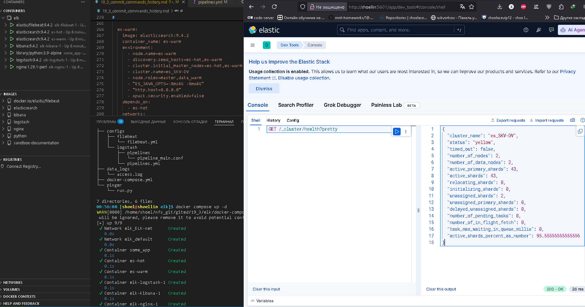
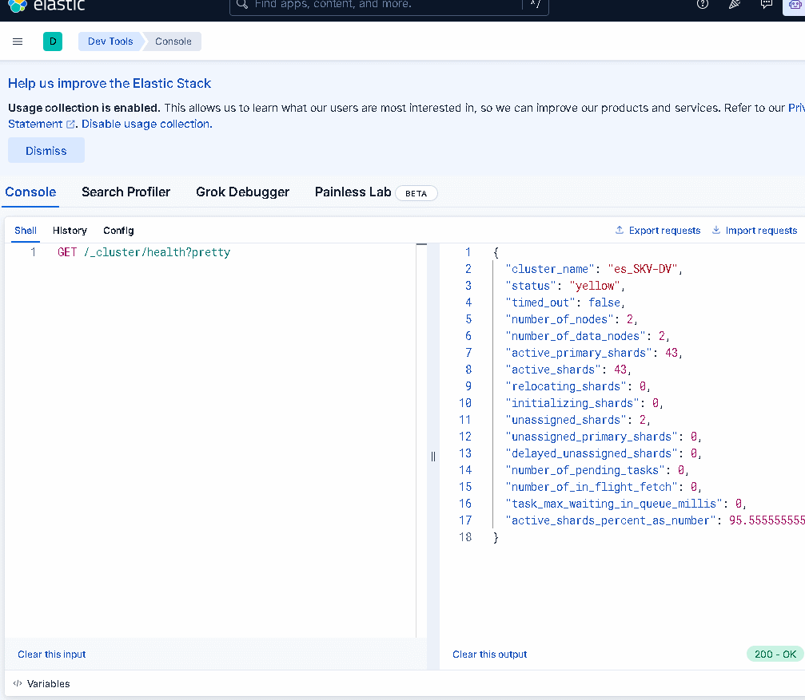

# Домашнее задание к занятию 15 «`Система сбора логов Elastic Stack`» `Скворцов Денис`

## Дополнительные ссылки

При выполнении задания используйте дополнительные ресурсы:

- [поднимаем elk в docker](https://www.elastic.co/guide/en/elastic-stack-get-started/current/get-started-docker.html);
- [поднимаем elk в docker с filebeat и docker-логами](https://www.sarulabs.com/post/5/2019-08-12/sending-docker-logs-to-elasticsearch-and-kibana-with-filebeat.html);
- [конфигурируем logstash](https://www.elastic.co/guide/en/logstash/current/configuration.html);
- [плагины filter для logstash](https://www.elastic.co/guide/en/logstash/current/filter-plugins.html);
- [конфигурируем filebeat](https://www.elastic.co/guide/en/beats/libbeat/5.3/config-file-format.html);
- [привязываем индексы из elastic в kibana](https://www.elastic.co/guide/en/kibana/current/index-patterns.html);
- [как просматривать логи в kibana](https://www.elastic.co/guide/en/kibana/current/discover.html);
- [решение ошибки increase vm.max_map_count elasticsearch](https://stackoverflow.com/questions/42889241/how-to-increase-vm-max-map-count).

В процессе выполнения в зависимости от системы могут также возникнуть не указанные здесь проблемы.

Используйте output stdout filebeat/kibana и api elasticsearch для изучения корня проблемы и её устранения.

## Задание повышенной сложности

Не используйте директорию [help](./help) при выполнении домашнего задания.

## Задание 1

Вам необходимо поднять в докере и связать между собой:

- elasticsearch (hot и warm ноды);
- logstash;
- kibana;
- filebeat.

Logstash следует сконфигурировать для приёма по tcp json-сообщений.

Filebeat следует сконфигурировать для отправки логов docker вашей системы в logstash.

В директории [help](./help) находится манифест docker-compose и конфигурации filebeat/logstash для быстрого 
выполнения этого задания.

Результатом выполнения задания должны быть:

- скриншот `docker ps` через 5 минут после старта всех контейнеров (их должно быть 5);
- скриншот интерфейса kibana;
- docker-compose манифест (если вы не использовали директорию help);
- ваши yml-конфигурации для стека (если вы не использовали директорию help).

#



> docker-compose
```yaml
version: "3.9"
services:
  es-hot:
    image: elasticsearch:9.4.2
    container_name: es-hot
    environment:
      - node.name=es-hot
      - discovery.seed_hosts=es-hot,es-warm
      - cluster.initial_master_nodes=es-hot,es-warm
      - cluster.name=es_SKV-DV
      - node.roles=master,data_content,data_hot
      - "ES_JAVA_OPTS=-Xms4G -Xmx4G"
      - "http.host=0.0.0.0"
      - xpack.security.enabled=false
    ports:
      - 9200:9200
    networks:
      - ELK-net

  es-warm:
    image: elasticsearch:9.4.2
    container_name: es-warm
    environment:
      - node.name=es-warm
      - discovery.seed_hosts=es-hot,es-warm
      - cluster.initial_master_nodes=es-hot,es-warm
      - cluster.name=es_SKV-DV
      - node.roles=master,data_warm
      - "ES_JAVA_OPTS=-Xms4G -Xmx4G"
      - "http.host=0.0.0.0"
      - xpack.security.enabled=false
    depends_on:
      - es-hot
    networks:
      - ELK-net

  kibana:
    image: kibana:9.4.2
    ports:
      - "5601:5601"
    depends_on:
      - es-hot
      - es-warm
    environment:
      ELASTICSEARCH_URL: http://es-hot:9200
      ELASTICSEARCH_HOSTS: '["http://es-hot:9200","http://es-warm:9200"]'
    networks:
      - ELK-net

  logstash:
    image: logstash:9.4.2
    environment:
      ES_HOST: "es-hot:9200"
    ports:
      - "5044:5044/udp"
    depends_on:
      - es-hot
      - es-warm
    volumes:
      - ./configs/logstash/pipelines.yml:/usr/share/logstash/config/pipelines.yml
      - ./configs/logstash/pipelines:/usr/share/logstash/config/pipelines
      - ./data_logs:/var/log/nginx
    networks:
      - ELK-net

  nginx:
    image: nginx:1.29.1-perl
    ports:
      - 8080:80
      - 8443:443
    depends_on:
      - logstash
    volumes:
      - ./data_logs/access.log:/var/log/nginx/access.log
    networks:
      - ELK-net

  filebeat:
    image: elastic/filebeat:9.4.2
    privileged: true
    user: root
    # group_add:
    #   - 959
    volumes:
      - ./data_logs:/var/log/app/:ro
      - ./configs/filebeat/filebeat.yml:/usr/share/filebeat/filebeat.yml
      - /var/run/docker.sock:/var/run/docker.sock:ro
      - /var/lib/docker/containers:/var/lib/docker/containers:ro
    depends_on:
      - logstash
      - es-hot
      - es-warm
      - kibana
      - nginx
      - some_application
    networks:
      - ELK-net

  some_application:
    image: library/python:3.9-alpine
    container_name: some_app
    volumes:
      - ./pinger/:/opt
    entrypoint: python3 /opt/run.py

networks:
  ELK-net:
    driver: bridge
```

#

> filebeat

```yaml
filebeat.inputs:
  # Вход для логов Nginx
  - type: filestream
    id: nginx-access-log
    paths:
      - /var/log/app/access.log
    parsers:
      - multiline:
          type: pattern
          pattern: '^[[:digit:]]{4}-[[:digit:]]{2}-[[:digit:]]{2}'
          negate: true
          match: after
    fields:
      service: nginx_access
    fields_under_root: true

  # Вход для *всех* логов Docker-контейнеров
  - type: filestream
    id: docker-all-logs
    paths:
      - '/var/lib/docker/containers/*/*.log'
    parsers:
      - container:
          format: auto
    processors:
      - add_docker_metadata:
          host: "unix:///var/run/docker.sock"
          match_source: true
          match_short_id: true

output.logstash:
  enabled: true
  hosts: ["logstash:5044"]
```

#

## Задание 2

Перейдите в меню [создания index-patterns  в kibana](http://localhost:5601/app/management/kibana/indexPatterns/create) и создайте несколько index-patterns из имеющихся.

Перейдите в меню просмотра логов в kibana (Discover) и самостоятельно изучите, как отображаются логи и как производить поиск по логам.

В манифесте директории help также приведенно dummy-приложение, которое генерирует рандомные события в stdout-контейнера.
Эти логи должны порождать индекс logstash-* в elasticsearch. Если этого индекса нет — воспользуйтесь советами и источниками из раздела «Дополнительные ссылки» этого задания.

#



---

### Как оформить решение задания

Выполненное домашнее задание пришлите в виде ссылки на .md-файл в вашем репозитории.

---
