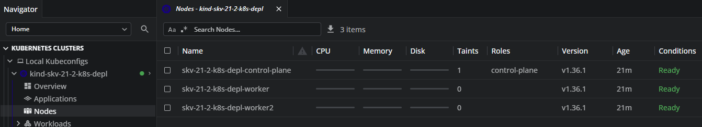
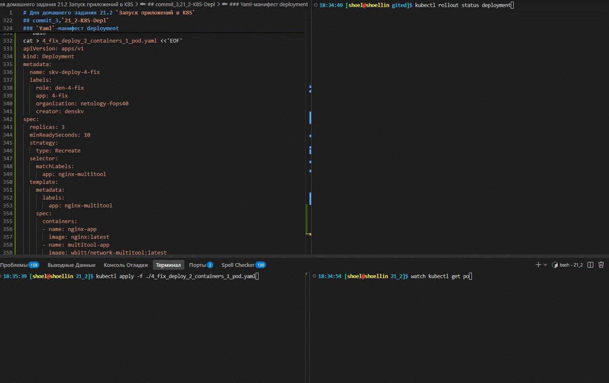
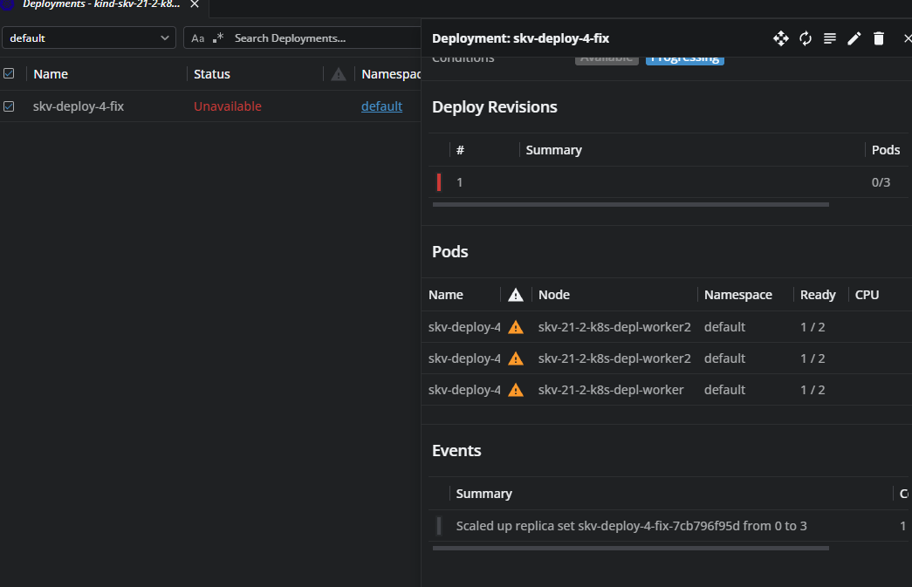
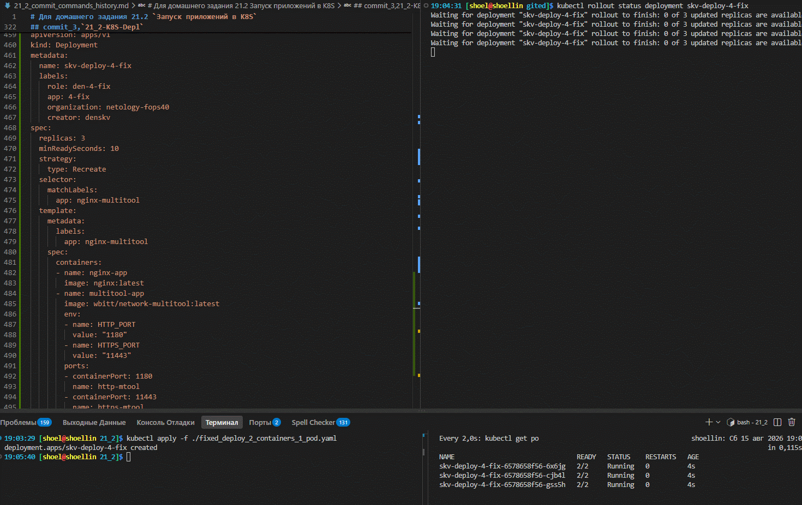
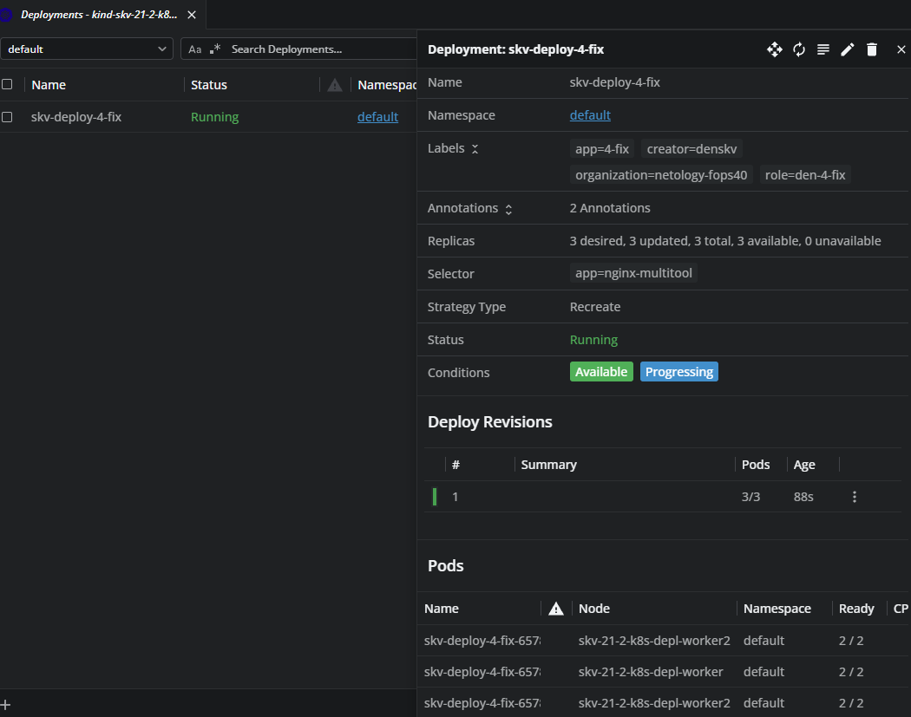
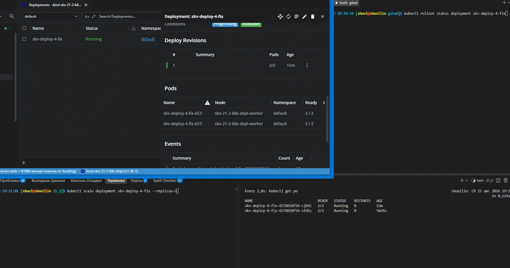
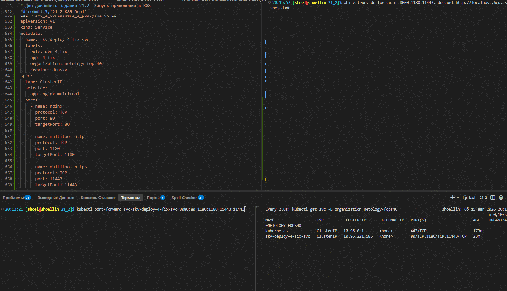
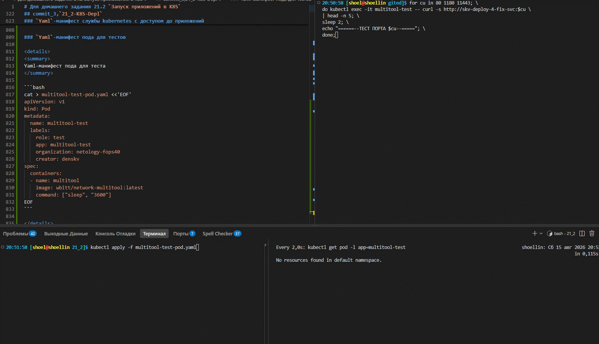
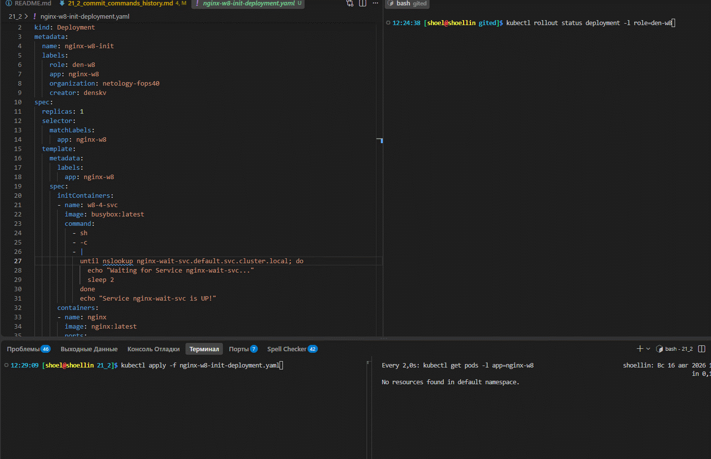
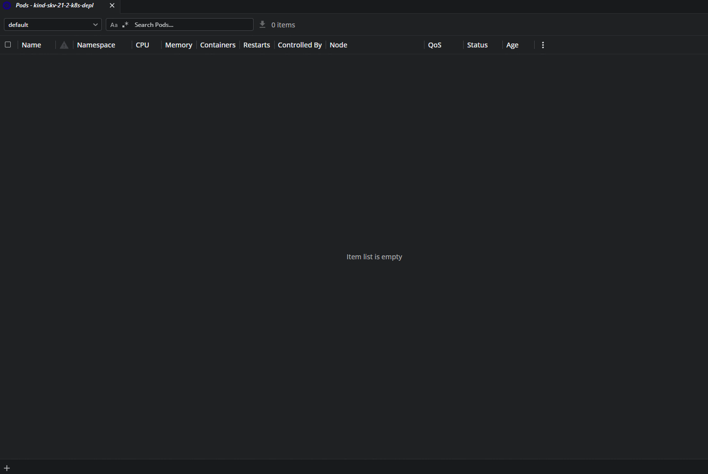

# Домашнее задание к занятию «`Запуск приложений в K8S`» `Скворцов Денис`

### Цель задания

В тестовой среде для работы с Kubernetes, установленной в предыдущем ДЗ, необходимо развернуть Deployment с приложением, состоящим из нескольких контейнеров, и масштабировать его.

------

## Чеклист готовности к домашнему заданию

1. Установленное k8s-решение (например, MicroK8S).

```bash
# k8s-решение In docker kind
kind --version
```

```log
kind version 0.32.0
```

```bash
# Запущенные ноды в докере
docker ps
```

```log
CONTAINER ID   IMAGE                  COMMAND                  CREATED         STATUS         PORTS                    NAMES
27278ed9ff32   kindest/node:v1.36.1   "/usr/local/bin/entr…"   4 minutes ago   Up 4 minutes   0.0.0.0:6443->6443/tcp   skv-21-2-k8s-depl-control-plane
607bf5f324ff   kindest/node:v1.36.1   "/usr/local/bin/entr…"   4 minutes ago   Up 4 minutes                            skv-21-2-k8s-depl-worker2
c2a73902d98e   kindest/node:v1.36.1   "/usr/local/bin/entr…"   4 minutes ago   Up 4 minutes                            skv-21-2-k8s-depl-worker
```

```bash
# Просмотр нод кластера
kubectl get no
```

```log
NAME                              STATUS   ROLES           AGE     VERSION
skv-21-2-k8s-depl-control-plane   Ready    control-plane   4m51s   v1.36.1
skv-21-2-k8s-depl-worker          Ready    <none>          4m40s   v1.36.1
skv-21-2-k8s-depl-worker2         Ready    <none>          4m40s   v1.36.1
```



2. Установленный локальный kubectl.

```bash
# Проверка версии установленного kubectl
kubectl version --client
```

```log
Client Version: v1.36.3
Kustomize Version: v5.8.1
```

3. Редактор YAML-файлов с подключённым git-репозиторием.

------

### Инструменты и дополнительные материалы, которые пригодятся для выполнения задания

1. [Описание](https://kubernetes.io/docs/concepts/workloads/controllers/deployment/) Deployment и примеры манифестов.
2. [Описание](https://kubernetes.io/docs/concepts/workloads/pods/init-containers/) Init-контейнеров.
3. [Описание](https://github.com/wbitt/Network-MultiTool) Multitool.

------

### Задание 1. Создать Deployment и обеспечить доступ к репликам приложения из другого Pod

1. Создать Deployment приложения, состоящего из двух контейнеров — nginx и multitool. Решить возникшую ошибку.


---


---


---


---

2. После запуска увеличить количество реплик работающего приложения до 2.
3. Продемонстрировать количество подов до и после масштабирования.


---

4. Создать Service, который обеспечит доступ до реплик приложений из п.1.


---

1. Создать отдельный Pod с приложением multitool и убедиться с помощью `curl`, что из пода есть доступ до приложений из п.1.



------

### Задание 2. Создать Deployment и обеспечить старт основного контейнера при выполнении условий

1. Создать Deployment приложения nginx и обеспечить старт контейнера только после того, как будет запущен сервис этого приложения.
2. Убедиться, что nginx не стартует. В качестве Init-контейнера взять busybox.
3. Создать и запустить Service. Убедиться, что Init запустился.



4. Продемонстрировать состояние пода до и после запуска сервиса.



------

### Правила приема работы

1. Домашняя работа оформляется в своем Git-репозитории в файле README.md. Выполненное домашнее задание пришлите ссылкой на .md-файл в вашем репозитории.
2. Файл README.md должен содержать скриншоты вывода необходимых команд `kubectl` и скриншоты результатов.
3. Репозиторий должен содержать файлы манифестов и ссылки на них в файле README.md.

------
