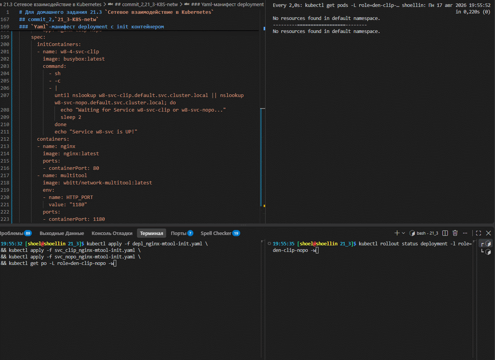
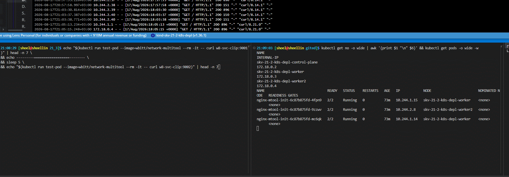
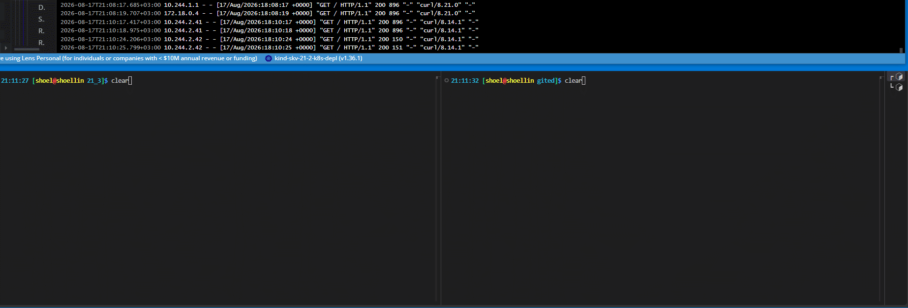
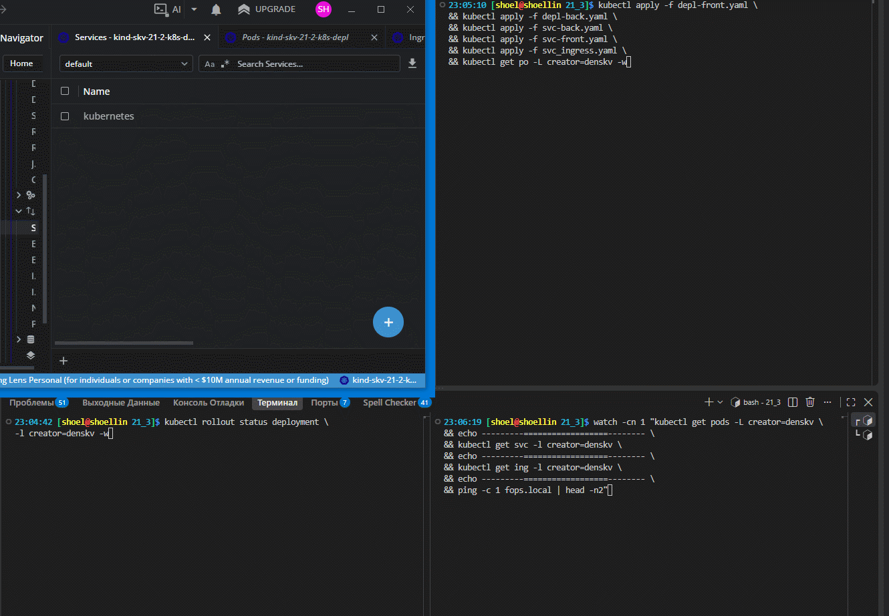
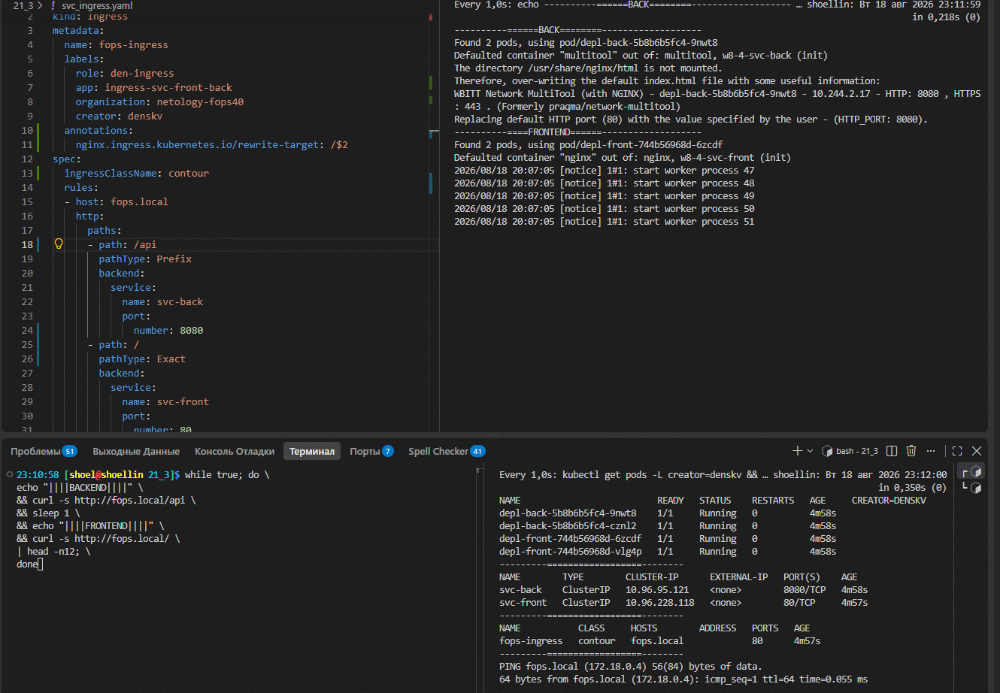

# Домашнее задание к занятию «`Сетевое взаимодействие в Kubernetes`» `Скворцов Денис`

### Примерное время выполнения задания

120 минут

### Цель задания

Научиться настраивать доступ к приложениям в Kubernetes:
- Внутри кластера через **Service** (ClusterIP, NodePort).
- Снаружи кластера через **Ingress**.

Это задание поможет вам освоить базовые принципы сетевого взаимодействия в Kubernetes — ключевого навыка для работы с кластерами.
На практике Service и Ingress используются для доступа к приложениям, балансировки нагрузки и маршрутизации трафика. Понимание этих механизмов поможет вам упростить управление сервисами в рабочих окружениях и снизит риски ошибок при развёртывании.

------

## **Подготовка**
### **Чеклист готовности**
- Установлен Kubernetes (MicroK8S, Minikube или другой).

```bash
# k8s-решение In docker kind
kind --version
```

```log
kind version 0.32.0
```

```bash
# Запущенные ноды в докере
docker ps
```

```log
CONTAINER ID   IMAGE                  COMMAND                  CREATED         STATUS         PORTS                    NAMES
27278ed9ff32   kindest/node:v1.36.1   "/usr/local/bin/entr…"   4 minutes ago   Up 4 minutes   0.0.0.0:6443->6443/tcp   skv-21-2-k8s-depl-control-plane
607bf5f324ff   kindest/node:v1.36.1   "/usr/local/bin/entr…"   4 minutes ago   Up 4 minutes                            skv-21-2-k8s-depl-worker2
c2a73902d98e   kindest/node:v1.36.1   "/usr/local/bin/entr…"   4 minutes ago   Up 4 minutes                            skv-21-2-k8s-depl-worker
```

```bash
# Просмотр нод кластера
kubectl get no
```

```log
NAME                              STATUS   ROLES           AGE     VERSION
skv-21-2-k8s-depl-control-plane   Ready    control-plane   4m51s   v1.36.1
skv-21-2-k8s-depl-worker          Ready    <none>          4m40s   v1.36.1
skv-21-2-k8s-depl-worker2         Ready    <none>          4m40s   v1.36.1
```


- Установлен `kubectl`.

```bash
# Проверка версии установленного kubectl
kubectl version --client
```

```log
Client Version: v1.36.3
Kustomize Version: v5.8.1
```

- Редактор для YAML-файлов (VS Code, Vim и др.).

------

### Инструменты, которые пригодятся для выполнения задания

1. [Инструкция](https://microk8s.io/docs/getting-started) по установке MicroK8S.
2. [Инструкция](https://minikube.sigs.k8s.io/docs/start/?arch=%2Fwindows%2Fx86-64%2Fstable%2F.exe+download) по установке Minikube. 
3. [Инструкция](https://kubernetes.io/docs/tasks/tools/install-kubectl-windows/)по установке kubectl.
4. [Инструкция](https://marketplace.visualstudio.com/items?itemName=ms-kubernetes-tools.vscode-kubernetes-tools) по установке VS Code

### Дополнительные материалы, которые пригодятся для выполнения задания

1. [Описание](https://kubernetes.io/docs/concepts/workloads/controllers/deployment/) Deployment и примеры манифестов.
2. [Описание](https://kubernetes.io/docs/concepts/services-networking/service/) Описание Service.
3. [Описание](https://kubernetes.io/docs/concepts/services-networking/ingress/) Ingress.
4. [Описание](https://github.com/wbitt/Network-MultiTool) Multitool.

------

## **Задание 1: Настройка Service (ClusterIP и NodePort)**
### **Задача**
Развернуть приложение из двух контейнеров (`nginx` и `multitool`) и обеспечить доступ к ним:
- Внутри кластера через **ClusterIP**.
- Снаружи через **NodePort**.

### **Шаги выполнения**
1. **Создать Deployment** с двумя контейнерами:
   - `nginx` (порт `80`).
   - `multitool` (порт `8080`).
   - Количество реплик: `3`.

---
<details>
<summary>
Yaml-манифест deployment с init контейнером
</summary>

```bash
cat > depl_nginx-mtool-init.yaml <<'EOF'
apiVersion: apps/v1
kind: Deployment
metadata:
  name: nginx-mtool-init
  labels:
    role: den-clip-nopo
    app: nginx-clip-nopo
    organization: netology-fops40
    creator: denskv
spec:
  replicas: 3
  minReadySeconds: 10
  strategy:
    type: Recreate
  selector:
    matchLabels:
      app: nginx-clip-nopo
  template:
    metadata:
      labels:
        app: nginx-clip-nopo
    spec:
      initContainers:
      - name: w8-4-svc-clip
        image: busybox:latest
        command:
          - sh
          - -c
          - |
            until nslookup w8-svc-clip.default.svc.cluster.local || nslookup w8-svc-nopo.default.svc.cluster.local; do
              echo "Waiting for Service w8-svc-clip or w8-svc-nopo..."
              sleep 2
            done
            echo "Service w8-svc is UP!"
      containers:
      - name: nginx
        image: nginx:latest
        ports:
        - containerPort: 80
      - name: multitool
        image: wbitt/network-multitool:latest
        env:
        - name: HTTP_PORT
          value: "1180"
        ports:
        - containerPort: 1180
EOF
```

</details>

---

2. **Создать Service типа ClusterIP**, который:
   - Открывает `nginx` на порту `9001`.
   - Открывает `multitool` на порту `9002`.

---
<details>
<summary>
Yaml-манифест ClusterIP для deployment nginx-mtool-init
</summary>

```bash
cat > svc_clip_nginx-mtool-init.yaml <<'EOF'
apiVersion: v1
kind: Service
metadata:
  name: w8-svc-clip
  labels:
    role: den-clip-nopo
    app: nginx-clip-nopo
    organization: netology-fops40
    creator: denskv
spec:
  type: ClusterIP
  selector:
    app: nginx-clip-nopo
  ports:
  - name: nginx
    port: 9001
    targetPort: 80
    protocol: TCP
  - name: multitool
    port: 9002
    targetPort: 1180
    protocol: TCP
EOF
```

</details>

---


---

3. **Проверить доступность** изнутри кластера:
```bash
 kubectl run test-pod --image=wbitt/network-multitool --rm -it -- sh
 curl <service-name>:9001 # Проверить nginx
 curl <service-name>:9002 # Проверить multitool
```


---

4. **Создать Service типа NodePort** для доступа к `nginx` снаружи.

---
<details>
<summary>
Yaml-манифест NodePort для deployment nginx-mtool-init
</summary>

```bash
cat > svc_nopo_nginx-mtool-init.yaml <<'EOF'
apiVersion: v1
kind: Service
metadata:
  name: w8-svc-nopo
  labels:
    role: den-clip-nopo
    app: nginx-clip-nopo
    organization: netology-fops40
    creator: denskv
spec:
  type: NodePort
  selector:
    app: nginx-clip-nopo
  ports:
  - name: nginx
    port: 80
    targetPort: 80
    nodePort: 30080
    protocol: TCP
EOF
```

</details>

---

5. **Проверить доступ** с локального компьютера:
```bash
 curl <node-ip>:<node-port>
   ```
 или через браузер.



---

### **Что сдать на проверку**
- Манифесты:
  - [deployment-multi-container.yaml](./depl_nginx-mtool-init.yaml)
  - [service-clusterip.yaml](./svc_clip_nginx-mtool-init.yaml)
  - [service-nodeport.yaml](./svc_nopo_nginx-mtool-init.yaml)
- Скриншоты проверки доступа (`curl` или браузер).

---
## **Задание 2: Настройка Ingress**
### **Задача**
Развернуть два приложения (`frontend` и `backend`) и обеспечить доступ к ним через **Ingress** по разным путям.

### **Шаги выполнения**
1. **Развернуть два Deployment**:
   - `frontend` (образ `nginx`).
   - `backend` (образ `wbitt/network-multitool`).


<details>
<summary>
Yaml-манифест deployment depl-front
</summary>

```bash
cat > depl-front.yaml <<'EOF'
apiVersion: apps/v1
kind: Deployment
metadata:
  name: depl-front
  labels:
    role: den-ingress
    app: front-app
    organization: netology-fops40
    creator: denskv
spec:
  replicas: 2
  minReadySeconds: 10
  strategy:
    type: Recreate
  selector:
    matchLabels:
      app: app-front
  template:
    metadata:
      labels:
        app: app-front
    spec:
      initContainers:
      - name: w8-4-svc-front
        image: busybox:latest
        command:
          - sh
          - -c
          - |
            until nslookup svc-front.default.svc.cluster.local; do
              echo "Waiting for Service svc-front..."
              sleep 2
            done
            echo "Service svc-front is UP!"
      containers:
      - name: nginx
        image: nginx:latest
        ports:
        - containerPort: 80
EOF
```

</details>

<details>
<summary>
Yaml-манифест deployment depl-back
</summary>

```bash
cat > depl-back.yaml <<'EOF'
apiVersion: apps/v1
kind: Deployment
metadata:
  name: depl-back
  labels:
    role: den-ingress
    app: back-app
    organization: netology-fops40
    creator: denskv
spec:
  replicas: 2
  minReadySeconds: 10
  strategy:
    type: Recreate
  selector:
    matchLabels:
      app: app-back
  template:
    metadata:
      labels:
        app: app-back
    spec:
      initContainers:
      - name: w8-4-svc-back
        image: busybox:latest
        command:
          - sh
          - -c
          - |
            until nslookup svc-back.default.svc.cluster.local; do
              echo "Waiting for Service svc-back..."
              sleep 2
            done
            echo "Service svc-back is UP!"
      containers:
      - name: multitool
        image: wbitt/network-multitool:latest
        env:
        - name: HTTP_PORT
          value: "8080"
        ports:
        - containerPort: 8080
EOF
```

</details>
    
---

2. **Создать Service** для каждого приложения.

<details>
<summary>
Yaml-манифест backend сервиса для deployment depl-back
</summary>

```bash
cat > svc-back.yaml <<'EOF'
apiVersion: v1
kind: Service
metadata:
  name: svc-back
  labels:
    role: den-ingress
    app: back-app
    organization: netology-fops40
    creator: denskv
spec:
  type: ClusterIP
  selector:
    app: app-back
  ports:
  - name: http
    port: 8080
    targetPort: 8080
    protocol: TCP
EOF
```

</details>

---

<details>
<summary>
Yaml-манифест frontend сервиса для deployment depl-front
</summary>

```bash
cat > svc-front.yaml <<'EOF'
apiVersion: v1
kind: Service
metadata:
  name: svc-front
  labels:
    role: den-ingress
    app: front-app
    organization: netology-fops40
    creator: denskv
spec:
  type: ClusterIP
  selector:
    app: app-front
  ports:
  - name: http
    port: 80
    targetPort: 80
    protocol: TCP
EOF
```

</details>

---
3. **Включить Ingress-контроллер**:


```bash
# Установка contour Ingress контроллера
git clone https://github.com/projectcontour/contour.git

find . \
-name ".git" \
-exec rm -vrf {} \;

kubectl apply \
-f ./contour/examples/contour
```

<details>
<summary>
Вывод развертывания contour
</summary>

```log
Клонирование в «contour»...
remote: Enumerating objects: 57875, done.
remote: Counting objects: 100% (1428/1428), done.
remote: Compressing objects: 100% (671/671), done.
remote: Total 57875 (delta 1176), reused 812 (delta 746), pack-reused 56447 (from 5)
Получение объектов: 100% (57875/57875), 39.55 MiB | 10.49 MiB/s, готово.
Определение изменений: 100% (43186/43186), готово.
Updating files: 100% (2992/2992), готово.

удалён './contour/.git/description'
удалён './contour/.git/hooks/post-update.sample'
удалён './contour/.git/hooks/pre-rebase.sample'
удалён './contour/.git/hooks/pre-commit.sample'
удалён './contour/.git/hooks/pre-receive.sample'
удалён './contour/.git/hooks/commit-msg.sample'
удалён './contour/.git/hooks/pre-push.sample'
удалён './contour/.git/hooks/applypatch-msg.sample'
удалён './contour/.git/hooks/pre-applypatch.sample'
удалён './contour/.git/hooks/update.sample'
удалён './contour/.git/hooks/fsmonitor-watchman.sample'
удалён './contour/.git/hooks/push-to-checkout.sample'
удалён './contour/.git/hooks/pre-merge-commit.sample'
удалён './contour/.git/hooks/sendemail-validate.sample'
удалён './contour/.git/hooks/prepare-commit-msg.sample'
удалён каталог './contour/.git/hooks'
удалён './contour/.git/info/exclude'
удалён каталог './contour/.git/info'
удалён './contour/.git/objects/pack/pack-38e2169f1d9ca8d3db9ca5e3e031db43b733f469.pack'
удалён './contour/.git/objects/pack/pack-38e2169f1d9ca8d3db9ca5e3e031db43b733f469.rev'
удалён './contour/.git/objects/pack/pack-38e2169f1d9ca8d3db9ca5e3e031db43b733f469.idx'
удалён каталог './contour/.git/objects/pack'
удалён каталог './contour/.git/objects/info'
удалён каталог './contour/.git/objects'
удалён './contour/.git/refs/heads/main'
удалён каталог './contour/.git/refs/heads'
удалён каталог './contour/.git/refs/tags'
удалён './contour/.git/refs/remotes/origin/HEAD'
удалён каталог './contour/.git/refs/remotes/origin'
удалён каталог './contour/.git/refs/remotes'
удалён каталог './contour/.git/refs'
удалён './contour/.git/packed-refs'
удалён './contour/.git/logs/refs/remotes/origin/HEAD'
удалён каталог './contour/.git/logs/refs/remotes/origin'
удалён каталог './contour/.git/logs/refs/remotes'
удалён './contour/.git/logs/refs/heads/main'
удалён каталог './contour/.git/logs/refs/heads'
удалён каталог './contour/.git/logs/refs'
удалён './contour/.git/logs/HEAD'
удалён каталог './contour/.git/logs'
удалён './contour/.git/HEAD'
удалён './contour/.git/config'
удалён './contour/.git/index'
удалён каталог './contour/.git'
find: «./contour/.git»: Нет такого файла или каталога

namespace/projectcontour created
serviceaccount/contour created
serviceaccount/envoy created
configmap/contour created
customresourcedefinition.apiextensions.k8s.io/contourconfigurations.projectcontour.io created
customresourcedefinition.apiextensions.k8s.io/contourdeployments.projectcontour.io created
customresourcedefinition.apiextensions.k8s.io/extensionservices.projectcontour.io created
customresourcedefinition.apiextensions.k8s.io/httpproxies.projectcontour.io created
customresourcedefinition.apiextensions.k8s.io/tlscertificatedelegations.projectcontour.io created
serviceaccount/contour-certgen created
rolebinding.rbac.authorization.k8s.io/contour created
role.rbac.authorization.k8s.io/contour-certgen created
job.batch/contour-certgen-main created
clusterrolebinding.rbac.authorization.k8s.io/contour created
rolebinding.rbac.authorization.k8s.io/contour-rolebinding created
clusterrole.rbac.authorization.k8s.io/contour created
role.rbac.authorization.k8s.io/contour created
service/contour created
service/envoy created
deployment.apps/contour created
daemonset.apps/envoy created
```

</details>

```bash
# проверка подов в namespace projectcontour
kubectl get pods -n projectcontour -o wide
```

<details>
<summary>
Проверка созданных ресурсов
</summary>

```log
NAME                       READY   STATUS    RESTARTS   AGE   IP           NODE                        NOMINATED NODE   READINESS GATES
contour-5595b97775-n88js   1/1     Running   0          87s   10.244.2.4   skv-21-2-k8s-depl-worker2   <none>           <none>
contour-5595b97775-psd4d   1/1     Running   0          87s   10.244.1.4   skv-21-2-k8s-depl-worker    <none>           <none>
envoy-mb6vz                2/2     Running   0          87s   10.244.1.5   skv-21-2-k8s-depl-worker    <none>           <none>
envoy-zpxfp                2/2     Running   0          87s   10.244.2.5   skv-21-2-k8s-depl-worker2   <none>           <none>
```

</details>

---

4. **Создать Ingress**, который:
   - Открывает `frontend` по пути `/`.
   - Открывает `backend` по пути `/api`.

<details>
<summary>
Yaml-манифест ingress сервиса для deployment depl-front и depl-back
</summary>

```bash
cat > svc_ingress.yaml <<'EOF'
apiVersion: networking.k8s.io/v1
kind: Ingress
metadata:
  name: fops-ingress
  labels:
    role: den-ingress
    app: ingress-svc-front-back
    organization: netology-fops40
    creator: denskv
  annotations:
    nginx.ingress.kubernetes.io/rewrite-target: /$2
spec:
  ingressClassName: contour
  rules:
  - host: fops.local
    http:
      paths:
      - path: /api(/|$)(.*)
        pathType: Prefix
        backend:
          service:
            name: svc-back
            port:
              number: 8080
      - path: /
        pathType: Prefix
        backend:
          service:
            name: svc-front
            port:
              number: 80
EOF
```

</details>

---


```bash
# добавление записи в /etc/hosts и проверка backend и frontend сервисов
echo "172.18.0.4 fops.local" \
| sudo tee -a /etc/hosts

cat /etc/hosts
```

<details>
<summary>
Проверка resolving имен на хосте сервера kubernetes
</summary>

```log
172.18.0.4 fops.local

# Static table lookup for hostnames.
# See hosts(5) for details.
# Static table lookup for hostnames.
# See hosts(5) for details.
127.0.0.1        localhost
::1              localhost
172.18.0.4 fops.local
```

</details>


```bash
ping -c 2 fops.local
```

<details>
<summary>
Проверка resolving имен на хосте сервера kubernetes
</summary>

```log
PING fops.local (172.18.0.4) 56(84) bytes of data.
64 bytes from fops.local (172.18.0.4): icmp_seq=1 ttl=64 time=0.042 ms
64 bytes from fops.local (172.18.0.4): icmp_seq=2 ttl=64 time=0.053 ms

--- fops.local ping statistics ---
2 packets transmitted, 2 received, 0% packet loss, time 1059ms
rtt min/avg/max/mdev = 0.042/0.047/0.053/0.005 ms                                                                                            15:53:34
```

</details>



5. **Проверить доступность**:
```bash
 curl <host>/
 curl <host>/api
   ```
 или через браузер.



### **Что сдать на проверку**
- Манифесты:
  - [deployment-frontend.yaml](./depl-front.yaml)
  - [deployment-backend.yaml](./depl-back.yaml)
  - [service-frontend.yaml](./svc-front.yaml)
  - [service-backend.yaml](./svc-back.yaml)
  - [ingress.yaml](./svc_ingress.yaml)
- Скриншоты проверки доступа (`curl` или браузер).

---
## Шаблоны манифестов с учебными комментариями
### **1. Deployment (nginx + multitool)**
```yaml
apiVersion: apps/v1
kind: Deployment
metadata:
  name: # ПРИМЕР: "multi-container-app"
spec:
  replicas: # ЗАДАНИЕ: Укажите количество реплик
  selector:
    matchLabels:
      app: # ДОПОЛНИТЕ: Метка для селектора
  template:
    metadata:
      labels:
        app: # ПОВТОРИТЕ метку из selector.matchLabels
    spec:
      containers:
 - name: # ЗАДАНИЕ: Название первого контейнера
        image: nginx
        ports:
 - containerPort: 80
 - name: multitool
        image: wbitt/network-multitool
        ports:
 - containerPort: 8080
        env:
 - name: HTTP_PORT
          value: "8080" # КЛЮЧЕВОЙ МОМЕНТ: Порт должен совпадать с containerPort
```
### **2. Ingress (для frontend и backend)**
```yaml
apiVersion: networking.k8s.io/v1
kind: Ingress
metadata:
  name: # ЗАДАНИЕ: Придумайте имя, допустим example-ingress
  annotations:  # ВАЖНО: Эта аннотация нужна для rewrite правил
    nginx.ingress.kubernetes.io/rewrite-target: /
spec:
  rules:
 - http:
      paths:
 - path: /
        pathType: Prefix
        backend:
          service:
            name: # УКАЖИТЕ: Имя frontend Service
            port:
              number: 80
 - path: /api # КЛЮЧЕВОЙ ПУТЬ: API endpoint
        pathType: Prefix
        backend:
          service:
            name: # УКАЖИТЕ: Имя backend Service
            port:
              number: 80
```
---

## **Правила приёма работы**
1. Домашняя работа оформляется в своём Git-репозитории в файле README.md. Выполненное домашнее задание пришлите ссылкой на .md-файл в вашем репозитории.
2. Файл README.md должен содержать скриншоты вывода необходимых команд `kubectl` и скриншоты результатов.
3. Репозиторий должен содержать тексты манифестов или ссылки на них в файле README.md.

## **Критерии оценивания задания**
1. Зачёт: Все задачи выполнены, манифесты корректны, есть доказательства работы (скриншоты).
2. Доработка (на доработку задание направляется 1 раз): основные задачи выполнены, при этом есть ошибки в манифестах или отсутствуют проверочные скриншоты.
3. Незачёт: работа выполнена не в полном объёме, есть ошибки в манифестах, отсутствуют проверочные скриншоты. Все попытки доработки израсходованы (на доработку работа направляется 1 раз). Этот вид оценки используется крайне редко.

## **Срок выполнения задания**  
1. 5 дней на выполнение задания.
2. 5 дней на доработку задания (в случае направления задания на доработку).
