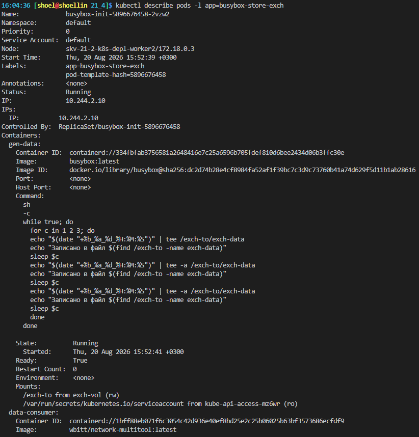
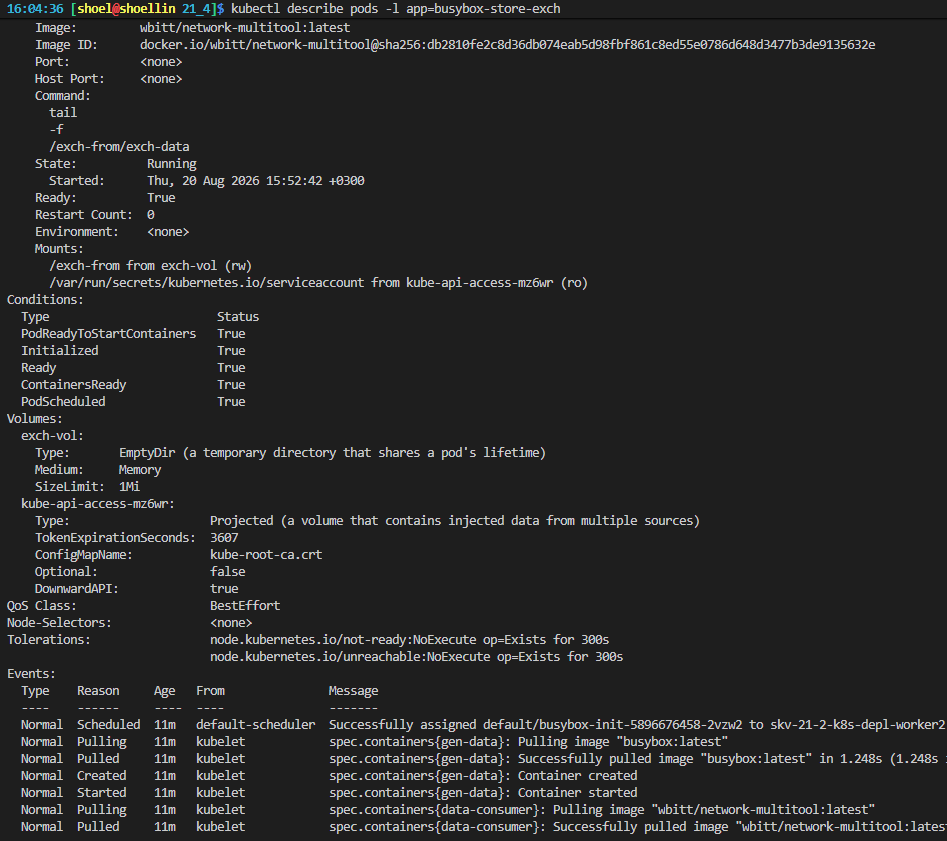
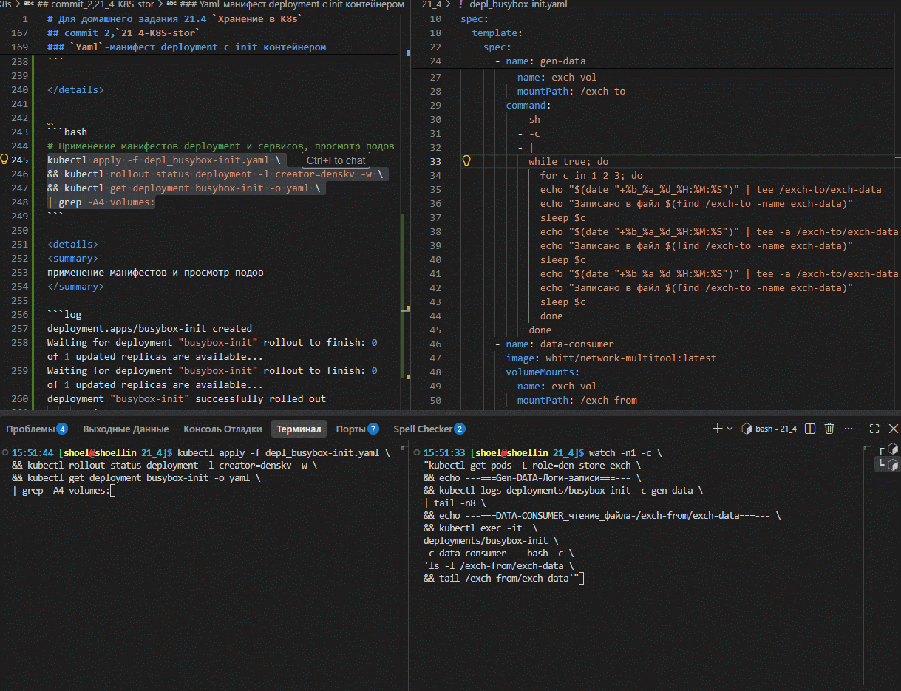
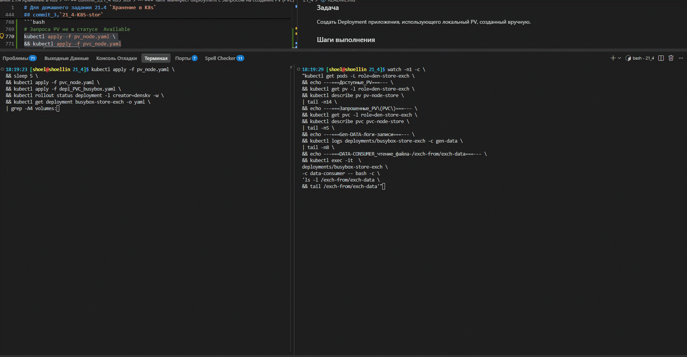
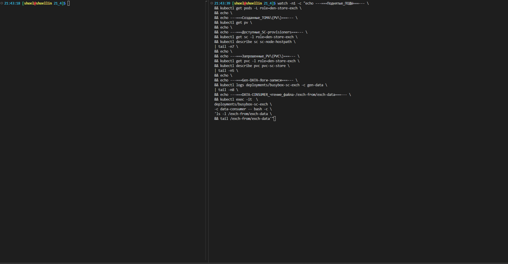

# Домашнее задание к занятию «`Хранение в K8s`»`Скворцов Денис`

### Примерное время выполнения задания — 180 минут

### Цель задания

Научиться работать с хранилищами в тестовой среде Kubernetes:

- обеспечить обмен файлами между контейнерами пода;
- создавать **PersistentVolume** (PV) и использовать его в подах через **PersistentVolumeClaim** (PVC);
- объявлять свой **StorageClass** (SC) и монтировать его в под через **PVC**.

Это задание поможет вам освоить базовые принципы взаимодействия с хранилищами в Kubernetes — одного из ключевых навыков для работы с кластерами. На практике Volume, PV, PVC используются для хранения данных независимо от пода, обмена данными между подами и контейнерами внутри пода. Понимание этих механизмов поможет вам упростить проектирование слоя данных для приложений, разворачиваемых в кластере k8s.

------

## **Подготовка**

### **Чеклист готовности**

1. Установленное K8s-решение (допустим, MicroK8S).

```bash
# k8s-решение In docker kind
kind --version
```

```log
kind version 0.32.0
```

```bash
# Запущенные ноды в докере
docker ps
```

```log
CONTAINER ID   IMAGE                  COMMAND                  CREATED         STATUS         PORTS                    NAMES
27278ed9ff32   kindest/node:v1.36.1   "/usr/local/bin/entr…"   4 minutes ago   Up 4 minutes   0.0.0.0:6443->6443/tcp   skv-21-2-k8s-depl-control-plane
607bf5f324ff   kindest/node:v1.36.1   "/usr/local/bin/entr…"   4 minutes ago   Up 4 minutes                            skv-21-2-k8s-depl-worker2
c2a73902d98e   kindest/node:v1.36.1   "/usr/local/bin/entr…"   4 minutes ago   Up 4 minutes                            skv-21-2-k8s-depl-worker
```

```bash
# Просмотр нод кластера
kubectl get no
```

```log
NAME                              STATUS   ROLES           AGE     VERSION
skv-21-2-k8s-depl-control-plane   Ready    control-plane   4m51s   v1.36.1
skv-21-2-k8s-depl-worker          Ready    <none>          4m40s   v1.36.1
skv-21-2-k8s-depl-worker2         Ready    <none>          4m40s   v1.36.1
```


2. Установленный локальный kubectl.

```bash
# Проверка версии установленного kubectl
kubectl version --client
```

```log
Client Version: v1.36.3
Kustomize Version: v5.8.1
```

3. Редактор YAML-файлов с подключенным GitHub-репозиторием.

```bash
code -v
```

```log
1.134.0
110a328ea54b42367b803ec53ee0bf52ef26b419
x64
```

```bash
git remote -v
```

```log
study-fops39_sc ssh://ssh.sourcecraft.dev/shoelacevip12/study-fops39.git (fetch)
study-fops39_sc ssh://ssh.sourcecraft.dev/shoelacevip12/study-fops39.git (push)
study_fops39    git@github.com:shoelacevip12/study_fops39.git (fetch)
study_fops39    git@github.com:shoelacevip12/study_fops39.git (push)
study_fops39_gitflic_ru git@gitflic.ru:shoelacevip12/fops39.git (fetch)
study_fops39_gitflic_ru git@gitflic.ru:shoelacevip12/fops39.git (push)
```

------

### Инструменты, которые пригодятся для выполнения задания

1. [Инструкция](https://microk8s.io/docs/getting-started) по установке MicroK8S.
2. [Инструкция](https://minikube.sigs.k8s.io/docs/start/?arch=%2Fwindows%2Fx86-64%2Fstable%2F.exe+download) по установке Minikube.
3. [Инструкция](https://kubernetes.io/docs/tasks/tools/install-kubectl-windows/) по установке kubectl.
4. [Инструкция](https://marketplace.visualstudio.com/items?itemName=ms-kubernetes-tools.vscode-kubernetes-tools) по установке VS Code

### Дополнительные материалы, которые пригодятся для выполнения задания

1. [Описание Volumes](https://kubernetes.io/docs/concepts/storage/volumes/).
2. [Описание Ephemeral Volumes](https://kubernetes.io/docs/concepts/storage/volumes/).
3. [Описание PersistentVolume](https://kubernetes.io/docs/concepts/storage/persistent-volumes/).
4. [Описание PersistentVolumeClaim](https://kubernetes.io/docs/concepts/storage/persistent-volumes/#persistentvolumeclaims).
5. [Описание StorageClass](https://kubernetes.io/docs/concepts/storage/storage-classes/).
6. [Описание Multitool](https://github.com/wbitt/Network-MultiTool).

------

## Задание 1. Volume: обмен данными между контейнерами в поде

### Задача

Создать Deployment приложения, состоящего из двух контейнеров, обменивающихся данными.

### Шаги выполнения

1. Создать Deployment приложения, состоящего из контейнеров busybox и multitool.
2. Настроить busybox на запись данных каждые 5 секунд в некий файл в общей директории.
3. Обеспечить возможность чтения файла контейнером multitool.

### Что сдать на проверку

- Манифесты:
  - [containers-data-exchange.yaml](./depl_busybox-init.yaml)
- Скриншоты:
  - описание пода с контейнерами (`kubectl describe pods data-exchange`)
  
<details>
<summary>
describe подов -l app=busybox-store-exch
</summary>

```log
Name:             busybox-init-5896676458-2vzw2
Namespace:        default
Priority:         0
Service Account:  default
Node:             skv-21-2-k8s-depl-worker2/172.18.0.3
Start Time:       Thu, 20 Aug 2026 15:52:39 +0300
Labels:           app=busybox-store-exch
                  pod-template-hash=5896676458
Annotations:      <none>
Status:           Running
IP:               10.244.2.10
IPs:
  IP:           10.244.2.10
Controlled By:  ReplicaSet/busybox-init-5896676458
Containers:
  gen-data:
    Container ID:  containerd://334fbfab3756581a2648416e7c25a6596b705fdef810d6bee2434d06b3ffc30e
    Image:         busybox:latest
    Image ID:      docker.io/library/busybox@sha256:dc2d74b28e4cf8984fa52af1f39bc7c3d9c73760b41a74d629f5d11b1ab28616
    Port:          <none>
    Host Port:     <none>
    Command:
      sh
      -c
      while true; do
        for c in 1 2 3; do
        echo "$(date "+%b_%a_%d_%H:%M:%S")" | tee /exch-to/exch-data
        echo "Записано в файл $(find /exch-to -name exch-data)"
        sleep $c
        echo "$(date "+%b_%a_%d_%H:%M:%S")" | tee -a /exch-to/exch-data
        echo "Записано в файл $(find /exch-to -name exch-data)"
        sleep $c
        echo "$(date "+%b_%a_%d_%H:%M:%S")" | tee -a /exch-to/exch-data
        echo "Записано в файл $(find /exch-to -name exch-data)"
        sleep $c
        done
      done
      
    State:          Running
      Started:      Thu, 20 Aug 2026 15:52:41 +0300
    Ready:          True
    Restart Count:  0
    Environment:    <none>
    Mounts:
      /exch-to from exch-vol (rw)
      /var/run/secrets/kubernetes.io/serviceaccount from kube-api-access-mz6wr (ro)
  data-consumer:
    Container ID:  containerd://1bff88eb071f6c3054c42d936e40ef8bd25e2c25b06025b63bf3573686ecfdf9
    Image:         wbitt/network-multitool:latest
    Image ID:      docker.io/wbitt/network-multitool@sha256:db2810fe2c8d36db074eab5d98fbf861c8ed55e0786d648d3477b3de9135632e
    Port:          <none>
    Host Port:     <none>
    Command:
      tail
      -f
      /exch-from/exch-data
    State:          Running
      Started:      Thu, 20 Aug 2026 15:52:42 +0300
    Ready:          True
    Restart Count:  0
    Environment:    <none>
    Mounts:
      /exch-from from exch-vol (rw)
      /var/run/secrets/kubernetes.io/serviceaccount from kube-api-access-mz6wr (ro)
Conditions:
  Type                        Status
  PodReadyToStartContainers   True 
  Initialized                 True 
  Ready                       True 
  ContainersReady             True 
  PodScheduled                True 
Volumes:
  exch-vol:
    Type:       EmptyDir (a temporary directory that shares a pod's lifetime)
    Medium:     Memory
    SizeLimit:  1Mi
  kube-api-access-mz6wr:
    Type:                    Projected (a volume that contains injected data from multiple sources)
    TokenExpirationSeconds:  3607
    ConfigMapName:           kube-root-ca.crt
    Optional:                false
    DownwardAPI:             true
QoS Class:                   BestEffort
Node-Selectors:              <none>
Tolerations:                 node.kubernetes.io/not-ready:NoExecute op=Exists for 300s
                            node.kubernetes.io/unreachable:NoExecute op=Exists for 300s
Events:
  Type    Reason     Age   From               Message
  ----    ------     ----  ----               -------
  Normal  Scheduled  11m   default-scheduler  Successfully assigned default/busybox-init-5896676458-2vzw2 to skv-21-2-k8s-depl-worker2
  Normal  Pulling    11m   kubelet            spec.containers{gen-data}: Pulling image "busybox:latest"
  Normal  Pulled     11m   kubelet            spec.containers{gen-data}: Successfully pulled image "busybox:latest" in 1.248s (1.248s including waiting). Image size: 2236931 bytes.
  Normal  Created    11m   kubelet            spec.containers{gen-data}: Container created
  Normal  Started    11m   kubelet            spec.containers{gen-data}: Container started
  Normal  Pulling    11m   kubelet            spec.containers{data-consumer}: Pulling image "wbitt/network-multitool:latest"
  Normal  Pulled     11m   kubelet            spec.containers{data-consumer}: Successfully pulled image "wbitt/network-multitool:latest" in 1.078s (1.078s including waiting). Image size: 96718848 bytes.
  Normal  Created    11m   kubelet            spec.containers{data-consumer}: Container created
  Normal  Started    11m   kubelet            spec.containers{data-consumer}: Container started
```

</details>

<details>
<summary>
Скрин Вывода
</summary>




</details>

- вывод команды чтения файла (`tail -f <имя общего файла>`)



------

## Задание 2. PV, PVC

### Задача

Создать Deployment приложения, использующего локальный PV, созданный вручную.

### Шаги выполнения

1. Создать Deployment приложения, состоящего из контейнеров busybox и multitool, использующего созданный ранее PVC
2. Создать PV и PVC для подключения папки на локальной ноде, которая будет использована в поде.
3. Продемонстрировать, что контейнер multitool может читать данные из файла в смонтированной директории, в который busybox записывает данные каждые 5 секунд.
4. Удалить Deployment и PVC. Продемонстрировать, что после этого произошло с PV. Пояснить, почему. (Используйте команду `kubectl describe pv`).
5. Продемонстрировать, что файл сохранился на локальном диске ноды. Удалить PV.  Продемонстрировать, что произошло с файлом после удаления PV. Пояснить, почему.

### Что сдать на проверку

- Манифесты:
  - [pv.yaml](./pv_node.yaml)
  - [pvc.yaml](./pvc_node.yaml)

> Изменения в [containers-data-exchange.yaml](./depl_PVC_busybox.yaml)

```yaml
...
spec:
...
  template:
...
    spec:
      nodeName: skv-21-2-k8s-depl-worker2   # привязка к Ноде из-за hostpath PV
      containers:
...
      volumes:
      - name: exch-vol-pv
        persistentVolumeClaim:              # привязка к ТОМУ(PV) через Привязку PVC
          claimName: pvc-node-store
```

- Скриншоты:
  - каждый шаг выполнения задания, начиная с шага 2.



- Описания:
  - объяснение наблюдаемого поведения ресурсов в двух последних шагах.

> При создании `Persistent Volume (PV)` и установленной политике `Retain`, даже  после Удаления `Deployment` и `PVC` тома остаются в статусе `RELEASED`, если не выполнен запрос на удаление `PV`. Хоть тома в данном статусе и становятся не доступными для повторного использования в Подах, но они имеют ценность в случае при восстановлении данных.

```yaml
...
spec:
...
  persistentVolumeReclaimPolicy: Retain  # Политика сохранения PV после удаления PVC
  storageClassName: ""
  hostPath:
...
```

------

## Задание 3. StorageClass

### Задача

Создать Deployment приложения, использующего PVC, созданный на основе StorageClass.

### Шаги выполнения

1. Создать Deployment приложения, состоящего из контейнеров busybox и multitool, использующего созданный ранее PVC.
2. Создать SC и PVC для подключения папки на локальной ноде, которая будет использована в поде.
3. Продемонстрировать, что контейнер multitool может читать данные из файла в смонтированной директории, в который busybox записывает данные каждые 5 секунд.

### Что сдать на проверку

- Манифесты:
  - [sc.yaml](./sc_node.yaml)
  - [pvc-sc.yaml](./pvc-sc_node.yaml)
  
```bash
# Вывод доступных PROVISIONER в класторе
kubectl get storageclass standard \
|| kubectl describe sc standard | grep -i provisioner:
```

```log
NAME                 PROVISIONER             RECLAIMPOLICY   VOLUMEBINDINGMODE      ALLOWVOLUMEEXPANSION   AGE
standard (default)   rancher.io/local-path   Delete          WaitForFirstConsumer   false                  5d3h
#или
Provisioner:           rancher.io/local-path
```

```yaml
...
provisioner: "rancher.io/local-path"    # стандартный Provisioner для KIND (Kubernetes IN Docker)
volumeBindingMode: WaitForFirstConsumer # отложить выбор ноды до момента создания пода
...
```

- Скриншоты:
  - каждый шаг выполнения задания, начиная с шага 2



---

## Шаблоны манифестов с учебными комментариями

### 1. Deployment (containers-data-exchange.yaml)

```yaml
apiVersion: apps/v1
kind: Deployment
metadata:
  name: data-exchange
spec:
  replicas: # ЗАДАНИЕ: Укажите количество реплик
  selector:
    matchLabels:
      app: # ДОПОЛНИТЕ: Метка для селектора
  template:
    metadata:
      labels:
        app: # ПОВТОРИТЕ: Метка из selector.matchLabels
    spec:
      containers:
      - name: # ДОПОЛНИТЕ: Имя первого контейнера
        image: busybox
        command: ["/bin/sh", "-c"] 
        args: ["echo $(date) > путь_к_файлу; sleep 3600"] # КЛЮЧЕВОЕ: Команда записи данных в файл в директории из секции volumeMounts контейнера
        volumeMounts:
        - name: # ДОПОЛНИТЕ: Имя монтируемого раздела. Должно совпадать с именем эфемерного хранилища, объявленного на уровне пода.
          mountPath: # КЛЮЧЕВОЕ: Путь монтирования эфемерного хранилища внутри контейнера 1
      - name: # ДОПОЛНИТЕ: Имя второго контейнера
        image: busybox
        command: ["/bin/sh", "-c"]
        args: ["tail -f путь_к_файлу"] # КЛЮЧЕВОЕ: Команда для чтения данных из файла, расположенного в директории, указанной в volumeMounts контейнера
        volumeMounts:
        - name: # ДОПОЛНИТЕ: Имя монтируемого раздела. Должно совпадать с именем эфемерного хранилища, объявленного на уровне пода
          mountPath: # КЛЮЧЕВОЕ: Путь монтирования эфемерного хранилища внутри контейнера 2
      volumes:
      - name: # ДОПОЛНИТЕ: Имя монтируемого раздела эфемерного хранилища
        emptyDir: {} # ИНФОРМАЦИЯ: Определяем эфемерное хранилище, которое работает только внутри пода
```

### 2. Deployment (pv-pvc.yaml)

```yaml
---
apiVersion: v1
kind: PersistentVolume
metadata:
  name: # ДОПОЛНИТЕ: Имя хранилища
spec:
  capacity:
    storage: 1Gi
  volumeMode: Filesystem
  accessModes:
    - ReadWriteOnce
  persistentVolumeReclaimPolicy: Retain
  hostPath:
    path: # КЛЮЧЕВОЕ: Путь к директории на ноде (хосте, на котором развёрнут кластер)
---
apiVersion: v1
kind: PersistentVolumeClaim
metadata:
  name: # ДОПОЛНИТЕ: Имя PVC
spec:
  volumeName: # ДОПОЛНИТЕ: Имя PV, к которому будет привязан PVC, должен совпадать с созданным ранее PV
  volumeMode: Filesystem
  accessModes:
    - ReadWriteOnce
  resources:
    requests:
      storage: # ДОПОЛНИТЕ: Какой объём хранилища вы хотите передать в контейнер. Должно быть меньше или равно параметру storage из PV
---
apiVersion: apps/v1
kind: Deployment
metadata:
  name: data-exchange-pvc
spec:
  replicas: # ЗАДАНИЕ: Укажите количество реплик
  selector:
    matchLabels:
      app: # ДОПОЛНИТЕ: Метка для селектора
  template:
    metadata:
      labels:
        app: # ПОВТОРИТЕ: Метка из selector.matchLabels
    spec:
      containers:
      - name: # ДОПОЛНИТЕ: Имя первого контейнера
        image: busybox
        command: ["/bin/sh", "-c"] 
        args: ["echo $(date) > путь_к_файлу; sleep 3600"] # КЛЮЧЕВОЕ: Команда записи данных в файл в директории из секции volumeMounts контейнера 
        volumeMounts:
        - name: # ДОПОЛНИТЕ: Имя монтируемого раздела. Должно совпадать с именем хранилища, объявленного на уровне пода
          mountPath: # КЛЮЧЕВОЕ: Путь монтирования хранилища внутри контейнера 1
      - name: # ДОПОЛНИТЕ: Имя второго контейнера
        image: busybox
        command: ["/bin/sh", "-c"]
        args: ["tail -f путь_к_файлу"] # КЛЮЧЕВОЕ: Команда для чтения данных из файла, расположенного в директории, указанной в volumeMounts контейнера
        volumeMounts:
        - name: # ДОПОЛНИТЕ: Имя монтируемого раздела. Должно совпадать с именем хранилища, объявленного на уровне пода
          mountPath: # КЛЮЧЕВОЕ: Путь монтирования хранилища внутри контейнера 2
      volumes:
      - name: # ДОПОЛНИТЕ: Имя монтируемого раздела хранилища
        persistentVolumeClaim:
          claimName: # КЛЮЧЕВОЕ: Совпадает с именем PVC объявленного ранее
```

### 3. Deployment (sc.yaml)

```yaml
apiVersion: storage.k8s.io/v1
kind: StorageClass
metadata:
  name: # ДОПОЛНИТЕ: Имя StorageClass
provisioner: kubernetes.io/no-provisioner # ИНФОРМАЦИЯ: Нет автоматического развёртывания
volumeBindingMode: WaitForFirstConsumer
---
apiVersion: v1
kind: PersistentVolumeClaim
metadata:
  name: # ДОПОЛНИТЕ: Имя PVC
spec:
  volumeMode: Filesystem
  accessModes:
    - ReadWriteOnce
  resources:
    requests:
      storage: # ДОПОЛНИТЕ: Какой объем хранилища вы хотите передать в контейнер. Должно быть меньше или равно параметру storage из PV
  storageClassName: # ДОПОЛНИТЕ: Имя StorageClass. Должно совпадать с объявленным ранее
---
apiVersion: apps/v1
kind: Deployment
metadata:
  name: data-exchange-sc
spec:
  replicas: # ЗАДАНИЕ: Укажите количество реплик
  selector:
    matchLabels:
      app: # ДОПОЛНИТЕ: Метка для селектора
  template:
    metadata:
      labels:
        app: # ПОВТОРИТЕ: Метка из selector.matchLabels
    spec:
      containers:
      - name: # ДОПОЛНИТЕ: Имя первого контейнера
        image: busybox
        command: ["/bin/sh", "-c"] 
        args: ["echo $(date) > путь_к_файлу; sleep 3600"] # КЛЮЧЕВОЕ: Команда для чтения данных из файла, расположенного в директории, указанной в volumeMounts контейнера
        volumeMounts:
        - name: # ДОПОЛНИТЕ: Имя монтируемого раздела. Должно совпадать с именем хранилища, объявленного на уровне пода
          mountPath: # КЛЮЧЕВОЕ: Путь монтирования хранилища внутри контейнера 1
      - name: # ДОПОЛНИТЕ: Имя второго контейнера
        image: busybox
        command: ["/bin/sh", "-c"]
        args: ["tail -f путь_к_файлу"] # КЛЮЧЕВОЕ: Команда для чтения данных из файла, расположенного в директории, указанной в volumeMounts контейнера
        volumeMounts:
        - name: # ДОПОЛНИТЕ: Имя монтируемого раздела. Должно совпадать с именем хранилища, объявленного на уровне пода
          mountPath: # КЛЮЧЕВОЕ: Путь монтирования хранилища внутри контейнера 2
      volumes:
      - name: # ДОПОЛНИТЕ: Имя монтируемого раздела хранилища
        persistentVolumeClaim:
          claimName: # КЛЮЧЕВОЕ: Совпадает с именем PVC объявленного ранее
```

## **Правила приёма работы**

1. Домашняя работа оформляется в своём Git-репозитории в файле README.md. Выполненное домашнее задание пришлите ссылкой на .md-файл в вашем репозитории.
2. Файл README.md должен содержать скриншоты вывода необходимых команд `kubectl`, скриншоты результатов, пояснения.
3. Репозиторий должен содержать тексты манифестов или ссылки на них в файле README.md.

## **Критерии оценивания задания**

1. Зачёт: Все задачи выполнены, манифесты корректны, есть доказательства работы (скриншоты) и пояснения по заданию 2.
2. Доработка (на доработку задание направляется 1 раз): основные задачи выполнены, при этом есть ошибки в манифестах или отсутствуют проверочные скриншоты.
3. Незачёт: работа выполнена не в полном объёме, есть ошибки в манифестах, отсутствуют проверочные скриншоты. Все попытки доработки израсходованы (на доработку работа направляется 1 раз). Этот вид оценки используется крайне редко.

## **Срок выполнения задания**  

1. 5 дней на выполнение задания.
2. 5 дней на доработку задания (в случае направления задания на доработку).
