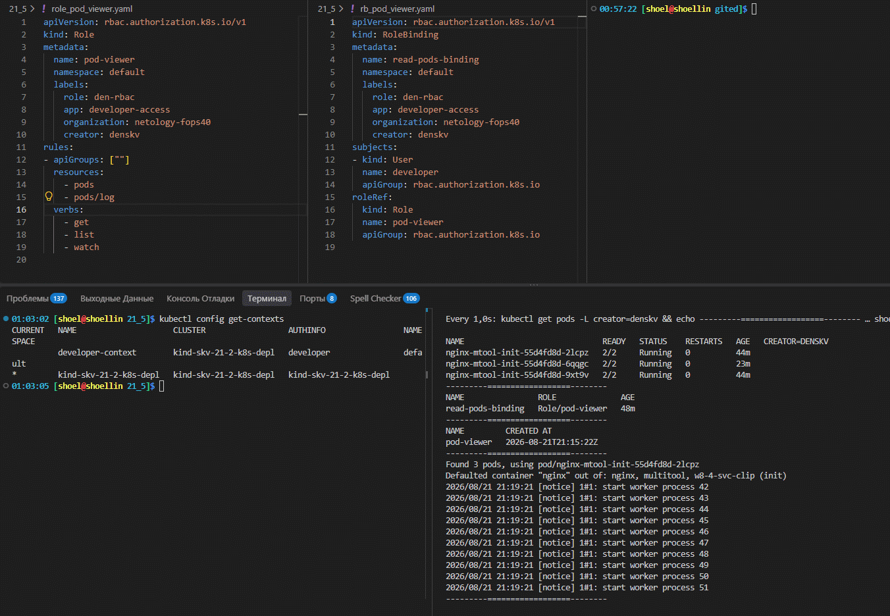

# Для домашнего задания 21.5 `Настройка приложений и управление доступом в Kubernetes`

## commit_80, master Предварительная подготовка

```bash
# Переключение на мастер-ветку на случай работы в соседней ветке репозитория
git checkout master
```

<details>
<summary>
переход на master
</summary>

```log
Уже на «master»
```

</details>

```bash
# Просмотр имеющихся веток
git branch -v

# Клонирование репозитория
git clone \
https://github.com/netology-code/kuber-homeworks.git

cd kuber-homeworks

git config \
--global \
--add safe.directory \
/home/shoel/nfs_git/gited/kuber-homeworks

git checkout shkuber-16

cd ..

# Удаление всех файлов и каталогов кроме нужных
find kuber-homeworks/ \
-mindepth 1 \
-not -path "*2.3*" \
-delete

# Перемещение нужного каталога в корневую директорию с новым именем
mv -v kuber-homeworks \
21_5

# Переход в каталог по последней переменной вывода последней команды
cd !$

mv -v 2.3/* ./

# Удаление всех файлов и каталогов кроме нужных
find . \
-mindepth 1 \
-not -path "*2.3.md*" \
-delete

# Переименование 
mv -v {2.3,README}.md
```

```bash
# Просмотр текущих удаленных репозиториев
git remote -v

# Проверка текущего локального состояния репозитория
git status

git rm -r --cached \
../

git remote -v

# Добавляем ключи агенту ssh от репозитория gitflic и github
eval $(ssh-agent) \
&& ssh-add ~/.ssh/id_gitflic_2026_ed25519 \
&& ssh-add ~/.ssh/id_github_2026_ed25519 \
&& ssh-agent -c

# Просмотр различий в рабочей директории и индексов
git diff \
&& git diff --staged

# Добавление всех изменений из текущей и вывод текущего состояния репозитория
git add . .. \
&& git status

git diff \
&& git diff --staged

# Просмотр истории коммитов в кратком формате
git log --oneline

# Создание коммита со всеми изменениями и отправка в удаленный репозиторий
git commit -am 'commit_80, master' \
&& git push \
--set-upstream \
study_fops39 \
master \
&& git push \
--set-upstream \
study_fops39_gitflic_ru \
master \
&& git push \
--set-upstream \
study-fops39_sc \
master
```

## commit_1, `21_5-K8S-conf-app`

```bash
# Просмотр истории коммитов в кратком формате
git log --oneline

# Переключение\формирование новой ветки git
git checkout -b 21_5-K8S-conf-app

# Вывод всех веток
git branch -v

# Вывод списка удаленных репозиториев
git remote -v

# вывод текущего состояния репозитория
git status

# Просмотр истории коммитов в кратком формате
git log --oneline

# Добавляем ключи агенту ssh от репозитория gitflic и github
eval $(ssh-agent) \
&& ssh-add ~/.ssh/id_gitflic_2026_ed25519 \
&& ssh-add ~/.ssh/id_github_2026_ed25519 \
&& ssh-agent -c

# Просмотр различий в рабочей директории и индексов
git diff \
&& git diff --staged

git rm -r --cached \
./ ../

# Добавление всех изменений из текущей и вывод текущего состояния репозитория
git add . .. \
&& git status

# Создание коммита со всеми изменениями и отправка в удаленный репозиторий на новую ветку
git commit -am 'commit1, 21_5-K8S-conf-app' \
&& git push \
--set-upstream \
study_fops39 \
21_5-K8S-conf-app \
&& git push \
--set-upstream \
study_fops39_gitflic_ru \
21_5-K8S-conf-app \
&& git push \
--set-upstream \
study-fops39_sc \
21_5-K8S-conf-app
```

## commit_2,`21_5-K8S-conf-app`

### Ручной проброс Контейнеров в кластер Kind как локальные

```bash
# Скачивание образов и присвоение дополнительного тега denskv
docker pull \
nginx:latest

docker tag \
nginx:latest \
nginx:denskv

docker pull \
wbitt/network-multitool:latest

docker tag \
wbitt/network-multitool:latest \
wbitt/network-multitool:denskv

docker pull \
busybox:latest

docker tag \
busybox:latest \
busybox:denskv

```

<details>
<summary>
Скачивание контейерных образов
</summary>

```log
nginx:latest
latest: Pulling from library/nginx
26c307b5e35a: Pull complete 
746b934a8960: Pull complete 
5508f6432d3e: Pull complete 
5d480233f531: Pull complete 
f530c3e421fc: Pull complete 
128fcc7b23b0: Pull complete 
7eb55399d6de: Pull complete 
Digest: sha256:8f029c543423e3eac6b08254718bc31eb75633b1e448026b6616927baa7d4bfe
Status: Downloaded newer image for nginx:latest
docker.io/library/nginx:latest

latest: Pulling from wbitt/network-multitool
2d35ebdb57d9: Already exists 
106e2d3f4331: Pull complete 
ededf688eedd: Pull complete 
161472afd5cd: Pull complete 
04da513cb5c7: Pull complete 
68fb4c9e5297: Pull complete 
Digest: sha256:db2810fe2c8d36db074eab5d98fbf861c8ed55e0786d648d3477b3de9135632e
Status: Downloaded newer image for wbitt/network-multitool:latest
docker.io/wbitt/network-multitool:latest

busybox:latest
latest: Pulling from library/busybox
b05093807bb0: Pull complete 
Digest: sha256:dc2d74b28e4cf8984fa52af1f39bc7c3d9c73760b41a74d629f5d11b1ab28616
Status: Downloaded newer image for busybox:latest
docker.io/library/busybox:latest
```

</details>

```bash
# Просмотр списка имен кластеров для загрузки
kubectl config get-clusters
```

<details>
<summary>
Просмотр списка имен доступных кластеров
</summary>

```log
NAME
kind-skv-21-2-k8s-depl
```

</details>

```bash
# Загрузка образов контейнеров в кластер на ноды в KIND
kind load docker-image \
nginx:denskv \
--name skv-21-2-k8s-depl

kind load docker-image \
wbitt/network-multitool:denskv \
--name skv-21-2-k8s-depl

kind load docker-image \
busybox:denskv \
--name skv-21-2-k8s-depl
```

<details>
<summary>
Сообщение что образы уже загружены в кластер KIND
</summary>

```log
Image: "nginx:denskv" with ID "sha256:f075e3f9498646fffa374cbd2a781eec14d8e788304a2c40a7f2355996a2146a" found to be already present on all nodes.

Image with ID: sha256:f4f4b4b4dd953a35486839ef36481c59e0628155494fead5fdcc0a9875752ec8 already present on the node skv-21-2-k8s-depl-worker2 but is missing the tag docker.io/wbitt/network-multitool:denskv. re-tagging...
Image with ID: sha256:f4f4b4b4dd953a35486839ef36481c59e0628155494fead5fdcc0a9875752ec8 already present on the node skv-21-2-k8s-depl-worker but is missing the tag docker.io/wbitt/network-multitool:denskv. re-tagging...
Image with ID: sha256:f4f4b4b4dd953a35486839ef36481c59e0628155494fead5fdcc0a9875752ec8 already present on the node skv-21-2-k8s-depl-control-plane but is missing the tag docker.io/wbitt/network-multitool:denskv. re-tagging...

Image with ID: sha256:c6348fa86ba0fb2108c9334f5fe913ddc6d853313e655891f133a0127c30099f already present on the node skv-21-2-k8s-depl-worker2 but is missing the tag docker.io/library/busybox:denskv. re-tagging...
Image with ID: sha256:c6348fa86ba0fb2108c9334f5fe913ddc6d853313e655891f133a0127c30099f already present on the node skv-21-2-k8s-depl-worker but is missing the tag docker.io/library/busybox:denskv. re-tagging...
Image: "busybox:denskv" with ID "sha256:c6348fa86ba0fb2108c9334f5fe913ddc6d853313e655891f133a0127c30099f" not yet present on node "skv-21-2-k8s-depl-control-plane", loading...
```

</details>

### `Yaml`-манифест deployment с init контейнером

<details>
<summary>
Yaml-манифест deployment с init контейнером
</summary>

```bash
cat > depl_svc_clip_nopo_nginx-mtool-init.yaml <<'EOF'
apiVersion: v1
kind: Service
metadata:
  name: w8-svc-clip
  labels:
    role: den-clip-nopo
    app: nginx-clip-nopo
    organization: netology-fops40
    creator: denskv
spec:
  type: ClusterIP
  selector:
    app: nginx-clip-nopo
  ports:
  - name: nginx
    port: 9001
    targetPort: 80
    protocol: TCP
  - name: multitool
    port: 9002
    targetPort: 8080
    protocol: TCP
---
apiVersion: v1
kind: Service
metadata:
  name: w8-svc-nopo
  labels:
    role: den-clip-nopo
    app: nginx-clip-nopo
    organization: netology-fops40
    creator: denskv
spec:
  type: NodePort
  selector:
    app: nginx-clip-nopo
  ports:
  - name: nginx
    port: 80
    targetPort: 80
    nodePort: 30080
    protocol: TCP
---
apiVersion: apps/v1
kind: Deployment
metadata:
  name: nginx-mtool-init
  labels:
    role: den-clip-nopo
    app: nginx-clip-nopo
    organization: netology-fops40
    creator: denskv
spec:
  replicas: 3
  minReadySeconds: 10
  strategy:
    type: Recreate
  selector:
    matchLabels:
      app: nginx-clip-nopo
  template:
    metadata:
      labels:
        app: nginx-clip-nopo
    spec:
      initContainers:
      - name: w8-4-svc-clip
        image: busybox:denskv
        imagePullPolicy: Never  # Использовать ранее использованные или выгруженные в кластер образы
        command:
          - sh
          - -c
          - |
            until nslookup w8-svc-clip.default.svc.cluster.local || nslookup w8-svc-nopo.default.svc.cluster.local; do
              echo "Waiting for Service w8-svc-clip or w8-svc-nopo..."
              sleep 2
            done
            echo "Service w8-svc is UP!"
      containers:
      - name: nginx
        image: nginx:denskv
        imagePullPolicy: Never  # Использовать ранее использованные или выгруженные в кластер образы
        ports:
        - containerPort: 80
        volumeMounts:
          - name: nginx-html
            mountPath: /usr/share/nginx/html/index.html  # полный путь монтирования для опции subPath
            subPath: index.html # Подмонтировать только index.html (для обновления пересоздать pod)
            readOnly: true
      - name: multitool
        image: wbitt/network-multitool:denskv
        imagePullPolicy: Never  # Использовать ранее использованные или выгруженные в кластер образы
        env:
        - name: HTTP_PORT
          value: "8080"
        ports:
        - containerPort: 8080
      volumes:
        - name: nginx-html
          configMap:
            name: nginx-html-file
EOF
```

</details>

### `Yaml`-манифест configmaps для index.html

<details>
<summary>
Yaml-манифест config-map
</summary>

```bash
cat > cm_nginx-html.yaml <<'EOF'
apiVersion: v1
kind: ConfigMap
metadata:
  name: nginx-html-file
  labels:
    role: den-clip-nopo
    app: nginx-clip-nopo
    organization: netology-fops40
    creator: denskv
data:
  index.html: |
    <!DOCTYPE html>
    <html>
    <head>
      <meta charset="UTF-8">
      <title>Страница из volumeMounts</title>
      <style>
        body { font-family: Arial, sans-serif; padding: 20px; }
        .joke { background-color: #f0f0f0; padding: 15px; border-radius: 8px; margin-top: 20px; }
      </style>
    </head>
    <body>
      <h1>Привет из ПОДА Kubernetes!</h1>
      <p>Эта страница подгружена из ConfigMap в volumeMounts.</p>
      
      <div class="joke">
        <h3>Из окружения DevOps:</h3>
        <p>- Почему разработчик не стал чинить прод?<br>
        - Потому что в локальной среде всё работало!</p>
      </div>
    </body>
    </html>
EOF
```

</details>

```bash
# Просмотр IP-адресов нод и подов кластера
watch -c 'kubectl get no -o wide \
| awk "{print \$1 \"\n\" \$6}" \
&& kubectl get pods -o wide \
&& echo -e "\n---===ВЫВОД-ТЕКУЩЕЙ-СТРАНИЦЫ-ПОДОВ==---" \
&& kubectl describe nodes \
| awk "/InternalIP/ {print \$2}" \
| xargs -I {} curl -s {}:30080 \
| grep -E -A3 "<h1>Welcome to nginx!</h1>|DevOps"'
```

<details>
<summary>
просмотр IP-адресов нод и подов
</summary>

```log
```

</details>

```bash
kubectl apply \
-f cm_nginx-html.yaml \
-f depl_svc_clip_nopo_nginx-mtool-init.yaml \
&& kubectl rollout status deployment -l creator=denskv
```

```bash
# Принудительный Перезапуск подов ориентирование по labels
kubectl rollout restart deployment -l organization=netology-fops40 \
|| kubectl delete pod -l app=nginx-clip-nopo \
&& kubectl rollout status deployment -l role=den-clip-nopo
```

<details>

<summary>
Лог перезапуска подов
</summary>

```log
Waiting for deployment "nginx-mtool-init" rollout to finish: 0 out of 3 new replicas have been updated...
Waiting for deployment "nginx-mtool-init" rollout to finish: 0 out of 3 new replicas have been updated...
Waiting for deployment "nginx-mtool-init" rollout to finish: 0 out of 3 new replicas have been updated...
Waiting for deployment "nginx-mtool-init" rollout to finish: 0 out of 3 new replicas have been updated...
Waiting for deployment "nginx-mtool-init" rollout to finish: 0 out of 3 new replicas have been updated...
Waiting for deployment "nginx-mtool-init" rollout to finish: 0 of 3 updated replicas are available...
Waiting for deployment "nginx-mtool-init" rollout to finish: 0 of 3 updated replicas are available...
Waiting for deployment "nginx-mtool-init" rollout to finish: 0 of 3 updated replicas are available...
Waiting for deployment "nginx-mtool-init" rollout to finish: 0 of 3 updated replicas are available...
Waiting for deployment "nginx-mtool-init" rollout to finish: 1 of 3 updated replicas are available...
deployment "nginx-mtool-init" successfully rolled out

#ИЛИ

pod "nginx-mtool-init-54d877bc7c-kqzfn" deleted from default namespace
pod "nginx-mtool-init-54d877bc7c-qxdnh" deleted from default namespace
pod "nginx-mtool-init-54d877bc7c-tbzxf" deleted from default namespace
Waiting for deployment "nginx-mtool-init" rollout to finish: 0 of 3 updated replicas are available...
Waiting for deployment "nginx-mtool-init" rollout to finish: 0 of 3 updated replicas are available...
Waiting for deployment "nginx-mtool-init" rollout to finish: 0 of 3 updated replicas are available...
deployment "nginx-mtool-init" successfully rolled out
```

</details>

```bash
# Мониторинг кластера 
echo -e "\nСписок IP-адресов кластера:" \
&& kubectl describe nodes \
| awk '/InternalIP/ {print $2}' \
&& echo \
&& kubectl describe nodes \
| awk '/InternalIP/ {print $2}' \
| xargs -I {} curl -s {}:30080 \
| grep -E -A3 "<h1>Welcome to nginx!</h1>|DevOps"
```

<summary>
Лог мониторинга кластера
</summary>

```log
NAME
INTERNAL-IP
skv-21-2-k8s-depl-control-plane
172.18.0.3
skv-21-2-k8s-depl-worker
172.18.0.2
skv-21-2-k8s-depl-worker2
172.18.0.4
NAME                                READY   STATUS    RESTARTS   AGE   IP            NODE                        NOMINA
TED NODE   READINESS GATES
nginx-mtool-init-79b889b7cb-7kk4l   2/2     Running   0          26s   10.244.1.65   skv-21-2-k8s-depl-worker    <none>
           <none>
nginx-mtool-init-79b889b7cb-nflpj   2/2     Running   0          26s   10.244.2.45   skv-21-2-k8s-depl-worker2   <none>
           <none>
nginx-mtool-init-79b889b7cb-zcssg   2/2     Running   0          26s   10.244.1.64   skv-21-2-k8s-depl-worker    <none>
           <none>

---===ВЫВОД-ТЕКУЩЕЙ-СТРАНИЦЫ-ПОДОВ==---
    <h3>Из окружения DevOps:</h3>
    <p>- Почему разработчик не стал чинить прод?<br>
    - Потому что в локальной среде всё работало!</p>
  </div>
--
    <h3>Из окружения DevOps:</h3>
    <p>- Почему разработчик не стал чинить прод?<br>
    - Потому что в локальной среде всё работало!</p>
  </div>
--
    <h3>Из окружения DevOps:</h3>
    <p>- Почему разработчик не стал чинить прод?<br>
    - Потому что в локальной среде всё работало!</p>
  </div>
```

</details>

```bash
# Добавление всех изменений из текущей и вывод текущего состояния репозитория
git add . .. \
&& git status

# Создание коммита со всеми изменениями и отправка в удаленный репозиторий на новую ветку
git commit -am 'commit2, 21_5-K8S-conf-app' \
&& git push \
--set-upstream \
study_fops39 \
21_5-K8S-conf-app \
&& git push \
--set-upstream \
study_fops39_gitflic_ru \
21_5-K8S-conf-app \
&& git push \
--set-upstream \
study-fops39_sc \
21_5-K8S-conf-app
```

## commit_3,`21_5-K8S-conf-app`

### Формирование Secret для k8s

```bash
# Генерация самоподписного сертификата и создание Secret:
openssl req -x509 -nodes -days 365 -newkey rsa:2048 \
-keyout tls.key \
-out tls.crt \
-subj "/CN=myapp.den.skv/O=netology-fops40/CN=denskv"
```

<details>
<summary>
Лог создания сертификата
</summary>

```log
.....+.......+..+.+++++++++++++++++++++++++++++++++++++++*.+.............+++++++++++++++++++++++++++++++++++++++*......+...+.......+........+...+..........+..+...+......+...............+...................+......+......+.........+......+.....+....+.....+.++++++
.........+...+........+.+......+.....+++++++++++++++++++++++++++++++++++++++*......+....+..+.+++++++++++++++++++++++++++++++++++++++*.......+..+.+..+...+...+.+......+...+..............+...++++++
-----
```

</details>

```bash
# Экспорт сертификата в переменные окружения для применения в манифестах
export TLS_CRT=$(cat tls.crt | base64 -w 0)
export TLS_KEY=$(cat tls.key | base64 -w 0)
```


### `Yaml`-манифест секретов tls на основе переменных окружения

<details>
<summary>
Yaml-манифест секретов tls на основе переменных окружения
</summary>

```bash
## Применять только после exports
cat > secr_tls.yaml <<EOF
apiVersion: v1
kind: Secret
metadata:
  name: myapp-tls-secret
  labels:
    role: den-clip-ingr
    app: nginx-clip-ingr
    organization: netology-fops40
    creator: denskv
type: kubernetes.io/tls
data:
  tls.crt: ${TLS_CRT}
  tls.key: ${TLS_KEY}
EOF
```

</details>

### Переустановка Ingress контроллера

```bash
# Удаление Ingress контроллера contour
kubectl delete \
-f ../21_3/contour/examples/contour
```

<details>
<summary>
лог удаления Ingress контроллера
</summary>

```log
namespace "projectcontour" deleted
serviceaccount "contour" deleted from projectcontour namespace
serviceaccount "envoy" deleted from projectcontour namespace
configmap "contour" deleted from projectcontour namespace
customresourcedefinition.apiextensions.k8s.io "contourconfigurations.projectcontour.io" deleted
customresourcedefinition.apiextensions.k8s.io "contourdeployments.projectcontour.io" deleted
customresourcedefinition.apiextensions.k8s.io "extensionservices.projectcontour.io" deleted
customresourcedefinition.apiextensions.k8s.io "httpproxies.projectcontour.io" deleted
customresourcedefinition.apiextensions.k8s.io "tlscertificatedelegations.projectcontour.io" deleted
serviceaccount "contour-certgen" deleted from projectcontour namespace
rolebinding.rbac.authorization.k8s.io "contour" deleted from projectcontour namespace
role.rbac.authorization.k8s.io "contour-certgen" deleted from projectcontour namespace
clusterrolebinding.rbac.authorization.k8s.io "contour" deleted
rolebinding.rbac.authorization.k8s.io "contour-rolebinding" deleted from projectcontour namespace
clusterrole.rbac.authorization.k8s.io "contour" deleted
role.rbac.authorization.k8s.io "contour" deleted from projectcontour namespace
service "contour" deleted from projectcontour namespace
service "envoy" deleted from projectcontour namespace
deployment.apps "contour" deleted from projectcontour namespace
daemonset.apps "envoy" deleted from projectcontour namespace
Error from server (NotFound): error when deleting "../21_3/contour/examples/contour/02-job-certgen.yaml": jobs.batch "contour-certgen-main" not found
```

</details>

#### Скачивание манифеста ingress контроллера nginx

```bash
git clone https://github.com/kubernetes/ingress-nginx.git

find . \
-name ".git" \
-exec rm -vrf {} \;

kubectl apply \
-f ingress-nginx/deploy/static/provider/kind/deploy.yaml
```

<details>
<summary>
Вывод развертывания nginx ingress контроллера
</summary>

```log
Клонирование в «ingress-nginx»...
remote: Enumerating objects: 140569, done.
remote: Total 140569 (delta 0), reused 0 (delta 0), pack-reused 140569 (from 1)
Получение объектов: 100% (140569/140569), 137.23 MiB | 1.06 MiB/s, готово.
Определение изменений: 100% (82574/82574), готово.
Updating files: 100% (1150/1150), готово.

удалён './ingress-nginx/.git/description'
удалён './ingress-nginx/.git/hooks/post-update.sample'
удалён './ingress-nginx/.git/hooks/pre-rebase.sample'
удалён './ingress-nginx/.git/hooks/pre-commit.sample'
удалён './ingress-nginx/.git/hooks/pre-receive.sample'
удалён './ingress-nginx/.git/hooks/commit-msg.sample'
удалён './ingress-nginx/.git/hooks/pre-push.sample'
удалён './ingress-nginx/.git/hooks/applypatch-msg.sample'
удалён './ingress-nginx/.git/hooks/pre-applypatch.sample'
удалён './ingress-nginx/.git/hooks/update.sample'
удалён './ingress-nginx/.git/hooks/fsmonitor-watchman.sample'
удалён './ingress-nginx/.git/hooks/push-to-checkout.sample'
удалён './ingress-nginx/.git/hooks/pre-merge-commit.sample'
удалён './ingress-nginx/.git/hooks/sendemail-validate.sample'
удалён './ingress-nginx/.git/hooks/prepare-commit-msg.sample'
удалён каталог './ingress-nginx/.git/hooks'
удалён './ingress-nginx/.git/info/exclude'
удалён каталог './ingress-nginx/.git/info'
удалён './ingress-nginx/.git/objects/pack/pack-814d23fdac2a3637ed66266b4efe5bbb58547712.pack'
удалён './ingress-nginx/.git/objects/pack/pack-814d23fdac2a3637ed66266b4efe5bbb58547712.rev'
удалён './ingress-nginx/.git/objects/pack/pack-814d23fdac2a3637ed66266b4efe5bbb58547712.idx'
удалён каталог './ingress-nginx/.git/objects/pack'
удалён каталог './ingress-nginx/.git/objects/info'
удалён каталог './ingress-nginx/.git/objects'
удалён './ingress-nginx/.git/refs/heads/main'
удалён каталог './ingress-nginx/.git/refs/heads'
удалён каталог './ingress-nginx/.git/refs/tags'
удалён './ingress-nginx/.git/refs/remotes/origin/HEAD'
удалён каталог './ingress-nginx/.git/refs/remotes/origin'
удалён каталог './ingress-nginx/.git/refs/remotes'
удалён каталог './ingress-nginx/.git/refs'
удалён './ingress-nginx/.git/packed-refs'
удалён './ingress-nginx/.git/logs/refs/remotes/origin/HEAD'
удалён каталог './ingress-nginx/.git/logs/refs/remotes/origin'
удалён каталог './ingress-nginx/.git/logs/refs/remotes'
удалён './ingress-nginx/.git/logs/refs/heads/main'
удалён каталог './ingress-nginx/.git/logs/refs/heads'
удалён каталог './ingress-nginx/.git/logs/refs'
удалён './ingress-nginx/.git/logs/HEAD'
удалён каталог './ingress-nginx/.git/logs'
удалён './ingress-nginx/.git/HEAD'
удалён './ingress-nginx/.git/config'
удалён './ingress-nginx/.git/index'
удалён каталог './ingress-nginx/.git'
find: «./ingress-nginx/.git»: Нет такого файла или каталога

namespace/ingress-nginx created
serviceaccount/ingress-nginx created
serviceaccount/ingress-nginx-admission created
role.rbac.authorization.k8s.io/ingress-nginx created
role.rbac.authorization.k8s.io/ingress-nginx-admission created
clusterrole.rbac.authorization.k8s.io/ingress-nginx created
clusterrole.rbac.authorization.k8s.io/ingress-nginx-admission created
rolebinding.rbac.authorization.k8s.io/ingress-nginx created
rolebinding.rbac.authorization.k8s.io/ingress-nginx-admission created
clusterrolebinding.rbac.authorization.k8s.io/ingress-nginx created
clusterrolebinding.rbac.authorization.k8s.io/ingress-nginx-admission created
configmap/ingress-nginx-controller created
service/ingress-nginx-controller created
service/ingress-nginx-controller-admission created
deployment.apps/ingress-nginx-controller created
job.batch/ingress-nginx-admission-create created
job.batch/ingress-nginx-admission-patch created
ingressclass.networking.k8s.io/nginx created
validatingwebhookconfiguration.admissionregistration.k8s.io/ingress-nginx-admission created
```

</details>

### `Yaml`-манифест deployment с ingress на tls

<details>
<summary>
Yaml-манифест deployment с ingress на tls
</summary>

```bash
cat > depl_svc_clip_ingress_nginx-mtool-init.yaml <<'EOF'
apiVersion: v1
kind: Service
metadata:
  name: w8-svc-clip
  labels:
    role: den-clip-nopo
    app: nginx-clip-ingr
    organization: netology-fops40
    creator: denskv
spec:
  type: ClusterIP
  selector:
    app: nginx-clip-ingr
  ports:
  - name: nginx
    port: 80
    targetPort: 80
    protocol: TCP
  - name: multitool
    port: 8080
    targetPort: 8080
    protocol: TCP
---
apiVersion: networking.k8s.io/v1
kind: Ingress
metadata:
  name: myapp-ingress
  labels:
    role: den-clip-ingr
    app: nginx-clip-ingr
    organization: netology-fops40
    creator: denskv
  annotations:
    nginx.ingress.kubernetes.io/ssl-redirect: "true"
    nginx.ingress.kubernetes.io/backend-protocol: "HTTP"
spec:
  ingressClassName: nginx
  tls:
  - hosts:
    - myapp.den.skv
    secretName: myapp-tls-secret
  rules:
  - host: myapp.den.skv
    http:
      paths:
      - path: /
        pathType: Prefix
        backend:
          service:
            name: w8-svc-clip
            port:
              number: 80
---
apiVersion: apps/v1
kind: Deployment
metadata:
  name: nginx-mtool-init
  labels:
    role: den-clip-ingr
    app: nginx-clip-ingr
    organization: netology-fops40
    creator: denskv
spec:
  replicas: 3
  minReadySeconds: 10
  strategy:
    type: Recreate
  selector:
    matchLabels:
      app: nginx-clip-ingr
  template:
    metadata:
      labels:
        app: nginx-clip-ingr
    spec:
      initContainers:
      - name: w8-4-svc-clip
        image: busybox:denskv
        imagePullPolicy: Never  # Использовать ранее использованные или выгруженные в кластер образы
        command:
          - sh
          - -c
          - |
            until nslookup w8-svc-clip.default.svc.cluster.local; do
              echo "Waiting for Service w8-svc-clip..."
              sleep 2
            done
            echo "Service w8-svc is UP!"
      containers:
      - name: nginx
        image: nginx:denskv
        imagePullPolicy: Never  # Использовать ранее использованные или выгруженные в кластер образы
        ports:
        - containerPort: 80
        volumeMounts:
          - name: nginx-html
            mountPath: /usr/share/nginx/html/index.html  # полный путь монтирования для опции subPath
            subPath: index.html # Подмонтировать только index.html (для обновления пересоздать pod)
            readOnly: true
      - name: multitool
        image: wbitt/network-multitool:denskv
        imagePullPolicy: Never  # Использовать ранее использованные или выгруженные в кластер образы
        env:
        - name: HTTP_PORT
          value: "8080"
        ports:
        - containerPort: 8080
      volumes:
        - name: nginx-html
          configMap:
            name: nginx-html-file
EOF
```

</details>

```bash
# Просмотр IP-адресов нод
kubectl get no -o wide \
| awk '{print $1 "\n" $6}'
```

<details>
<summary>
просмотр IP-адресов нод
</summary>

```log
NAME
INTERNAL-IP
skv-21-2-k8s-depl-control-plane
172.18.0.3
skv-21-2-k8s-depl-worker
172.18.0.2
skv-21-2-k8s-depl-worker2
172.18.0.4
```

</details>

```bash
# добавление записи в /etc/hosts на адрес -host в ingress myapp.den.skv на текущий contolplane
echo "172.18.0.3 myapp.den.skv" \
| sudo tee -a /etc/hosts

cat /etc/hosts
```

<details>
<summary>
Проверка resolving имен на хосте сервера kubernetes
</summary>

```log
172.18.0.3 myapp.den.skv

# Static table lookup for hostnames.
# See hosts(5) for details.
127.0.0.1        localhost
::1              localhost
172.18.0.4 fops.local
172.18.0.3 myapp.den.skv
```

</details>

```bash
# Для определения работы порта сервиса ingress-nginx-controller в режиме LoadBalancer в класторе
kubectl get svc -n ingress-nginx \
| awk '/LoadBalancer/{print $5}'
```

```log
80:30993/TCP,443:30652/TCP
```

```bash
# Применение манифестов и port-forward до порта ingress-nginx-controller на 80 порту
kubectl apply \
-f secr_tls.yaml \
-f cm_nginx-html.yaml \
-f depl_svc_clip_ingress_nginx-mtool-init.yaml \
&& kubectl port-forward \
-n ingress-nginx svc/ingress-nginx-controller \
--address=0.0.0.0 30993:443
```

<details>
<summary>
Лог развертывания
</summary>

```log
secret/myapp-tls-secret created
configmap/nginx-html-file created
service/w8-svc-clip created
ingress.networking.k8s.io/myapp-ingress created
deployment.apps/nginx-mtool-init created
Forwarding from 0.0.0.0:30993 -> 443
Handling connection for 30993
Handling connection for 30993
Handling connection for 30993
Handling connection for 30993
Handling connection for 30993
Handling connection for 30993
....
```

</details>

```bash
# Мониторинг подов и сервисов deployment
watch -cn 1 \
"kubectl get pods -L creator=denskv \
&& echo ---------==================-------- \
&& kubectl get svc -l creator=denskv \
&& echo ---------==================-------- \
&& kubectl get ing -l creator=denskv \
&& echo ----------======Запросы_на_Nginx========------------------- \
&& kubectl logs deployments/nginx-mtool-init | tail -n5 \
&& echo ---------==================-------- \
&& ping -c 1 myapp.den.skv | head -n2"
```

<details>
<summary>
Мониторинг подов и сервисов deployment
</summary>

```log
NAME                              READY   STATUS    RESTARTS   AGE    CREATOR=DENSKV
nginx-mtool-init-55d4fd8d-bhnsg   2/2     Running   0          119s
nginx-mtool-init-55d4fd8d-jsjww   2/2     Running   0          119s
nginx-mtool-init-55d4fd8d-rj2kq   2/2     Running   0          119s
---------==================--------
NAME          TYPE        CLUSTER-IP      EXTERNAL-IP   PORT(S)           AGE
w8-svc-clip   ClusterIP   10.96.181.103   <none>        80/TCP,8080/TCP   119s
---------==================--------
NAME            CLASS   HOSTS           ADDRESS     PORTS     AGE
myapp-ingress   nginx   myapp.den.skv   localhost   80, 443   2m
----------======Запросы_на_Nginx========-------------------
Found 3 pods, using pod/nginx-mtool-init-55d4fd8d-bhnsg
Defaulted container "nginx" out of: nginx, multitool, w8-4-svc-clip (init)
2026/08/21 20:06:19 [notice] 1#1: start worker process 50
2026/08/21 20:06:19 [notice] 1#1: start worker process 51
10.244.2.53 - - [21/Aug/2026:20:06:48 +0000] "GET / HTTP/1.1" 200 701 "https://myapp.den.skv:30993/" "Mozi
lla/5.0 (Windows NT 10.0; Win64; x64) AppleWebKit/537.36 (KHTML, like Gecko) Chrome/150.0.0.0 YaBrowser/26
.8.0.0 Safari/537.36" "127.0.0.1"
10.244.2.53 - - [21/Aug/2026:20:07:18 +0000] "GET / HTTP/1.1" 200 701 "-" "Mozilla/5.0 (Windows NT 10.0; W
in64; x64; rv:140.0) Gecko/20100101 Firefox/140.0" "127.0.0.1"
10.244.2.53 - - [21/Aug/2026:20:08:08 +0000] "GET / HTTP/1.1" 200 701 "-" "curl/8.21.0" "127.0.0.1"
---------==================--------
PING myapp.den.skv (172.18.0.3) 56(84) bytes of data.
64 bytes from myapp.den.skv (172.18.0.3): icmp_seq=1 ttl=64 time=0.082 ms
```

</details>

```bash
# Скрипт опроса сервисов
while true; do \
echo "||||||||" \
&& curl -sk --max-time 5 https://myapp.den.skv:30993 --resolve myapp.den.skv:30993:172.18.0.1 \
| grep -A2 "DevOps" \
&& sleep 1; \
done
```

<details>
<summary>
Лог Скрипта опроса веб страницы
</summary>

```log
||||||||
    <h3>Из окружения DevOps:</h3>
    <p>- Почему разработчик не стал чинить прод?<br>
    - Потому что в локальной среде всё работало!</p>
```

</details>

```bash
# Добавление всех изменений из текущей и вывод текущего состояния репозитория
git add . .. \
&& git status

# Создание коммита со всеми изменениями и отправка в удаленный репозиторий на новую ветку
git commit -am 'commit3, 21_5-K8S-conf-app' \
&& git push \
--set-upstream \
study_fops39 \
21_5-K8S-conf-app \
&& git push \
--set-upstream \
study_fops39_gitflic_ru \
21_5-K8S-conf-app \
&& git push \
--set-upstream \
study-fops39_sc \
21_5-K8S-conf-app
```

## commit_4,`21_5-K8S-conf-app`

### Получение CA сертификата и ключа кластера

```bash
export CONTROL_PLANE_CONTAINER=$(docker ps | awk '/control-plane/ {print $11}')

echo $CONTROL_PLANE_CONTAINER
```

```log
skv-21-2-k8s-depl-control-plane
```

```bash
mkdir -pv ~/kind-ca

docker cp ${CONTROL_PLANE_CONTAINER}:/etc/kubernetes/pki/ca.crt ~/kind-ca/

docker cp ${CONTROL_PLANE_CONTAINER}:/etc/kubernetes/pki/ca.key ~/kind-ca/

tree ~/kind-ca
```

<details>
<summary>
Лог получения CA сертификата и ключа кластера
</summary>

```log
mkdir: создан каталог '/home/shoel/kind-ca'
Successfully copied 1.11kB (transferred 3.07kB) to /home/shoel/kind-ca/
Successfully copied 1.68kB (transferred 3.58kB) to /home/shoel/kind-ca/
/home/shoel/kind-ca
├── ca.crt
└── ca.key

1 directory, 2 files
```

</details>

```bash
# Генерация сертификата пользователя
openssl genrsa -out developer.key 2048
openssl req -new -key developer.key -out developer.csr -subj "/CN=developer/O=dev-team"
openssl x509 -req -in developer.csr \
-CA ~/kind-ca/ca.crt \
-CAkey ~/kind-ca/ca.key \
-CAcreateserial \
-out developer.crt \
-days 365 \
-sha256

tree ~/kind-ca

tree -L1 . \
| grep devel
```

<details>
<summary>
Лог генерации сертификата пользователя
</summary>

```log
Certificate request self-signature ok
subject=CN=developer, O=dev-team
/home/shoel/kind-ca
├── ca.crt
├── ca.key
└── ca.srl

1 directory, 3 files

├── developer.crt
├── developer.csr
├── developer.key
```

</details>

### `Yaml`-манифест Роли в класторе k8s

<details>
<summary>
Yaml-манифест Роли в класторе k8s
</summary>

```bash
cat > role_pod_viewer.yaml <<'EOF'
apiVersion: rbac.authorization.k8s.io/v1
kind: Role
metadata:
  name: pod-viewer
  namespace: default
  labels:
    role: den-rbac
    app: developer-access
    organization: netology-fops40
    creator: denskv
rules:
- apiGroups: [""]
  resources:
    - pods
    - pods/log
  verbs:
    - get
    - list
    - watch
EOF
```

</details>

### `Yaml`-манифест Привязки Роли(RoleBinding) в класторе k8s

<details>
<summary>
Yaml-манифест привязки роли 
</summary>

```bash
cat > rb_pod_viewer.yaml <<'EOF'
apiVersion: rbac.authorization.k8s.io/v1
kind: RoleBinding
metadata:
  name: read-pods-binding
  namespace: default
  labels:
    role: den-rbac
    app: developer-access
    organization: netology-fops40
    creator: denskv
subjects:
- kind: User
  name: developer
  apiGroup: rbac.authorization.k8s.io
roleRef:
  kind: Role
  name: pod-viewer
  apiGroup: rbac.authorization.k8s.io
EOF
```

</details>


```bash
kubectl apply \
-f role_pod_viewer.yaml \
-f rb_pod_viewer.yaml
```

<details>
<summary>
Лог применения роли и привязки роли
</summary>

```log
role.rbac.authorization.k8s.io/pod-viewer created
rolebinding.rbac.authorization.k8s.io/read-pods-binding created
```

</details>

### Настройка контекста для нового пользователя `developer`

```bash
export CLUSTER_NAME="$(kubectl config get-contexts | awk '/kind/ {print $2}')"

echo $CLUSTER_NAME
```

```log
kind-skv-21-2-k8s-depl
```

```bash
# Проверка контекстов в kubectl
kubectl config get-contexts

# Настройка пользователя developer
kubectl config set-credentials developer \
--client-certificate=developer.crt \
--client-key=developer.key \
--embed-certs=true

# Настройка контекста для нового пользователя developer
kubectl config set-context developer-context \
--cluster=${CLUSTER_NAME} \
--user=developer \
--namespace=default

# Повторная Проверка контекстов в kubectl
kubectl config get-contexts
```

<details>
<summary>
Лог настройки контекста для нового пользователя developer
</summary>

```log
CURRENT   NAME                     CLUSTER                  AUTHINFO                 NAMESPACE
*         kind-skv-21-2-k8s-depl   kind-skv-21-2-k8s-depl   kind-skv-21-2-k8s-depl 

User "developer" set.

Context "developer-context" created.

CURRENT   NAME                     CLUSTER                  AUTHINFO                 NAMESPACE
          developer-context        kind-skv-21-2-k8s-depl   developer                default
*         kind-skv-21-2-k8s-depl   kind-skv-21-2-k8s-depl   kind-skv-21-2-k8s-depl
```

</details>


```bash
# Мониторинг подов и ролей
watch -cn 1 \
"kubectl get pods -L creator=denskv \
&& echo ---------==================-------- \
&& kubectl get rolebindings \
&& echo ---------==================-------- \
&& kubectl get role \
&& echo ---------==================-------- \
&& kubectl logs deployments/nginx-mtool-init | tail \
&& echo ---------==================--------"
```

```bash
# Тесты до смены контекста на нового пользователя developer
kubectl get pods
echo 
kubectl logs deployments/nginx-mtool-init | tail
echo
kubectl delete pods/nginx-mtool-init-55d4fd8d-64rmb
echo
kubectl exec -it pods/nginx-mtool-init-55d4fd8d-9xt9v -- sh
echo
kubectl run test --image=nginx:denskv
```

```bash
# Тесты после смены контекста на нового пользователя developer
kubectl config use-context developer-context
echo
kubectl config get-contexts
echo
kubectl get pods
echo 
kubectl logs deployments/nginx-mtool-init | tail
echo
kubectl delete pods/nginx-mtool-init-55d4fd8d-64rmb
echo
kubectl exec -it pods/nginx-mtool-init-55d4fd8d-9xt9v -- sh
echo
kubectl run test --image=nginx:denskv
```



```bash
# Добавление всех изменений из текущей и вывод текущего состояния репозитория
git add . .. \
&& git status

# Создание коммита со всеми изменениями и отправка в удаленный репозиторий на новую ветку
git commit -am 'commit4, 21_5-K8S-conf-app' \
&& git push \
--set-upstream \
study_fops39 \
21_5-K8S-conf-app \
&& git push \
--set-upstream \
study_fops39_gitflic_ru \
21_5-K8S-conf-app \
&& git push \
--set-upstream \
study-fops39_sc \
21_5-K8S-conf-app
```

## commit_81, maaster