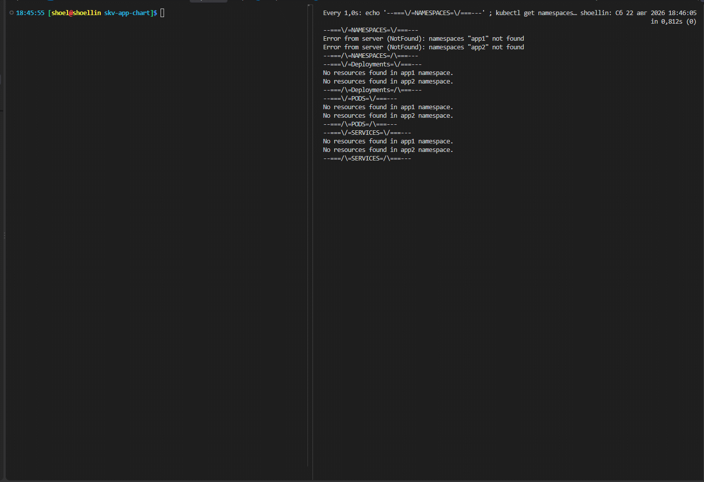

# Домашнее задание к занятию «`Helm`» `Скворцов Денис`

### Цель задания

В тестовой среде Kubernetes необходимо установить и обновить приложения с помощью Helm.

------

### Чеклист готовности к домашнему заданию

1. Установленное k8s-решение, например, MicroK8S.

```bash
# k8s-решение In docker kind
kind --version
```

```log
kind version 0.32.0
```

```bash
# Запущенные ноды в докере
docker ps
```

```log
CONTAINER ID   IMAGE                  COMMAND                  CREATED         STATUS         PORTS                    NAMES
27278ed9ff32   kindest/node:v1.36.1   "/usr/local/bin/entr…"   4 minutes ago   Up 4 minutes   0.0.0.0:6443->6443/tcp   skv-21-2-k8s-depl-control-plane
607bf5f324ff   kindest/node:v1.36.1   "/usr/local/bin/entr…"   4 minutes ago   Up 4 minutes                            skv-21-2-k8s-depl-worker2
c2a73902d98e   kindest/node:v1.36.1   "/usr/local/bin/entr…"   4 minutes ago   Up 4 minutes                            skv-21-2-k8s-depl-worker
```

```bash
# Просмотр нод кластера
kubectl get no
```

```log
NAME                              STATUS   ROLES           AGE     VERSION
skv-21-2-k8s-depl-control-plane   Ready    control-plane   4m51s   v1.36.1
skv-21-2-k8s-depl-worker          Ready    <none>          4m40s   v1.36.1
skv-21-2-k8s-depl-worker2         Ready    <none>          4m40s   v1.36.1
```


2. Установленный локальный kubectl.

```bash
# Проверка версии установленного kubectl
kubectl version --client
```

```log
Client Version: v1.36.3
Kustomize Version: v5.8.1
```

3. Установленный локальный Helm.

```bash
helm version
```

```log
version.BuildInfo{Version:"v4.2.2", GitCommit:"b05881cf967a5a09e19866799d0edfd40675803a", GitTreeState:"", GoVersion:"go1.26.4-X:nodwarf5", KubeClientVersion:"v1.36"}
```

4. Редактор YAML-файлов с подключенным репозиторием GitHub.

```bash
code -v
```

```log
1.134.0
110a328ea54b42367b803ec53ee0bf52ef26b419
x64
```

```bash
git remote -v
```

```log
study-fops39_sc ssh://ssh.sourcecraft.dev/shoelacevip12/study-fops39.git (fetch)
study-fops39_sc ssh://ssh.sourcecraft.dev/shoelacevip12/study-fops39.git (push)
study_fops39    git@github.com:shoelacevip12/study_fops39.git (fetch)
study_fops39    git@github.com:shoelacevip12/study_fops39.git (push)
study_fops39_gitflic_ru git@gitflic.ru:shoelacevip12/fops39.git (fetch)
study_fops39_gitflic_ru git@gitflic.ru:shoelacevip12/fops39.git (push)
```

------

### Инструменты и дополнительные материалы, которые пригодятся для выполнения задания

1. [Инструкция](https://helm.sh/docs/intro/install/) по установке Helm. [Helm completion](https://helm.sh/docs/helm/helm_completion/).

------

### Задание 1. Подготовить Helm-чарт для приложения

1. Необходимо упаковать приложение в чарт для деплоя в разные окружения.
2. Каждый компонент приложения деплоится отдельным deployment’ом или statefulset’ом.
3. В переменных чарта измените образ приложения для изменения версии.

```log
.
├── charts
├── Chart.yaml
├── templates
│   ├── deployments-denskv.yaml
│   ├── _helpers.tpl
│   ├── NOTES.txt
│   ├── serviceaccount.yaml
│   ├── services-denskv.yaml
│   └── tests
└── values.yaml

==> Linting .
[INFO] Chart.yaml: icon is recommended

1 chart(s) linted, 0 chart(s) failed
```

<details>
<summary>
Yaml-values для шаблонов с параметризацией
</summary>

```yaml
cat > values.yaml <<'EOF'
replicaCount: 3

imagePullSecrets: []
nameOverride: ""
fullnameOverride: ""

# Конфигурация компонента Nginx
nginx:
  name: nginx
  image:
    repository: nginx
    pullPolicy: IfNotPresent
    tag: "denskv"
  service:
    type: ClusterIP
    port: 80
    targetPort: 80
  resources: {}

# Конфигурация компонента MultiTool
multitool:
  name: multitool
  image:
    repository: wbitt/network-multitool
    pullPolicy: IfNotPresent
    tag: "denskv"
  service:
    type: ClusterIP
    port: 8080
    targetPort: 8080
  env:
    - name: HTTP_PORT
      value: "8080"
  resources: {}

serviceAccount:
  create: true
  annotations: {}
  name: ""

podSecurityContext: {}
securityContext: {}
nodeSelector: {}
tolerations: []
affinity: {}
EOF
```

</details>

<details>
<summary>
Yaml-шаблон service с параметризацией
</summary>

```yaml
cat > templates/services-denskv.yaml <<'EOF'
{{- range $componentName, $componentValues := dict "nginx" .Values.nginx "multitool" .Values.multitool }}
apiVersion: v1
kind: Service
metadata:
  name: {{ include "skv-app-chart.fullname" $ }}-{{ $componentName }}
  labels:
    {{- include "skv-app-chart.labels" $ | nindent 4 }}
    app.kubernetes.io/component: {{ $componentName }}
spec:
  type: {{ $componentValues.service.type }}
  ports:
    - port: {{ $componentValues.service.port }}
      targetPort: http
      protocol: TCP
      name: http
  selector:
    {{- include "skv-app-chart.selectorLabels" $ | nindent 4 }}
    app.kubernetes.io/component: {{ $componentName }}
---
{{- end }}
EOF
```

</details>

<details>
<summary>
Yaml-шаблон deployment с параметризацией
</summary>

```yaml
cat > templates/deployments-denskv.yaml <<'EOF'
{{- range $componentName, $componentValues := dict "nginx" .Values.nginx "multitool" .Values.multitool }}
apiVersion: apps/v1
kind: Deployment
metadata:
  name: {{ include "skv-app-chart.fullname" $ }}-{{ $componentName }}
  labels:
    {{- include "skv-app-chart.labels" $ | nindent 4 }}
    app.kubernetes.io/component: {{ $componentName }}
spec:
  replicas: {{ $.Values.replicaCount }}
  selector:
    matchLabels:
      {{- include "skv-app-chart.selectorLabels" $ | nindent 6 }}
      app.kubernetes.io/component: {{ $componentName }}
  template:
    metadata:
      labels:
        {{- include "skv-app-chart.selectorLabels" $ | nindent 8 }}
        app.kubernetes.io/component: {{ $componentName }}
    spec:
      {{- with $.Values.imagePullSecrets }}
      imagePullSecrets:
        {{- toYaml . | nindent 8 }}
      {{- end }}
      serviceAccountName: {{ include "skv-app-chart.serviceAccountName" $ }}
      securityContext:
        {{- toYaml $.Values.podSecurityContext | nindent 8 }}
      containers:
        - name: {{ $componentName }}
          securityContext:
            {{- toYaml $.Values.securityContext | nindent 12 }}
          image: "{{ $componentValues.image.repository }}:{{ $componentValues.image.tag }}"
          imagePullPolicy: {{ $componentValues.image.pullPolicy }}
          ports:
            - name: http
              containerPort: {{ $componentValues.service.targetPort }}
              protocol: TCP
          {{- if $componentValues.env }}
          env:
            {{- toYaml $componentValues.env | nindent 12 }}
          {{- end }}
          livenessProbe:
            httpGet:
              path: /
              port: http
          readinessProbe:
            httpGet:
              path: /
              port: http
          resources:
            {{- toYaml $componentValues.resources | nindent 12 }}
      {{- with $.Values.nodeSelector }}
      nodeSelector:
        {{- toYaml . | nindent 8 }}
      {{- end }}
      {{- with $.Values.affinity }}
      affinity:
        {{- toYaml . | nindent 8 }}
      {{- end }}
      {{- with $.Values.tolerations }}
      tolerations:
        {{- toYaml . | nindent 8 }}
      {{- end }}
---
{{- end }}
EOF
```

</details>

<details>
<summary>
Обновление информации о шаблонах в NOTES.txt
</summary>

```yaml
cat > templates/NOTES.txt <<'EOF'
{{- range $componentName, $componentValues := dict "nginx" .Values.nginx "multitool" .Values.multitool }}
apiVersion: v1
kind: Service
metadata:
  name: {{ include "skv-app-chart.fullname" $ }}-{{ $componentName }}
  labels:
    {{- include "skv-app-chart.labels" $ | nindent 4 }}
    app.kubernetes.io/component: {{ $componentName }}
spec:
  type: {{ $componentValues.service.type }}
  ports:
    - port: {{ $componentValues.service.port }}
      targetPort: http
      protocol: TCP
      name: http
  selector:
    {{- include "skv-app-chart.selectorLabels" $ | nindent 4 }}
    app.kubernetes.io/component: {{ $componentName }}
---
{{- end }}
EOF
```

</details>

------

### Задание 2. Запустить две версии в разных неймспейсах

1. Подготовив чарт, необходимо его проверить. Запуститe несколько копий приложения.
2. Одну версию в namespace=app1, вторую версию в том же неймспейсе, третью версию в namespace=app2.
3. Продемонстрируйте результат.

> Флаг `--create-namespace` говорит Helm создать NS, если его нет. 

#### Запуск Версии 1 в NameSpace app1

```bash
helm install release-v1-app1 . \
--namespace app1 \
--create-namespace
```

#### Запуск Версии 2 в NameSpace app1

```bash
helm install release-v2-app1 . \
--namespace app1 \
--create-namespace
```

#### Запуск Версии 3 в app2

```bash
helm install release-v3-app2 . \
--namespace app2 \
--create-namespace
```

---

<details>
<summary>
Вывод развернутых deployment через чарт helm
</summary>

```log
--===\/=NAMESPACES=\/===---
NAME   STATUS   AGE
app1   Active   26s
app2   Active   15s
--===/\=NAMESPACES=/\===---
--===\/=Deployments=\/===---
NAME                                      READY   UP-TO-DATE   AVAILABLE   AGE
release-v1-app1-skv-app-chart-multitool   3/3     3            3           26s
release-v1-app1-skv-app-chart-nginx       3/3     3            3           26s
release-v2-app1-skv-app-chart-multitool   3/3     3            3           21s
release-v2-app1-skv-app-chart-nginx       3/3     3            3           21s
NAME                                      READY   UP-TO-DATE   AVAILABLE   AGE
release-v3-app2-skv-app-chart-multitool   3/3     3            3           15s
release-v3-app2-skv-app-chart-nginx       3/3     3            3           15s
--===/\=Deployments=/\===---
--===\/=PODS=\/===---
NAME                                                       READY   STATUS    RESTARTS   AGE
release-v1-app1-skv-app-chart-multitool-669b6f9ccf-6d6fv   1/1     Running   0          26s
release-v1-app1-skv-app-chart-multitool-669b6f9ccf-wjttz   1/1     Running   0          26s
release-v1-app1-skv-app-chart-multitool-669b6f9ccf-zgc7h   1/1     Running   0          26s
release-v1-app1-skv-app-chart-nginx-7656f9f6-24lf4         1/1     Running   0          26s
release-v1-app1-skv-app-chart-nginx-7656f9f6-8dxhv         1/1     Running   0          26s
release-v1-app1-skv-app-chart-nginx-7656f9f6-fs25c         1/1     Running   0          26s
release-v2-app1-skv-app-chart-multitool-7bdcdb64bd-crwmx   1/1     Running   0          21s
release-v2-app1-skv-app-chart-multitool-7bdcdb64bd-gpxdk   1/1     Running   0          21s
release-v2-app1-skv-app-chart-multitool-7bdcdb64bd-p8k79   1/1     Running   0          21s
release-v2-app1-skv-app-chart-nginx-694fdfc747-45fv4       1/1     Running   0          21s
release-v2-app1-skv-app-chart-nginx-694fdfc747-fckx7       1/1     Running   0          21s
release-v2-app1-skv-app-chart-nginx-694fdfc747-sqkgt       1/1     Running   0          21s
NAME                                                      READY   STATUS    RESTARTS   AGE
release-v3-app2-skv-app-chart-multitool-5c9b76d8d-cfnv7   1/1     Running   0          15s
release-v3-app2-skv-app-chart-multitool-5c9b76d8d-fskks   1/1     Running   0          15s
release-v3-app2-skv-app-chart-multitool-5c9b76d8d-wqnwr   1/1     Running   0          15s
release-v3-app2-skv-app-chart-nginx-66c46fc795-kvspg      1/1     Running   0          15s
release-v3-app2-skv-app-chart-nginx-66c46fc795-tvxvz      1/1     Running   0          15s
release-v3-app2-skv-app-chart-nginx-66c46fc795-z5xph      1/1     Running   0          15s
--===/\=PODS=/\===---
--===\/=SERVICES=\/===---
NAME                                      TYPE        CLUSTER-IP      EXTERNAL-IP   PORT(S)    AGE
release-v1-app1-skv-app-chart-multitool   ClusterIP   10.96.179.176   <none>        8080/TCP   26s
release-v1-app1-skv-app-chart-nginx       ClusterIP   10.96.103.5     <none>        80/TCP     26s
release-v2-app1-skv-app-chart-multitool   ClusterIP   10.96.133.58    <none>        8080/TCP   21s
release-v2-app1-skv-app-chart-nginx       ClusterIP   10.96.151.171   <none>        80/TCP     21s
NAME                                      TYPE        CLUSTER-IP      EXTERNAL-IP   PORT(S)    AGE
release-v3-app2-skv-app-chart-multitool   ClusterIP   10.96.59.5      <none>        8080/TCP   15s
release-v3-app2-skv-app-chart-nginx       ClusterIP   10.96.176.181   <none>        80/TCP     15s
--===/\=SERVICES=/\===---
```

</details>

---




### Правила приёма работы

1. Домашняя работа оформляется в своём Git репозитории в файле README.md. Выполненное домашнее задание пришлите ссылкой на .md-файл в вашем репозитории.
2. Файл README.md должен содержать скриншоты вывода необходимых команд `kubectl`, `helm`, а также скриншоты результатов.
3. Репозиторий должен содержать тексты манифестов или ссылки на них в файле README.md.
