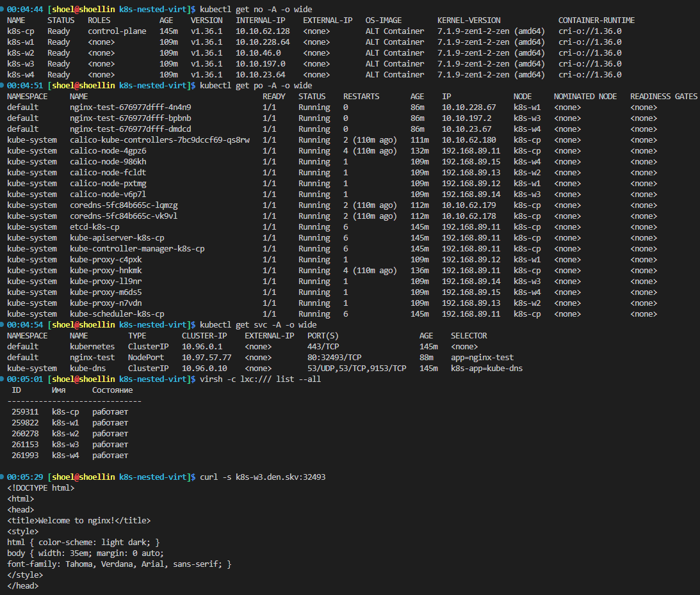

# Домашнее задание к занятию «`Установка Kubernetes`» `Скворцов Денис`

### Цель задания

Установить кластер K8s.

### Чеклист готовности к домашнему заданию

1. Развёрнутые ВМ с ОС Ubuntu 20.04-lts.

### Инструменты и дополнительные материалы, которые пригодятся для выполнения задания

1. [Инструкция по установке kubeadm](https://kubernetes.io/docs/setup/production-environment/tools/kubeadm/create-cluster-kubeadm/).
2. [Документация kubespray](https://kubespray.io/).

-----

### Задание 1. Установить кластер k8s с 1 master node

1. Подготовка работы кластера из 5 нод: 1 мастер и 4 рабочие ноды.

```bash
virsh -c lxc:/// list --all
```

```log
 ID       Имя      Состояние
------------------------------
 259311   k8s-cp   работает
 259822   k8s-w1   работает
 260278   k8s-w2   работает
 261153   k8s-w3   работает
 261993   k8s-w4   работает
```

2. В качестве CRI — containerd.

```bash
kubectl describe nodes \
| grep "Container"
```

```log
  OS Image:                   ALT Container
  Container Runtime Version:  cri-o://1.36.0
  OS Image:                   ALT Container
  Container Runtime Version:  cri-o://1.36.0
  OS Image:                   ALT Container
  Container Runtime Version:  cri-o://1.36.0
  OS Image:                   ALT Container
  Container Runtime Version:  cri-o://1.36.0
  OS Image:                   ALT Container
  Container Runtime Version:  cri-o://1.36.0
```

3. Запуск etcd производить на мастере.

```bash
kubectl describe nodes | grep -A4 etcd
```

```log
  kube-system                 etcd-k8s-cp                                 100m (0%)     0 (0%)      100Mi (0%)       0 (0%)         175m
  kube-system                 kube-apiserver-k8s-cp                       250m (1%)     0 (0%)      0 (0%)           0 (0%)         175m
  kube-system                 kube-controller-manager-k8s-cp              200m (1%)     0 (0%)      0 (0%)           0 (0%)         175m
  kube-system                 kube-proxy-hnkmk                            0 (0%)        0 (0%)      0 (0%)           0 (0%)         166m
  kube-system                 kube-scheduler-k8s-cp                       100m (0%)     0 (0%)      0 (0%)           0 (0%)         175m
```

4. Способ установки выбрать самостоятельно.

```bash
tree k8s-nested-virt/
```

```log
k8s-nested-virt/
├── lxc-k8s-cp.xml
├── lxc-k8s-w1.xml
├── lxc-k8s-w2.xml
├── lxc-k8s-w3.xml
├── lxc-k8s-w4.xml
├── README.md
├── scripts
│   ├── allow_devices_host.sh
│   ├── clone_rootfs.sh
│   ├── delete_containers.sh
│   ├── disable_swap_node.sh
│   ├── fix_kmsg_node.sh
│   ├── fix_pause_image.sh
│   ├── fix_runtime_nested.sh
│   ├── fix_sysctl_host.sh
│   ├── init_cp_ha.sh
│   ├── init_cp.sh
│   ├── prepare_crio_node.sh
│   └── setup_k8s_node.sh
└── templates
    └── lxc-k8s.xml.j2
```




## Дополнительные задания (со звёздочкой)

**Настоятельно рекомендуем выполнять все задания под звёздочкой.** Их выполнение поможет глубже разобраться в материале.
Задания под звёздочкой необязательные к выполнению и не повлияют на получение зачёта по этому домашнему заданию.

------

### Правила приёма работы

1. Домашняя работа оформляется в своем Git-репозитории в файле README.md. Выполненное домашнее задание пришлите ссылкой на .md-файл в вашем репозитории.
2. Файл README.md должен содержать скриншоты вывода необходимых команд `kubectl get nodes`, а также скриншоты результатов.
3. Репозиторий должен содержать тексты манифестов или ссылки на них в файле README.md.
