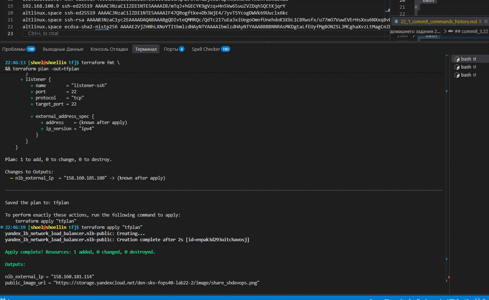
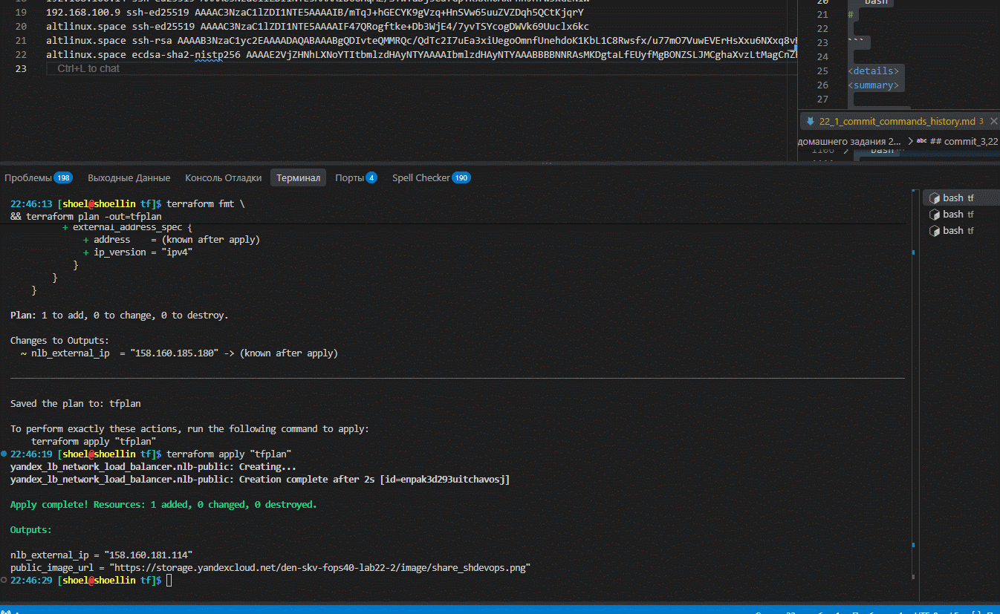
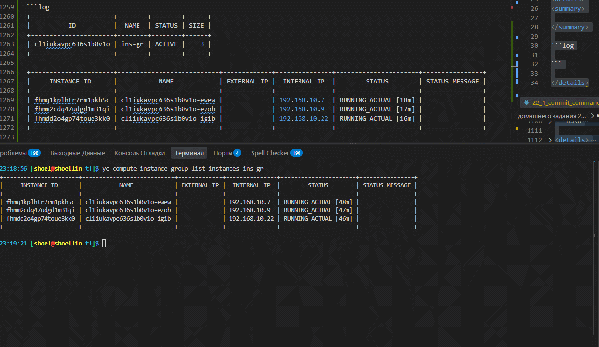

# Домашнее задание к занятию «`Вычислительные мощности. Балансировщики нагрузки`» `Скворцов Денис`  

### Подготовка к выполнению задания

1. Домашнее задание состоит из обязательной части, которую нужно выполнить на провайдере Yandex Cloud, и дополнительной части в AWS (выполняется по желанию).
2. Все домашние задания в блоке 15 связаны друг с другом и в конце представляют пример законченной инфраструктуры.  
3. Все задания нужно выполнить с помощью Terraform. Результатом выполненного домашнего задания будет код в репозитории.
4. Перед началом работы настройте доступ к облачным ресурсам из Terraform, используя материалы прошлых лекций и домашних заданий.

---

## Задание 1. Yandex Cloud

**Что нужно сделать**

1. Создать бакет Object Storage и разместить в нём файл с картинкой:

- Создать бакет в Object Storage с произвольным именем (например, _имя_студента_дата_).
- Положить в бакет файл с картинкой.
- Сделать файл доступным из интернета.

2. Создать группу ВМ в public подсети фиксированного размера с шаблоном LAMP и веб-страницей, содержащей ссылку на картинку из бакета:

- Создать Instance Group с тремя ВМ и шаблоном LAMP. Для LAMP рекомендуется использовать `image_id = fd827b91d99psvq5fjit`.
- Для создания стартовой веб-страницы рекомендуется использовать раздел `user_data` в [meta_data](https://cloud.yandex.ru/docs/compute/concepts/vm-metadata).
- Разместить в стартовой веб-странице шаблонной ВМ ссылку на картинку из бакета.
- Настроить проверку состояния ВМ.

3. Подключить группу к сетевому балансировщику:

- Создать сетевой балансировщик.
- Проверить работоспособность, удалив одну или несколько ВМ.

4. (дополнительно)* Создать Application Load Balancer с использованием Instance group и проверкой состояния.

Полезные документы:

- [Compute instance group](https://registry.terraform.io/providers/yandex-cloud/yandex/latest/docs/resources/compute_instance_group).
- [Network Load Balancer](https://registry.terraform.io/providers/yandex-cloud/yandex/latest/docs/resources/lb_network_load_balancer).
- [Группа ВМ с сетевым балансировщиком](https://cloud.yandex.ru/docs/compute/operations/instance-groups/create-with-balancer).

---

Пример bootstrap-скрипта:

```
#!/bin/bash
yum install httpd -y
service httpd start
chkconfig httpd on
cd /var/www/html
echo "<html><h1>My cool web-server</h1></html>" > index.html
```

---

### Сcылки на файл в S3 хранилище и сайт 
#### `(доступен до 30-08-2026)`

- [файл на S3 den-skv-fops40-lab22-2](https://storage.yandexcloud.net/den-skv-fops40-lab22-2/image/share_shdevops.png)

- [сайт на банасировщике_доступен до 30-08-2026](http://158.160.181.114)

### `TF-манифесты работы`

- [провайдера YC](./tf/providers.tf)
- [переменных](./tf/variables.tf)
- [Создание S3 бакета и загрузка файла](./tf/s3.tf)
- [Описания сетей](./tf/network.tf)
- [security group](./tf/security_groups.tf)
- [Создание LEMP инстанс-групп без NAT](./tf/vms.tf)
- [Сетевой Балансировщик](./tf/nlb.tf)
-   <details>
    <summary>
    Yaml-манифест шаблона cloud-init
    </summary>

    ```yaml
    cat > ./cloud-init.yml <<'EOF'
    #cloud-config
    users:
    - name: skv
        groups: sudo
        shell: /bin/bash
        sudo: ["ALL=(ALL) NOPASSWD:ALL"]
        ssh_authorized_keys:
        - ssh-ed25519 
    ssh_pwauth: false
    # package_update: true
    # package_upgrade: true
    write_files:
    - path: "/var/www/html/index.nginx-debian.html"
        permissions: "0644"
        content: |
        <!DOCTYPE html>
        <html>
        <head>
            <title>Welcome Fops40-2026!</title>
            <style>
                body {
                    display: flex;
                    justify-content: center;
                    align-items: center;
                    height: 100vh;
                    margin: 0;
                    background-color: #f4f4f4;
                }
                img {
                    max-width: 90%;
                    height: auto;
                    box-shadow: 0 4px 8px rgba(0,0,0,0.1);
                }
            </style>
        </head>
        <body>
            
        </body>
        </html>
        defer: true
    runcmd:
    - ["systemctl", "restart", "nginx"]
    EOF
    ```

    </details>
---

### `Скриншот проверок`



#### Проверка из вне



#### Удаление инстанса при рабочей инстанс-группе



---


### Правила приёма работы

Домашняя работа оформляется в своём Git репозитории в файле README.md. Выполненное домашнее задание пришлите ссылкой на .md-файл в вашем репозитории.
Файл README.md должен содержать скриншоты вывода необходимых команд, а также скриншоты результатов.
Репозиторий должен содержать тексты манифестов или ссылки на них в файле README.md.
