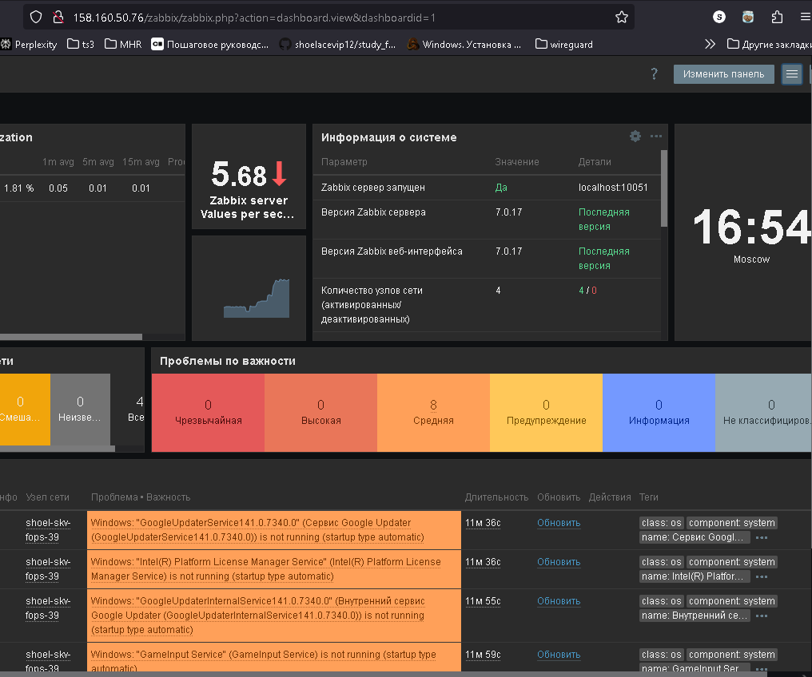
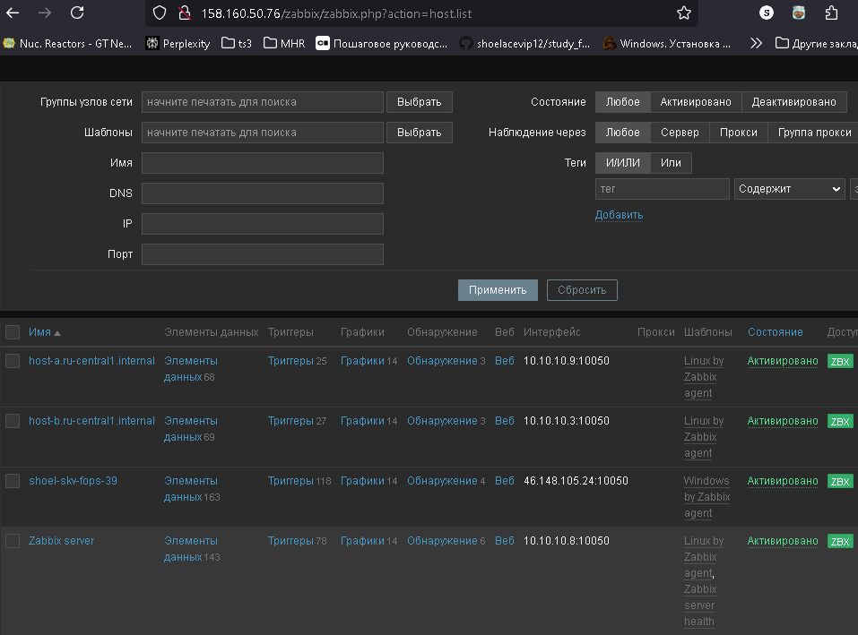
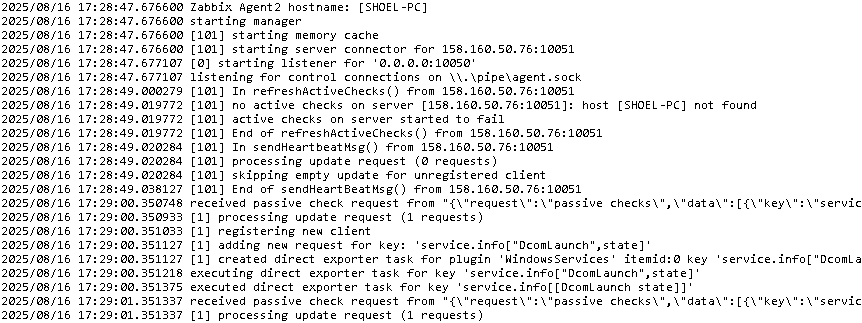
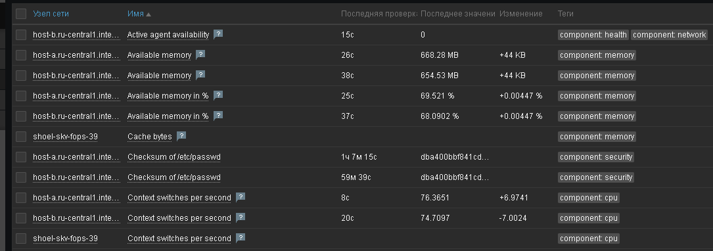
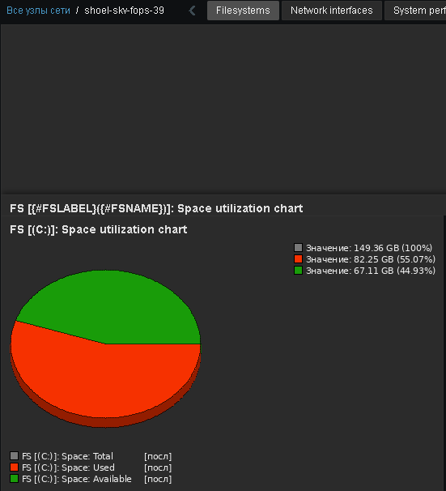
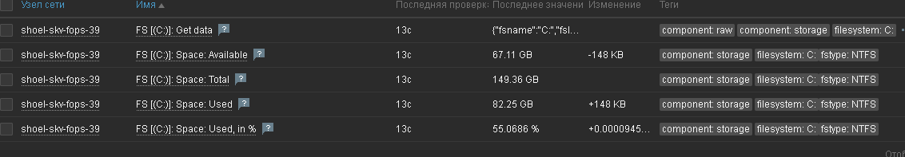

# Домашнее задание к занятию "`Система мониторинга Zabbix`" - `Скворцов Денис`


В практике есть 2 основных и 1 дополнительное (со звездочкой) задания. Первые два нужно выполнять обязательно, третье - по желанию и его решение никак не повлияет на получение вами зачета по этому домашнему заданию, при этом вы сможете глубже и/или шире разобраться в материале. 

Пожалуйста, присылайте на проверку всю задачу сразу. Любые вопросы по решению задач задавайте в чате учебной группы.

### Цели задания
1. Научиться устанавливать Zabbix Server c веб-интерфейсом
2. Научиться устанавливать Zabbix Agent на хосты
3. Научиться устанавливать Zabbix Agent на компьютер и подключать его к серверу Zabbix 

### Чеклист готовности к домашнему заданию
- [ ] Просмотрите в личном кабинете занятие "Система мониторинга Zabbix" 

### Инструкция по выполнению домашнего задания

1. Сделайте fork [репозитория c шаблоном решения](https://github.com/netology-code/sys-pattern-homework) к себе в Github и переименуйте его по названию или номеру занятия, например, https://github.com/имя-вашего-репозитория/gitlab-hw или https://github.com/имя-вашего-репозитория/8-03-hw).
2. Выполните клонирование этого репозитория к себе на ПК с помощью команды `git clone`.
3. Выполните домашнее задание и заполните у себя локально этот файл README.md:
   - впишите вверху название занятия и ваши фамилию и имя;
   - в каждом задании добавьте решение в требуемом виде: текст/код/скриншоты/ссылка;
   - для корректного добавления скриншотов воспользуйтесь инструкцией [«Как вставить скриншот в шаблон с решением»](https://github.com/netology-code/sys-pattern-homework/blob/main/screen-instruction.md);
   - при оформлении используйте возможности языка разметки md. Коротко об этом можно посмотреть в [инструкции по MarkDown](https://github.com/netology-code/sys-pattern-homework/blob/main/md-instruction.md).
4. После завершения работы над домашним заданием сделайте коммит (`git commit -m "comment"`) и отправьте его на Github (`git push origin`).
5. Для проверки домашнего задания преподавателем в личном кабинете прикрепите и отправьте ссылку на решение в виде md-файла в вашем Github.
6. Любые вопросы задавайте в чате учебной группы и/или в разделе «Вопросы по заданию» в личном кабинете.

---

### Задание 1 

Установите Zabbix Server с веб-интерфейсом.

#### Процесс выполнения
1. Выполняя ДЗ, сверяйтесь с процессом отражённым в записи лекции.
2. Установите PostgreSQL. Для установки достаточна та версия, что есть в системном репозитороии Debian 11.
3. Пользуясь конфигуратором команд с официального сайта, составьте набор команд для установки последней версии Zabbix с поддержкой PostgreSQL и Apache.
4. Выполните все необходимые команды для установки Zabbix Server и Zabbix Web Server.

#### Требования к результатам 
1. Прикрепите в файл README.md скриншот авторизации в админке.
2. Приложите в файл README.md текст использованных команд в GitHub.



```bash
cd 9_2

terraform validate \
&& terraform fmt  \
&& terraform init --upgrade \
&& terraform plan -out=tfplan

terraform apply "tfplan"

rm ~/.ssh/known_hosts \
; eval $(ssh-agent) \
&& ssh-add ~/.ssh/id_09-2_ed25519 \
&& ssh -o StrictHostKeyChecking=no -i \
~/.ssh/id_09-2_ed25519 -A skv@$(awk 'NR==2' hosts.ini | cut -d' ' -f1) hostnamectl \
&& yc compute instance list

cat >> cloud-init.yml<<'EOF'
package_update: true
package_upgrade: true
packages:
  - wget
  - curl
  - gnupg
  - software-properties-common
  - python3-psycopg2
  - acl
  - locales-all
runcmd:
  - wget https://repo.zabbix.com/zabbix/7.0/ubuntu/pool/main/z/zabbix-release/zabbix-release_7.0-2+ubuntu24.04_all.deb -O /tmp/zabbix-release.deb
  - dpkg -i /tmp/zabbix-release.deb
  - apt-get update
  - apt-get install -y zabbix-agent2 -t noble-backports
  - rm /tmp/zabbix-release.deb
EOF

terraform destroy

terraform validate \
&& terraform fmt  \
&& terraform init --upgrade \
&& terraform plan -out=tfplan

terraform apply "tfplan"

rm ~/.ssh/known_hosts \
; eval $(ssh-agent) \
&& ssh-add ~/.ssh/id_09-2_ed25519 \
&& for d in {120..1}; do \
echo -n "Лучше подождать чем получить ошибку =): $d сек." \
; sleep 1 \
; echo -ne "\r"; done \
&& ssh -o StrictHostKeyChecking=no -i \
~/.ssh/id_09-2_ed25519 -A skv@$(awk 'NR==5' hosts.ini | cut -d' ' -f1) hostnamectl \
&& yc compute instance list

ansible-config init --disabled -t all > ansible.cfg
sed -i -e '/^[[:space:]]*\(#\|;\)/d' -e '/^[[:space:]]*$/d' ansible.cfg

ansible-playbook ANS_common.yml
ansible-playbook ANS_zabbix_server.yml
```

---

### Задание 2 

Установите Zabbix Agent на два хоста.

#### Процесс выполнения
1. Выполняя ДЗ, сверяйтесь с процессом отражённым в записи лекции.
2. Установите Zabbix Agent на 2 вирт.машины, одной из них может быть ваш Zabbix Server.
3. Добавьте Zabbix Server в список разрешенных серверов ваших Zabbix Agentов.
4. Добавьте Zabbix Agentов в раздел Configuration > Hosts вашего Zabbix Servera.
5. Проверьте, что в разделе Latest Data начали появляться данные с добавленных агентов.

#### Требования к результатам
1. Приложите в файл README.md скриншот раздела Configuration > Hosts, где видно, что агенты подключены к серверу
2. Приложите в файл README.md скриншот лога zabbix agent, где видно, что он работает с сервером
3. Приложите в файл README.md скриншот раздела Monitoring > Latest data для обоих хостов, где видны поступающие от агентов данные.
4. Приложите в файл README.md текст использованных команд в GitHub




```bash
ansible-playbook ANS_zabbix_agent.yml
```
```yaml
---
- name: Установка Zabbix Agent
  hosts: all
  become: yes
  vars:
    zabbix_server_ip: "{{ groups['zab-serv'][1] }}"
  tasks:
    - name: Добавление GPG-ключа и репозитория
      block:
        - name: Импорт GPG-ключа
          ansible.builtin.apt_key:
            url: https://repo.zabbix.com/zabbix-official-repo.key
            state: present
        
        - name: Добавление репозитория
          ansible.builtin.apt_repository:
            repo: "deb https://repo.zabbix.com/zabbix/7.0/ubuntu noble main"
            state: present
            filename: zabbix
            update_cache: yes
      tags: repo


    - name: Установка агента
      apt:
        name: zabbix-agent2
        state: present

    - name: Настройка конфига агента
      template:
        src: templates/zabbix_agent2.conf.j2
        dest: /etc/zabbix/zabbix_agent2.conf
      notify: Restart Zabbix Agent

    - name: Включение агента
      service:
        name: zabbix-agent2
        state: started
        enabled: yes

  handlers:
    - name: Restart Zabbix Agent
      service:
        name: zabbix-agent2
        state: restarted
```
---
## Задание 3 со звёздочкой*
Установите Zabbix Agent на Windows (компьютер) и подключите его к серверу Zabbix.

#### Требования к результатам
1. Приложите в файл README.md скриншот раздела Latest Data, где видно свободное место на диске C:


--- 

## Критерии оценки

1. Выполнено минимум 2 обязательных задания
2. Прикреплены требуемые скриншоты и тексты 
3. Задание оформлено в шаблоне с решением и опубликовано на GitHub