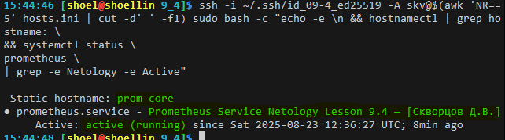
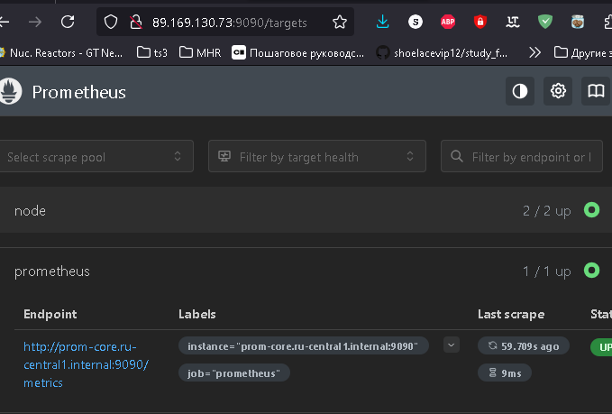
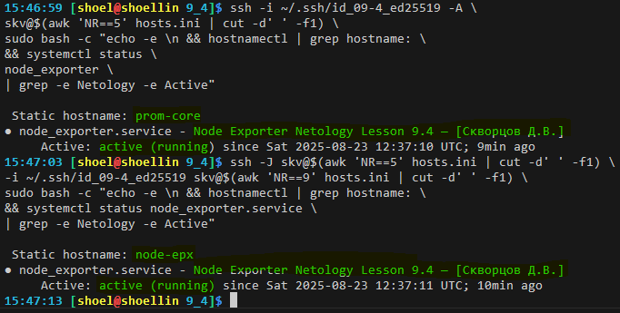
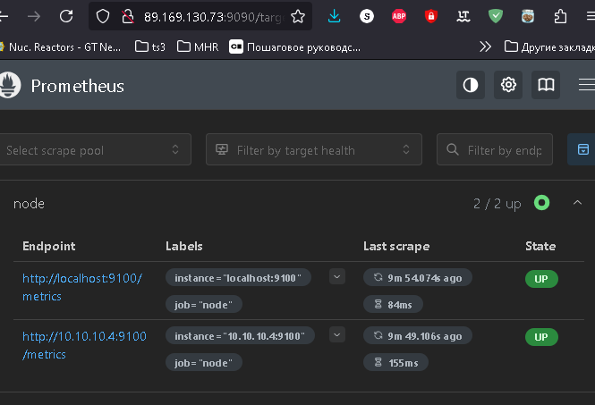
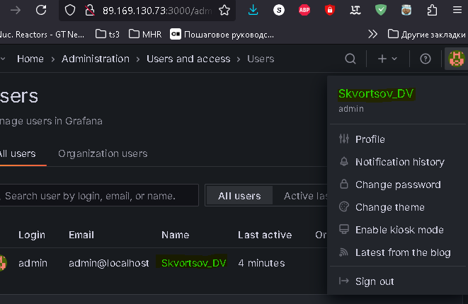
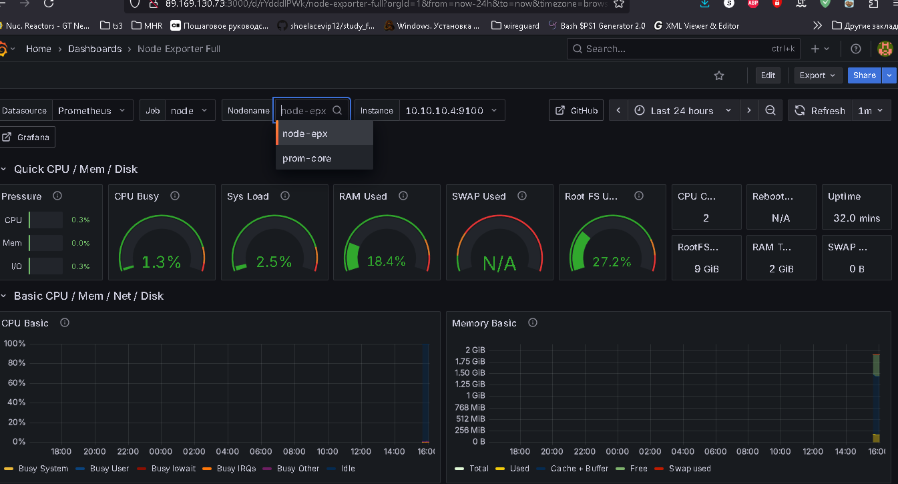
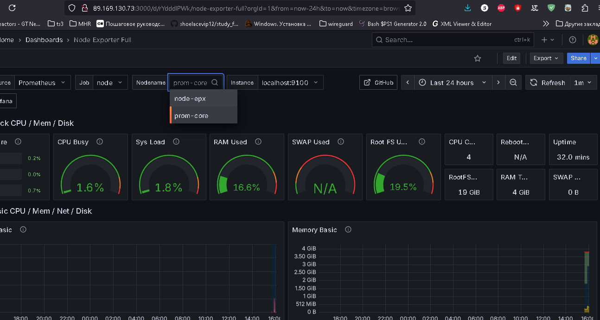

# Домашнее задание к занятию «`Система мониторинга Prometheus`» `Скворцов Денис`

Это задание для самостоятельной отработки навыков и не предполагает обратной связи от преподавателя. Его выполнение не влияет на завершение модуля. Но мы рекомендуем его выполнить, чтобы закрепить полученные знания.

### Цели задания

1. Научиться устанавливать Prometheus
2. Научиться устанавливать Node Exporter
3. Научиться подключать Node Exporter к серверу Prometheus
4. Научиться устанавливать Grafana и интегрировать с Prometheus


### Чеклист готовности к домашнему заданию
- [ ] Просмотрите в личном кабинете занятие "Система мониторинга Prometheus" 

### Инструкция по выполнению домашнего задания

1. Сделайте fork [репозитория c шаблоном решения](https://github.com/netology-code/sys-pattern-homework) к себе в Github и переименуйте его по названию или номеру занятия, например, https://github.com/имя-вашего-репозитория/gitlab-hw или https://github.com/имя-вашего-репозитория/8-03-hw).
2. Выполните клонирование этого репозитория к себе на ПК с помощью команды `git clone`.
3. Выполните домашнее задание и заполните у себя локально этот файл README.md:
   - впишите вверху название занятия и ваши фамилию и имя;
   - в каждом задании добавьте решение в требуемом виде: текст/код/скриншоты/ссылка;
   - для корректного добавления скриншотов воспользуйтесь инструкцией [«Как вставить скриншот в шаблон с решением»](https://github.com/netology-code/sys-pattern-homework/blob/main/screen-instruction.md);
   - при оформлении используйте возможности языка разметки md. Коротко об этом можно посмотреть в [инструкции по MarkDown](https://github.com/netology-code/sys-pattern-homework/blob/main/md-instruction.md).
4. После завершения работы над домашним заданием сделайте коммит (`git commit -m "comment"`) и отправьте его на Github (`git push origin`).
5. В личном кабинете прикрепите ссылку на решение в виде md-файла в вашем Github.
6. Любые вопросы задавайте в чате учебной группы и/или в разделе «Вопросы по заданию» в личном кабинете.

---

### Задание 1
Установите Prometheus.

#### Процесс выполнения
1. Выполняя задание, сверяйтесь с процессом, отражённым в записи лекции
2. Создайте пользователя prometheus
3. Скачайте prometheus и в соответствии с лекцией разместите файлы в целевые директории
4. Создайте сервис как показано на уроке
5. Проверьте что prometheus запускается, останавливается, перезапускается и отображает статус с помощью systemctl

#### Требования к результату
- [ ] Прикрепите к файлу README.md скриншот systemctl status prometheus, где будет написано: prometheus.service — Prometheus Service Netology Lesson 9.4 — [Ваши ФИО]


---

### Задание 2
Установите Node Exporter.

#### Процесс выполнения
1. Выполняя ДЗ сверяйтесь с процессом отражённым в записи лекции.
3. Скачайте node exporter приведённый в презентации и в соответствии с лекцией разместите файлы в целевые директории
4. Создайте сервис для как показано на уроке
5. Проверьте что node exporter запускается, останавливается, перезапускается и отображает статус с помощью systemctl

#### Требования к результату
- [ ] Прикрепите к файлу README.md скриншот systemctl status node-exporter, где будет написано: node-exporter.service — Node Exporter Netology Lesson 9.4 — [Ваши ФИО]


---

### Задание 3
Подключите Node Exporter к серверу Prometheus.

#### Процесс выполнения
1. Выполняя ДЗ сверяйтесь с процессом отражённым в записи лекции.
2. Отредактируйте prometheus.yaml, добавив в массив таргетов установленный в задании 2 node exporter
3. Перезапустите prometheus
4. Проверьте что он запустился

#### Требования к результату
- [ ] Прикрепите к файлу README.md скриншот конфигурации из интерфейса Prometheus вкладки Status > Configuration
- [ ] Прикрепите к файлу README.md скриншот из интерфейса Prometheus вкладки Status > Targets, чтобы было видно минимум два эндпоинта

```yaml
global:
  scrape_interval: 15s
  scrape_timeout: 10s
  scrape_protocols:
  - OpenMetricsText1.0.0
  - OpenMetricsText0.0.1
  - PrometheusText1.0.0
  - PrometheusText0.0.4
  evaluation_interval: 15s
  external_labels:
    environment: prom-core.ru-central1.internal
runtime:
  gogc: 75
rule_files:
- /etc/prometheus/rules/*.yml
- /etc/prometheus/rules/*.yaml
- /etc/prometheus/rules/*.rules
scrape_config_files:
- /etc/prometheus/scrape_configs/*
scrape_configs:
- job_name: prometheus
  honor_timestamps: true
  track_timestamps_staleness: false
  scrape_interval: 15s
  scrape_timeout: 10s
  scrape_protocols:
  - OpenMetricsText1.0.0
  - OpenMetricsText0.0.1
  - PrometheusText1.0.0
  - PrometheusText0.0.4
  always_scrape_classic_histograms: false
  convert_classic_histograms_to_nhcb: false
  metrics_path: /metrics
  scheme: http
  enable_compression: true
  metric_name_validation_scheme: utf8
  metric_name_escaping_scheme: allow-utf-8
  follow_redirects: true
  enable_http2: true
  static_configs:
  - targets:
    - prom-core.ru-central1.internal:9090
- job_name: node
  honor_timestamps: true
  track_timestamps_staleness: false
  scrape_interval: 15s
  scrape_timeout: 10s
  scrape_protocols:
  - OpenMetricsText1.0.0
  - OpenMetricsText0.0.1
  - PrometheusText1.0.0
  - PrometheusText0.0.4
  always_scrape_classic_histograms: false
  convert_classic_histograms_to_nhcb: false
  metrics_path: /metrics
  scheme: http
  enable_compression: true
  metric_name_validation_scheme: utf8
  metric_name_escaping_scheme: allow-utf-8
  follow_redirects: true
  enable_http2: true
  file_sd_configs:
  - files:
    - /etc/prometheus/file_sd/node.yml
    refresh_interval: 5m
otlp:
  translation_strategy: UnderscoreEscapingWithSuffixes
```


---
## Дополнительные задания со звёздочкой*
Эти задания дополнительные. Их можно не выполнять. Это не повлияет на зачёт. Вы можете их выполнить, если хотите глубже разобраться в материале.

---

### Задание 4*
Установите Grafana.

#### Требования к результату
- [ ] Прикрепите к файлу README.md скриншот левого нижнего угла интерфейса, чтобы при наведении на иконку пользователя были видны ваши ФИО


---

### Задание 5*
Интегрируйте Grafana и Prometheus.

