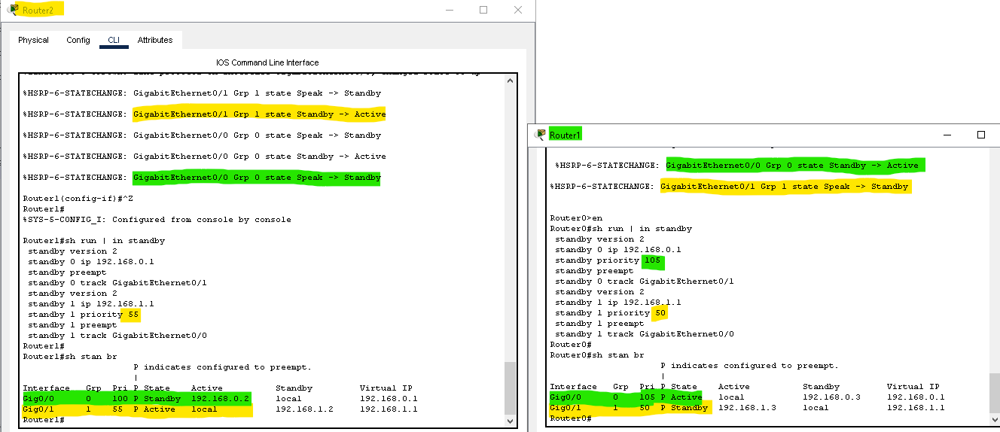
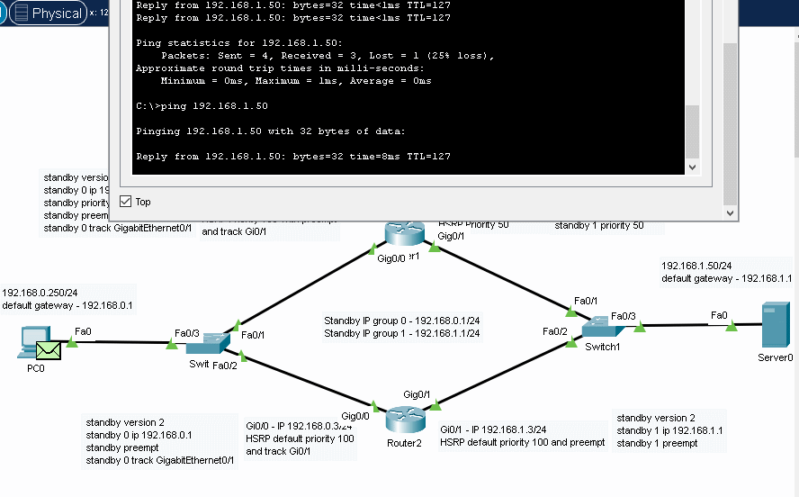
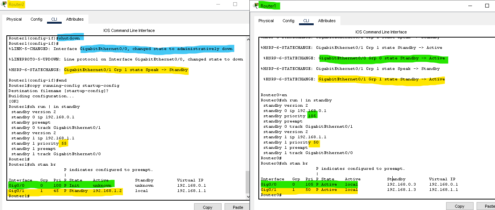
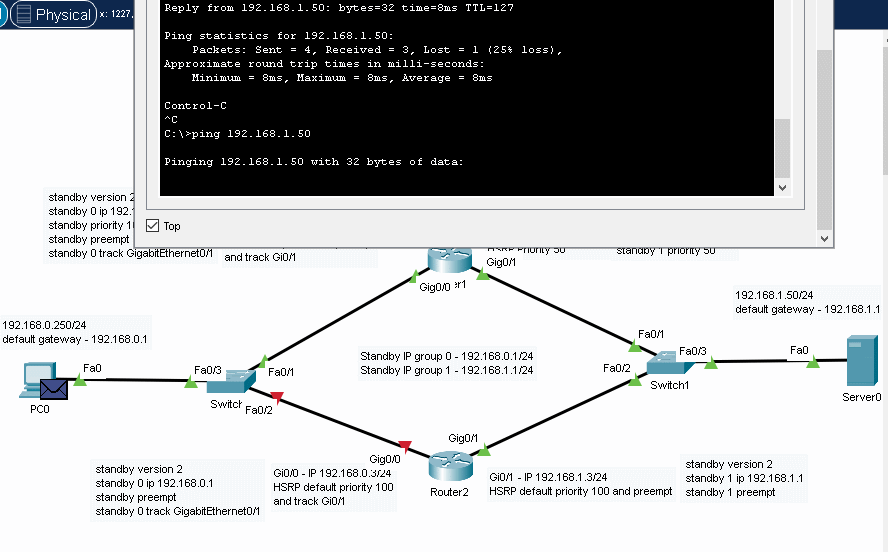
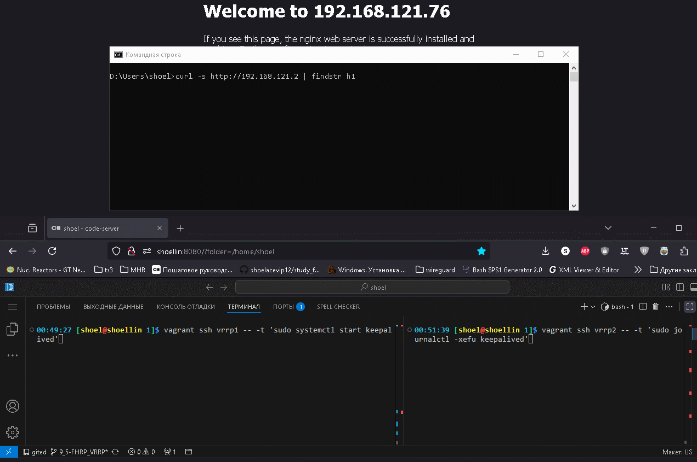

# Домашнее задание к занятию 1 «`Disaster recovery и Keepalived`» `Скворцов Денис`

### Цель задания
В результате выполнения этого задания вы научитесь:
1. Настраивать отслеживание интерфейса для протокола HSRP;
2. Настраивать сервис Keepalived для использования плавающего IP

------

### Чеклист готовности к домашнему заданию

1. Установлена программа Cisco Packet Tracer
2. Установлена операционная система Ubuntu на виртуальную машину и имеется доступ к терминалу
3. Сделан клон этой виртуальной машины, они находятся в одной подсети и имеют разные IP адреса
4. Просмотрены конфигурационные файлы, рассматриваемые на лекции, которые находятся по [ссылке](1/)


------

### Инструкция по выполнению домашнего задания

1. Сделайте fork [репозитория c шаблоном решения](https://github.com/netology-code/sys-pattern-homework) к себе в Github и переименуйте его по названию или номеру занятия, например, https://github.com/имя-вашего-репозитория/gitlab-hw или https://github.com/имя-вашего-репозитория/8-03-hw).
2. Выполните клонирование этого репозитория к себе на ПК с помощью команды git clone.
3. Выполните домашнее задание и заполните у себя локально этот файл README.md:
   - впишите вверху название занятия и ваши фамилию и имя;
   - в каждом задании добавьте решение в требуемом виде: текст/код/скриншоты/ссылка;
   - для корректного добавления скриншотов воспользуйтесь инструкцией [«Как вставить скриншот в шаблон с решением»](https://github.com/netology-code/sys-pattern-homework/blob/main/screen-instruction.md);
   - при оформлении используйте возможности языка разметки md. Коротко об этом можно посмотреть в [инструкции по MarkDown](https://github.com/netology-code/sys-pattern-homework/blob/main/md-instruction.md).
4. После завершения работы над домашним заданием сделайте коммит (git commit -m "comment") и отправьте его на Github (git push origin).
5. Для проверки домашнего задания преподавателем в личном кабинете прикрепите и отправьте ссылку на решение в виде md-файла в вашем Github.
6. Любые вопросы задавайте в чате учебной группы и/или в разделе «Вопросы по заданию» в личном кабинете.


------


### Задание 1
- Дана [схема](1/hsrp_advanced.pkt) для Cisco Packet Tracer, рассматриваемая в лекции.
- На данной схеме уже настроено отслеживание интерфейсов маршрутизаторов Gi0/1 (для нулевой группы)
- Необходимо аналогично настроить отслеживание состояния интерфейсов Gi0/0 (для первой группы).
- Для проверки корректности настройки, разорвите один из кабелей между одним из маршрутизаторов и Switch0 и запустите ping между PC0 и Server0.
- На проверку отправьте получившуюся схему в формате pkt и скриншот, где виден процесс настройки маршрутизатора.

```Pug
#Router 1
en
sh run


^C
conf t
int gi0/1
standby 1 preempt
standby 1 tr gi0/0
sh
no sh
end

wr

cop run st

sh run | in standby

sh stan br
````
```Pug
#Router 2
en
sh run


^C
conf t
int gi0/1
standby 1 pri 55
standby 1 tr gi0/0
sh
no sh
end

wr

cop run st

sh run | in standby

sh stan br
```



```Pug
#Router 2
en
sh run


^C
conf t
int gi0/0
sh
end

wr

cop run st

```


------

### Задание 2
- Запустите две виртуальные машины Linux, установите и настройте сервис Keepalived как в лекции, используя пример конфигурационного [файла](1/keepalived-simple.conf).
- Настройте любой веб-сервер (например, nginx или simple python server) на двух виртуальных машинах
- Напишите Bash-скрипт, который будет проверять доступность порта данного веб-сервера и существование файла index.html в root-директории данного веб-сервера.
- Настройте Keepalived так, чтобы он запускал данный скрипт каждые 3 секунды и переносил виртуальный IP на другой сервер, если bash-скрипт завершался с кодом, отличным от нуля (то есть порт веб-сервера был недоступен или отсутствовал index.html). Используйте для этого секцию vrrp_script
- На проверку отправьте получившейся bash-скрипт и конфигурационный файл keepalived, а также скриншот с демонстрацией переезда плавающего ip на другой сервер в случае недоступности порта или файла index.html



```bash
#!/bin/bash
# Параметры по умолчанию
HOST="127.0.0.1"
PORT="80"
FILE="/var/www/html/index.nginx-debian.html"
# Проверка доступности порта
if nc -z "$HOST" "$PORT" &>/dev/null; then
    echo "Порт $PORT на $HOST доступен"
else
    exit 1
fi
# Проверка существования файла
if [ -f "$FILE" ]; then
    echo "Файл $FILE существует"
else
    exit 2
fi
exit 0
```

```json
vrrp_script chk_web_server {
    script "/usr/local/bin/check_web_server.sh"
    interval 3
    fall 2
    rise 1
}
vrrp_instance VI_1 {
        state MASTER
        interface ens33
        virtual_router_id 15
        priority 255
        advert_int 1


        virtual_ipaddress {
              192.168.121.2/24
        }

     
        track_script {
	           chk_web_server

		}
}

```
------

### Правила приема работы

1. Необходимо следовать инструкции по выполнению домашнего задания, используя для оформления репозиторий Github
2. В ответе необходимо прикладывать требуемые материалы - скриншоты, конфигурационные файлы, скрипты. Необходимые материалы для получения зачета указаны в каждом задании.


------

### Критерии оценки

- Зачет - выполнены все задания, ответы даны в развернутой форме, приложены требуемые скриншоты, конфигурационные файлы, скрипты. В выполненных заданиях нет противоречий и нарушения логики
- На доработку - задание выполнено частично или не выполнено, в логике выполнения заданий есть противоречия, существенные недостатки, приложены не все требуемые материалы.
