# Дипломный практикум в Yandex.Cloud `Скворцов Денис`
  * [Цели:](#цели)
  * [Этапы выполнения:](#этапы-выполнения)
     * [Создание облачной инфраструктуры](#создание-облачной-инфраструктуры)
     * [Создание Kubernetes кластера](#создание-kubernetes-кластера)
     * [Создание тестового приложения](#создание-тестового-приложения)
     * [Подготовка cистемы мониторинга и деплой приложения](#подготовка-cистемы-мониторинга-и-деплой-приложения)
     * [Установка и настройка CI/CD](#установка-и-настройка-cicd)
  * [Что необходимо для сдачи задания?](#что-необходимо-для-сдачи-задания)
  * [Как правильно задавать вопросы дипломному руководителю?](#как-правильно-задавать-вопросы-дипломному-руководителю)

**Перед началом работы над дипломным заданием изучите [Инструкция по экономии облачных ресурсов](https://github.com/netology-code/devops-materials/blob/master/cloudwork.MD).**

---
## Цели:

1. Подготовить облачную инфраструктуру на базе облачного провайдера Яндекс.Облако.
2. Запустить и сконфигурировать Kubernetes кластер.
3. Установить и настроить систему мониторинга.
4. Настроить и автоматизировать сборку тестового приложения с использованием Docker-контейнеров.
5. Настроить CI для автоматической сборки и тестирования.
6. Настроить CD для автоматического развёртывания приложения.

---

### Общая архитектурная схема реализация проекта

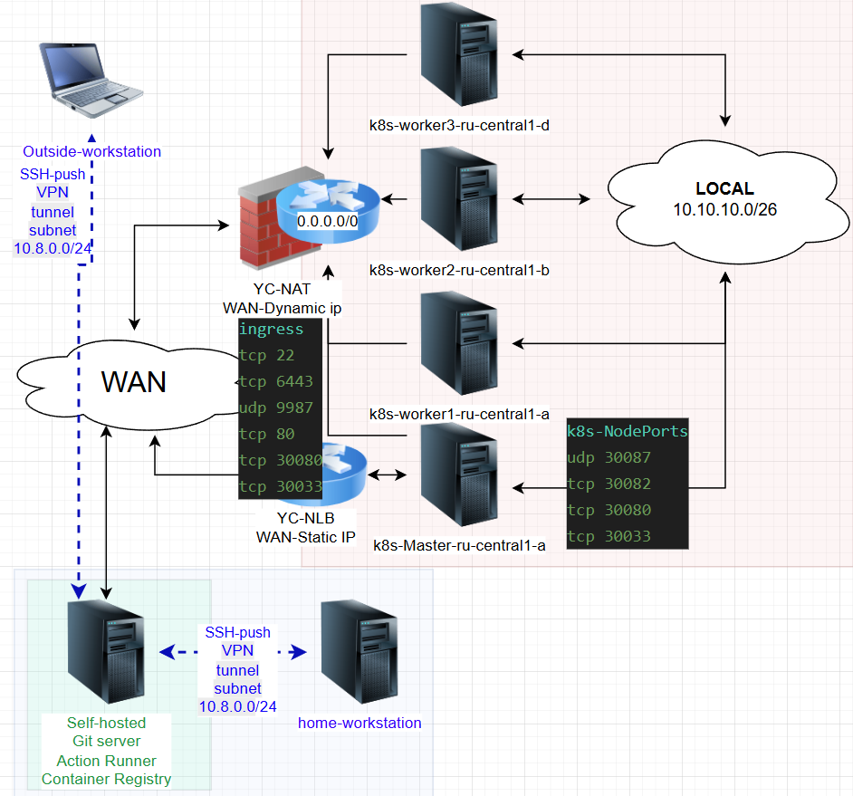

### Схема внешнего доступа до приложения (прямая публичная точка - NLB)

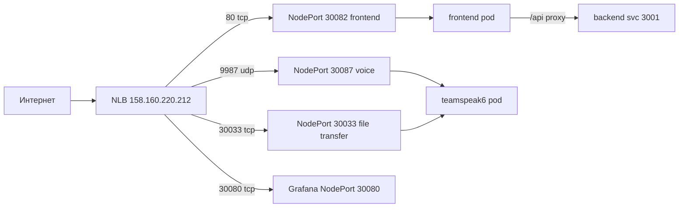

---

## Реализация проекта (итоговые репозитории)

Проект реализован цепочкой git-репозиториев (self-hosted Forgejo, организация `diplom`), каждый из которых закрывает свой этап задания:

| # |  Репозиторий | Назначение |
|---|---|---|
| 1 | [`Дtмонстрационные GIF`](./Demo/) | Болшие демонстрационные файлы процесса CI-CD и работы приложения\мониторинга кластера k8s |
| 1 | [`tf/net_S3-store`](./tf/net_S3-store) | Terraform: VPC/подсети/NAT, S3-бэкенд, KMS, сервисные аккаунты, security groups |
| 2 | [`tf/k8s`](./tf/k8s) | Terraform: ВМ master/workers, cloud-init, NLB, генерация инвентаря ansible |
| 3 | [`tf/ansible`](./tf/ansible) | Ansible: роль k3s_cluster (K3s, Calico, ingress-nginx, Grafana) |
| 4 |  [`deploy/ts6-image-build`](./deploy/ts6-image-build) | Сборка 4 образов стека ts6 с вшитым `.env`, публикация в Forgejo CR |
| 5 | [`deploy/k8s-deploy`](./deploy/k8s-deploy) | Манифесты k8s + ansible-импорт образов + CI/CD деплой по тегу `v*` |
| 6 | приватный на self-hosted  | Секреты: `terraform.tfvars.secret`, `va_pa`, `kubeconfig` |

Поток: `tf-net-S3-store` -> `tf-k8s` -> `ansible-k3s` -> `ts6-image-build` (сборка) -> `k8s-deploy` (тег `v*` -> импорт -> `kubectl apply`).

Особенности:

- кластер k3s напрямую не достаёт Forgejo CR за VPN  - образы доставляются плейбуком `k8s-deploy` (`docker pull` -> `docker save` -> tar на ноды -> `k3s ctr images import`);
- секреты вшиваются в образы на этапе сборки (ARG/ENV) либо берутся из приватного `tf-secrets`;
- публичный доступ только через NLB `158.160.220.212` (80 frontend, 30080 Grafana, 30033 file transfer; голос 9987/udp - после включения UDP в YC);
- CI/CD: Forgejo Actions, self-hosted runner в контейнере `ubuntu-act` с docker-сокетом хоста.

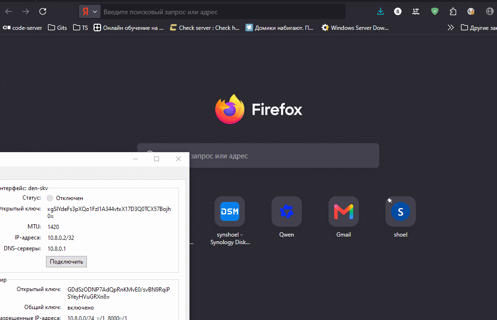

## Этапы выполнения:

### Создание облачной инфраструктуры

Для начала необходимо подготовить облачную инфраструктуру в ЯО при помощи [Terraform](https://www.terraform.io/).

Особенности выполнения:

- Бюджет купона ограничен, что следует иметь в виду при проектировании инфраструктуры и использовании ресурсов;
Для облачного k8s используйте региональный мастер(неотказоустойчивый). Для self-hosted k8s минимизируйте ресурсы ВМ и долю ЦПУ. В обоих вариантах используйте прерываемые ВМ для worker nodes.

Предварительная подготовка к установке и запуску Kubernetes кластера.

1. Создайте сервисный аккаунт, который будет в дальнейшем использоваться Terraform для работы с инфраструктурой с необходимыми и достаточными правами. Не стоит использовать права суперпользователя
2. Подготовьте [backend](https://developer.hashicorp.com/terraform/language/backend) для Terraform:  
   а. Рекомендуемый вариант: S3 bucket в созданном ЯО аккаунте(создание бакета через TF)
   б. Альтернативный вариант:  [Terraform Cloud](https://app.terraform.io/)
3. Создайте конфигурацию Terrafrom, используя созданный бакет ранее как бекенд для хранения стейт файла. Конфигурации Terraform для создания сервисного аккаунта и бакета и основной инфраструктуры следует сохранить в разных папках.
4. Создайте VPC с подсетями в разных зонах доступности.
5. Убедитесь, что теперь вы можете выполнить команды `terraform destroy` и `terraform apply` без дополнительных ручных действий.
6. В случае использования [Terraform Cloud](https://app.terraform.io/) в качестве [backend](https://developer.hashicorp.com/terraform/language/backend) убедитесь, что применение изменений успешно проходит, используя web-интерфейс Terraform cloud.

Ожидаемые результаты:

1. Terraform сконфигурирован и создание инфраструктуры посредством Terraform возможно без дополнительных ручных действий, стейт основной конфигурации сохраняется в бакете или Terraform Cloud
2. Полученная конфигурация инфраструктуры является предварительной, поэтому в ходе дальнейшего выполнения задания возможны изменения.

**Реализация:**

- поднят self-hosted git-сервер Forgejo за VPN (WireGuard) с локальным DNS на CoreDNS;
- terraform-манифесты репозитория [`tf/net_S3-store`](tf/net_S3-store): S3-бэкенд для стейта, VPC с подсетями и NAT, KMS-ключ, сервисный аккаунт, группа доступа, S3-бакет;
- инфраструктура применена `terraform apply` без ручных действий, стейт хранится в бакете `tfstate-skv`.

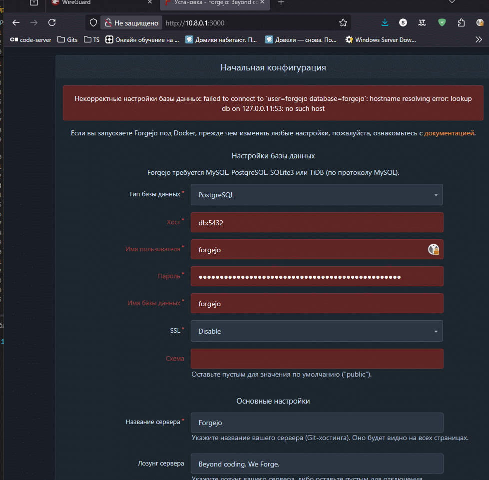

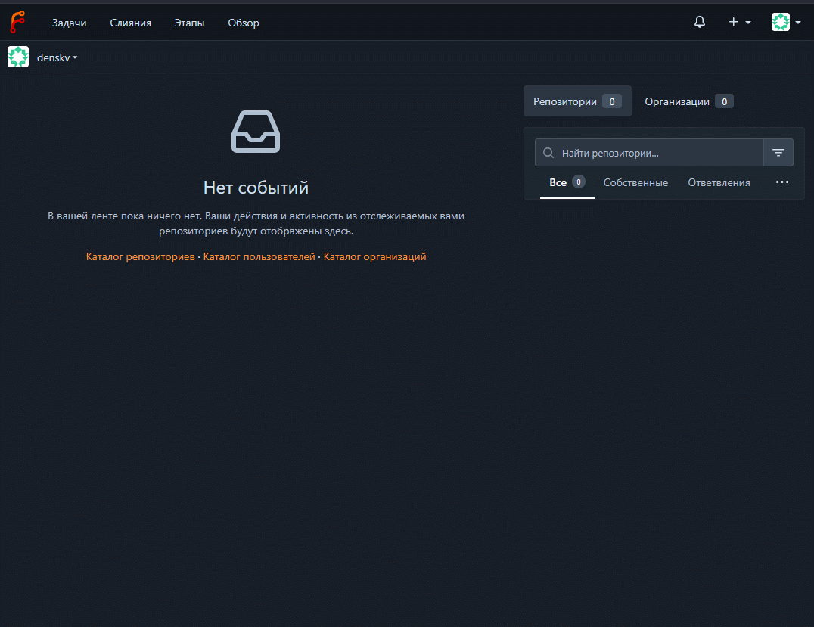

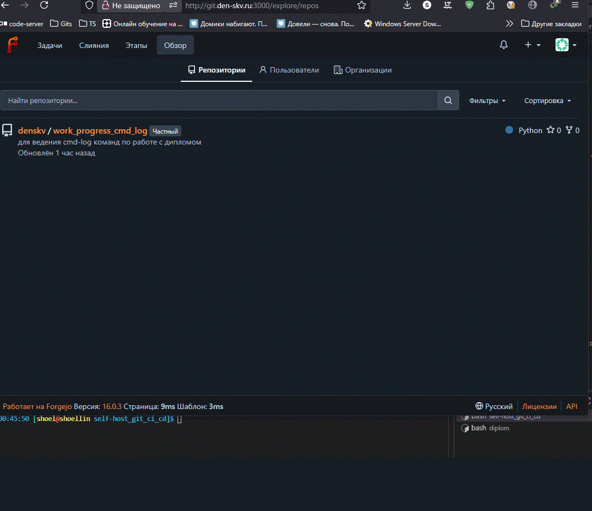

---
### Создание Kubernetes кластера

На этом этапе необходимо создать [Kubernetes](https://kubernetes.io/ru/docs/concepts/overview/what-is-kubernetes/) кластер на базе предварительно созданной инфраструктуры.   Требуется обеспечить доступ к ресурсам из Интернета.

Это можно сделать двумя способами:

1. Рекомендуемый вариант: самостоятельная установка Kubernetes кластера.  
   а. При помощи Terraform подготовить как минимум 3 виртуальных машины Compute Cloud для создания Kubernetes-кластера. Тип виртуальной машины следует выбрать самостоятельно с учётом требовании к производительности и стоимости. Если в дальнейшем поймете, что необходимо сменить тип инстанса, используйте Terraform для внесения изменений.  
   б. Подготовить [ansible](https://www.ansible.com/) конфигурации, можно воспользоваться, например [Kubespray](https://kubernetes.io/docs/setup/production-environment/tools/kubespray/)  
   в. Задеплоить Kubernetes на подготовленные ранее инстансы, в случае нехватки каких-либо ресурсов вы всегда можете создать их при помощи Terraform.
2. Альтернативный вариант: воспользуйтесь сервисом [Yandex Managed Service for Kubernetes](https://cloud.yandex.ru/services/managed-kubernetes)  
  а. С помощью terraform resource для [kubernetes](https://registry.terraform.io/providers/yandex-cloud/yandex/latest/docs/resources/kubernetes_cluster) создать **региональный** мастер kubernetes с размещением нод в разных 3 подсетях      
  б. С помощью terraform resource для [kubernetes node group](https://registry.terraform.io/providers/yandex-cloud/yandex/latest/docs/resources/kubernetes_node_group)
  
Ожидаемый результат:

1. Работоспособный Kubernetes кластер.
2. В файле `~/.kube/config` находятся данные для доступа к кластеру.
3. Команда `kubectl get pods --all-namespaces` отрабатывает без ошибок.

**Реализация:**

- terraform-репозиторий [`tf/k8s`](tf/k8s): инстанс-группы master (1 ВМ) и workers (3 ВМ), cloud-init, NLB `nlb-k8s-master`, генерация `hosts.ini` и `ssh_config_yc_k8s` для ansible;
- ansible-роль `k3s_cluster` (репозиторий [`tf/ansible`](tf/ansible)): установка K3s, Calico CNI, ingress-nginx, сборка локального `~/.kube/config`;
- после запуска playbook проверено: `kubectl get nodes` - 4 ноды в статусе Ready.

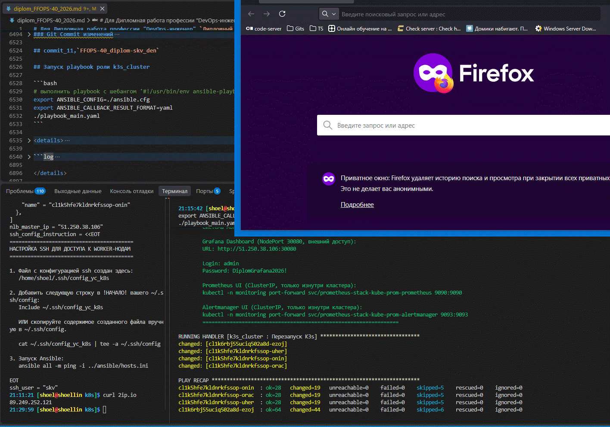

---
### Создание тестового приложения

Для перехода к следующему этапу необходимо подготовить тестовое приложение, эмулирующее основное приложение разрабатываемое вашей компанией.

Способ подготовки:

1. Рекомендуемый вариант:  
   а. Создайте отдельный git репозиторий с простым nginx конфигом, который будет отдавать статические данные.  
   б. Подготовьте Dockerfile для создания образа приложения.  
2. Альтернативный вариант:  
   а. Используйте любой другой код, главное, чтобы был самостоятельно создан Dockerfile.

Ожидаемый результат:

1. Git репозиторий с тестовым приложением и Dockerfile.
2. Регистри с собранным docker image. В качестве регистри может быть DockerHub или [Yandex Container Registry](https://cloud.yandex.ru/services/container-registry), созданный также с помощью terraform.

**Реализация:**

- репозиторий сборки [`deploy/ts6-image-build`](deploy/ts6-image-build): 4 собственных Dockerfile (teamspeak6-server, backend, sidecar, frontend) поверх upstream-образов с вшитым `.env` (ARG/ENV);
- скрипты `gen_secrets.sh` (генерация секретов) и `build_images.sh` (сборка и публикация образов);
- образы опубликованы в Forgejo Container Registry `10.8.0.1:3000/diplom/*` (`latest` на каждый push, `v*` на git-тег).

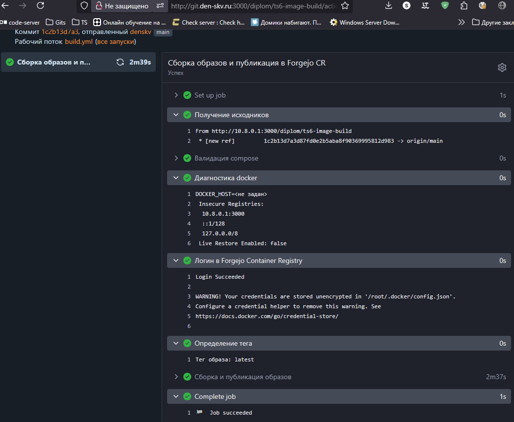 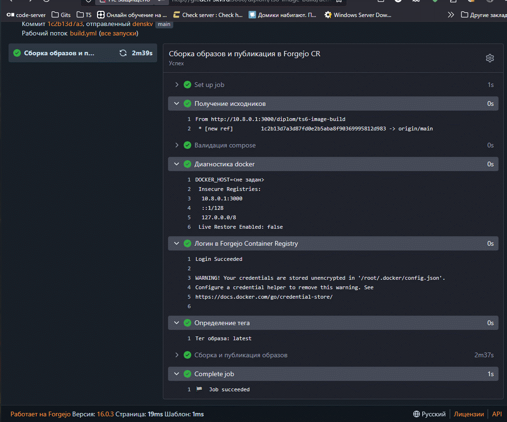

---
### Подготовка cистемы мониторинга и деплой приложения

Уже должны быть готовы конфигурации для автоматического создания облачной инфраструктуры и поднятия Kubernetes кластера.
Теперь необходимо подготовить конфигурационные файлы для настройки нашего Kubernetes кластера.

Цель:
1. Задеплоить в кластер [prometheus](https://prometheus.io/), [grafana](https://grafana.com/), [alertmanager](https://github.com/prometheus/alertmanager), [экспортер](https://github.com/prometheus/node_exporter) основных метрик Kubernetes.
2. Задеплоить тестовое приложение, например, [nginx](https://www.nginx.com/) сервер отдающий статическую страницу.

Способ выполнения:
1. Воспользоваться пакетом [kube-prometheus](https://github.com/prometheus-operator/kube-prometheus), который уже включает в себя [Kubernetes оператор](https://operatorhub.io/) для [grafana](https://grafana.com/), [prometheus](https://prometheus.io/), [alertmanager](https://github.com/prometheus/alertmanager) и [node_exporter](https://github.com/prometheus/node_exporter). Альтернативный вариант - использовать набор helm чартов от [bitnami](https://github.com/bitnami/charts/tree/main/bitnami).

**Реализация:**

- мониторинг развёрнут ролью `k3s_cluster`: helm-чарт `kube-prometheus-stack` (Prometheus, Grafana, Alertmanager, node_exporter), Grafana доступна через NodePort 30080;
- приложение развёрнуто репозиторием доставки [`deploy/k8s-deploy`](deploy/k8s-deploy): namespace `ts6`, PVC (local-path), 4 Deployment, сервисы ClusterIP/NodePort;
- деплой по тегу `v*`: импорт образов в containerd нод ansible-плейбуком -> `kubectl apply` -> rollout.

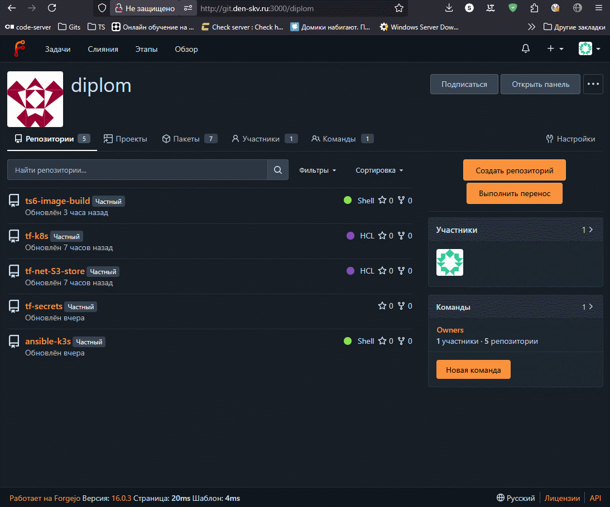

---

### Деплой инфраструктуры в terraform pipeline

1. Если на первом этапе вы не воспользовались [Terraform Cloud](https://app.terraform.io/), то задеплойте и настройте в кластере [atlantis](https://www.runatlantis.io/) для отслеживания изменений инфраструктуры. Альтернативный вариант 3 задания: вместо Terraform Cloud или atlantis настройте на автоматический запуск и применение конфигурации terraform из вашего git-репозитория в выбранной вами CI-CD системе при любом комите в main ветку. Предоставьте скриншоты работы пайплайна из CI/CD системы.

Ожидаемый результат:
1. Git репозиторий с конфигурационными файлами для настройки Kubernetes.
2. Http доступ на 80 порту к web интерфейсу grafana.
3. Дашборды в grafana отображающие состояние Kubernetes кластера.
4. Http доступ на 80 порту к тестовому приложению.
5. Atlantis или terraform cloud или ci/cd-terraform

**Реализация:**

- вместо Atlantis/Terraform Cloud настроены Forgejo Actions-pipelines репозиториев [`tf/net_S3-store`](tf/net_S3-store) и [`tf/k8s`](tf/k8s): авто `terraform plan` -> `apply` при коммите в main;
- бинарь Terraform кэшируется в Forgejo Package Registry (скрипты `scripts/fetch_terraform.sh`);
- чувствительные переменные подтягиваются из приватного репозитория `tf-secrets` через `TOKEN`.

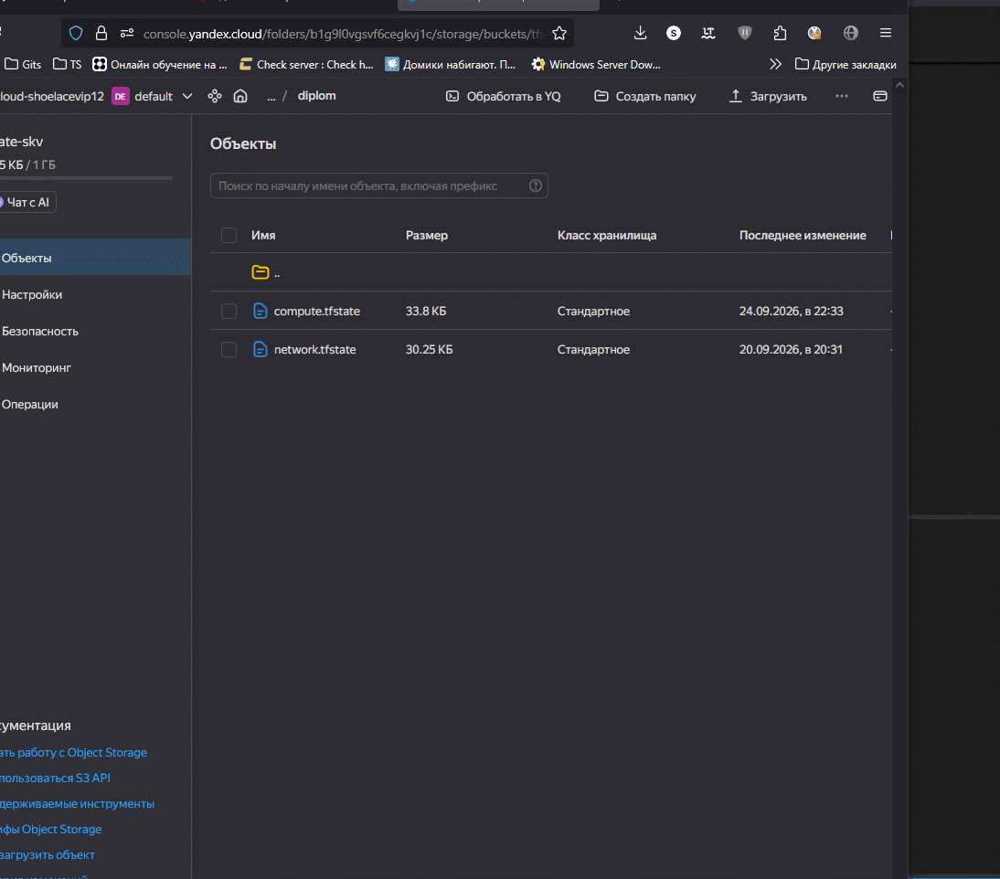 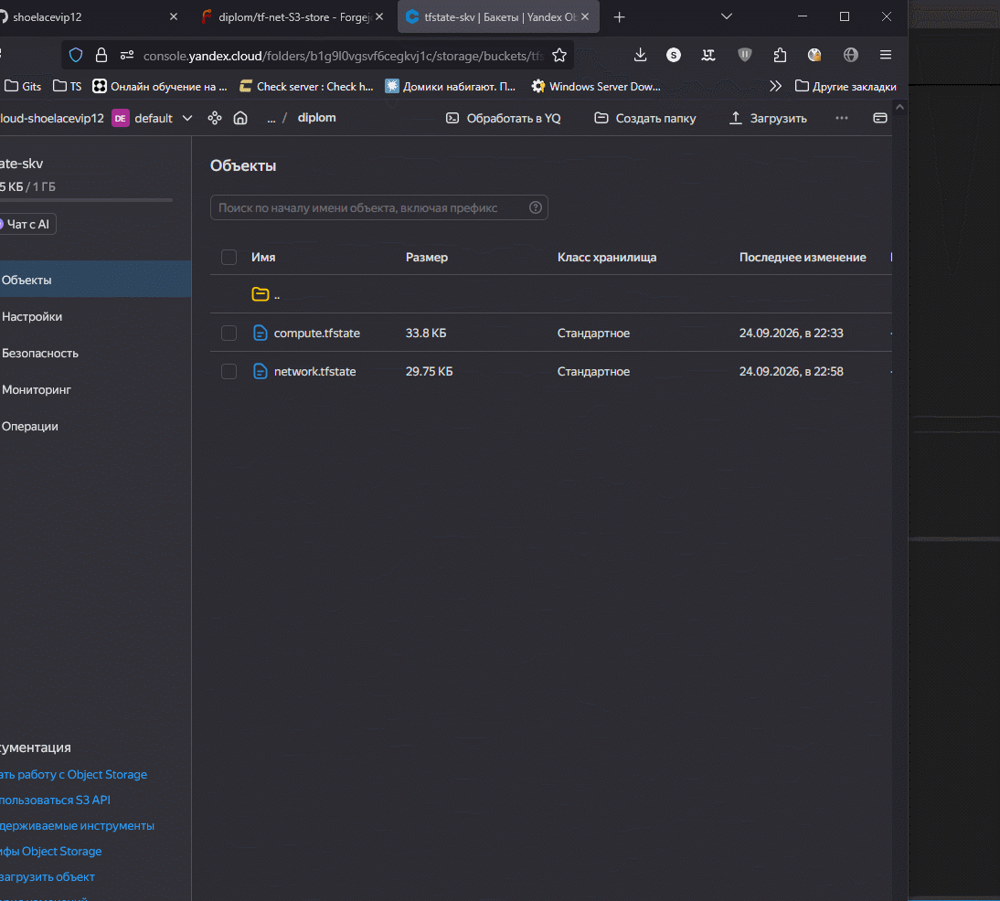

---
### Установка и настройка CI/CD

Осталось настроить ci/cd систему для автоматической сборки docker image и деплоя приложения при изменении кода.

Цель:

1. Автоматическая сборка docker образа при коммите в репозиторий с тестовым приложением.
2. Автоматический деплой нового docker образа.

Можно использовать [teamcity](https://www.jetbrains.com/ru-ru/teamcity/), [jenkins](https://www.jenkins.io/), [GitLab CI](https://about.gitlab.com/stages-devops-lifecycle/continuous-integration/) или GitHub Actions.

Ожидаемый результат:

1. Интерфейс ci/cd сервиса доступен по http.
2. При любом коммите в репозиторие с тестовым приложением происходит сборка и отправка в регистр Docker образа.
3. При создании тега (например, v1.0.0) происходит сборка и отправка с соответствующим label в регистри, а также деплой соответствующего Docker образа в кластер Kubernetes.

**Реализация:**

- self-hosted runner Forgejo в docker-контейнере `ubuntu-act` (доступ к docker-сокету хоста, установлен ansible);
- pipeline сборки `deploy/ts6-image-build/.forgejo/workflows/build.yml`: сборка образов на каждый push (latest) и на теги `v*`;
- pipeline деплоя `deploy/k8s-deploy/.forgejo/workflows/deploy.yml`: тег `v*` -> импорт образов -> `kubectl apply`;
- pipeline `ansible-k3s`: развёртывание кластера при коммите в main.

 

---
## Что необходимо для сдачи задания?

1. Репозиторий с конфигурационными файлами Terraform и готовность продемонстрировать создание всех ресурсов с нуля.
2. Пример pull request с комментариями созданными atlantis'ом или снимки экрана из Terraform Cloud или вашего CI-CD-terraform pipeline.
3. Репозиторий с конфигурацией ansible, если был выбран способ создания Kubernetes кластера при помощи ansible.
4. Репозиторий с Dockerfile тестового приложения и ссылка на собранный docker image.
5. Репозиторий с конфигурацией Kubernetes кластера.
6. Ссылка на тестовое приложение и веб интерфейс Grafana с данными доступа.
7. Все репозитории рекомендуется хранить на одном ресурсе (github, gitlab)
