#  Курсовая работа на профессии "`DevOps-инженер с нуля`" `Скворцов Денис`

Содержание
==========
* [Задача](#Задача)
* [Инфраструктура](#Инфраструктура)
    * [Сайт](#Сайт)
    * [Мониторинг](#Мониторинг)
    * [Логи](#Логи)
    * [Сеть](#Сеть)
    * [Резервное копирование](#Резервное-копирование)
    * [Дополнительно](#Дополнительно)
* [Выполнение работы](#Выполнение-работы)
* [Критерии сдачи](#Критерии-сдачи)
* [Как правильно задавать вопросы дипломному руководителю](#Как-правильно-задавать-вопросы-дипломному-руководителю) 

---------
## Задача
Ключевая задача — разработать отказоустойчивую инфраструктуру для сайта, включающую мониторинг, сбор логов и резервное копирование основных данных. Инфраструктура должна размещаться в [Yandex Cloud](https://cloud.yandex.com/).

**Примечание**: в курсовой работе используется система мониторинга Prometheus. Вместо Prometheus вы можете использовать Zabbix. Задание для курсовой работы с использованием Zabbix находится по [ссылке](https://github.com/netology-code/fops-sysadm-diplom/blob/diplom-zabbix/README.md).

**Перед началом работы над дипломным заданием изучите [Инструкция по экономии облачных ресурсов](https://github.com/netology-code/devops-materials/blob/master/cloudwork.MD).**   

## Инфраструктура

Для развёртки инфраструктуры используйте Terraform и Ansible. 

Параметры виртуальной машины (ВМ) подбирайте по потребностям сервисов, которые будут на ней работать. 

Ознакомьтесь со всеми пунктами из этой секции, не беритесь сразу выполнять задание, не дочитав до конца. Пункты взаимосвязаны и могут влиять друг на друга.

### Сайт
Создайте две ВМ в разных зонах, установите на них сервер nginx, если его там нет. ОС и содержимое ВМ должно быть идентичным, это будут наши веб-сервера.

Используйте набор статичных файлов для сайта. Можно переиспользовать сайт из домашнего задания.

Создайте [Target Group](https://cloud.yandex.com/docs/application-load-balancer/concepts/target-group), включите в неё две созданных ВМ.

Создайте [Backend Group](https://cloud.yandex.com/docs/application-load-balancer/concepts/backend-group), настройте backends на target group, ранее созданную. Настройте healthcheck на корень (/) и порт 80, протокол HTTP.

Создайте [HTTP router](https://cloud.yandex.com/docs/application-load-balancer/concepts/http-router). Путь укажите — /, backend group — созданную ранее.

Создайте [Application load balancer](https://cloud.yandex.com/en/docs/application-load-balancer/) для распределения трафика на веб-сервера, созданные ранее. Укажите HTTP router, созданный ранее, задайте listener тип auto, порт 80.

Протестируйте сайт
`curl -v <публичный IP балансера>:80` 

### Мониторинг
Создайте ВМ, разверните на ней Prometheus. На каждую ВМ из веб-серверов установите Node Exporter и [Nginx Log Exporter](https://github.com/martin-helmich/prometheus-nginxlog-exporter). Настройте Prometheus на сбор метрик с этих exporter.

Создайте ВМ, установите туда Grafana. Настройте её на взаимодействие с ранее развернутым Prometheus. Настройте дешборды с отображением метрик, минимальный набор — Utilization, Saturation, Errors для CPU, RAM, диски, сеть, http_response_count_total, http_response_size_bytes. Добавьте необходимые [tresholds](https://grafana.com/docs/grafana/latest/panels/thresholds/) на соответствующие графики.

### Логи
Cоздайте ВМ, разверните на ней Elasticsearch. Установите filebeat в ВМ к веб-серверам, настройте на отправку access.log, error.log nginx в Elasticsearch.

Создайте ВМ, разверните на ней Kibana, сконфигурируйте соединение с Elasticsearch.

### Сеть
Разверните один VPC. Сервера web, Prometheus, Elasticsearch поместите в приватные подсети. Сервера Grafana, Kibana, application load balancer определите в публичную подсеть.

Настройте [Security Groups](https://cloud.yandex.com/docs/vpc/concepts/security-groups) соответствующих сервисов на входящий трафик только к нужным портам.

Настройте ВМ с публичным адресом, в которой будет открыт только один порт — ssh. Настройте все security groups на разрешение входящего ssh из этой security group. Эта вм будет реализовывать концепцию bastion host. Потом можно будет подключаться по ssh ко всем хостам через этот хост.

### Резервное копирование
Создайте snapshot дисков всех ВМ. Ограничьте время жизни snaphot в неделю. Сами snaphot настройте на ежедневное копирование.

### Дополнительно
Не входит в минимальные требования. 

1. Для Prometheus можно реализовать альтернативный способ хранения данных — в базе данных PpostgreSQL. Используйте [Yandex Managed Service for PostgreSQL](https://cloud.yandex.com/en-ru/services/managed-postgresql). Разверните кластер из двух нод с автоматическим failover. Воспользуйтесь адаптером с https://github.com/CrunchyData/postgresql-prometheus-adapter для настройки отправки данных из Prometheus в новую БД.
2. Вместо конкретных ВМ, которые входят в target group, можно создать [Instance Group](https://cloud.yandex.com/en/docs/compute/concepts/instance-groups/), для которой настройте следующие правила автоматического горизонтального масштабирования: минимальное количество ВМ на зону — 1, максимальный размер группы — 3.
3. Можно добавить в Grafana оповещения с помощью Grafana alerts. Как вариант, можно также установить Alertmanager в ВМ к Prometheus, настроить оповещения через него.
4. В Elasticsearch добавьте мониторинг логов самого себя, Kibana, Prometheus, Grafana через filebeat. Можно использовать logstash тоже.
5. Воспользуйтесь Yandex Certificate Manager, выпустите сертификат для сайта, если есть доменное имя. Перенастройте работу балансера на HTTPS, при этом нацелен он будет на HTTP веб-серверов.

## Выполнение работы
На этом этапе вы непосредственно выполняете работу. При этом вы можете консультироваться с руководителем по поводу вопросов, требующих уточнения.

⚠️ В случае недоступности ресурсов Elastic для скачивания рекомендуется разворачивать сервисы с помощью docker контейнеров, основанных на официальных образах.

**Важно**: Ещё можно задавать вопросы по поводу того, как реализовать ту или иную функциональность. И руководитель определяет, правильно вы её реализовали или нет. Любые вопросы, которые не освещены в этом документе, стоит уточнять у руководителя. Если его требования и указания расходятся с указанными в этом документе, то приоритетны требования и указания руководителя.

## Критерии сдачи
1. Инфраструктура отвечает минимальным требованиям, описанным в [Задаче](#Задача).
2. Предоставлен доступ ко всем ресурсам, у которых предполагается веб-страница (сайт, Kibana, Grafanа).
3. Для ресурсов, к которым предоставить доступ проблематично, предоставлены скриншоты, команды, stdout, stderr, подтверждающие работу ресурса.
4. Работа оформлена в отдельном репозитории в GitHub или в [Google Docs](https://docs.google.com/), разрешён доступ по ссылке. 
5. Код размещён в репозитории в GitHub.
6. Работа оформлена так, чтобы были понятны ваши решения и компромиссы. 
7. Если использованы дополнительные репозитории, доступ к ним открыт. 

## Как правильно задавать вопросы дипломному руководителю
Что поможет решить большинство частых проблем:
1. Попробовать найти ответ сначала самостоятельно в интернете или в материалах курса и только после этого спрашивать у дипломного руководителя. Навык поиска ответов пригодится вам в профессиональной деятельности.
2. Если вопросов больше одного, присылайте их в виде нумерованного списка. Так дипломному руководителю будет проще отвечать на каждый из них.
3. При необходимости прикрепите к вопросу скриншоты и стрелочкой покажите, где не получается. Программу для этого можно скачать [здесь](https://app.prntscr.com/ru/).

Что может стать источником проблем:
1. Вопросы вида «Ничего не работает. Не запускается. Всё сломалось». Дипломный руководитель не сможет ответить на такой вопрос без дополнительных уточнений. Цените своё время и время других.
2. Откладывание выполнения дипломной работы на последний момент.
3. Ожидание моментального ответа на свой вопрос. Дипломные руководители — работающие инженеры, которые занимаются, кроме преподавания, своими проектами. Их время ограничено, поэтому постарайтесь задавать правильные вопросы, чтобы получать быстрые ответы :)
---
### В рамках поставленного задания было выполнено:
Созданы ВМ в разных зонах, где:
****
0. ALB Между Зонами A и Б
1. Nginx(web-a) - Зона А
2. Nginx(web-b) - Зона Б
3. Prometheus - Зона Д
4. Grafana - Зона Д
5. Elasticsearch - Зона Д
6. Kibana - Зона Д
7. bastion host - Зона Д
---

* Сеть VPC реализована следующим образом:
    ---
	- общая закрытая локальная сеть 10.10.10.192/26
	- Поделена между зонами:
		+ 10.10.10.192/28 -Зона А
		+ 10.10.10.208/28 -Зона Б
		+ 10.10.10.224/28 -Зона Д
		
	- Предоставлено 2 публичных IP от yandex cloud, где:
		+ 1 из адресов предоставлен для Application Load Balancer для доступа к сайту на уровне трафика L7 по портам 80 и 443
		+ 1 из адресов предоставлен для ВМ работающем в режиме Узла-бастиона, через который производится дальнейшая установка Ansible и проброшен трафик до внутренних IP Зоны Д к хостам Grafana и Kibana по соответствующим портам
* Сайт реализован на 2-х ВМ (Nginx) с доступом через единый публичный IP Application Load Balancer сервиса Yandex cloud
	---
* Развернут и настроен стек сервисов мониторинга Prometheus\Grafana\Node Exporter\Nginx Log Exporter за хостами с сайтом.
	---
* Развернут и настроен стек ELK Elasticsearch\Kibana\filebeat-агентов
	---
* По Резервному копированию Создано расписание, в рамках сервиса Yandex cloud, ежедневных snapshot дисков всех ВМ, где выставлена ротация snaphot сроком в неделю.
	---
* Для развёртки инфраструктуры использовался Terraform и Ansible
	- `Terraform` был распределен по отдельным tf-файлам описания развертывания в yandex cloud
		+ providers.tf - Описание провайдера для работы с yandex-cloud
		+ в variables.tf - Описание часто повторяющихся переменных в других файлах .tf
		+ network.tf - Описание CIDR локальных сетей в зонах, WAN и NAT маршрутизации
		+ security_groups.tf - Описание security group для локальных и публичных сетей с разграничением доступа по портам и протоколам
		+ snapshots.tf - Описание расписания снимков дисков для всех ВМ
		+ alb.tf - Описание Application Load Balancer
		+ vms.tf - Описание развертки Виртуальных Машин
		
	- В `Ansible` был использован, для развертывания сервисной инфраструктуры задания, ansible-galaxy collection для prometheus и Grafana и своя роль для остального. 
		- Созданы отдельные playbook` с минимальными задачами и запуском ролей
		- Своя роль fops39_skv_2025, что выполняет следующие задачи:
			+ Обновление и установка необходимых пакетов на ubuntu 2404 для задачи
			+ Проброс портов bastion для доступа к Grafana и Kibana
			+ Установка и настройка nginx на ВМ выступающих в роли сайта проекта
			+ Установка ELK стека для логирования
			+ Установка и настройка prometheus-nginxlog-exporter под grafana через prometheus
	
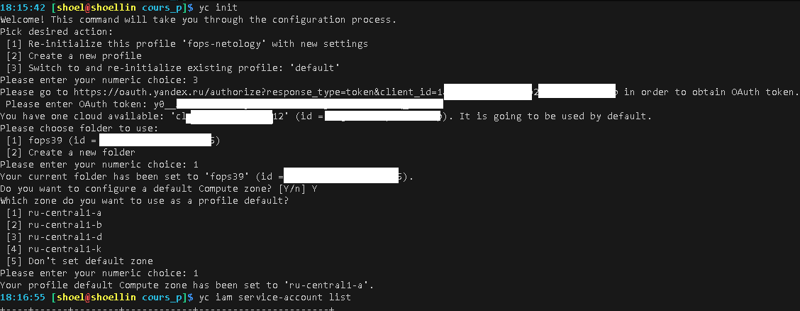 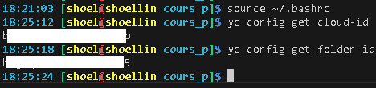 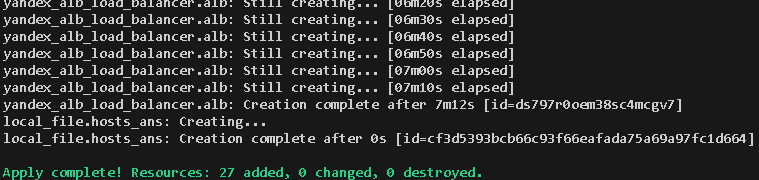 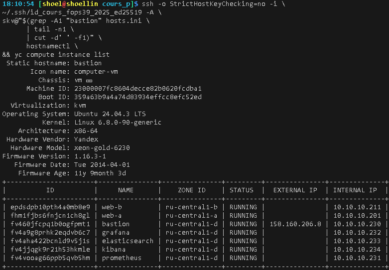 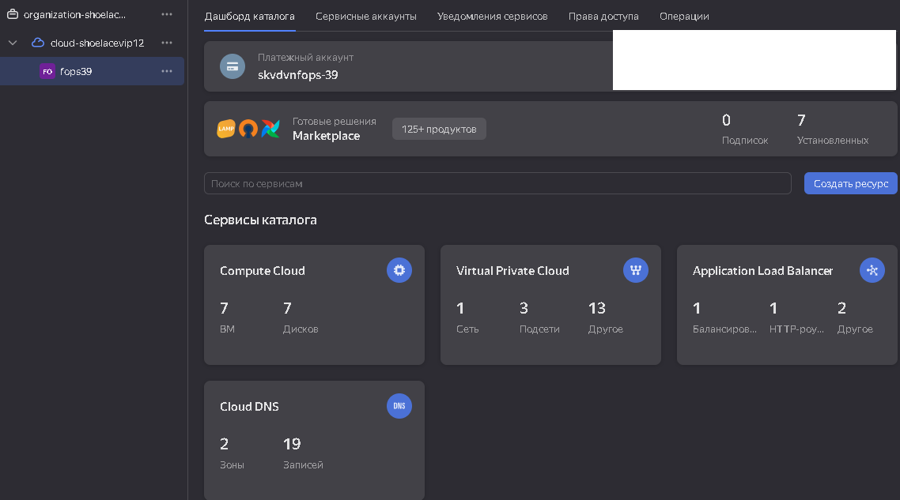 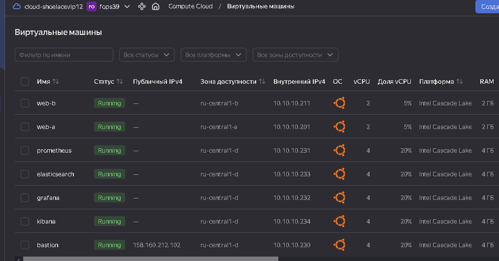 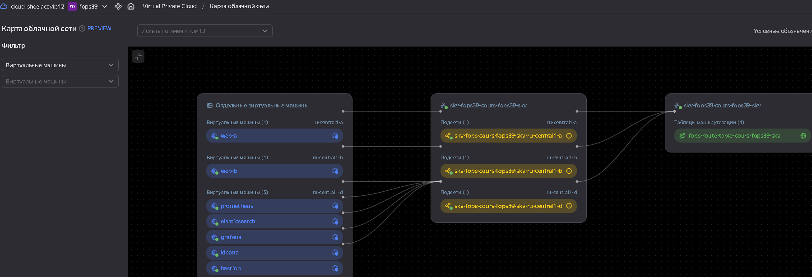 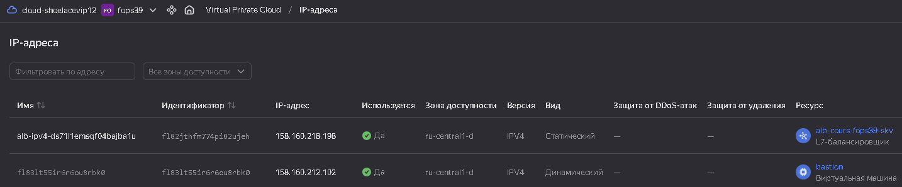 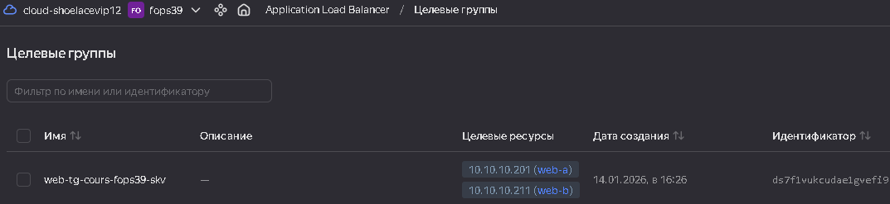 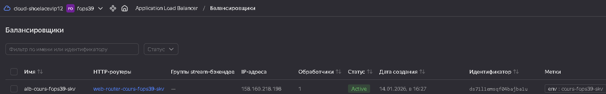 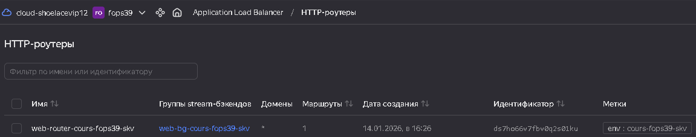 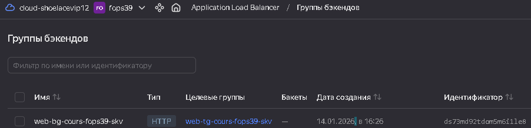 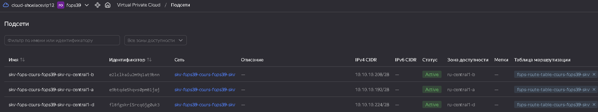 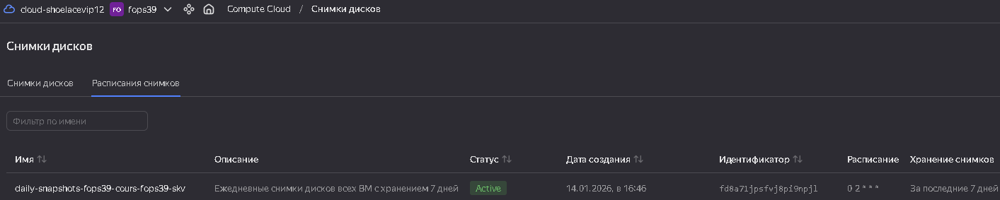 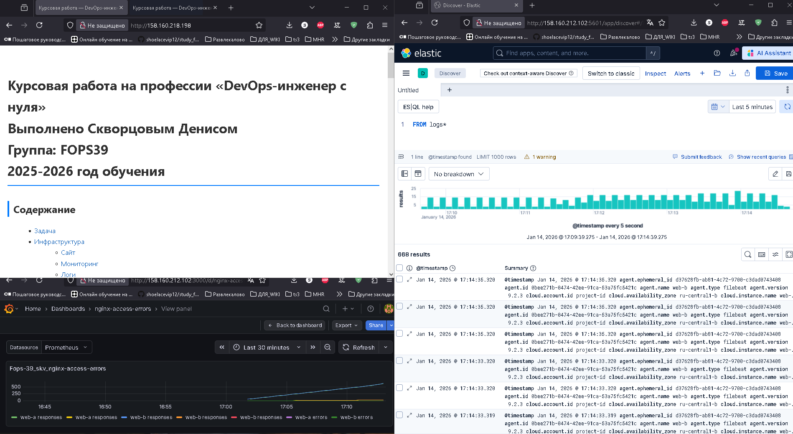 