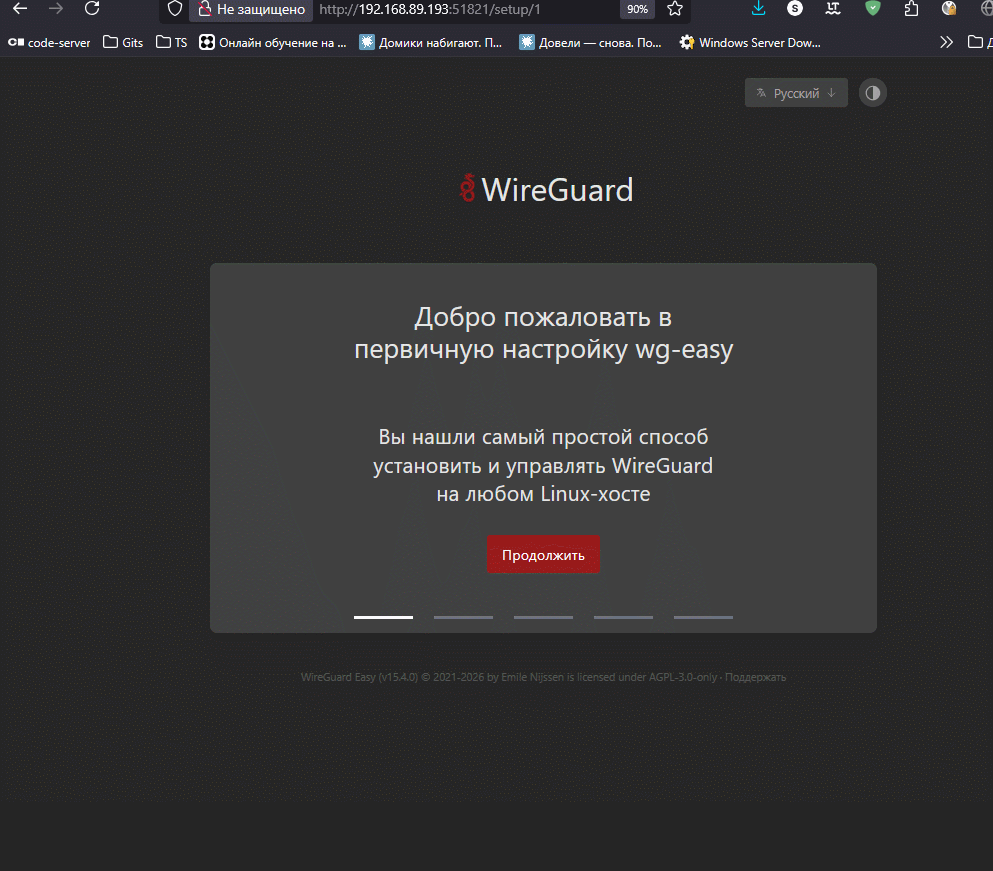
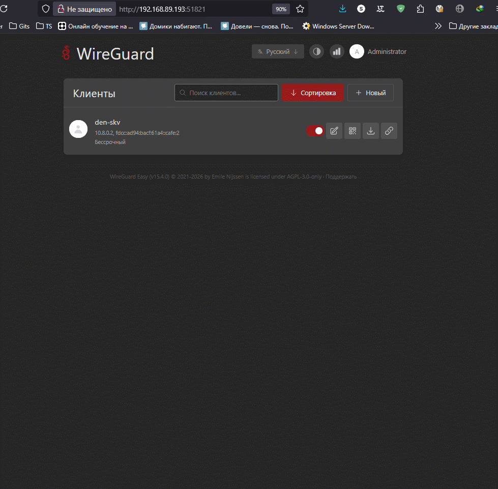
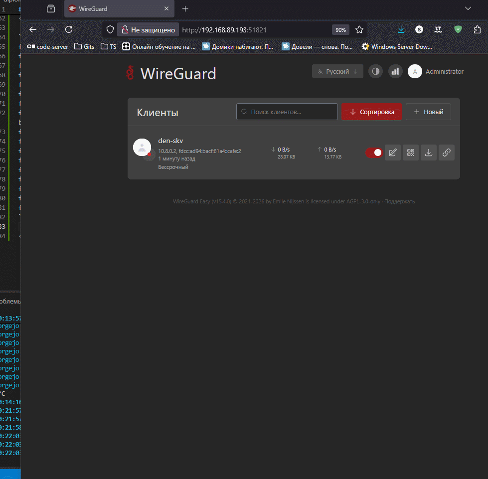
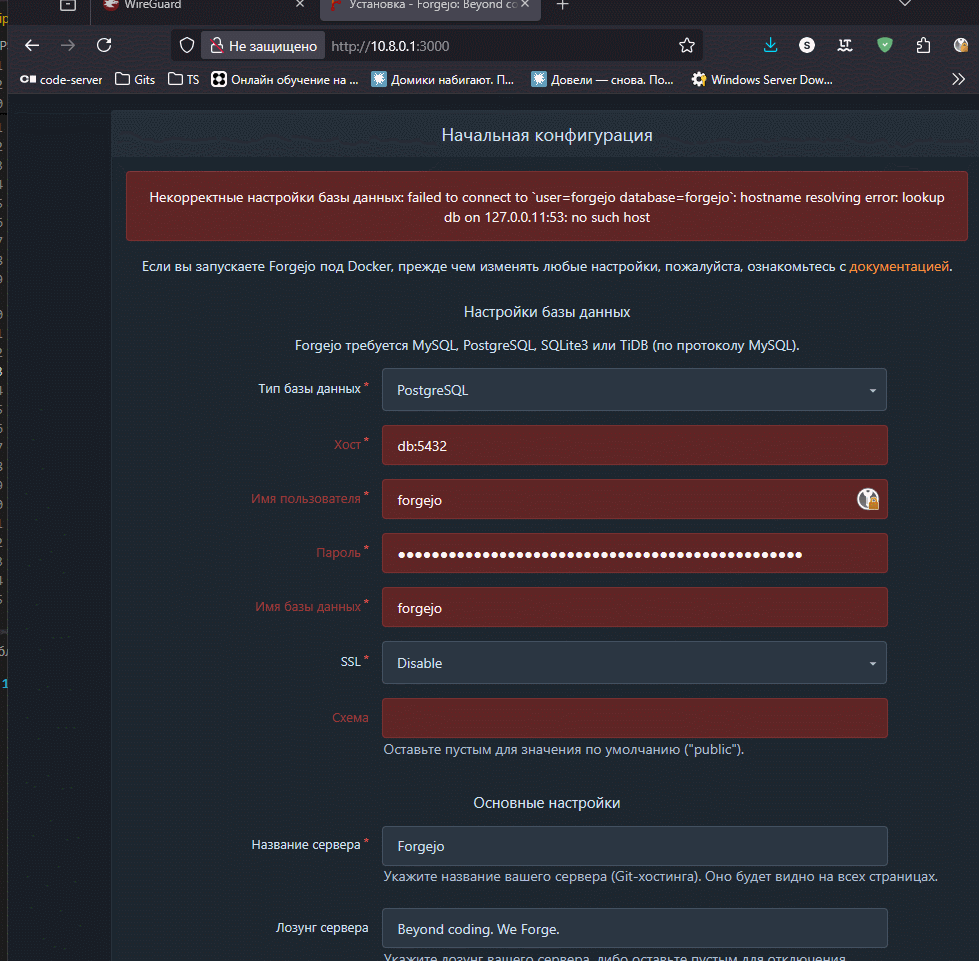
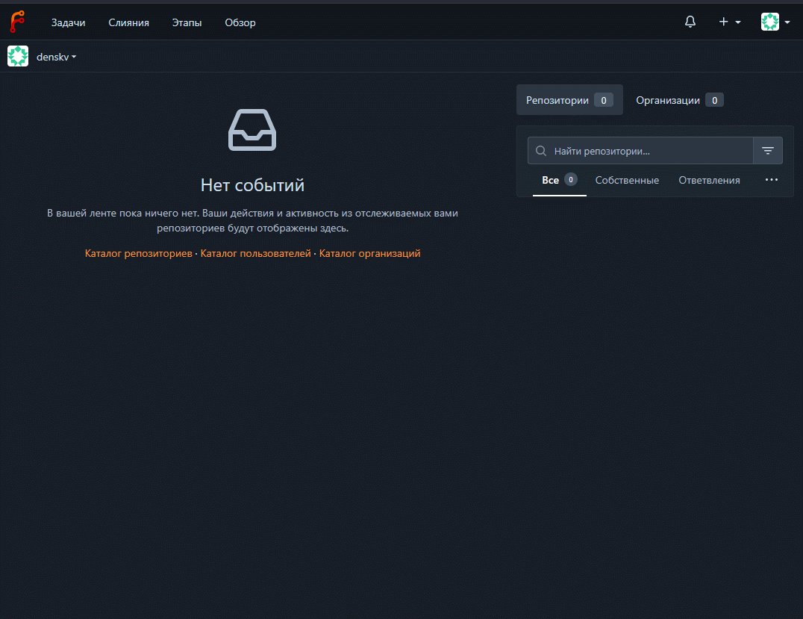
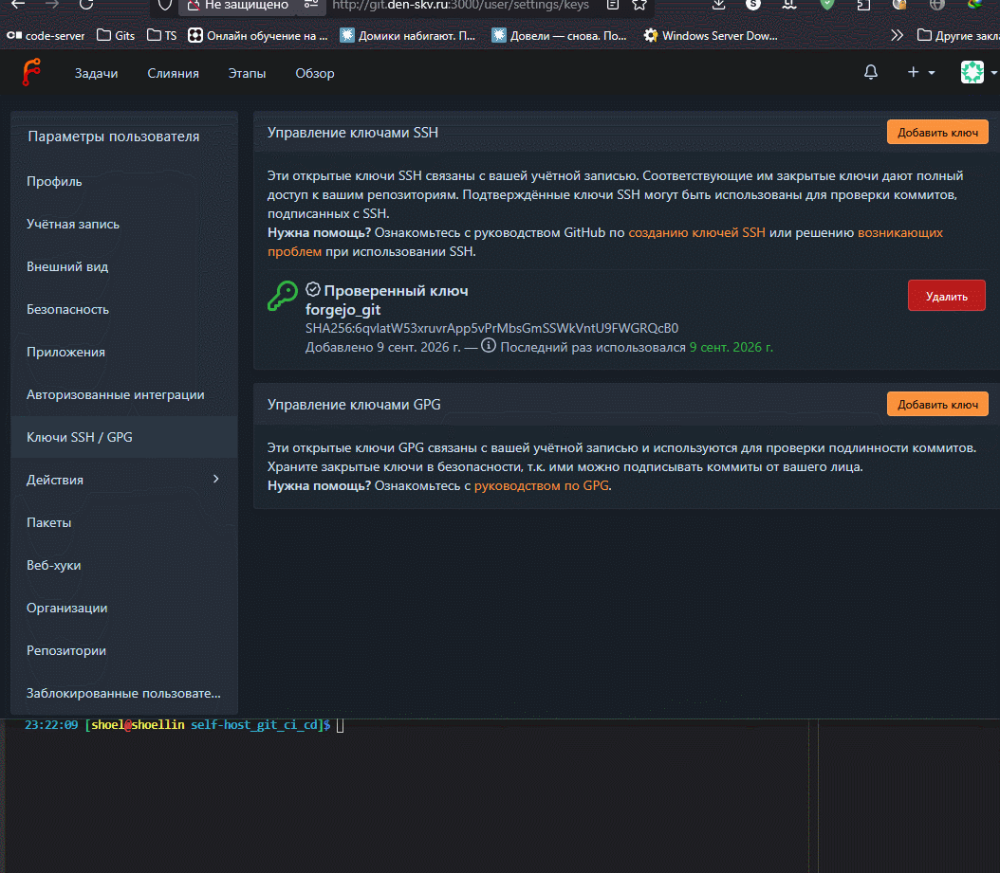
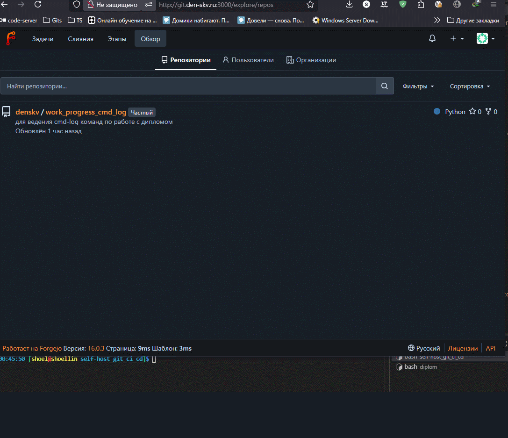
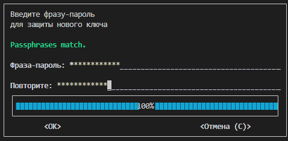
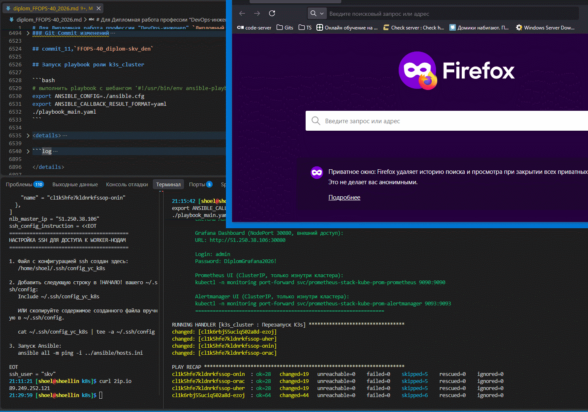

# Для Дипломная работа профессии "DevOps-инженер" `Дипломный практикум в Yandex.Cloud`

## commit_91, master Предварительная подготовка

```bash
# Переключение на мастер-ветку на случай работы в соседней ветке репозитория
git checkout master
```

<details>
<summary>
переход на master
</summary>

```log
Уже на «master»
```

</details>

```bash
# Просмотр имеющихся веток
git branch -v

# Клонирование репозитория
git clone \
https://github.com/netology-code/devops-diplom-yandexcloud.git


# Удаление всех файлов и каталогов кроме нужных
find devops-diplom-yandexcloud/ \
-mindepth 1 \
-not -path "*README.md*" \
-delete

# Перемещение нужного каталога в корневую директорию с новым именем
mv -v devops-diplom-yandexcloud \
FFOPS-40_diplom-skv_den

# Переход в каталог по последней переменной вывода последней команды
cd !$
```

```bash
# Просмотр текущих удаленных репозиториев
git remote -v

# Проверка текущего локального состояния репозитория
git status

git rm -r --cached \
../

git remote -v

# Добавляем ключи агенту ssh от репозитория gitflic и github
eval $(ssh-agent) \
&& ssh-add ~/.ssh/id_gitflic_2026_ed25519 \
&& ssh-add ~/.ssh/id_github_2026_ed25519 \
&& ssh-agent -c

# Просмотр различий в рабочей директории и индексов
git diff \
&& git diff --staged

# Добавление всех изменений из текущей и вывод текущего состояния репозитория
git add . .. \
&& git status

git diff \
&& git diff --staged

# Просмотр истории коммитов в кратком формате
git log --oneline

# Создание коммита со всеми изменениями и отправка в удаленный репозиторий
git commit -am 'commit_91, master' \
&& git push \
--set-upstream \
study_fops39 \
master \
&& git push \
--set-upstream \
study_fops39_gitflic_ru \
master \
&& git push \
--set-upstream \
study-fops39_sc \
master
```

## commit_1, `FFOPS-40_diplom-skv_den`

```bash
# Просмотр истории коммитов в кратком формате
git log --oneline

# Переключение\формирование новой ветки git
git checkout -b FFOPS-40_diplom-skv_den

# Вывод всех веток
git branch -v

# Вывод списка удаленных репозиториев
git remote -v

# вывод текущего состояния репозитория
git status

# Просмотр истории коммитов в кратком формате
git log --oneline

# Добавляем ключи агенту ssh от репозитория gitflic и github
eval $(ssh-agent) \
&& ssh-add ~/.ssh/id_gitflic_2026_ed25519 \
&& ssh-add ~/.ssh/id_github_2026_ed25519 \
&& ssh-agent -c

# Просмотр различий в рабочей директории и индексов
git diff \
&& git diff --staged

git rm -r --cached \
./ ../

# Добавление всех изменений из текущей и вывод текущего состояния репозитория
git add . .. \
&& git status

# Создание коммита со всеми изменениями и отправка в удаленный репозиторий на новую ветку
git commit -am 'commit1, FFOPS-40_diplom-skv_den' \
; git push \
--set-upstream \
study_fops39 \
FFOPS-40_diplom-skv_den \
&& git push \
--set-upstream \
study_fops39_gitflic_ru \
FFOPS-40_diplom-skv_den \
&& git push \
--set-upstream \
study-fops39_sc \
FFOPS-40_diplom-skv_den
```

## commit_2,`FFOPS-40_diplom-skv_den`

### Подготовка к работе self-hosted git сервера за VPN

```bash
mkdir -p self-host_git_ci_cd
cd self-host_git_ci_cd
```

```bash
# sysctl форвардинг
sudo tee /etc/sysctl.d/99-ipforward.conf << 'EOF'
net.ipv4.ip_forward=1
net.ipv4.conf.all.src_valid_mark=1
EOF
sudo sysctl --system
```

<details>
<summary>
вывод sysctl
</summary>

```log
[sudo] пароль для shoel: 
net.ipv4.ip_forward=1
net.ipv4.conf.all.src_valid_mark=1

* Applying /usr/lib/sysctl.d/10-arch.conf ...
* Applying /etc/sysctl.d/40-hugepage.conf ...
* Applying /usr/lib/sysctl.d/50-coredump.conf ...
* Applying /usr/lib/sysctl.d/50-default.conf ...
* Applying /usr/lib/sysctl.d/50-pid-max.conf ...
* Applying /usr/lib/sysctl.d/60-libvirtd.conf ...
* Applying /etc/sysctl.d/99-ipforward.conf ...
* Applying /etc/sysctl.d/99-kubelet-lxc.conf ...
fs.inotify.max_user_instances = 1024
fs.inotify.max_user_watches = 524288
vm.max_map_count = 1048576
net.ipv4.tcp_keepalive_time = 120
vm.nr_hugepages = 550
kernel.core_pattern = |/usr/lib/systemd/systemd-coredump %P %u %g %s %t %c %h %d %F %I
kernel.core_pipe_limit = 16
fs.suid_dumpable = 2
kernel.sysrq = 16
kernel.core_uses_pid = 1
net.ipv4.conf.default.rp_filter = 2
net.ipv4.conf.br0.rp_filter = 2
net.ipv4.conf.eno1.rp_filter = 2
net.ipv4.conf.lo.rp_filter = 2
net.ipv4.conf.wlo1.rp_filter = 2
net.ipv4.conf.default.accept_source_route = 0
net.ipv4.conf.br0.accept_source_route = 0
net.ipv4.conf.eno1.accept_source_route = 0
net.ipv4.conf.lo.accept_source_route = 0
net.ipv4.conf.wlo1.accept_source_route = 0
net.ipv4.conf.default.promote_secondaries = 1
net.ipv4.conf.br0.promote_secondaries = 1
net.ipv4.conf.eno1.promote_secondaries = 1
net.ipv4.conf.lo.promote_secondaries = 1
net.ipv4.conf.wlo1.promote_secondaries = 1
net.ipv4.ping_group_range = 0 2147483647
net.core.default_qdisc = fq_codel
fs.protected_hardlinks = 1
fs.protected_symlinks = 1
fs.protected_regular = 1
fs.protected_fifos = 1
kernel.pid_max = 4194304
fs.aio-max-nr = 1048576
net.ipv4.ip_forward = 1
net.ipv4.conf.all.src_valid_mark = 1
vm.overcommit_memory = 1
kernel.panic = 10
kernel.panic_on_oops = 1
kernel.keys.root_maxkeys = 1000000
kernel.keys.root_maxbytes = 25000000
```

</details>

#### WireGuard in docker

```yaml
# docker-compose.yml
cat > docker-compose.yml << 'EOF'
services:
    wg-easy:
        image: ghcr.io/wg-easy/wg-easy:15.4
        container_name: wg-easy
        network_mode: host
        environment:
            - INSECURE=true
            - DISABLE_IPV6=true
        volumes:
            - etc_wireguard:/etc/wireguard
            - /lib/modules:/lib/modules:ro
        cap_add:
            - NET_ADMIN
            - SYS_MODULE
        devices:
            - /dev/net/tun:/dev/net/tun
        restart: unless-stopped
        healthcheck: 
            # Ждём, пока wg0 получит адрес 10.8.0.1
            test: ["CMD-SHELL", "ip -4 addr show wg0 | grep -q '10.8.0.1'"]
            interval: 10s
            timeout: 3s
            retries: 15
            start_period: 30s

volumes:
    etc_wireguard:
EOF
```

```bash
# start docker
sudo bash -c \
"systemctl start docker \
&& systemctl is-active docker"

docker compose up -d
```

<details>
<summary>
вывод docker
</summary>

```log
WARN[0000] /home/shoel/nfs_git/gited/FFOPS-40_diplom-skv_den/self-host_git_ci_cd/docker-compose.yml: the attribute `version` is obsolete, it will be ignored, please remove it to avoid potential confusion 
[+] up 22/22
 ✔ Image ghcr.io/wg-easy/wg-easy:15.4       Pulled                                                                                                                                                       208.2s
 ✔ Volume self-host_git_ci_cd_etc_wireguard Created                                                                                                                                                      0.0s
 ✔ Container wg-easy                        Created 
```

</details>

```bash
ip -br a show br0
```

<details>
<summary>
вывод ip
</summary>

```log
br0   UP   192.168.89.193/24 metric 1024 fe80::f832:c0ff:fe95:76f/64 
```

</details>

#### Установка локального DNS на Coredns

```bash
# Поиск в Пользовательских репозиториях Archlinux
yay -Ss coredns
```

<details>
<summary>
Поиск пакета coredns в archlinux AUR
</summary>

```log
aur/dotcoredns 1-1 (+0 0.00) [3392d] 
    Tools for running CoreDNS as a regular user
aur/coredns-fanout 1.9.0-1 (+0 0.00) [1670d20h] (сирота в AUR) 
    A DNS server that chains plugins - with module fanout
aur/coredns-openrc 20230319-1 (+0 0.00) [1269d7h] (сирота в AUR) 
    A DNS server that chains plugins - OpenRC init script
aur/coredns-wgsd-git 1.11.1-2 (+1 0.00) [940d3h] 
    A DNS server that chains plugins - with module wgsd
aur/coredns-git 1.12.0.r3.g177253340-1 (+0 0.00) [625d23h] 
    A DNS server that chains plugins
aur/coredns-s6 20220507-1 (+0 0.00) [1585d6h] 
    s6-rc service scripts for coredns
aur/coredns-bin 1.14.7-1 (+7 0.00) [20d17h] 
    A DNS server that chains plugins
aur/coredns 1.14.3-3 (+6 0.00) [137d21h] 
    A DNS server that chains plugins
```

</details>

```bash
# Установка Coredns и обновление системы 
yay -Syu coredns-bin

# Проверка установленной службы
sudo systemctl status coredns

# Проверка установленного Coredns
coredns --version
```

<details>
<summary>
вывод systemctl status coredns
</summary>

```log
○ coredns.service - CoreDNS DNS server
     Loaded: loaded (/usr/lib/systemd/system/coredns.service; disabled; preset: dis>
     Active: inactive (dead)
       Docs: https://coredns.io

CoreDNS-1.14.7
linux/amd64, go1.26.6, 427fc80
```

</details>

```bash
# Создание зоны в локальном DNS den-skv.ru и записей прямого просмотра
sudo tee /etc/coredns/db.den-skv.ru << 'EOF'
; $ORIGIN задает суффикс по умолчанию для неполных имен в этом файле
$ORIGIN den-skv.ru.
; SOA (Start of Authority) обязательная запись для любой DNS-зоны
; Формат: primary-ns admin-email (serial refresh retry expire minimum-ttl)
; admin-email: точка вместо @, т. е. admin.den-skv.ru = admin@den-skv.ru
@   IN SOA ns.den-skv.ru. admin.den-skv.ru. (
        2025010101  ; serial — увеличивайте при каждом изменении зоны
        3600        ; refresh — как часто secondary DNS проверяет обновления (нам неважно)
        600         ; retry — интервал повтора при неудаче
        86400       ; expire — через сколько secondary перестает отдавать зону
        60          ; minimum TTL — время жизни negative-кеша
    )
; NS указывает authoritative nameserver для зоны
@   IN NS  ns.den-skv.ru.
; A-записи: имя = IPv4-адрес внутри VPN
; Все сервисы живут на одном VPS, поэтому все указывают на 10.8.0.1
ns      IN A 10.8.0.1
git     IN A 10.8.0.1
EOF
```

```bash
# Настройка и Привязка DNS сервера к VPN сети, созданной зоне и перенаправление запросов на внешний DNS
sudo tee ./etc/coredns/Corefile << 'EOF'
. {
    bind 10.8.0.1                      # слушаем только на WireGuard-интерфейсе
    file /etc/coredns/db.den-skv.ru den-skv.ru
    forward . 192.168.89.1         # upstream для остальных имен через местный DNS-сервер
    cache 30
    errors
}
EOF
```

```bash
# Вывод полученных файлов
sudo tree /etc/coredns/

# Проверка наличия поднятого туннеля на WG
ip -br a show wg0

# Проверка работы основного интерфейса хоста
ip -br a show br0

# Проверка запущенного VPN службы на докере
docker ps -a
```

<details>
<summary>
Связка WireGuard VPN и CoreDNS
</summary>

```log
/etc/coredns/
├── Corefile
└── db.den-skv.ru

1 directory, 2 files
wg0              UNKNOWN        10.8.0.1/24 
br0              UP             192.168.89.193/24 metric 1024 fe80::f832:c0ff:fe95:76f/64 
CONTAINER ID   IMAGE                          COMMAND                  CREATED          STATUS                    PORTS     NAMES
0fddff54c316   ghcr.io/wg-easy/wg-easy:15.4   "docker-entrypoint.s…"   47 minutes ago   Up 47 minutes (healthy)             wg-eas
```

</details>

```bash
# Drop-in редактирование systemd-службы coredns с изменением требований запуска и перезапуска
sudo systemctl edit coredns
```

```
### Editing /etc/systemd/system/coredns.service.d/override.conf
### Anything between here and the comment below will become the contents of the drop-in file

[Unit]
After=network.target
After=docker.service

[Service]
Restart=
Restart=on-failure
RestartSec=5

### Edits below this comment will be discarded
...
```

```bash 
# Проверка наличия Drop-in изменений в  systemd-службе coredns
sudo systemctl cat coredns

# Обновление информации об измененной службе
sudo systemctl daemon-reload

# Пробный запуск службы
sudo systemctl restart coredns

# Проверка статуса coredns
sudo systemctl status coredns

# Установка в автозагрузку
sudo systemctl enable coredns
```

<details>
<summary>
CoreDNS systemd unit file
</summary>

```log
# /usr/lib/systemd/system/coredns.service
[Unit]
Description=CoreDNS DNS server
Documentation=https://coredns.io
After=network.target

[Service]
PermissionsStartOnly=true
LimitNOFILE=1048576
LimitNPROC=512
CapabilityBoundingSet=CAP_NET_BIND_SERVICE
AmbientCapabilities=CAP_NET_BIND_SERVICE
NoNewPrivileges=true
User=coredns
ExecStart=/usr/bin/coredns -conf=/etc/coredns/Corefile
ExecReload=/bin/kill -SIGUSR1 $MAINPID
Restart=on-failure

[Install]
WantedBy=multi-user.target

# /etc/systemd/system/coredns.service.d/override.conf
[Unit]
After=network.target
After=docker.service

[Service]
Restart=
Restart=on-failure
RestartSec=5
● coredns.service - CoreDNS DNS server
     Loaded: loaded (/usr/lib/systemd/system/coredns.service; disabled; preset: disabled)
    Drop-In: /etc/systemd/system/coredns.service.d
             └─override.conf
     Active: active (running) since Tue 2026-09-08 23:16:49 MSK; 26ms ago
 Invocation: 9f8aa1b41e46498aaf1bb6d88b9f71cc
       Docs: https://coredns.io
   Main PID: 107165 (coredns)
      Tasks: 1 (limit: 18205)
     Memory: 1.4M (peak: 2.3M)
        CPU: 8ms
     CGroup: /system.slice/coredns.service
             └─107165 /usr/bin/coredns -conf=/etc/coredns/Corefile

сен 08 23:16:49 shoellin systemd[1]: Started CoreDNS DNS server.

Created symlink '/etc/systemd/system/multi-user.target.wants/coredns.service' → '/usr/lib/systemd/system/coredns.service'.
```

</details>

#### Проверка работы coredns на хостовой машине

```bash
# Проверка резолвинага по dns A записи
host git.den-skv.ru 10.8.0.1

# Проверка работы forwarding запросов на внешние DNS
host ya.ru 10.8.0.1
```

<details>
<summary>
Проверка работы CoreDNS
</summary>

```log
Using domain server:
Name: 10.8.0.1
Address: 10.8.0.1#53
Aliases: 

git.den-skv.ru has address 10.8.0.1

Using domain server:
Name: 10.8.0.1
Address: 10.8.0.1#53
Aliases: 

ya.ru has address 77.88.44.242
ya.ru has address 5.255.255.242
ya.ru has address 77.88.55.242
ya.ru has IPv6 address 2a02:6b8::2:242
ya.ru mail is handled by 10 mx.yandex.ru.
```

</details>

### Git Commit изменений

```bash
# Добавление всех изменений из текущей и вывод текущего состояния репозитория
git add . .. ../.. \
&& git status

# Создание коммита со всеми изменениями и отправка в удаленный репозиторий на новую ветку
git commit -am 'commit2, FFOPS-40_diplom-skv_den' \
; git push \
--set-upstream \
study_fops39 \
FFOPS-40_diplom-skv_den \
&& git push \
--set-upstream \
study_fops39_gitflic_ru \
FFOPS-40_diplom-skv_den \
&& git push \
--set-upstream \
study-fops39_sc \
FFOPS-40_diplom-skv_den
```

## commit_3,`FFOPS-40_diplom-skv_den`

### NFS файловое хранилище

```bash
# вывод рабочего интерфейса сети Сервера
ip -br a show bond0

# Проверка настроек экспорта FS nfs
sudo exportfs -vra

# конфиг настроек экспорта
sudo cat /etc/exports
```

<details>
<summary>
Вывод настроек NFS экспорта с сервера
</summary>

```log
bond0  UP  192.168.89.246/24

exporting 192.168.89.0/24:/volume1/iso
exporting 192.168.89.0/24:/volume1/git

/volume1/git    192.168.89.0/24(rw,async,no_wdelay,crossmnt,all_squash,insecure_locks,sec=sys,anonuid=1024,anongid=100)
/volume1/iso    192.168.89.0/24(rw,async,no_wdelay,crossmnt,all_squash,insecure_locks,sec=sys,anonuid=1024,anongid=100)
```

</details>

### Сервер forgejo

```bash
pwd

showmount -e 192.168.89.246

cat /etc/fstab | grep git

ls -ld

mkdir -pv ./postgres-data

mkdir -pv ~/forgejo-data
```

<details>
<summary>
Подготовка каталогов для работы forgejo и PG БД
</summary>

```log
/home/shoel/nfs_git/gited/FFOPS-40_diplom-skv_den/self-host_git_ci_cd

Export list for 192.168.89.246:
/volume1/iso 192.168.89.0/24
/volume1/git 192.168.89.0/24

192.168.89.246:/volume1/git /home/shoel/nfs_git nfs rw,soft,intr,noatime,nodev,nosuid 0 0

drwxrwxrwx 1 1024 100 152 сен  8 23:46 .

mkdir: создан каталог './postgres-data'
mkdir: создан каталог '/home/shoel/forgejo-data'
```

</details>

```yaml
# docker-compose-forgejo.yml
cat > docker-compose-forgejo.yml << 'EOF'
include:
  - docker-compose.yml
services:
  server:
    image: data.forgejo.org/forgejo/forgejo:16.0.3
    container_name: forgejo
    restart: always
    depends_on:
      wg-easy:
        condition: service_healthy
      db:
        condition: service_healthy
    networks:
      - forgejo
    environment:
      - USER_UID=1000
      - USER_GID=1000
      - FORGEJO__database__DB_TYPE=postgres
      - FORGEJO__database__HOST=db:5432
      - FORGEJO__database__NAME=forgejo
      - FORGEJO__database__USER=forgejo
      - FORGEJO__database__PASSWD=${DB_PASSWORD}
      - FORGEJO__server__ROOT_URL=http://git.den-skv.ru/
      - FORGEJO__server__SSH_DOMAIN=git.den-skv.ru
      - FORGEJO__server__SSH_PORT=6722
      - FORGEJO__actions__ENABLED=true
    volumes:
      - ~/forgejo-data:/data
      - /etc/timezone:/etc/timezone:ro
      - /etc/localtime:/etc/localtime:ro
    ports:
      - "10.8.0.1:3000:3000"   # внутренний HTTP;
      - "10.8.0.1:6722:22"      # git over ssh, только через VPN

  db:
    image: postgres:18-alpine
    container_name: forgejo-db
    user: "1024:100"
    restart: unless-stopped
    depends_on:
      wg-easy:
        condition: service_healthy
    networks:
      - forgejo
    environment:
      - POSTGRES_USER=forgejo
      - POSTGRES_PASSWORD=${DB_PASSWORD}
      - POSTGRES_DB=forgejo
      - PGDATA=/var/lib/postgresql/data/pgdata
    volumes:
      - ./postgres-data:/var/lib/postgresql
    healthcheck:
      test: ["CMD-SHELL", "pg_isready -U forgejo"]
      interval: 15s
      timeout: 3s
      retries: 3
      start_period: 40s

networks:
  forgejo:
EOF
```

```bash
# Генерация пароля для базы данных
echo "DB_PASSWORD=$(openssl rand -hex 24)" \
> .env
```

```bash
docker-compose -f docker-compose-forgejo.yml up -d
```

<details>
<summary>
Docker forgejo с postgres 18
</summary>

```log
[+] up 20/20
 ⠏ Image data.forgejo.org/forgejo/forgejo:16.0.3 [⣿⣿⣿⣿⣿⣄⣿⣿⣿] 54.81MB / 82.05MB Pulling                                                      [+] up 18/20
 ⠋ Image data.forgejo.org/forgejo/forgejo:16.0.3 [⣿⣿⣿⣿⣿⣄⣿⣿⣿] 54.81MB / 82.05MB Pulling                              [+] up 18/20             148.1s
 ⠙ Image data.forgejo.org/forgejo/forgejo:16.0.3 [⣿⣿⣿⣿⣿⣄⣿⣿⣿] 54.81MB / 82.05MB Pulling                     [+] up 18/20 148.2s               107.7s
 ⠹ Image data.forgejo.org/forgejo/forgejo:16.0.3 [⣿⣿⣿⣿⣿⣄⣿⣿⣿] 54.81MB / 82.05MB Pulling                148.[+] up 18/20  107.7s
 ⠇ Image data.forgejo.org/forgejo/forgejo:16.0.3 [⣿⣿⣿⣿⣿⣿⣿⣿⣿] 82.05MB / 82.05MB Pulling              317.9s
[+] up 22/23tgres:18-alpine                                                    Pulled               107.7s
 ✔ Image data.forgejo.org/forgejo/forgejo:16.0.3 Pulled                                             317.9s
 ✔ Image postgres:18-alpine                      Pulled                                             107.7s
 ✔ Network self-host_git_ci_cd_forgejo           Created                                              0.0s
 ⠹ Container forgejo-db                          Starting                                             0.2s
 ✔ Container forgejo                             Created                                              0.0s
 ✔ Container forgejo-db                          Started                                              0.2s
 ✔ Container forgejo                             Started                                              0.2s
```

</details>

```bash
# Проверка готовности git-сервера forgejo
docker-compose -f docker-compose-forgejo.yml logs -f server
```

<details>
<summary>
готовность git-сервера forgejo
</summary>

```log
forgejo  | Generating /data/ssh/ssh_host_ed25519_key...
forgejo  | Generating /data/ssh/ssh_host_rsa_key...
forgejo  | 2026/09/09 00:01:03 ...nvironment-to-ini.go:104:runEnvironmentToIni() [I] Settings saved to: "/data/gitea/conf/app.ini"
forgejo  | Generating /data/ssh/ssh_host_ecdsa_key...
forgejo  | Server listening on :: port 22.
forgejo  | Server listening on 0.0.0.0 port 22.
forgejo  | 2026/09/09 00:01:03 cmd/web.go:250:runWeb() [I] Starting Forgejo on PID: 16
forgejo  | 2026/09/09 00:01:03 cmd/web.go:114:showWebStartupMessage() [I] Forgejo version: 16.0.3+gitea-1.22.0 built with GNU Make 4.4.1, go1.26.7 : bindata, timetzdata, sqlite, sqlite_unlock_notify
forgejo  | 2026/09/09 00:01:03 cmd/web.go:115:showWebStartupMessage() [I] * RunMode: prod
forgejo  | 2026/09/09 00:01:03 cmd/web.go:116:showWebStartupMessage() [I] * AppPath: /usr/local/bin/gitea
forgejo  | 2026/09/09 00:01:03 cmd/web.go:117:showWebStartupMessage() [I] * WorkPath: /data/gitea
forgejo  | 2026/09/09 00:01:03 cmd/web.go:118:showWebStartupMessage() [I] * CustomPath: /data/gitea
forgejo  | 2026/09/09 00:01:03 cmd/web.go:119:showWebStartupMessage() [I] * ConfigFile: /data/gitea/conf/app.ini
forgejo  | 2026/09/09 00:01:03 cmd/web.go:120:showWebStartupMessage() [I] Prepare to run install page
forgejo  | 2026/09/09 00:01:04 cmd/web.go:315:listen() [I] Listen: http://0.0.0.0:3000
forgejo  | 2026/09/09 00:01:04 cmd/web.go:319:listen() [I] AppURL(ROOT_URL): http://git.den-skv.ru/
forgejo  | 2026/09/09 00:01:04 ...s/graceful/server.go:50:NewServer() [I] Starting new Web server: tcp:0.0.0.0:3000 on PID: 16
```

</details>

```bash
# Проверка готовности базы данных
docker-compose -f docker-compose-forgejo.yml logs -f db
```

<details>
<summary>
готовность базы данных
</summary>

```log
forgejo-db  | chmod: /var/run/postgresql: Operation not permitted
forgejo-db  | The files belonging to this database system will be owned by user "postgres".
forgejo-db  | This user must also own the server process.
forgejo-db  | 
forgejo-db  | The database cluster will be initialized with locale "en_US.utf8".
forgejo-db  | The default database encoding has accordingly been set to "UTF8".
forgejo-db  | The default text search configuration will be set to "english".
forgejo-db  | 
forgejo-db  | Data page checksums are enabled.
forgejo-db  | 
forgejo-db  | fixing permissions on existing directory /var/lib/postgresql/data/pgdata ... ok
forgejo-db  | creating subdirectories ... ok
forgejo-db  | selecting dynamic shared memory implementation ... posix
forgejo-db  | selecting default "max_connections" ... 100
forgejo-db  | selecting default "shared_buffers" ... 128MB
forgejo-db  | selecting default time zone ... UTC
forgejo-db  | creating configuration files ... ok
forgejo-db  | running bootstrap script ... ok
forgejo-db  | sh: locale: not found
forgejo-db  | 2026-09-09 17:24:44.403 UTC [25] WARNING:  no usable system locales were found
forgejo-db  | performing post-bootstrap initialization ... ok
forgejo-db  | syncing data to disk ... ok
forgejo-db  | 
forgejo-db  | 
forgejo-db  | Success. You can now start the database server using:
forgejo-db  | 
forgejo-db  |     pg_ctl -D /var/lib/postgresql/data/pgdata -l logfile start
forgejo-db  | 
forgejo-db  | initdb: warning: enabling "trust" authentication for local connections
forgejo-db  | initdb: hint: You can change this by editing pg_hba.conf or using the option -A, or --auth-local and --auth-host, the next time you run initdb.
forgejo-db  | waiting for server to start....2026-09-09 17:24:47.364 UTC [32] LOG:  starting PostgreSQL 18.6 on x86_64-pc-linux-musl, compiled by gcc (Alpine 15.2.0) 15.2.0, 64-bit
forgejo-db  | 2026-09-09 17:24:47.367 UTC [32] LOG:  listening on Unix socket "/var/run/postgresql/.s.PGSQL.5432"
forgejo-db  | 2026-09-09 17:24:47.377 UTC [38] LOG:  database system was shut down at 2026-09-09 17:24:46 UTC
forgejo-db  | 2026-09-09 17:24:47.387 UTC [32] LOG:  database system is ready to accept connections
forgejo-db  |  done
forgejo-db  | server started
forgejo-db  | 2026-09-09 17:24:47.565 UTC [53] FATAL:  database "forgejo" does not exist
forgejo-db  | CREATE DATABASE
forgejo-db  | 
forgejo-db  | 
forgejo-db  | /usr/local/bin/docker-entrypoint.sh: ignoring /docker-entrypoint-initdb.d/*
forgejo-db  | 
forgejo-db  | waiting for server to shut down....2026-09-09 17:24:48.096 UTC [32] LOG:  received fast shutdown request
forgejo-db  | 2026-09-09 17:24:48.097 UTC [32] LOG:  aborting any active transactions
forgejo-db  | 2026-09-09 17:24:48.099 UTC [32] LOG:  background worker "logical replication launcher" (PID 41) exited with exit code 1
forgejo-db  | 2026-09-09 17:24:48.100 UTC [36] LOG:  shutting down
forgejo-db  | 2026-09-09 17:24:48.100 UTC [36] LOG:  checkpoint starting: shutdown immediate
forgejo-db  | 2026-09-09 17:24:48.256 UTC [36] LOG:  checkpoint complete: wrote 943 buffers (5.8%), wrote 3 SLRU buffers; 0 WAL file(s) added, 0 removed, 0 recycled; write=0.131 s, sync=0.020 s, total=0.156 s; sync files=303, longest=0.001 s, average=0.001 s; distance=4362 kB, estimate=4362 kB; lsn=0/1BA8858, redo lsn=0/1BA8858
forgejo-db  | 2026-09-09 17:24:48.346 UTC [32] LOG:  database system is shut down
forgejo-db  |  done
forgejo-db  | server stopped
forgejo-db  | 
forgejo-db  | PostgreSQL init process complete; ready for start up.
forgejo-db  | 
forgejo-db  | 2026-09-09 17:24:48.432 UTC [1] LOG:  starting PostgreSQL 18.6 on x86_64-pc-linux-musl, compiled by gcc (Alpine 15.2.0) 15.2.0, 64-bit
forgejo-db  | 2026-09-09 17:24:48.432 UTC [1] LOG:  listening on IPv4 address "0.0.0.0", port 5432
forgejo-db  | 2026-09-09 17:24:48.432 UTC [1] LOG:  listening on IPv6 address "::", port 5432
forgejo-db  | 2026-09-09 17:24:48.441 UTC [1] LOG:  listening on Unix socket "/var/run/postgresql/.s.PGSQL.5432"
forgejo-db  | 2026-09-09 17:24:48.456 UTC [61] LOG:  database system was shut down at 2026-09-09 17:24:48 UTC
forgejo-db  | 2026-09-09 17:24:48.466 UTC [1] LOG:  database system is ready to accept connections
```

</details>









### Git Commit изменений

```bash
git rm -r --cached \
./ ../

# Добавление всех изменений из текущей и вывод текущего состояния репозитория
git add . .. ../.. \
&& git status

# Создание коммита со всеми изменениями и отправка в удаленный репозиторий на новую ветку
git commit -am 'commit3, FFOPS-40_diplom-skv_den' \
; git push \
--set-upstream \
study_fops39 \
FFOPS-40_diplom-skv_den \
&& git push \
--set-upstream \
study_fops39_gitflic_ru \
FFOPS-40_diplom-skv_den \
&& git push \
--set-upstream \
study-fops39_sc \
FFOPS-40_diplom-skv_den \
&& git push \
--set-upstream \
ffops40-diplom \
FFOPS-40_diplom-skv_den
```

## commit_4,`FFOPS-40_diplom-skv_den`

### Проверка работоспособности git сервера

```bash
# Генерация ssh-ключа для git сервера
ssh-keygen \
-f ~/.ssh/id_forgejo_git_ed25519 \
-t ed25519 \
-C "forgejo_git"

eval $(ssh-agent -s)
ssh-add ~/.ssh/id_forgejo_git_ed25519
```

<details>
<summary>
Вывод генерации ключа
</summary>

```log
Generating public/private ed25519 key pair.
Enter passphrase for "/home/shoel/.ssh/id_forgejo_git_ed25519" (empty for no passphrase): 
Enter same passphrase again: 
Your identification has been saved in /home/shoel/.ssh/id_forgejo_git_ed25519
Your public key has been saved in /home/shoel/.ssh/id_forgejo_git_ed25519.pub
The key fingerprint is:
SHA256:6qvlatW53xruvrApp5vPrMbsGmSSWkVntU9FWGRQcB0 forgejo_git
The key's randomart image is:
+--[ED25519 256]--+
|               . |
|                 |
|                 |
|   o             |
|          .      |
| o +             |
|.                |
|                 |
|                 |
+----[SHA256]-----+
```

</details>



```bash
git remote -v

git remote add ffops40-diplom ssh://git@git.den-skv.ru:6722/denskv/work_progress_cmd_log.git

git remote -v

git add . .. ../.. \
&& git status

git commit -am 'commit3_test, FFOPS-40_diplom-skv_den' \
; git push \
--set-upstream \
ffops40-diplom \
FFOPS-40_diplom-skv_den
```



### Git Commit изменений

```bash
git rm -r --cached \
./ ../

# Добавление всех изменений из текущей и вывод текущего состояния репозитория
git add . .. ../.. \
&& git status

# Создание коммита со всеми изменениями и отправка в удаленный репозиторий на новую ветку
git commit -am 'commit4, FFOPS-40_diplom-skv_den' \
; git push \
--set-upstream \
study_fops39 \
FFOPS-40_diplom-skv_den \
&& git push \
--set-upstream \
study_fops39_gitflic_ru \
FFOPS-40_diplom-skv_den \
&& git push \
--set-upstream \
study-fops39_sc \
FFOPS-40_diplom-skv_den \
&& git push \
--set-upstream \
ffops40-diplom \
FFOPS-40_diplom-skv_den
```

## commit_5,`FFOPS-40_diplom-skv_den`

### Развертывание FORGEJO runner

```bash
# каталог для данных runner
mkdir -pv ~/data-runner/.cache

# Генерируем файл конфигурации раннера
docker run --rm data.forgejo.org/forgejo/runner:13 \
forgejo-runner generate-config > ~/data-runner/runner-config.yml

# смена прав на неппривилигированного пользователя контейнера с UID/GUID 1001 
sudo chown -Rv 1001:1001 /home/shoel/data-runner

sudo chmod -v 775 /home/shoel/data-runner/.cache

sudo chmod -v g+s /home/shoel/data-runner/.cache
```

<details>
<summary>
каталог для runner
</summary>

```log
mkdir: создан каталог '/home/shoel/data-runner'

mkdir: создан каталог '/home/shoel/data-runner/.cache'

Unable to find image 'data.forgejo.org/forgejo/runner:13' locally
13: Pulling from forgejo/runner
55afa1ecc21d: Already exists 
13ef92308689: Pull complete 
35cc8c60d093: Pull complete 
6146ea618b55: Pull complete 
Digest: sha256:c4af85fd9f0dd03788676a534781a87c71aa2c6a37737143e017eb94d4312952
Status: Downloaded newer image for data.forgejo.org/forgejo/runner:13

изменён владелец '/home/shoel/data-runner/runner-config.yml' с shoel:shoel на 1001:1001

изменён владелец '/home/shoel/data-runner/.cache' с shoel:shoel на 1001:1001

изменён владелец '/home/shoel/data-runner' с shoel:shoel на 1001:1001

права доступа '/home/shoel/data-runner/.cache' изменены с 0755 (rwxr-xr-x) на 0775 (rwxrwxr-x)

права доступа '/home/shoel/data-runner/.cache' изменены с 0775 (rwxrwxr-x) на 2775 (rwxrwsr-x)
```

</details>

```yaml
cat > docker-compose-forgejo-runner.yml <<'EOF'
include:
  - docker-compose-forgejo.yml
services:
  docker-in-docker:
    image: docker:dind
    depends_on:
      server:
        condition: service_started
    container_name: 'docker_dind'
    privileged: 'true'
    command: ['dockerd', '-H', 'tcp://0.0.0.0:2375', '--tls=false']
    restart: 'unless-stopped'

  runner:
    image: 'data.forgejo.org/forgejo/runner:13'
    links:
      - docker-in-docker
    depends_on:
      docker-in-docker:
        condition: service_started
    container_name: 'runner'
    environment:
      DOCKER_HOST: tcp://docker-in-docker:2375
    user: 1001:1001
    volumes:
      - ~/data-runner:/data
    restart: 'unless-stopped'
    command: 'forgejo-runner daemon --config runner-config.yml'
EOF
```

```bash
# Создание настроек для подключения в роли runnera
sudo tee ~/data-runner/runner-config.yml <<'EOF'
runner:
  labels: ["docker:docker://ghcr.io/catthehacker/ubuntu:act-latest"]

server:
  connections:
    forgejo:
      url: http://10.8.0.1:3000/   # внутренний HTTP
      uuid: 308d588e-5379-4e69-8234-b85c0027d7a4
      token: c08ad111cf3b1801107aae9759d9af984bfe590c
EOF
```

```bash
docker-compose -f docker-compose-forgejo-runner.yml up -d
```

<details>
<summary>
Лог запуска runner
</summary>

```log
[+] up 23/23
 ✔ Image docker:dind                   Pulled    19.2s
 ✔ Container forgejo-db                Healthy   1.1s
 ✔ Container wg-easy                   Healthy   1.1s
 ✔ Container forgejo                   Running   0.0s
 ✔ Network self-host_git_ci_cd_default Created   0.0s
 ✔ Container docker_dind               Started   1.2s
 ✔ Container runner                    Started   1.3s
```

</details>



### Git Commit изменений

```bash
git rm -r --cached \
./ ../

# Добавление всех изменений из текущей и вывод текущего состояния репозитория
git add . .. ../.. \
&& git status

# Создание коммита со всеми изменениями и отправка в удаленный репозиторий на новую ветку
git commit -am 'commit5, FFOPS-40_diplom-skv_den' \
; git push \
--set-upstream \
study_fops39 \
FFOPS-40_diplom-skv_den \
&& git push \
--set-upstream \
study_fops39_gitflic_ru \
FFOPS-40_diplom-skv_den \
&& git push \
--set-upstream \
study-fops39_sc \
FFOPS-40_diplom-skv_den \
&& git push \
--set-upstream \
ffops40-diplom \
FFOPS-40_diplom-skv_den
```

## commit_6,`FFOPS-40_diplom-skv_den`

```bash
mkdir -p .forgejo/workflows
```

> Заменить `your-deployment-name`, `your-container-name`, `your-namespace` в workflow на новые значения

``` bash
cat > .forgejo/workflows/ci.yaml <<'EOF'
name: CI/CD Pipeline

on:
  push:
    branches:
      - '**'  # Любой коммит в любую ветку
    tags:
      - 'v*'  # Любой тег вида v1.0.0, v2.3.4 и т.д.

env:
  REGISTRY: git.den-skv.ru:3000
  IMAGE_NAME: ${{ forgejo.repository }}

jobs:
  # ========================================
  # Job 1: Сборка и push Docker образа
  # Запускается при любом коммите и создании тега
  # ========================================
  build:
    runs-on: docker
    container:
      image: ghcr.io/catthehacker/ubuntu:act-latest
      options: --privileged
    steps:
      - name: Checkout code
        uses: actions/checkout@v4

      - name: Set up Docker Buildx
        uses: docker/setup-buildx-action@v3
        with:
          driver-opts: network=host

      - name: Log in to Forgejo Container Registry
        uses: docker/login-action@v3
        with:
          registry: ${{ env.REGISTRY }}
          username: ${{ forgejo.actor }}
          password: ${{ secrets.FORGEJO_TOKEN }}

      - name: Extract metadata (tags, labels)
        id: meta
        uses: docker/metadata-action@v5
        with:
          images: ${{ env.REGISTRY }}/${{ env.IMAGE_NAME }}
          tags: |
            # При push тега v1.0.0 → образ с тегом v1.0.0 и latest
            type=semver,pattern={{version}}
            type=semver,pattern={{major}}.{{minor}}
            type=semver,pattern={{major}}
            # При push в ветку → образ с тегом ветки
            type=ref,event=branch
            # При push тега → также latest
            type=raw,value=latest,enable=${{ startsWith(forgejo.ref, 'refs/tags/v') }}
            # Всегда добавлять SHA коммита
            type=sha,prefix=

      - name: Build and push Docker image
        uses: docker/build-push-action@v5
        with:
          context: .
          push: true
          tags: ${{ steps.meta.outputs.tags }}
          labels: ${{ steps.meta.outputs.labels }}
          cache-from: type=registry,ref=${{ env.REGISTRY }}/${{ env.IMAGE_NAME }}:buildcache
          cache-to: type=registry,ref=${{ env.REGISTRY }}/${{ env.IMAGE_NAME }}:buildcache,mode=max

      - name: Image digest
        run: echo "Image pushed with tags ${{ steps.meta.outputs.tags }}"

  # ========================================
  # Job 2: Деплой в Kubernetes
  # Запускается ТОЛЬКО при создании тега v*
  # ========================================
  deploy:
    runs-on: docker
    container:
      image: ghcr.io/catthehacker/ubuntu:act-latest
    needs: build
    if: startsWith(forgejo.ref, 'refs/tags/v')
    steps:
      - name: Checkout code
        uses: actions/checkout@v4

      - name: Extract version from tag
        id: version
        run: |
          # Извлекаем версию из тега (v1.0.0 → 1.0.0)
          VERSION=${GITHUB_REF#refs/tags/v}
          echo "version=$VERSION" >> $GITHUB_OUTPUT
          echo "Deploying version: $VERSION"

      - name: Install kubectl
        run: |
          curl -LO "https://dl.k8s.io/release/$(curl -L -s https://dl.k8s.io/release/stable.txt)/bin/linux/amd64/kubectl"
          chmod +x kubectl
          mv kubectl /usr/local/bin/

      - name: Configure kubectl
        run: |
          # Создаём директорию для kubeconfig
          mkdir -p $HOME/.kube

          # Декодируем kubeconfig из secrets
          echo "${{ secrets.KUBE_CONFIG }}" | base64 -d > $HOME/.kube/config
          chmod 600 $HOME/.kube/config

      - name: Deploy to Kubernetes
        run: |
          VERSION=${{ steps.version.outputs.version }}
          IMAGE="${{ env.REGISTRY }}/${{ env.IMAGE_NAME }}:$VERSION"

          echo "Deploying image: $IMAGE"

          # Обновляем образ в deployment
          # Заменить 'your-deployment-name' и 'your-namespace' на новые значения
          kubectl set image deployment/your-deployment-name \
            your-container-name=$IMAGE \
            -n your-namespace

          # Ждём завершения rollout
          kubectl rollout status deployment/your-deployment-name -n your-namespace --timeout=300s

          echo "Deployment completed successfully!"

      - name: Verify deployment
        run: |
          kubectl get pods -n your-namespace
          kubectl get services -n your-namespace

  # ========================================
  # Job 3: Уведомление об успехе
  # ========================================
  notify:
    runs-on: docker
    needs: [build, deploy]
    if: success() && startsWith(forgejo.ref, 'refs/tags/v')
    steps:
      - name: Notify deployment success
        run: |
          echo "Deployment successful!"
          echo "Version: ${{ github.ref_name }}"
          echo "Image: ${{ env.REGISTRY }}/${{ env.IMAGE_NAME }}:${{ github.ref_name }}"
EOF
```

```bash
git add .forgejo/workflows/ci.yaml
git commit -m "Add CI/CD pipeline"
git push

git tag v1.0.0
git push ffops40-diplom v1.0.0
```

---

## Создание terraform ресурсов

```bash
mkdir -pv tf/{net_store,k8s}

cd tf/net_store
```

### Описание сети и tfsate хранилища

#### Генерация Ключа GPG

```bash
# Интерактивная генерирация ключа GPG
gpg2 --full-generate-key
```

<details>
<summary>
Сгенерировать ключ GPG
</summary>

```log
gpg (GnuPG) 2.4.9; Copyright (C) 2025 g10 Code GmbH
This is free software: you are free to change and redistribute it.
There is NO WARRANTY, to the extent permitted by law.

Выберите тип ключа:
   (1) RSA and RSA
   (2) DSA and Elgamal
   (3) DSA (sign only)
   (4) RSA (sign only)
   (9) ECC (sign and encrypt) *default*
  (10) ECC (только для подписи)
  (14) Existing key from card
Ваш выбор? 9
Выберите эллиптическую кривую:
   (1) Curve 25519 *default*
   (4) NIST P-384
   (6) Brainpool P-256
Ваш выбор? 1
Выберите срок действия ключа.
         0 = не ограничен
      <n>  = срок действия ключа - n дней
      <n>w = срок действия ключа - n недель
      <n>m = срок действия ключа - n месяцев
      <n>y = срок действия ключа - n лет
Срок действия ключа? (0) 
Срок действия ключа не ограничен
Все верно? (y/N) y

GnuPG должен составить идентификатор пользователя для идентификации ключа.

Ваше полное имя: denskv
Адрес электронной почты: shoelacevip12@gmail.com
Примечание: denskv
Вы выбрали следующий идентификатор пользователя:
    "denskv (denskv) <shoelacevip12@gmail.com>"

Сменить (N)Имя, (C)Примечание, (E)Адрес; (O)Принять/(Q)Выход? O
Необходимо получить много случайных чисел. Желательно, чтобы Вы
в процессе генерации выполняли какие-то другие действия (печать
на клавиатуре, движения мыши, обращения к дискам); это даст генератору
случайных чисел больше возможностей получить достаточное количество энтропии.
Необходимо получить много случайных чисел. Желательно, чтобы Вы
в процессе генерации выполняли какие-то другие действия (печать
на клавиатуре, движения мыши, обращения к дискам); это даст генератору
случайных чисел больше возможностей получить достаточное количество энтропии.
gpg: создан каталог '/home/shoel/.gnupg/openpgp-revocs.d'
gpg: сертификат отзыва записан в '/home/shoel/.gnupg/openpgp-revocs.d/CC1A1DA66D05E943B17BDB820186BF84DFD06287.rev'.
открытый и секретный ключи созданы и подписаны.

pub   ed25519 2026-09-12 [SC]
      CC1A1DA66D05E943B17BDB820186BF84DFD06287
uid                      denskv (denskv) <shoelacevip12@gmail.com>
sub   cv25519 2026-09-12 [E]
```



</details>

```bash
# список GPG-ключей
gpg2 --list-secret-keys
```

<details>
<summary>
Список GPG-ключей
</summary>

```log
gpg: проверка таблицы доверия
gpg: marginals needed: 3  completes needed: 1  trust model: pgp
gpg: глубина: 0  достоверных:   1  подписанных:   0  доверие: 0-, 0q, 0n, 0m, 0f, 1u
[keyboxd]
---------
sec   ed25519 2026-09-12 [SC]
      CC1A1DA66D05E943B17BDB820186BF84DFD06287
uid         [  абсолютно ] denskv (denskv) <shoelacevip12@gmail.com>
ssb   cv25519 2026-09-12 [E]
```

</details>

```bash
# получить публичный GPG-ключ в base64 без --armor
gpg2 --export 'CC1A1DA66D05E943B17BDB820186BF84DFD06287' | base64 -w0 | tee ~/.pgp_key_base64
```

<details>
<summary>
публичный GPG-ключ в base64
</summary>

```log
LS0tLS1CRUdJTiBQR1AgUFVCTElDIEtFWSBCTE9DSy0tLS0tCgptRE1FYXFWNWZoWUpLd1lCQkFIYVJ3OEJBUWRBUVArRjVjNjdDUU83TVVzTWMwdyt5OEpwRFVkdGhoVGhBa0VrCncvTWQ3TSswS1dSbGJuTnJkaUFvWkdWdWMydDJLU0E4YzJodlpXeGhZMlYyYVhBeE1rQm5iV0ZwYkM1amIyMCsKaUpBRUV4WUtBRGdXSVFUTUdoMm1iUVhwUTdGNzI0SUJocitFMzlCaWh3VUNhcVY1ZmdJYkF3VUxDUWdIQWdZVgpDZ2tJQ3dJRUZnSURBUUllQVFJWGdBQUtDUkFCaHIrRTM5QmloLytpQVFET1FoTUsycWVOdnhtUjlFKzdGeFIvCklUMXlrQVZ6MGJxUUo1TzRlenVqdWdFQXRIVnVEV0lERkxxaDJpUlA4MUs1RnhxbUhZTnpjMFJ6QW9Ua3lXQzQKNkFlNE9BUnFwWGwrRWdvckJnRUVBWmRWQVFVQkFRZEFJT09MQ3VCZ2doL0RnVTRySGk5dVZFTmV4TDRaSkduQwpaS1ZDcncveHlEY0RBUWdIaUhnRUdCWUtBQ0FXSVFUTUdoMm1iUVhwUTdGNzI0SUJocitFMzlCaWh3VUNhcVY1CmZnSWJEQUFLQ1JBQmhyK0UzOUJpaHpZeEFRQ0ttVTc3c1JaZ0lsVFU2cWkyWnBwQXBpQXQ4bXZsZ2lkc0RESFYKU3lPMDdBRUFuUjJaOEtyUVpLNGwzY3dYUytHVjNSSFpPWmFzT1pNODlXcjl0M1hpOXdJPQo9STBWbQotLS0tLUVORCBQR1AgUFVCTElDIEtFWSBCTE9D
```

</details>

### Git Commit изменений

```bash
git rm -r --cached \
./ ../

# Добавление всех изменений из текущей и вывод текущего состояния репозитория
git add . .. ../.. \
&& git status

# Создание коммита со всеми изменениями и отправка в удаленный репозиторий на новую ветку
git commit -am 'commit6, FFOPS-40_diplom-skv_den' \
; git push \
--set-upstream \
study_fops39 \
FFOPS-40_diplom-skv_den \
&& git push \
--set-upstream \
study_fops39_gitflic_ru \
FFOPS-40_diplom-skv_den \
&& git push \
--set-upstream \
study-fops39_sc \
FFOPS-40_diplom-skv_den \
&& git push \
--set-upstream \
ffops40-diplom \
FFOPS-40_diplom-skv_den
```

## commit_7,`FFOPS-40_diplom-skv_den`

### `TF-манифест` описания провайдера YC с бэкендом

<details>
<summary>
TF-манифест описания провайдера YC
</summary>

```tf
cat > providers_backend-S3.tf <<'EOF'
terraform {
  required_providers {
    yandex = {
      source = "yandex-cloud/yandex"
    }
  }
  required_version = ">= 0.13"

  backend "s3" {
    endpoints = {
      s3 = "https://storage.yandexcloud.net"
    }
    bucket                   = "tfstate-skv"
    region                   = "ru-central1"
    key                      = "diplom/network.tfstate"
    shared_credentials_files = ["~/.sa_storage.key"]

    skip_region_validation      = true
    skip_credentials_validation = true
    skip_requesting_account_id  = true
  }
}

provider "yandex" {
  service_account_key_file = file("~/.authorized_key.json")
  cloud_id                 = var.cloud_id
  folder_id                = var.folder_id
  zone                     = var.default_zone
}
EOF
```

</details>

### `TF-манифест` объявления переменных

<details>
<summary>
TF-манифест объявления переменных
</summary>

```tf
cat > variables.tf <<'EOF'
#=========== providers_backend-S3 ==============
variable "cloud_id" {
  description = "ID облака"
  type        = string
}
variable "folder_id" {
  description = "The folder ID"
  type        = string
}
variable "default_zone" {
  description = "Зона размещения по умолчанию"
  type        = string
}

#=========== sa_storage ==============

variable "pgp_key_base64" {
  description = "Публичный PGP-ключ в base64"
  type        = string
  sensitive   = true
}

#=========== s3 ==============
variable "bucket_name_chipher" {
  description = "Конфигурация S3 бакета"
  type = object({
    bucket                  = string
    default_storage_class   = string
    disabled_statickey_auth = bool
    max_size                = number
    versioning              = bool
  })
}

#=========== kms ==============
variable "symmetric_key_name" {
  description = "имя yandex_kms_symmetric_key"
  type        = string
}

#=========== network_vpc ==============
variable "network_name" {
  description = "наименование созданной сети"
  type        = string
}

#=========== network_subnet ==============
variable "subnets" {
  description = "подсети для k8s"

  type = map(list(object(
    {
      name = string,
      zone = string,
      cidr = list(string)
    }))
  )

  validation {
    condition     = alltrue([for i in keys(var.subnets) : alltrue([for j in lookup(var.subnets, i) : contains(["ru-central1-a", "ru-central1-b", "ru-central1-d"], j.zone)])])
    error_message = "Ошибка! Зоны не доступны!"
  }
}

#=========== network_nat_gateway ==============
variable "nat_gateway_name" {
  description = "Имя NAT-шлюза для выхода в WAN"
  type        = string
}

variable "route_table_name" {
  description = "Имя таблицы маршрутизации"
  type        = string
}

#=========== security_group ==============
variable "white_ips_access_to_master" {
  description = "Ip с доступом до мастера"
  type        = list(string)
}
EOF
```

</details>

### `TF-манифест` создания VPC сети, подсетей и публичных адресов

<details>
<summary>
TF-манифест создания VPC сети, подсетей и публичных адресов
</summary>

```tf
cat > network_vpc.tf <<'EOF'
resource "yandex_vpc_network" "skv-net" {
  name = var.network_name
}

resource "yandex_vpc_gateway" "nat-gateway" {
  description = "NAT-шлюз для выхода в WAN из подсетей"
  name        = var.nat_gateway_name
  shared_egress_gateway {}
}

resource "yandex_vpc_route_table" "route" {
  description = "Таблица маршрутизации для skv-net"
  name        = var.route_table_name
  network_id  = yandex_vpc_network.skv-net.id

  static_route {
    destination_prefix = "0.0.0.0/0"
    gateway_id         = yandex_vpc_gateway.nat-gateway.id
  }
}

resource "yandex_vpc_subnet" "subnet-main" {
  for_each = {
    for k, v in local.subnet_array : "${v.name}" => v
  }
  network_id     = yandex_vpc_network.skv-net.id
  v4_cidr_blocks = each.value.cidr
  zone           = each.value.zone
  name           = each.value.name
  route_table_id = yandex_vpc_route_table.route.id
}
EOF
```

</details>

### `TF-манифест` создания симметричного KMS-ключа

<details>
<summary>
TF-манифест создания симметричного KMS-ключа
</summary>

```tf
cat > kms.tf <<'EOF'
resource "yandex_kms_symmetric_key" "sym-kms" {
  default_algorithm = "AES_256"
  description       = "Создание симметричного ключа"
  folder_id         = var.folder_id
  name              = var.symmetric_key_name
  rotation_period   = ""
}
EOF
```

</details>

### `TF-манифест` создания сервисного аккаунта для доступа к Object Storage

<details>
<summary>
TF-манифест создания сервисного аккаунта для доступа к Object Storage
</summary>

```tf
cat > sa_storage.tf <<'EOF'
resource "yandex_iam_service_account" "sa-storage-access" {
  folder_id   = var.folder_id
  name        = "sa-storage-access"
  description = "Service account для доступа к Object Storage"
}

resource "yandex_resourcemanager_folder_iam_member" "sa_storage_editor" {
  # Сервисному аккаунту назначается роль "storage.admin".
  folder_id  = var.folder_id
  role       = "storage.admin"
  member     = "serviceAccount:${yandex_iam_service_account.sa-storage-access.id}"
  depends_on = [yandex_iam_service_account.sa-storage-access]
}

resource "yandex_resourcemanager_folder_iam_member" "sa_encrypterDecrypter" {
  /*
Сервисному аккаунту назначается роль "kms.keys.encrypterDecrypter".

KMS_ID="$(yc kms symmetric-key list | awk '/sym-kms-den-skv/{print $2}')"
SA_ID="$(yc iam service-account list | awk '/stor/ {print $2}')"

yc kms symmetric-key add-access-binding "$KMS_ID" \
--role kms.keys.encrypterDecrypter \
--service-account-id "$SA_ID"
*/
  folder_id = var.folder_id
  role      = "kms.keys.encrypterDecrypter"
  member    = "serviceAccount:${yandex_iam_service_account.sa-storage-access.id}"
}

resource "yandex_resourcemanager_folder_iam_member" "sa_compute_admin" {
  folder_id = var.folder_id
  role      = "compute.admin"
  member    = "serviceAccount:${yandex_iam_service_account.sa-storage-access.id}"
}

resource "yandex_resourcemanager_folder_iam_binding" "vpc-public-admin" {
  # Сервисному аккаунту назначается роль "vpc.publicAdmin".
  folder_id = var.folder_id
  role      = "vpc.publicAdmin"
  members = [
    "serviceAccount:${yandex_iam_service_account.sa-storage-access.id}"
  ]
}

resource "yandex_resourcemanager_folder_iam_binding" "images-puller" {
  # Сервисному аккаунту назначается роль "container-registry.images.puller".
  folder_id = var.folder_id
  role      = "container-registry.images.puller"
  members = [
    "serviceAccount:${yandex_iam_service_account.sa-storage-access.id}"
  ]
}

resource "yandex_iam_service_account_static_access_key" "sa_static_key" {
  service_account_id = yandex_iam_service_account.sa-storage-access.id
  description        = "Static access key для доступа к Object Storage"
  # pgp_key            = file(var.pgp_key_base64)
  pgp_key = var.pgp_key_base64
}
EOF
```

</details>

### `TF-манифест` таймера

<details>
<summary>
TF-манифест таймера
</summary>

```tf
cat > sleep_timer.tf <<'EOF'
resource "time_sleep" "iam_propagation" {
  /*
    задержка после создания IAM-биндинга sa_encrypterDecrypter,
    чтобы провайдер успел прочитать его обратно
    из-за ручного import ресурсов terraform
    */
  depends_on      = [yandex_resourcemanager_folder_iam_member.sa_encrypterDecrypter]
  create_duration = "30s"
}
EOF
```

</details>

### `TF-манифест` группы доступа

<details>
<summary>
TF-манифест групп доступа
</summary>

```tf
cat > security_groups.tf <<'EOF'
resource "yandex_vpc_security_group" "internal" {
  name        = "internal"
  description = "Доступность для внутренней сети"
  network_id  = yandex_vpc_network.skv-net.id
  labels = {
    firewall = "yc_internal"
  }
  ingress {
    protocol          = "ANY"
    description       = "self"
    predefined_target = "self_security_group"
    from_port         = 0
    to_port           = 65535
  }
  egress {
    protocol          = "ANY"
    description       = "self"
    predefined_target = "self_security_group"
    from_port         = 0
    to_port           = 65535
  }
}

resource "yandex_vpc_security_group" "k8s_master" {
  name        = "k8s-master"
  description = "Доступность для мастера k8s"
  network_id  = yandex_vpc_network.skv-net.id
  labels = {
    firewall = "k8s-master"
  }

  ingress {
    protocol       = "ANY"
    description    = "внутренний трафик сети k8s мастером и воркерами"
    v4_cidr_blocks = ["10.10.10.0/24"]
    from_port      = 0
    to_port        = 65535
  }

  egress {
    protocol       = "ANY"
    description    = "весь исходящий трафик (NAT/internet, внутренняя сеть)"
    v4_cidr_blocks = ["0.0.0.0/0"]
    from_port      = 0
    to_port        = 65535
  }
  ingress {
    protocol       = "TCP"
    description    = "доступ до api k8s"
    v4_cidr_blocks = var.white_ips_access_to_master
    port           = 443
  }
  ingress {
    protocol       = "TCP"
    description    = "доступ до kube-apiserver (kubectl) через NLB"
    v4_cidr_blocks = var.white_ips_access_to_master
    port           = 6443
  }
  ingress {
    protocol       = "TCP"
    description    = "доступ по ssh к мастеру через NLB"
    v4_cidr_blocks = var.white_ips_access_to_master
    port           = 22
  }
  ingress {
    protocol          = "TCP"
    description       = "доступ до api k8s из Yandex load balancer"
    predefined_target = "loadbalancer_healthchecks"
    from_port         = 0
    to_port           = 65535
  }
  ingress {
    protocol       = "TCP"
    description    = "доступ к grafana/ingress-nginx (http, порт 80)"
    v4_cidr_blocks = ["0.0.0.0/0"]
    port           = 80
  }
  ingress {
    protocol       = "TCP"
    description    = "доступ к grafana nodeport"
    v4_cidr_blocks = ["0.0.0.0/0"]
    port           = 30080
  }
}

resource "yandex_vpc_security_group" "k8s_worker" {
  name        = "k8s-worker"
  description = "Доступность для рабочих нод"
  network_id  = yandex_vpc_network.skv-net.id
  labels = {
    firewall = "k8s-worker"
  }
  ingress {
    protocol       = "ANY"
    description    = "any connections"
    v4_cidr_blocks = ["0.0.0.0/0"]
    from_port      = 0
    to_port        = 65535
  }
  egress {
    protocol       = "ANY"
    description    = "any connections"
    v4_cidr_blocks = ["0.0.0.0/0"]
    from_port      = 0
    to_port        = 65535
  }
}
EOF
```

</details>

### `TF-манифест` создания S3-бакета

<details>
<summary>
TF-манифест создания S3-бакета
</summary>

```tf
cat > s3.tf <<'EOF'
resource "yandex_storage_bucket" "tfstate" {
  anonymous_access_flags {
    read        = false
    list        = false
    config_read = false
  }

  server_side_encryption_configuration {
    rule {
      apply_server_side_encryption_by_default {
        kms_master_key_id = yandex_kms_symmetric_key.sym-kms.id
        sse_algorithm     = "aws:kms"
      }
    }
  }

  bucket                  = var.bucket_name_chipher.bucket
  default_storage_class   = var.bucket_name_chipher.default_storage_class
  disabled_statickey_auth = var.bucket_name_chipher.disabled_statickey_auth
  max_size                = var.bucket_name_chipher.max_size
  versioning {
    enabled = var.bucket_name_chipher.versioning
  }

  depends_on = [yandex_kms_symmetric_key.sym-kms]

}
EOF
```

</details>

### `TF-манифест` outputs

<details>
<summary>
TF-манифест outputs
</summary>

```tf
cat > output.tf <<'EOF'
output "service_account_id" {
  description = "ID созданного Service Account"
  value       = yandex_iam_service_account.sa-storage-access.id
}

output "access_key_id" {
  description = "ID статического ключа доступа к Object Storage"
  value       = yandex_iam_service_account_static_access_key.sa_static_key.access_key
}
output "encrypted_secret_key" {
  description = "Кодированный PGP secret key. Для раскодировки: echo <value> | base64 -d | gpg2 --decrypt"
  value       = yandex_iam_service_account_static_access_key.sa_static_key.encrypted_secret_key
}
output "key_fingerprint" {
  description = "Fingerprint PGP-ключа, использованного для шифрования"
  value       = yandex_iam_service_account_static_access_key.sa_static_key.key_fingerprint
}

output "static_access_key_id" {
  value = yandex_iam_service_account_static_access_key.sa_static_key.id
}


output "network_id" {
  value = yandex_vpc_network.skv-net.id
}

output "k8s_workers_subnet_info" {
  description = "Информация о подсетях рабочих нод (zone и id)"
  value = [
    {
      zone      = "ru-central1-a"
      subnet_id = yandex_vpc_subnet.subnet-main["k8s_worker_zone_a"].id
    },
    {
      zone      = "ru-central1-b"
      subnet_id = yandex_vpc_subnet.subnet-main["k8s_worker_zone_b"].id
    },
    {
      zone      = "ru-central1-d"
      subnet_id = yandex_vpc_subnet.subnet-main["k8s_worker_zone_d"].id
    }
  ]
}

output "worker_sg_id" {
  description = "ID группы безопасности для рабочих нод k8s"
  value       = yandex_vpc_security_group.k8s_worker.id
}

output "k8s_master_subnet_info" {
  description = "Информация о подсети мастер-ноды (zone и id)"
  value = {
    zone      = "ru-central1-a"
    subnet_id = yandex_vpc_subnet.subnet-main["k8s_master_zone_a"].id
  }
}

output "master_sg_id" {
  description = "ID группы безопасности для мастер-ноды k8s"
  value       = yandex_vpc_security_group.k8s_master.id
}
EOF
```

</details>

### `TF-манифест` locals значений

<details>
<summary>
TF-манифест локальных значений
</summary>

```tf
cat > locals.tf <<'EOF'
locals {
  subnet_array = flatten([for k, v in var.subnets : [for j in v : {
    name = j.name
    zone = j.zone
    cidr = j.cidr
    }
  ]])
}
EOF
```

</details>

### `tfvars-файл` значений переменных по умолчанию

<details>
<summary>
tfvars-файл значений переменных по умолчанию
</summary>

```tf
cat > terraform.tfvars <<'EOF'
#=========== s3 ==============
bucket_name_chipher = {
  bucket                  = "tfstate-skv"
  default_storage_class   = "STANDARD"
  disabled_statickey_auth = false
  max_size                = 1073741824
  versioning              = false
}

#=========== kms ==============
symmetric_key_name = "sym-kms-den-skv"

#=========== network_vpc ===========
network_name = "skv-net"

#=========== network_subnet ===========
subnets = {
  "k8s_master" = [
    {
      name = "k8s_master_zone_a"
      zone = "ru-central1-a"
      cidr = ["10.10.10.0/28"]
    }
  ],
  "k8s_workers" = [
    {
      name = "k8s_worker_zone_a"
      zone = "ru-central1-a"
      cidr = ["10.10.10.16/28"]
    },
    {
      name = "k8s_worker_zone_b"
      zone = "ru-central1-b"
      cidr = ["10.10.10.32/28"]
    },
    {
      name = "k8s_worker_zone_d"
      zone = "ru-central1-d"
      cidr = ["10.10.10.48/28"]
    }
  ],
}

#=========== network_nat_gateway ===========
nat_gateway_name = "skv-nat-gateway"

route_table_name = "skv-route-table"

#=========== security_group ===========
white_ips_access_to_master = [
  "127.0.0.1/32",
  "0.0.0.0/0"
]

# white_ips_access_to_master = [
#   "127.0.0.1/32",
#   "$YOUR_IP/32"
#   ]
EOF
```

</details>

### `tfvars.secret-файл` значение чуствительной переменной по умолчанию

<details>
<summary>
tfvars.secret-файл значений чуствительной переменных по умолчанию
</summary>

```tf
cat > terraform.tfvars.secret <<'EOF'
#=========== providers_backend-S3 ===========
cloud_id     = "b1g46dhqv17rkjcoc9k7"
folder_id    = "b1g9l0vgsvf6cegkvj1c"
default_zone = "ru-central1-a"

#=========== sa_storage ==============
pgp_key_base64 = "mDMEaqV5fhYJKwYBBAHaRw8BAQdAQP+F5c67CQO7MUsMc0w+y8JpDUdthhThAkEkw/Md7M+0KWRlbnNrdiAoZGVuc2t2KSA8c2hvZWxhY2V2aXAxMkBnbWFpbC5jb20+iJAEExYKADgWIQTMGh2mbQXpQ7F724IBhr+E39BihwUCaqV5fgIbAwULCQgHAgYVCgkICwIEFgIDAQIeAQIXgAAKCRABhr+E39Bih/+iAQDOQhMK2qeNvxmR9E+7FxR/IT1ykAVz0bqQJ5O4ezujugEAtHVuDWIDFLqh2iRP81K5FxqmHYNzc0RzAoTkyWC46Ae4OARqpXl+EgorBgEEAZdVAQUBAQdAIOOLCuBggh/DgU4rHi9uVENexL4ZJGnCZKVCrw/xyDcDAQgHiHgEGBYKACAWIQTMGh2mbQXpQ7F724IBhr+E39BihwUCaqV5fgIbDAAKCRABhr+E39BihzYxAQCKmU77sRZgIlTU6qi2ZppApiAt8mvlgidsDDHVSyO07AEAnR2Z8KrQZK4l3cwXS+GV3RHZOZasOZM89Wr9t3Xi9wI="
EOF
```

</details>

### Инициализация и запуск

```bash
yc components update

yc storage bucket create --name tfstate-skv

yc iam service-account create --name sa-storage-access

yc resource-manager folder add-access-binding \
$(yc resource-manager folder list | awk '/ACTIVE/ {print $2}') \
--role storage.admin \
--service-account-id $(yc iam service-account list | awk '/sa-storage-access/ {print $2}')
```

<details>
<summary>
Лог создания бакета и сервис аккаунта
</summary>

```log
Current version is the latest, no need to update.
name: tfstate-skv
folder_id: b1g9l0vgsvf6cegkvj1c
anonymous_access_flags: {}
default_storage_class: STANDARD
versioning: VERSIONING_DISABLED
created_at: "2026-09-16T17:25:04.434397Z"
resource_id: e3epq282muu8ngu4uf5p

done (2s)
id: ajeqt9u60j4km9ski4ip
folder_id: b1g9l0vgsvf6cegkvj1c
created_at: "2026-09-16T17:25:05Z"
name: sa-storage-access
status: ACTIVE

done (2s)
effective_deltas:
  - action: ADD
    access_binding:
      role_id: storage.admin
      subject:
        id: ajeqt9u60j4km9ski4ip
        type: serviceAccount
```

</details>

```bash
yc resource-manager folder add-access-binding \
"$(yc resource-manager folder list | awk '/ACTIVE/ {print $2}')" \
--role storage.editor \
--service-account-id \
"$(yc iam service-account list | awk '/sa-storage-access/ {print $2}')"

yc iam access-key create \
--service-account-name sa-storage-access \
--description "terraform backend" \
| grep "secret:" \
| tee ~/.sa_storage_secret
```

<details>
<summary>
Лог добавления прав и создания ключа доступа
</summary>

```log
done (2s)
effective_deltas:
  - action: ADD
    access_binding:
      role_id: storage.editor
      subject:
        id: ajeqt9u60j4km9ski4ip
        type: serviceAccount

secret: xxxxXxXXxxxxxxxxxxXx_xxxxxxx_xxXXXxxxXxx
```

</details>

```bash
cat > ~/.sa_storage.key <<EOF
[default]
aws_access_key_id = $(yc iam access-key list --service-account-name sa-storage-access | awk 'NR == 4 {print $6}')
aws_secret_access_key =$(awk -F: '{print $2}' ~/.sa_storage_secret)
EOF

cat ~/.sa_storage.key

mkdir -vp ~/.aws

cp -v ~/.sa_storage.key ~/.aws/credentials

/usr/bin/cp -vf \
~/.sa_storage.key \
~/.aws/credentials

chmod -v 600 ~/.sa_storage{.key,_secret} ~/.aws/credentials
```

<details>
<summary>
Создание файла доступа
</summary>

```log
[default]
aws_access_key_id = YCAxxXXxxxxxxxxxxxxxxxxxx
aws_secret_access_key = YCPAxxxxxxxxxxxx_xXxxxxxxxxx_xxxXXXxXXxx

mkdir: создан каталог '/home/shoel/.aws'

'/home/shoel/.sa_storage.key' -> '/home/shoel/.aws/credentials'

права доступа '/home/shoel/.sa_storage.key' оставлены в виде 0600 (rw-------)
права доступа '/home/shoel/.sa_storage_secret' оставлены в виде 0600 (rw-------)
права доступа '/home/shoel/.aws/credentials' оставлены в виде 0600 (rw-------)
```

</details>

```bash
cd net_S3-store/

pwd 

terraform init --upgrade \
&& terraform validate \
&& terraform fmt \
&& terraform plan \
-var-file="terraform.tfvars" \
-var-file="terraform.tfvars.secret" \
-out=tfplan
```

<details>
<summary>
вывод инициализации и проверки
</summary>

```log
/home/shoel/nfs_git/gited/FFOPS-40_diplom-skv_den/tf/net_S3-store

Initializing the backend...

Initializing provider plugins...
- Finding latest version of yandex-cloud/yandex...
- Finding latest version of hashicorp/time...
- Installing yandex-cloud/yandex v0.228.0...
- Installed yandex-cloud/yandex v0.228.0 (unauthenticated)
- Using previously-installed hashicorp/time v0.14.2

Terraform has made some changes to the provider dependency selections recorded
in the .terraform.lock.hcl file. Review those changes and commit them to your
version control system if they represent changes you intended to make.

╷
│ Warning: Incomplete lock file information for providers
│ 
│ Due to your customized provider installation methods, Terraform was forced to calculate lock file checksums locally for the following providers:
│   - yandex-cloud/yandex
│ 
│ The current .terraform.lock.hcl file only includes checksums for linux_amd64, so Terraform running on another platform will fail to install these providers.
│ 
│ To calculate additional checksums for another platform, run:
│   terraform providers lock -platform=linux_amd64
│ (where linux_amd64 is the platform to generate)
╵
Terraform has been successfully initialized!

You may now begin working with Terraform. Try running "terraform plan" to see
any changes that are required for your infrastructure. All Terraform commands
should now work.

If you ever set or change modules or backend configuration for Terraform,
rerun this command to reinitialize your working directory. If you forget, other
commands will detect it and remind you to do so if necessary.
Success! The configuration is valid.


Terraform used the selected providers to generate the following execution plan. Resource actions are indicated with the following symbols:
  + create

Terraform will perform the following actions:

  # time_sleep.iam_propagation will be created
  + resource "time_sleep" "iam_propagation" {
      + create_duration = "30s"
      + id              = (known after apply)
    }

  # yandex_iam_service_account.sa-storage-access will be created
  + resource "yandex_iam_service_account" "sa-storage-access" {
      + created_at         = (known after apply)
      + description        = "Service account для доступа к Object Storage"
      + expires_at         = (known after apply)
      + folder_id          = "b1g9l0vgsvf6cegkvj1c"
      + id                 = (known after apply)
      + labels             = (known after apply)
      + name               = "sa-storage-access"
      + service_account_id = (known after apply)
      + status             = (known after apply)
    }

  # yandex_iam_service_account_static_access_key.sa_static_key will be created
  + resource "yandex_iam_service_account_static_access_key" "sa_static_key" {
      + access_key                   = (known after apply)
      + created_at                   = (known after apply)
      + description                  = "Static access key для доступа к Object Storage"
      + encrypted_secret_key         = (known after apply)
      + id                           = (known after apply)
      + key_fingerprint              = (known after apply)
      + output_to_lockbox_version_id = (known after apply)
      + pgp_key                      = (sensitive value)
      + secret_key                   = (sensitive value)
      + service_account_id           = (known after apply)
    }

  # yandex_kms_symmetric_key.sym-kms will be created
  + resource "yandex_kms_symmetric_key" "sym-kms" {
      + created_at          = (known after apply)
      + default_algorithm   = "AES_256"
      + deletion_protection = false
      + description         = "Создание симметричного ключа"
      + folder_id           = "b1g9l0vgsvf6cegkvj1c"
      + id                  = (known after apply)
      + labels              = (known after apply)
      + name                = "sym-kms-den-skv"
      + rotated_at          = (known after apply)
      + status              = (known after apply)
      + symmetric_key_id    = (known after apply)
        # (1 unchanged attribute hidden)
    }

  # yandex_resourcemanager_folder_iam_binding.images-puller will be created
  + resource "yandex_resourcemanager_folder_iam_binding" "images-puller" {
      + folder_id = "b1g9l0vgsvf6cegkvj1c"
      + id        = (known after apply)
      + members   = [
          + (known after apply),
        ]
      + role      = "container-registry.images.puller"
    }

  # yandex_resourcemanager_folder_iam_binding.vpc-public-admin will be created
  + resource "yandex_resourcemanager_folder_iam_binding" "vpc-public-admin" {
      + folder_id = "b1g9l0vgsvf6cegkvj1c"
      + id        = (known after apply)
      + members   = [
          + (known after apply),
        ]
      + role      = "vpc.publicAdmin"
    }

  # yandex_resourcemanager_folder_iam_member.sa_compute_admin will be created
  + resource "yandex_resourcemanager_folder_iam_member" "sa_compute_admin" {
      + folder_id = "b1g9l0vgsvf6cegkvj1c"
      + id        = (known after apply)
      + member    = (known after apply)
      + role      = "compute.admin"
    }

  # yandex_resourcemanager_folder_iam_member.sa_encrypterDecrypter will be created
  + resource "yandex_resourcemanager_folder_iam_member" "sa_encrypterDecrypter" {
      + folder_id = "b1g9l0vgsvf6cegkvj1c"
      + id        = (known after apply)
      + member    = (known after apply)
      + role      = "kms.keys.encrypterDecrypter"
    }

  # yandex_resourcemanager_folder_iam_member.sa_storage_editor will be created
  + resource "yandex_resourcemanager_folder_iam_member" "sa_storage_editor" {
      + folder_id = "b1g9l0vgsvf6cegkvj1c"
      + id        = (known after apply)
      + member    = (known after apply)
      + role      = "storage.admin"
    }

  # yandex_storage_bucket.tfstate will be created
  + resource "yandex_storage_bucket" "tfstate" {
      + acl                     = (known after apply)
      + bucket                  = "tfstate-skv"
      + bucket_domain_name      = (known after apply)
      + default_storage_class   = "STANDARD"
      + disabled_statickey_auth = false
      + folder_id               = (known after apply)
      + force_destroy           = false
      + id                      = (known after apply)
      + max_size                = 1073741824
      + policy                  = (known after apply)
      + website_domain          = (known after apply)
      + website_endpoint        = (known after apply)

      + anonymous_access_flags {
          + config_read = false
          + list        = false
          + read        = false
        }

      + grant (known after apply)

      + server_side_encryption_configuration {
          + rule {
              + apply_server_side_encryption_by_default {
                  + kms_master_key_id = (known after apply)
                  + sse_algorithm     = "aws:kms"
                }
            }
        }

      + versioning {
          + enabled = false
        }
    }

  # yandex_vpc_gateway.nat-gateway will be created
  + resource "yandex_vpc_gateway" "nat-gateway" {
      + created_at  = (known after apply)
      + description = "NAT-шлюз для выхода в WAN из подсетей"
      + folder_id   = (known after apply)
      + id          = (known after apply)
      + labels      = (known after apply)
      + name        = "skv-nat-gateway"

      + shared_egress_gateway {}
    }

  # yandex_vpc_network.skv-net will be created
  + resource "yandex_vpc_network" "skv-net" {
      + created_at                = (known after apply)
      + default_security_group_id = (known after apply)
      + folder_id                 = (known after apply)
      + id                        = (known after apply)
      + labels                    = (known after apply)
      + name                      = "skv-net"
      + subnet_ids                = (known after apply)
    }

  # yandex_vpc_route_table.route will be created
  + resource "yandex_vpc_route_table" "route" {
      + created_at  = (known after apply)
      + description = "Таблица маршрутизации для skv-net"
      + folder_id   = (known after apply)
      + id          = (known after apply)
      + labels      = (known after apply)
      + name        = "skv-route-table"
      + network_id  = (known after apply)

      + static_route {
          + destination_prefix = "0.0.0.0/0"
          + gateway_id         = (known after apply)
            # (1 unchanged attribute hidden)
        }
    }

  # yandex_vpc_security_group.internal will be created
  + resource "yandex_vpc_security_group" "internal" {
      + created_at  = (known after apply)
      + description = "Доступность для внутренней сети"
      + folder_id   = (known after apply)
      + id          = (known after apply)
      + labels      = {
          + "firewall" = "yc_internal"
        }
      + name        = "internal"
      + network_id  = (known after apply)
      + status      = (known after apply)

      + egress {
          + description       = "self"
          + from_port         = 0
          + id                = (known after apply)
          + labels            = (known after apply)
          + port              = -1
          + predefined_target = "self_security_group"
          + protocol          = "ANY"
          + to_port           = 65535
          + v4_cidr_blocks    = []
          + v6_cidr_blocks    = []
            # (1 unchanged attribute hidden)
        }

      + ingress {
          + description       = "self"
          + from_port         = 0
          + id                = (known after apply)
          + labels            = (known after apply)
          + port              = -1
          + predefined_target = "self_security_group"
          + protocol          = "ANY"
          + to_port           = 65535
          + v4_cidr_blocks    = []
          + v6_cidr_blocks    = []
            # (1 unchanged attribute hidden)
        }
    }

  # yandex_vpc_security_group.k8s_master will be created
  + resource "yandex_vpc_security_group" "k8s_master" {
      + created_at  = (known after apply)
      + description = "Доступность для мастера k8s"
      + folder_id   = (known after apply)
      + id          = (known after apply)
      + labels      = {
          + "firewall" = "k8s-master"
        }
      + name        = "k8s-master"
      + network_id  = (known after apply)
      + status      = (known after apply)

      + egress {
          + description       = "весь исходящий трафик (NAT/internet, внутренняя сеть)"
          + from_port         = 0
          + id                = (known after apply)
          + labels            = (known after apply)
          + port              = -1
          + protocol          = "ANY"
          + to_port           = 65535
          + v4_cidr_blocks    = [
              + "0.0.0.0/0",
            ]
          + v6_cidr_blocks    = []
            # (2 unchanged attributes hidden)
        }

      + ingress {
          + description       = "внутренний трафик сети k8s мастером и воркерами"
          + from_port         = 0
          + id                = (known after apply)
          + labels            = (known after apply)
          + port              = -1
          + protocol          = "ANY"
          + to_port           = 65535
          + v4_cidr_blocks    = [
              + "10.10.10.0/24",
            ]
          + v6_cidr_blocks    = []
            # (2 unchanged attributes hidden)
        }
      + ingress {
          + description       = "доступ до api k8s из Yandex load balancer"
          + from_port         = 0
          + id                = (known after apply)
          + labels            = (known after apply)
          + port              = -1
          + predefined_target = "loadbalancer_healthchecks"
          + protocol          = "TCP"
          + to_port           = 65535
          + v4_cidr_blocks    = []
          + v6_cidr_blocks    = []
            # (1 unchanged attribute hidden)
        }
      + ingress {
          + description       = "доступ до api k8s"
          + from_port         = -1
          + id                = (known after apply)
          + labels            = (known after apply)
          + port              = 443
          + protocol          = "TCP"
          + to_port           = -1
          + v4_cidr_blocks    = [
              + "127.0.0.1/32",
              + "0.0.0.0/0",
            ]
          + v6_cidr_blocks    = []
            # (2 unchanged attributes hidden)
        }
      + ingress {
          + description       = "доступ до kube-apiserver (kubectl) через NLB"
          + from_port         = -1
          + id                = (known after apply)
          + labels            = (known after apply)
          + port              = 6443
          + protocol          = "TCP"
          + to_port           = -1
          + v4_cidr_blocks    = [
              + "127.0.0.1/32",
              + "0.0.0.0/0",
            ]
          + v6_cidr_blocks    = []
            # (2 unchanged attributes hidden)
        }
      + ingress {
          + description       = "доступ по ssh к мастеру через NLB"
          + from_port         = -1
          + id                = (known after apply)
          + labels            = (known after apply)
          + port              = 22
          + protocol          = "TCP"
          + to_port           = -1
          + v4_cidr_blocks    = [
              + "127.0.0.1/32",
              + "0.0.0.0/0",
            ]
          + v6_cidr_blocks    = []
            # (2 unchanged attributes hidden)
        }
    }

  # yandex_vpc_security_group.k8s_worker will be created
  + resource "yandex_vpc_security_group" "k8s_worker" {
      + created_at  = (known after apply)
      + description = "Доступность для рабочих нод"
      + folder_id   = (known after apply)
      + id          = (known after apply)
      + labels      = {
          + "firewall" = "k8s-worker"
        }
      + name        = "k8s-worker"
      + network_id  = (known after apply)
      + status      = (known after apply)

      + egress {
          + description       = "any connections"
          + from_port         = 0
          + id                = (known after apply)
          + labels            = (known after apply)
          + port              = -1
          + protocol          = "ANY"
          + to_port           = 65535
          + v4_cidr_blocks    = [
              + "0.0.0.0/0",
            ]
          + v6_cidr_blocks    = []
            # (2 unchanged attributes hidden)
        }

      + ingress {
          + description       = "any connections"
          + from_port         = 0
          + id                = (known after apply)
          + labels            = (known after apply)
          + port              = -1
          + protocol          = "ANY"
          + to_port           = 65535
          + v4_cidr_blocks    = [
              + "0.0.0.0/0",
            ]
          + v6_cidr_blocks    = []
            # (2 unchanged attributes hidden)
        }
    }

  # yandex_vpc_subnet.subnet-main["k8s_master_zone_a"] will be created
  + resource "yandex_vpc_subnet" "subnet-main" {
      + created_at     = (known after apply)
      + folder_id      = (known after apply)
      + id             = (known after apply)
      + labels         = (known after apply)
      + name           = "k8s_master_zone_a"
      + network_id     = (known after apply)
      + route_table_id = (known after apply)
      + v4_cidr_blocks = [
          + "10.10.10.0/28",
        ]
      + v6_cidr_blocks = (known after apply)
      + zone           = "ru-central1-a"
    }

  # yandex_vpc_subnet.subnet-main["k8s_worker_zone_a"] will be created
  + resource "yandex_vpc_subnet" "subnet-main" {
      + created_at     = (known after apply)
      + folder_id      = (known after apply)
      + id             = (known after apply)
      + labels         = (known after apply)
      + name           = "k8s_worker_zone_a"
      + network_id     = (known after apply)
      + route_table_id = (known after apply)
      + v4_cidr_blocks = [
          + "10.10.10.16/28",
        ]
      + v6_cidr_blocks = (known after apply)
      + zone           = "ru-central1-a"
    }

  # yandex_vpc_subnet.subnet-main["k8s_worker_zone_b"] will be created
  + resource "yandex_vpc_subnet" "subnet-main" {
      + created_at     = (known after apply)
      + folder_id      = (known after apply)
      + id             = (known after apply)
      + labels         = (known after apply)
      + name           = "k8s_worker_zone_b"
      + network_id     = (known after apply)
      + route_table_id = (known after apply)
      + v4_cidr_blocks = [
          + "10.10.10.32/28",
        ]
      + v6_cidr_blocks = (known after apply)
      + zone           = "ru-central1-b"
    }

  # yandex_vpc_subnet.subnet-main["k8s_worker_zone_d"] will be created
  + resource "yandex_vpc_subnet" "subnet-main" {
      + created_at     = (known after apply)
      + folder_id      = (known after apply)
      + id             = (known after apply)
      + labels         = (known after apply)
      + name           = "k8s_worker_zone_d"
      + network_id     = (known after apply)
      + route_table_id = (known after apply)
      + v4_cidr_blocks = [
          + "10.10.10.48/28",
        ]
      + v6_cidr_blocks = (known after apply)
      + zone           = "ru-central1-d"
    }

Plan: 20 to add, 0 to change, 0 to destroy.

Changes to Outputs:
  + access_key_id           = (known after apply)
  + encrypted_secret_key    = (known after apply)
  + k8s_master_subnet_info  = {
      + subnet_id = (known after apply)
      + zone      = "ru-central1-a"
    }
  + k8s_workers_subnet_info = [
      + {
          + subnet_id = (known after apply)
          + zone      = "ru-central1-a"
        },
      + {
          + subnet_id = (known after apply)
          + zone      = "ru-central1-b"
        },
      + {
          + subnet_id = (known after apply)
          + zone      = "ru-central1-d"
        },
    ]
  + key_fingerprint         = (known after apply)
  + master_sg_id            = (known after apply)
  + network_id              = (known after apply)
  + service_account_id      = (known after apply)
  + static_access_key_id    = (known after apply)
  + worker_sg_id            = (known after apply)

────────────────────────────────────────────────────────────────────────────────────────────────

Saved the plan to: tfplan

To perform exactly these actions, run the following command to apply:
    terraform apply "tfplan"
```

</details>

```bash
# Импорт существующего сервисного аккаунта (yc iam service-account list)
terraform import \
-var-file="terraform.tfvars" \
-var-file="terraform.tfvars.secret" \
"yandex_iam_service_account.$(yc iam service-account list | awk '/sa-storage-access/ {print $4}')" \
$(yc iam service-account list | awk '/sa-storage-access/ {print $2}')
```

<details>
<summary>
лог импорта существующих ресурсов
</summary>

```log
yandex_iam_service_account.sa-storage-access: Importing from ID "ajeqt9u60j4km9ski4ip"...
yandex_iam_service_account.sa-storage-access: Import prepared!
  Prepared yandex_iam_service_account for import
yandex_iam_service_account.sa-storage-access: Refreshing state...

Import successful!

The resources that were imported are shown above. These resources are now in
your Terraform state and will henceforth be managed by Terraform.
```

</details>

```bash
# Импорт существующего бакета (по имени бакета yandex_storage_bucket )
terraform import \
-var-file="terraform.tfvars" \
-var-file="terraform.tfvars.secret" \
yandex_storage_bucket.tfstate \
$(yc storage bucket list | awk 'NR ==4  {print $2}')
```

<details>
<summary>
лог импорта существующих ресурсов
</summary>

```log
yandex_storage_bucket.tfstate: Importing from ID "tfstate-skv"...
yandex_storage_bucket.tfstate: Import prepared!
  Prepared yandex_storage_bucket for import
yandex_storage_bucket.tfstate: Refreshing state... [id=tfstate-skv]

Import successful!

The resources that were imported are shown above. These resources are now in
your Terraform state and will henceforth be managed by Terraform.
```

</details>

```bash
# Обновление plan
terraform init -reconfigure \
&& terraform plan \
-var-file="terraform.tfvars" \
-var-file="terraform.tfvars.secret" -out=tfplan
```

<details>
<summary>
Обновления Plan
</summary>

```log
Initializing the backend...

Successfully configured the backend "s3"! Terraform will automatically
use this backend unless the backend configuration changes.

Initializing provider plugins...
- Reusing previous version of yandex-cloud/yandex from the dependency lock file
- Reusing previous version of hashicorp/time from the dependency lock file
- Using previously-installed yandex-cloud/yandex v0.228.0
- Using previously-installed hashicorp/time v0.14.2


Terraform has been successfully initialized!

You may now begin working with Terraform. Try running "terraform plan" to see
any changes that are required for your infrastructure. All Terraform commands
should now work.

If you ever set or change modules or backend configuration for Terraform,
rerun this command to reinitialize your working directory. If you forget, other
commands will detect it and remind you to do so if necessary.
yandex_iam_service_account.sa-storage-access: Refreshing state... [id=ajeqt9u60j4km9ski4ip]
yandex_storage_bucket.tfstate: Refreshing state... [id=tfstate-skv]

Terraform used the selected providers to generate the following execution plan. Resource actions are indicated with the following symbols:
  + create
  ~ update in-place

Terraform will perform the following actions:

  # time_sleep.iam_propagation will be created
  + resource "time_sleep" "iam_propagation" {
      + create_duration = "30s"
      + id              = (known after apply)
    }

  # yandex_iam_service_account.sa-storage-access will be updated in-place
  ~ resource "yandex_iam_service_account" "sa-storage-access" {
      ~ created_at         = "2026-09-16T17:25:05Z" -> (known after apply)
      + description        = "Service account для доступа к Object Storage"
        id                 = "ajeqt9u60j4km9ski4ip"
      + labels             = (known after apply)
        name               = "sa-storage-access"
      ~ status             = "ACTIVE" -> (known after apply)
        # (3 unchanged attributes hidden)
    }

  # yandex_iam_service_account_static_access_key.sa_static_key will be created
  + resource "yandex_iam_service_account_static_access_key" "sa_static_key" {
      + access_key                   = (known after apply)
      + created_at                   = (known after apply)
      + description                  = "Static access key для доступа к Object Storage"
      + encrypted_secret_key         = (known after apply)
      + id                           = (known after apply)
      + key_fingerprint              = (known after apply)
      + output_to_lockbox_version_id = (known after apply)
      + pgp_key                      = (sensitive value)
      + secret_key                   = (sensitive value)
      + service_account_id           = "ajeqt9u60j4km9ski4ip"
    }

  # yandex_kms_symmetric_key.sym-kms will be created
  + resource "yandex_kms_symmetric_key" "sym-kms" {
      + created_at          = (known after apply)
      + default_algorithm   = "AES_256"
      + deletion_protection = false
      + description         = "Создание симметричного ключа"
      + folder_id           = "b1g9l0vgsvf6cegkvj1c"
      + id                  = (known after apply)
      + labels              = (known after apply)
      + name                = "sym-kms-den-skv"
      + rotated_at          = (known after apply)
      + status              = (known after apply)
      + symmetric_key_id    = (known after apply)
        # (1 unchanged attribute hidden)
    }

  # yandex_resourcemanager_folder_iam_binding.images-puller will be created
  + resource "yandex_resourcemanager_folder_iam_binding" "images-puller" {
      + folder_id = "b1g9l0vgsvf6cegkvj1c"
      + id        = (known after apply)
      + members   = [
          + "serviceAccount:ajeqt9u60j4km9ski4ip",
        ]
      + role      = "container-registry.images.puller"
    }

  # yandex_resourcemanager_folder_iam_binding.vpc-public-admin will be created
  + resource "yandex_resourcemanager_folder_iam_binding" "vpc-public-admin" {
      + folder_id = "b1g9l0vgsvf6cegkvj1c"
      + id        = (known after apply)
      + members   = [
          + "serviceAccount:ajeqt9u60j4km9ski4ip",
        ]
      + role      = "vpc.publicAdmin"
    }

  # yandex_resourcemanager_folder_iam_member.sa_compute_admin will be created
  + resource "yandex_resourcemanager_folder_iam_member" "sa_compute_admin" {
      + folder_id = "b1g9l0vgsvf6cegkvj1c"
      + id        = (known after apply)
      + member    = "serviceAccount:ajeqt9u60j4km9ski4ip"
      + role      = "compute.admin"
    }

  # yandex_resourcemanager_folder_iam_member.sa_encrypterDecrypter will be created
  + resource "yandex_resourcemanager_folder_iam_member" "sa_encrypterDecrypter" {
      + folder_id = "b1g9l0vgsvf6cegkvj1c"
      + id        = (known after apply)
      + member    = "serviceAccount:ajeqt9u60j4km9ski4ip"
      + role      = "kms.keys.encrypterDecrypter"
    }

  # yandex_resourcemanager_folder_iam_member.sa_storage_editor will be created
  + resource "yandex_resourcemanager_folder_iam_member" "sa_storage_editor" {
      + folder_id = "b1g9l0vgsvf6cegkvj1c"
      + id        = (known after apply)
      + member    = "serviceAccount:ajeqt9u60j4km9ski4ip"
      + role      = "storage.admin"
    }

  # yandex_storage_bucket.tfstate will be updated in-place
  ~ resource "yandex_storage_bucket" "tfstate" {
      + force_destroy           = false
        id                      = "tfstate-skv"
      ~ max_size                = 0 -> 1073741824
        tags                    = {}
        # (6 unchanged attributes hidden)

      + server_side_encryption_configuration {
          + rule {
              + apply_server_side_encryption_by_default {
                  + kms_master_key_id = (known after apply)
                  + sse_algorithm     = "aws:kms"
                }
            }
        }

        # (2 unchanged blocks hidden)
    }

  # yandex_vpc_gateway.nat-gateway will be created
  + resource "yandex_vpc_gateway" "nat-gateway" {
      + created_at  = (known after apply)
      + description = "NAT-шлюз для выхода в WAN из подсетей"
      + folder_id   = (known after apply)
      + id          = (known after apply)
      + labels      = (known after apply)
      + name        = "skv-nat-gateway"

      + shared_egress_gateway {}
    }

  # yandex_vpc_network.skv-net will be created
  + resource "yandex_vpc_network" "skv-net" {
      + created_at                = (known after apply)
      + default_security_group_id = (known after apply)
      + folder_id                 = (known after apply)
      + id                        = (known after apply)
      + labels                    = (known after apply)
      + name                      = "skv-net"
      + subnet_ids                = (known after apply)
    }

  # yandex_vpc_route_table.route will be created
  + resource "yandex_vpc_route_table" "route" {
      + created_at  = (known after apply)
      + description = "Таблица маршрутизации для skv-net"
      + folder_id   = (known after apply)
      + id          = (known after apply)
      + labels      = (known after apply)
      + name        = "skv-route-table"
      + network_id  = (known after apply)

      + static_route {
          + destination_prefix = "0.0.0.0/0"
          + gateway_id         = (known after apply)
            # (1 unchanged attribute hidden)
        }
    }

  # yandex_vpc_security_group.internal will be created
  + resource "yandex_vpc_security_group" "internal" {
      + created_at  = (known after apply)
      + description = "Доступность для внутренней сети"
      + folder_id   = (known after apply)
      + id          = (known after apply)
      + labels      = {
          + "firewall" = "yc_internal"
        }
      + name        = "internal"
      + network_id  = (known after apply)
      + status      = (known after apply)

      + egress {
          + description       = "self"
          + from_port         = 0
          + id                = (known after apply)
          + labels            = (known after apply)
          + port              = -1
          + predefined_target = "self_security_group"
          + protocol          = "ANY"
          + to_port           = 65535
          + v4_cidr_blocks    = []
          + v6_cidr_blocks    = []
            # (1 unchanged attribute hidden)
        }

      + ingress {
          + description       = "self"
          + from_port         = 0
          + id                = (known after apply)
          + labels            = (known after apply)
          + port              = -1
          + predefined_target = "self_security_group"
          + protocol          = "ANY"
          + to_port           = 65535
          + v4_cidr_blocks    = []
          + v6_cidr_blocks    = []
            # (1 unchanged attribute hidden)
        }
    }

  # yandex_vpc_security_group.k8s_master will be created
  + resource "yandex_vpc_security_group" "k8s_master" {
      + created_at  = (known after apply)
      + description = "Доступность для мастера k8s"
      + folder_id   = (known after apply)
      + id          = (known after apply)
      + labels      = {
          + "firewall" = "k8s-master"
        }
      + name        = "k8s-master"
      + network_id  = (known after apply)
      + status      = (known after apply)

      + egress {
          + description       = "весь исходящий трафик (NAT/internet, внутренняя сеть)"
          + from_port         = 0
          + id                = (known after apply)
          + labels            = (known after apply)
          + port              = -1
          + protocol          = "ANY"
          + to_port           = 65535
          + v4_cidr_blocks    = [
              + "0.0.0.0/0",
            ]
          + v6_cidr_blocks    = []
            # (2 unchanged attributes hidden)
        }

      + ingress {
          + description       = "внутренний трафик сети k8s мастером и воркерами"
          + from_port         = 0
          + id                = (known after apply)
          + labels            = (known after apply)
          + port              = -1
          + protocol          = "ANY"
          + to_port           = 65535
          + v4_cidr_blocks    = [
              + "10.10.10.0/24",
            ]
          + v6_cidr_blocks    = []
            # (2 unchanged attributes hidden)
        }
      + ingress {
          + description       = "доступ до api k8s из Yandex load balancer"
          + from_port         = 0
          + id                = (known after apply)
          + labels            = (known after apply)
          + port              = -1
          + predefined_target = "loadbalancer_healthchecks"
          + protocol          = "TCP"
          + to_port           = 65535
          + v4_cidr_blocks    = []
          + v6_cidr_blocks    = []
            # (1 unchanged attribute hidden)
        }
      + ingress {
          + description       = "доступ до api k8s"
          + from_port         = -1
          + id                = (known after apply)
          + labels            = (known after apply)
          + port              = 443
          + protocol          = "TCP"
          + to_port           = -1
          + v4_cidr_blocks    = [
              + "127.0.0.1/32",
              + "0.0.0.0/0",
            ]
          + v6_cidr_blocks    = []
            # (2 unchanged attributes hidden)
        }
      + ingress {
          + description       = "доступ до kube-apiserver (kubectl) через NLB"
          + from_port         = -1
          + id                = (known after apply)
          + labels            = (known after apply)
          + port              = 6443
          + protocol          = "TCP"
          + to_port           = -1
          + v4_cidr_blocks    = [
              + "127.0.0.1/32",
              + "0.0.0.0/0",
            ]
          + v6_cidr_blocks    = []
            # (2 unchanged attributes hidden)
        }
      + ingress {
          + description       = "доступ по ssh к мастеру через NLB"
          + from_port         = -1
          + id                = (known after apply)
          + labels            = (known after apply)
          + port              = 22
          + protocol          = "TCP"
          + to_port           = -1
          + v4_cidr_blocks    = [
              + "127.0.0.1/32",
              + "0.0.0.0/0",
            ]
          + v6_cidr_blocks    = []
            # (2 unchanged attributes hidden)
        }
    }

  # yandex_vpc_security_group.k8s_worker will be created
  + resource "yandex_vpc_security_group" "k8s_worker" {
      + created_at  = (known after apply)
      + description = "Доступность для рабочих нод"
      + folder_id   = (known after apply)
      + id          = (known after apply)
      + labels      = {
          + "firewall" = "k8s-worker"
        }
      + name        = "k8s-worker"
      + network_id  = (known after apply)
      + status      = (known after apply)

      + egress {
          + description       = "any connections"
          + from_port         = 0
          + id                = (known after apply)
          + labels            = (known after apply)
          + port              = -1
          + protocol          = "ANY"
          + to_port           = 65535
          + v4_cidr_blocks    = [
              + "0.0.0.0/0",
            ]
          + v6_cidr_blocks    = []
            # (2 unchanged attributes hidden)
        }

      + ingress {
          + description       = "any connections"
          + from_port         = 0
          + id                = (known after apply)
          + labels            = (known after apply)
          + port              = -1
          + protocol          = "ANY"
          + to_port           = 65535
          + v4_cidr_blocks    = [
              + "0.0.0.0/0",
            ]
          + v6_cidr_blocks    = []
            # (2 unchanged attributes hidden)
        }
    }

  # yandex_vpc_subnet.subnet-main["k8s_master_zone_a"] will be created
  + resource "yandex_vpc_subnet" "subnet-main" {
      + created_at     = (known after apply)
      + folder_id      = (known after apply)
      + id             = (known after apply)
      + labels         = (known after apply)
      + name           = "k8s_master_zone_a"
      + network_id     = (known after apply)
      + route_table_id = (known after apply)
      + v4_cidr_blocks = [
          + "10.10.10.0/28",
        ]
      + v6_cidr_blocks = (known after apply)
      + zone           = "ru-central1-a"
    }

  # yandex_vpc_subnet.subnet-main["k8s_worker_zone_a"] will be created
  + resource "yandex_vpc_subnet" "subnet-main" {
      + created_at     = (known after apply)
      + folder_id      = (known after apply)
      + id             = (known after apply)
      + labels         = (known after apply)
      + name           = "k8s_worker_zone_a"
      + network_id     = (known after apply)
      + route_table_id = (known after apply)
      + v4_cidr_blocks = [
          + "10.10.10.16/28",
        ]
      + v6_cidr_blocks = (known after apply)
      + zone           = "ru-central1-a"
    }

  # yandex_vpc_subnet.subnet-main["k8s_worker_zone_b"] will be created
  + resource "yandex_vpc_subnet" "subnet-main" {
      + created_at     = (known after apply)
      + folder_id      = (known after apply)
      + id             = (known after apply)
      + labels         = (known after apply)
      + name           = "k8s_worker_zone_b"
      + network_id     = (known after apply)
      + route_table_id = (known after apply)
      + v4_cidr_blocks = [
          + "10.10.10.32/28",
        ]
      + v6_cidr_blocks = (known after apply)
      + zone           = "ru-central1-b"
    }

  # yandex_vpc_subnet.subnet-main["k8s_worker_zone_d"] will be created
  + resource "yandex_vpc_subnet" "subnet-main" {
      + created_at     = (known after apply)
      + folder_id      = (known after apply)
      + id             = (known after apply)
      + labels         = (known after apply)
      + name           = "k8s_worker_zone_d"
      + network_id     = (known after apply)
      + route_table_id = (known after apply)
      + v4_cidr_blocks = [
          + "10.10.10.48/28",
        ]
      + v6_cidr_blocks = (known after apply)
      + zone           = "ru-central1-d"
    }

Plan: 18 to add, 2 to change, 0 to destroy.

Changes to Outputs:
  + access_key_id           = (known after apply)
  + encrypted_secret_key    = (known after apply)
  ~ k8s_master_subnet_info  = {
      + subnet_id = (known after apply)
        # (1 unchanged attribute hidden)
    }
  ~ k8s_workers_subnet_info = [
      ~ {
          + subnet_id = (known after apply)
            # (1 unchanged attribute hidden)
        },
      ~ {
          + subnet_id = (known after apply)
            # (1 unchanged attribute hidden)
        },
      ~ {
          + subnet_id = (known after apply)
            # (1 unchanged attribute hidden)
        },
    ]
  + key_fingerprint         = (known after apply)
  + master_sg_id            = (known after apply)
  + network_id              = (known after apply)
  + static_access_key_id    = (known after apply)
  + worker_sg_id            = (known after apply)

─────────────────────────────────────────────────────

Saved the plan to: tfplan

To perform exactly these actions, run the following command to apply:
    terraform apply "tfplan"
```

</details>

```bash
# Создание ресурсов с ошибкой первого запуска
terraform apply "tfplan"
```

<details>
<summary>
Лог Создания ресурсов с ошибкой первого запуска
</summary>

```log
yandex_vpc_network.skv-net: Creating...
yandex_vpc_gateway.nat-gateway: Creating...
yandex_kms_symmetric_key.sym-kms: Creating...
yandex_iam_service_account.sa-storage-access: Modifying... [id=ajeqt9u60j4km9ski4ip]
yandex_kms_symmetric_key.sym-kms: Creation complete after 0s [id=abjpl9v3q674vv38cd9i]
yandex_storage_bucket.tfstate: Modifying... [id=tfstate-skv]
yandex_vpc_gateway.nat-gateway: Creation complete after 1s [id=enpkq1ta2uv5sdc8ogqb]
yandex_storage_bucket.tfstate: Modifications complete after 1s [id=tfstate-skv]
yandex_iam_service_account.sa-storage-access: Modifications complete after 1s [id=ajeqt9u60j4km9ski4ip]
yandex_resourcemanager_folder_iam_member.sa_storage_editor: Creating...
yandex_iam_service_account_static_access_key.sa_static_key: Creating...
yandex_resourcemanager_folder_iam_binding.vpc-public-admin: Creating...
yandex_resourcemanager_folder_iam_binding.images-puller: Creating...
yandex_resourcemanager_folder_iam_member.sa_compute_admin: Creating...
yandex_resourcemanager_folder_iam_member.sa_encrypterDecrypter: Creating...
yandex_vpc_network.skv-net: Creation complete after 2s [id=enplshg6v4o0872856bc]
yandex_vpc_route_table.route: Creating...
yandex_vpc_security_group.internal: Creating...
yandex_vpc_security_group.k8s_worker: Creating...
yandex_vpc_security_group.k8s_master: Creating...
yandex_vpc_route_table.route: Creation complete after 1s [id=enpfn3uu1h8huqlkf6q5]
yandex_vpc_subnet.subnet-main["k8s_worker_zone_b"]: Creating...
yandex_vpc_security_group.k8s_master: Creation complete after 1s [id=enpjt1enfqrmg3ads3qf]
yandex_vpc_subnet.subnet-main["k8s_master_zone_a"]: Creating...
yandex_iam_service_account_static_access_key.sa_static_key: Creation complete after 2s [id=ajeaqrkpa08kgupk80t1]
yandex_vpc_subnet.subnet-main["k8s_worker_zone_a"]: Creating...
yandex_vpc_subnet.subnet-main["k8s_worker_zone_b"]: Creation complete after 0s [id=e2ln3oalfi1abksve7hb]
yandex_vpc_subnet.subnet-main["k8s_worker_zone_d"]: Creating...
yandex_vpc_subnet.subnet-main["k8s_worker_zone_d"]: Creation complete after 1s [id=fl8mo049uargdl63kh92]
yandex_vpc_security_group.internal: Creation complete after 2s [id=enp8suf2stuoesb1570t]
yandex_resourcemanager_folder_iam_binding.vpc-public-admin: Creation complete after 3s [id=b1g9l0vgsvf6cegkvj1c/vpc.publicAdmin]
yandex_vpc_subnet.subnet-main["k8s_worker_zone_a"]: Creation complete after 1s [id=e9buiu6p1h93jd96v98r]
yandex_vpc_subnet.subnet-main["k8s_master_zone_a"]: Creation complete after 2s [id=e9b88at7j4pqh6ugms4n]
yandex_vpc_security_group.k8s_worker: Creation complete after 3s [id=enp6clh6vic9c0uorbh9]
yandex_resourcemanager_folder_iam_member.sa_storage_editor: Creation complete after 5s [id=b1g9l0vgsvf6cegkvj1c/storage.admin/serviceAccount:ajeqt9u60j4km9ski4ip]
yandex_resourcemanager_folder_iam_binding.images-puller: Creation complete after 5s [id=b1g9l0vgsvf6cegkvj1c/container-registry.images.puller]
yandex_resourcemanager_folder_iam_member.sa_encrypterDecrypter: Creation complete after 7s [id=b1g9l0vgsvf6cegkvj1c/kms.keys.encrypterDecrypter/serviceAccount:ajeqt9u60j4km9ski4ip]
time_sleep.iam_propagation: Creating...
time_sleep.iam_propagation: Still creating... [00m10s elapsed]
time_sleep.iam_propagation: Still creating... [00m20s elapsed]
time_sleep.iam_propagation: Still creating... [00m30s elapsed]
time_sleep.iam_propagation: Creation complete after 30s [id=2026-09-16T17:36:58Z]
╷
│ Warning: No bindings found for role
│ 
│   with yandex_resourcemanager_folder_iam_member.sa_compute_admin,
│   on sa_storage.tf line 31, in resource "yandex_resourcemanager_folder_iam_member" "sa_compute_admin":
│   31: resource "yandex_resourcemanager_folder_iam_member" "sa_compute_admin" {
│ 
│ No bindings found for role: compute.admin. Resource will be removed from state
╵
╷
│ Error: Missing Resource State After Create
│ 
│   with yandex_resourcemanager_folder_iam_member.sa_compute_admin,
│   on sa_storage.tf line 31, in resource "yandex_resourcemanager_folder_iam_member" "sa_compute_admin":
│   31: resource "yandex_resourcemanager_folder_iam_member" "sa_compute_admin" {
│ 
│ The Terraform Provider unexpectedly returned no resource state after having no errors in the resource creation. This is always an issue in the Terraform Provider and should be reported to the provider developers.
│ 
│ The resource may have been successfully created, but Terraform is not tracking it. Applying the configuration again with no other action may result in duplicate resource errors. Import the resource if the resource
│ was actually created and Terraform should be tracking it.
```

</details>

```bash
# Повторная проверка ресурсов плана
terraform init -reconfigure \
&& terraform plan \
-var-file="terraform.tfvars" \
-var-file="terraform.tfvars.secret" \
-out=tfplan
```

<details>
<summary>
проверка ресурсов плана
</summary>

```log
Initializing the backend...

Successfully configured the backend "s3"! Terraform will automatically
use this backend unless the backend configuration changes.

Initializing provider plugins...
- Reusing previous version of hashicorp/time from the dependency lock file
- Reusing previous version of yandex-cloud/yandex from the dependency lock file
- Using previously-installed hashicorp/time v0.14.2
- Using previously-installed yandex-cloud/yandex v0.228.0


Terraform has been successfully initialized!

You may now begin working with Terraform. Try running "terraform plan" to see
any changes that are required for your infrastructure. All Terraform commands
should now work.

If you ever set or change modules or backend configuration for Terraform,
rerun this command to reinitialize your working directory. If you forget, other
commands will detect it and remind you to do so if necessary.
yandex_vpc_network.skv-net: Refreshing state... [id=enplshg6v4o0872856bc]
yandex_iam_service_account.sa-storage-access: Refreshing state... [id=ajeqt9u60j4km9ski4ip]
yandex_kms_symmetric_key.sym-kms: Refreshing state... [id=abjpl9v3q674vv38cd9i]
yandex_vpc_gateway.nat-gateway: Refreshing state... [id=enpkq1ta2uv5sdc8ogqb]
yandex_storage_bucket.tfstate: Refreshing state... [id=tfstate-skv]
yandex_vpc_route_table.route: Refreshing state... [id=enpfn3uu1h8huqlkf6q5]
yandex_vpc_security_group.internal: Refreshing state... [id=enp8suf2stuoesb1570t]
yandex_vpc_security_group.k8s_worker: Refreshing state... [id=enp6clh6vic9c0uorbh9]
yandex_vpc_security_group.k8s_master: Refreshing state... [id=enpjt1enfqrmg3ads3qf]
yandex_resourcemanager_folder_iam_member.sa_encrypterDecrypter: Refreshing state... [id=b1g9l0vgsvf6cegkvj1c/kms.keys.encrypterDecrypter/serviceAccount:ajeqt9u60j4km9ski4ip]
yandex_resourcemanager_folder_iam_binding.vpc-public-admin: Refreshing state... [id=b1g9l0vgsvf6cegkvj1c/vpc.publicAdmin]
yandex_iam_service_account_static_access_key.sa_static_key: Refreshing state... [id=ajeaqrkpa08kgupk80t1]
yandex_resourcemanager_folder_iam_binding.images-puller: Refreshing state... [id=b1g9l0vgsvf6cegkvj1c/container-registry.images.puller]
yandex_resourcemanager_folder_iam_member.sa_storage_editor: Refreshing state... [id=b1g9l0vgsvf6cegkvj1c/storage.admin/serviceAccount:ajeqt9u60j4km9ski4ip]
yandex_vpc_subnet.subnet-main["k8s_worker_zone_b"]: Refreshing state... [id=e2ln3oalfi1abksve7hb]
yandex_vpc_subnet.subnet-main["k8s_worker_zone_a"]: Refreshing state... [id=e9buiu6p1h93jd96v98r]
yandex_vpc_subnet.subnet-main["k8s_worker_zone_d"]: Refreshing state... [id=fl8mo049uargdl63kh92]
yandex_vpc_subnet.subnet-main["k8s_master_zone_a"]: Refreshing state... [id=e9b88at7j4pqh6ugms4n]
time_sleep.iam_propagation: Refreshing state... [id=2026-09-16T17:36:58Z]

Terraform used the selected providers to generate the following execution plan. Resource actions are indicated with the following symbols:
  + create

Terraform will perform the following actions:

  # yandex_resourcemanager_folder_iam_member.sa_compute_admin will be created
  + resource "yandex_resourcemanager_folder_iam_member" "sa_compute_admin" {
      + folder_id = "b1g9l0vgsvf6cegkvj1c"
      + id        = (known after apply)
      + member    = "serviceAccount:ajeqt9u60j4km9ski4ip"
      + role      = "compute.admin"
    }

Plan: 1 to add, 0 to change, 0 to destroy.

─────────────────────────────────────────

Saved the plan to: tfplan

To perform exactly these actions, run the following command to apply:
    terraform apply "tfplan"
```

</details>

```bash
# Применение плана для содания оставшихся ресурсов
terraform apply "tfplan"
```

<details>
<summary>
Cодание оставшихся ресурсов
</summary>

```log
yandex_resourcemanager_folder_iam_member.sa_compute_admin: Creating...
yandex_resourcemanager_folder_iam_member.sa_compute_admin: Creation complete after 2s [id=b1g9l0vgsvf6cegkvj1c/compute.admin/serviceAccount:ajeqt9u60j4km9ski4ip]

Apply complete! Resources: 1 added, 0 changed, 0 destroyed.

Outputs:

access_key_id = "Yxxxxxxxxxxxxxxxxxxxxxxxx"
encrypted_secret_key = "wxxxxxxxxxxxxxxxxxxxxxxxxxxxxxxxxxxxxxxxxxxxxxxxxxxxxxxxxxxxxxxxxxxxxxxxxxxxxxxxxxxxxxxxxxxxxxxxxxxxxxxxxxxxxxxxxxxxxxxxxxxxxxxxxxxxxxxxxxxxxxxxxxxxxxxxxxxxxxxxxxxxxxxxxxxxxxxxxxxxxxxxxxxxxxxxxxxxxxxxxxxxxxxxxxxxxxxxxxxxxxxxxxxxxxxxxxxxxxxxxxxxxxxxxxxxxxx="
k8s_master_subnet_info = {
  "subnet_id" = "e9b88at7j4pqh6ugms4n"
  "zone" = "ru-central1-a"
}
k8s_workers_subnet_info = [
  {
    "subnet_id" = "e9buiu6p1h93jd96v98r"
    "zone" = "ru-central1-a"
  },
  {
    "subnet_id" = "e2ln3oalfi1abksve7hb"
    "zone" = "ru-central1-b"
  },
  {
    "subnet_id" = "fl8mo049uargdl63kh92"
    "zone" = "ru-central1-d"
  },
]
key_fingerprint = "cc1a1da66d05e943b17bdb820186bf84dfd06287"
master_sg_id = "enpjt1enfqrmg3ads3qf"
network_id = "enplshg6v4o0872856bc"
service_account_id = "ajeqt9u60j4km9ski4ip"
static_access_key_id = "ajeaqrkpa08kgupk80t1"
worker_sg_id = "enp6clh6vic9c0uorbh9"
```

</details>

### Git Commit изменений

```bash
git rm -r --cached \
./ ../

# Добавление всех изменений из текущей и вывод текущего состояния репозитория
git add . .. ../.. \
&& git status

# Создание коммита со всеми изменениями и отправка в удаленный репозиторий на новую ветку
git commit -am 'commit7, FFOPS-40_diplom-skv_den' \
; git push \
--set-upstream \
study_fops39 \
FFOPS-40_diplom-skv_den \
&& git push \
--set-upstream \
study_fops39_gitflic_ru \
FFOPS-40_diplom-skv_den \
&& git push \
--set-upstream \
study-fops39_sc \
FFOPS-40_diplom-skv_den \
&& git push \
--set-upstream \
ffops40-diplom \
FFOPS-40_diplom-skv_den
```

## commit_8,`FFOPS-40_diplom-skv_den`

```bash
cd ..

mkdir k8s

cd !$
```

## commit_9,`FFOPS-40_diplom-skv_den`

### `TF-манифест` описания провайдера YC с бэкендом (k8s)

<details>
<summary>
TF-манифест описания провайдера YC
</summary>

```tf
cat > providers_backend-S3.tf <<'EOF'
terraform {
  required_providers {
    yandex = {
      source = "yandex-cloud/yandex"
    }
  }
  required_version = ">= 0.13"

  backend "s3" {
    endpoints = {
      s3 = "https://storage.yandexcloud.net"
    }
    bucket                   = "tfstate-skv"
    region                   = "ru-central1"
    key                      = "diplom/compute.tfstate"
    shared_credentials_files = ["~/.sa_storage.key"]

    skip_region_validation      = true
    skip_credentials_validation = true
    skip_requesting_account_id  = true
  }
}

provider "yandex" {
  service_account_key_file = file("~/.authorized_key.json")
  cloud_id                 = var.cloud_id
  folder_id                = var.folder_id
  zone                     = var.default_zone
}
EOF
```

</details>

### `TF-манифест` объявления переменных (k8s)

<details>
<summary>
TF-манифест объявления переменных
</summary>

```tf
cat > variables.tf <<'EOF'
#=========== providers_backend-S3 ==============
variable "cloud_id" {
  description = "ID облака Yandex Cloud"
  type        = string
}

variable "folder_id" {
  description = "ID каталога Yandex Cloud"
  type        = string
}

variable "default_zone" {
  description = "Зона размещения по умолчанию"
  type        = string
}

#=========== terraform_remote_state ==============
variable "network_state_key" {
  description = "Путь к файлу состояния tfstate network в S3"
  type        = string
}

variable "network_bucket_name" {
  description = "Имя S3 бакета, где хранится состояние tfstate network"
  type        = string
}

#============

variable "ssh_key_file" {
  description = "Путь к публичному SSH-ключу на компьютере, загружаемому во все ВМ"
  type        = string
  sensitive   = true
}

variable "vm_image_family" {
  type = string
}

variable "host" {
  description = "Ресурсы для всех создаваемых ВМ"
  type        = map(number)
}

variable "deploy_pol" {
  description = "Политика развертывания ВМ"
  type        = map(any)
}

variable "platform_id" {
  description = "Платформа YC для ВМ"
  type        = string
}

variable "disk" {
  description = "Параметры диска для ВМ"
  type = object({
    type = string
    size = number
  })
}

variable "group_name_prefix" {
  type = string
}

variable "scale_policy_size" {
  type = number
}

variable "master_group_name_prefix" {
  description = "Префикс имени группы инстансов для мастер-ноды"
  type        = string
}

variable "master_host" {
  description = "Ресурсы для мастер-ноды"
  type        = map(number)
}

variable "master_scale_policy_size" {
  type = number
}
EOF
```

</details>

### `TF-манифест` locals значений (k8s)

<details>
<summary>
TF-манифест локальных значений
</summary>

```tf
cat > locals.tf <<'EOF'
locals {
  # === ДАННЫЕ ИЗ Remote State ===
  network_output = data.terraform_remote_state.network.outputs

  # Карта подсетей воркеров: Zone -> SubnetID
  worker_subnet_list = zipmap(
    [for subnet in local.network_output.k8s_workers_subnet_info : subnet.zone],
    [for subnet in local.network_output.k8s_workers_subnet_info : subnet.subnet_id]
  )

  # Список зон воркеров
  worker_zones = [for subnet in local.network_output.k8s_workers_subnet_info : subnet.zone]

  # ID сервисного аккаунта
  sa_id = local.network_output.service_account_id

  # ID сети
  network_id = local.network_output.network_id

  # === ДАННЫЕ ДЛЯ МАСТЕР-НОДЫ ===
  master_subnet_id = local.network_output.k8s_master_subnet_info.subnet_id
  master_zone      = local.network_output.k8s_master_subnet_info.zone
  master_zones     = [local.master_zone]

  # === РАБОТА С SSH КЛЮЧОМ И CLOUD-INIT ===
  # Чтение публичного ключа из файла
  ssh_public_key = file(pathexpand(var.ssh_key_file))

  # Генерация cloud-init из шаблона с подстановкой ключа
  user_data_content = templatefile("${path.module}/cloud-init.tmpl", {
    ssh_public_key = local.ssh_public_key
  })

  # Формирование финальных метаданных для ВМ
  common_metadata = {
    user-data          = local.user_data_content
    serial-port-enable = "1"
    ssh-keys           = "skv:${local.ssh_public_key}"
  }

  # === ДАННЫЕ ДЛЯ ANSIBLE ===
  nlb_listeners      = [for l in yandex_lb_network_load_balancer.nlb-k8s-master.listener : l]
  kube_api_listener  = length(local.nlb_listeners) > 0 ? local.nlb_listeners[0] : null
  external_addresses = local.kube_api_listener != null ? [for e in local.kube_api_listener.external_address_spec : e.address] : []
  master_nlb_ip      = length(local.external_addresses) > 0 ? local.external_addresses[0] : ""

  # Путь к приватному ключу
  private_ssh_key_path = replace(var.ssh_key_file, ".pub", "")
}

locals {
  # Путь к домашней директории пользователя
  home_dir = pathexpand("~")

  # Полный путь к файлу конфигурации SSH
  ssh_config_fragment_path = "${local.home_dir}/.ssh/config_yc_k8s"

  # Приватный ключ (без .pub)
  private_key_path = replace(var.ssh_key_file, ".pub", "")
  # Раскрытие тильду в пути к ключу для файла конфига
  resolved_key_path = startswith(local.private_key_path, "~") ? "${local.home_dir}${substr(local.private_key_path, 1, -1)}" : local.private_key_path
}
EOF
```

</details>

### `TF-манифест` data источников (k8s)

<details>
<summary>
TF-манифест data источников
</summary>

```tf
cat > data.tf <<'EOF'
data "terraform_remote_state" "network" {
  backend = "s3"
  config = {
    endpoints = {
      s3 = "https://storage.yandexcloud.net"
    }
    bucket = var.network_bucket_name
    region = "ru-central1"
    key    = var.network_state_key

    shared_credentials_files = ["~/.sa_storage.key"]

    skip_region_validation      = true
    skip_credentials_validation = true
    skip_requesting_account_id  = true
  }
}

data "yandex_compute_image" "debian-13" {
  family = var.vm_image_family
}
EOF
```

</details>

### `TF-манифест` создания группы ВМ (k8s)

<details>
<summary>
TF-манифест создания группы ВМ
</summary>

```tf
cat > vms_workers.tf <<'EOF'
resource "yandex_compute_instance_group" "ins-gr_workers" {
  name = var.group_name_prefix

  scale_policy {
    fixed_scale {
      size = var.scale_policy_size
    }
  }

  folder_id           = var.folder_id
  service_account_id  = local.sa_id # Берем из remote state
  deletion_protection = false

  allocation_policy {
    zones = local.worker_zones
  }

  deploy_policy {
    max_creating     = var.deploy_pol.max_creating
    max_deleting     = var.deploy_pol.max_deleting
    max_unavailable  = var.deploy_pol.max_unavailable
    max_expansion    = var.deploy_pol.max_expansion
    startup_duration = var.deploy_pol.startup_duration
    strategy         = var.deploy_pol.strategy
  }

  instance_template {
    platform_id = var.platform_id
    hostname    = "worker-{instance.index}"

    resources {
      cores         = var.host.cores
      memory        = var.host.memory
      core_fraction = var.host.core_fraction
      gpus          = var.host.gpus
    }

    boot_disk {
      mode = "READ_WRITE"
      initialize_params {
        image_id = data.yandex_compute_image.debian-13.image_id
        type     = var.disk.type
        size     = var.disk.size
      }
    }

    metadata = local.common_metadata

    scheduling_policy {
      preemptible = true
    }

    network_interface {
      network_id         = local.network_id
      subnet_ids         = values(local.worker_subnet_list)
      security_group_ids = [local.network_output.worker_sg_id]
      nat                = false
    }
  }
}
EOF
```

</details>

### `TF-манифест` создания группы ВМ masters (k8s)

<details>
<summary>
TF-манифест создания группы ВМ masters
</summary>

```tf
cat > vms_master.tf <<'EOF'
resource "yandex_compute_instance_group" "ins-gr_master" {
  name = var.master_group_name_prefix

  # Политика масштабирования 1 нода
  scale_policy {
    fixed_scale {
      size = var.master_scale_policy_size
    }
  }

  folder_id           = var.folder_id
  service_account_id  = local.sa_id
  deletion_protection = false

  # Политика размещения - только зона мастера
  allocation_policy {
    zones = local.master_zones
  }

  deploy_policy {
    max_creating     = var.deploy_pol.max_creating
    max_deleting     = var.deploy_pol.max_deleting
    max_unavailable  = var.deploy_pol.max_unavailable
    max_expansion    = var.deploy_pol.max_expansion
    startup_duration = var.deploy_pol.startup_duration
    strategy         = var.deploy_pol.strategy
  }

  instance_template {
    platform_id = var.platform_id
    hostname    = "master-{instance.index}" # Плейсхолдер для уникальности имени

    resources {
      cores         = var.master_host.cores
      memory        = var.master_host.memory
      core_fraction = var.master_host.core_fraction
      gpus          = 0
    }

    boot_disk {
      mode = "READ_WRITE"
      initialize_params {
        image_id = data.yandex_compute_image.debian-13.image_id
        type     = var.disk.type
        size     = var.disk.size
      }
    }

    metadata = local.common_metadata

    scheduling_policy {
      preemptible = true
    }

    network_interface {
      network_id         = local.network_id
      subnet_ids         = [local.master_subnet_id]
      security_group_ids = [local.network_output.master_sg_id]
      nat                = false
    }
  }
}
EOF
```

</details>

### `tfvars-файл` значений переменных по умолчанию (k8s)

<details>
<summary>
tfvars-файл значений переменных по умолчанию
</summary>

```tf
cat > terraform.tfvars <<'EOF'
#==============
platform_id = "standard-v2"

disk = {
  type = "network-hdd"
  size = 20
}

vm_image_family = "debian-13"

host = {
  cores         = 2
  memory        = 4
  core_fraction = 20
  gpus          = 0
}

deploy_pol = {
  max_creating     = 1
  max_deleting     = 2
  max_unavailable  = 1
  max_expansion    = 1
  startup_duration = 60
  strategy         = "proactive"
}

group_name_prefix = "k8s-workers-group"

scale_policy_size = 3

master_group_name_prefix = "k8s-master-group"

master_scale_policy_size = 1

master_host = {
  cores         = 2
  memory        = 4
  core_fraction = 20
}
EOF
```

</details>

### `tf-файл` сетевого балансировщика для master (k8s)

<details>
<summary>
tf-файл сетевого балансировщика для master (k8s)
</summary>

```tf
cat > nlb_master.tf <<'EOF'
resource "yandex_lb_target_group" "tg-k8s-master" {
  description = "Целевая группа для мастер-ноды k8s"
  name        = "tg-k8s-master"
  folder_id   = var.folder_id

  dynamic "target" {
    for_each = yandex_compute_instance_group.ins-gr_master.instances
    content {
      subnet_id = local.master_subnet_id # Та же подсеть, что и инстанс-группа мастера
      address   = target.value.network_interface[0].ip_address
    }
  }
}

resource "yandex_lb_network_load_balancer" "nlb-k8s-master" {
  description         = "Network Load Balancer для доступа к мастер-ноде k8s (kubectl/ssh/grafana)"
  name                = "nlb-k8s-master"
  folder_id           = var.folder_id
  deletion_protection = false

  # lifecycle {
  #   ignore_changes = [listener]
  # }

  # Обработчик для kube-apiserver
  listener {
    name        = "listener-kube-api"
    port        = 6443 # внешний Порт балансировщика
    target_port = 6443 # kube-apiserver Порт на мастер-ноде
    protocol    = "tcp"

    external_address_spec {
      ip_version = "ipv4"
    }
  }

  # Обработчик для SSH
  listener {
    name        = "listener-ssh"
    port        = 22
    target_port = 22
    protocol    = "tcp"

    external_address_spec {
      ip_version = "ipv4"
    }
  }

  # Обработчик для Grafana NodePort
  listener {
    name        = "listener-grafana-nodeport"
    port        = 30080 # внешний порт балансировщика
    target_port = 30080 # NodePort сервиса grafana на мастер-ноде
    protocol    = "tcp"

    external_address_spec {
      ip_version = "ipv4"
    }
  }

  # Обработчик для Grafana по HTTP (http://grafana.<NLB_IP>.nip.io, порт 80)
  # listener {
  #   name        = "listener-grafana-http"
  #   port        = 80
  #   target_port = 30080
  #   protocol    = "tcp"

  #   external_address_spec {
  #     ip_version = "ipv4"
  #   }
  # }

  # Подключение целевой группы и healthcheck
  attached_target_group {
    target_group_id = yandex_lb_target_group.tg-k8s-master.id

    healthcheck {
      name                = "tcp-health-check"
      interval            = 5
      timeout             = 3
      unhealthy_threshold = 3
      healthy_threshold   = 2

      tcp_options {
        port = 22 # Проверка доступности по ssh
      }
    }
  }

  depends_on = [yandex_compute_instance_group.ins-gr_master]
}
EOF
```

</details>

### `tf-файл` output (k8s)

<details>
<summary>
tf-файл output (k8s)
</summary>

```tf
cat > output.tf <<'EOF'
locals {
  # Путь к домашней директории пользователя
  home_dir = pathexpand("~")

  # Полный путь к файлу конфигурации SSH
  ssh_config_fragment_path = "${local.home_dir}/.ssh/config_yc_k8s"

  # Приватный ключ (без .pub)
  private_key_path = replace(var.ssh_key_file, ".pub", "")
  # Раскрытие тильду в пути к ключу для файла конфига
  resolved_key_path = startswith(local.private_key_path, "~") ? "${local.home_dir}${substr(local.private_key_path, 1, -1)}" : local.private_key_path
}

resource "local_file" "ssh_config_fragment" {
  content = <<-EOT
# Сгенерировано Terraform для кластера K8s YC
# Дата генерации: ${timestamp()}

Host bastion-k8s-${var.folder_id}
    HostName ${local.master_nlb_ip}
    User skv
    IdentityFile ${local.resolved_key_path}
    StrictHostKeyChecking accept-new
    IdentitiesOnly yes

# Шаблон для всех воркеров в приватной подсети 10.10.10.0/24
Host 10.10.10.*
    ProxyJump bastion-k8s-${var.folder_id}
    User skv
    IdentityFile ${local.resolved_key_path}
    StrictHostKeyChecking accept-new
    IdentitiesOnly yes
  EOT

  filename        = local.ssh_config_fragment_path
  file_permission = "0600"
}
EOF
```

</details>

### `tfvars.secret-файл` значение чуствительных переменных по умолчанию (k8s)

<details>
<summary>
tfvars.secret-файл значений чуствительной переменных по умолчанию (k8s)
</summary>

```tf
cat > terraform.tfvars.secret <<'EOF'
#=========== providers_backend-S3 ==============
cloud_id     = "b1g46dhqv17rkjcoc9k7"
folder_id    = "b1g9l0vgsvf6cegkvj1c"
default_zone = "ru-central1-a"

#=========== terraform_remote_state ==============
network_state_key   = "diplom/network.tfstate"
network_bucket_name = "tfstate-skv"

#===========
ssh_key_file = "~/.ssh/id_lab22_1_fops40_ed25519.pub"
EOF
```

</details>

### `tf-файл` формирование файла хостов `../ansible/hosts.ini` (k8s)

<details>
<summary>
tf-файл формирование файла хостов ansible `../ansible/hosts.ini` (k8s)
</summary>

```tf
cat > ansible_hosts.tf <<'EOF'
resource "local_file" "hosts_ini" {
  content = templatefile("${path.module}/hosts.tftpl", {
    masters = [
      for instance in yandex_compute_instance_group.ins-gr_master.instances : {
        name = instance.name
        ip   = local.master_nlb_ip
      }
    ]
    workers = [
      for instance in yandex_compute_instance_group.ins-gr_workers.instances : {
        name = instance.name
        ip   = instance.network_interface[0].ip_address
      }
    ]
    ssh_user     = "skv"
    ssh_key_file = local.private_ssh_key_path
  })

  filename = "../ansible/hosts.ini"
}
EOF
```

</details>

### `tf-файл` формирование файла `~/.ssh/config_yc_k8s` (k8s)

<details>
<summary>
tf-файл формирование файла `~/.ssh/config_yc_k8s` (k8s)
</summary>

```tf
cat > ssh_config.tf <<'EOF'
resource "local_file" "ssh_config_fragment" {
  content = <<-EOT
# Сгенерировано Terraform для кластера K8s YC
# Дата генерации: ${timestamp()}

Host bastion-k8s-${var.folder_id}
    HostName ${local.master_nlb_ip}
    User skv
    IdentityFile ${local.resolved_key_path}
    StrictHostKeyChecking accept-new
    IdentitiesOnly yes

# Шаблон для всех воркеров в приватной подсети 10.10.10.0/24
Host 10.10.10.*
    ProxyJump bastion-k8s-${var.folder_id}
    User skv
    IdentityFile ${local.resolved_key_path}
    StrictHostKeyChecking accept-new
    IdentitiesOnly yes
  EOT

  filename        = local.ssh_config_fragment_path
  file_permission = "0600"
}
EOF
```

</details>

### `tmpl-файл` шаблона для формирования `../ansible/hosts.ini` (k8s)

<details>
<summary>
tftpl-файл шаблона для формирования `../ansible/hosts.ini` (k8s)
</summary>

```tf
cat > hosts.tftpl <<'EOF'
[masters]

%{~ for i in masters ~}
${i.name} ansible_host=${i.ip}

%{~ endfor ~}

[workers]

%{~ for i in workers ~}
${i.name} ansible_host=${i.ip}

%{~ endfor ~}

[workers:vars]
# SSH использовать с ProxyJump в файле ~/.ssh/config_yc_k8s
ansible_user=${ssh_user}
ansible_ssh_private_key_file=${ssh_key_file}

[all:vars]
ansible_user=${ssh_user}
ansible_ssh_private_key_file=${ssh_key_file}
EOF
```

</details>

### `Yaml-файл` cloud init (k8s)

<details>
<summary>
Yaml-файл значений переменных по умолчанию
</summary>

```yaml
cat > cloud-init.tmpl <<'EOF'
#cloud-config
users:
  - name: skv
    groups: sudo
    shell: /bin/bash
    sudo: ["ALL=(ALL) NOPASSWD:ALL"]
    ssh_authorized_keys:
      - ${ssh_public_key}
ssh_pwauth: false
package_update: false
package_upgrade: false
EOF
```

</details>

### Инициализация и запуск (k8s)

```bash
terraform init --upgrade \
&& terraform validate \
&& terraform fmt \
&& terraform plan \
-var-file="terraform.tfvars" \
-var-file="terraform.tfvars.secret" \
-out=tfplan
```

<details>
<summary>
вывод инициализации и проверки
</summary>

```log
Initializing the backend...

Initializing provider plugins...
- terraform.io/builtin/terraform is built in to Terraform
- Finding latest version of hashicorp/local...
- Finding latest version of yandex-cloud/yandex...
- Using previously-installed hashicorp/local v2.9.1
- Using previously-installed yandex-cloud/yandex v0.228.0


Terraform has been successfully initialized!

You may now begin working with Terraform. Try running "terraform plan" to see
any changes that are required for your infrastructure. All Terraform commands
should now work.

If you ever set or change modules or backend configuration for Terraform,
rerun this command to reinitialize your working directory. If you forget, other
commands will detect it and remind you to do so if necessary.
Success! The configuration is valid.

data.terraform_remote_state.network: Reading...
data.terraform_remote_state.network: Read complete after 1s
data.yandex_compute_image.debian-13: Reading...
data.yandex_compute_image.debian-13: Read complete after 0s [id=fd83cn670v017itrt51f]

Terraform used the selected providers to generate the following execution plan. Resource actions are indicated with
the following symbols:
  + create

Terraform will perform the following actions:

  # local_file.hosts_ini will be created
  + resource "local_file" "hosts_ini" {
      + content              = (sensitive value)
      + content_base64sha256 = (known after apply)
      + content_base64sha512 = (known after apply)
      + content_md5          = (known after apply)
      + content_sha1         = (known after apply)
      + content_sha256       = (known after apply)
      + content_sha512       = (known after apply)
      + directory_permission = "0777"
      + file_permission      = "0777"
      + filename             = "../ansible/hosts.ini"
      + id                   = (known after apply)
    }

  # local_file.ssh_config_fragment will be created
  + resource "local_file" "ssh_config_fragment" {
      + content              = (sensitive value)
      + content_base64sha256 = (known after apply)
      + content_base64sha512 = (known after apply)
      + content_md5          = (known after apply)
      + content_sha1         = (known after apply)
      + content_sha256       = (known after apply)
      + content_sha512       = (known after apply)
      + directory_permission = "0777"
      + file_permission      = "0600"
      + filename             = "/home/shoel/.ssh/config_yc_k8s"
      + id                   = (known after apply)
    }

  # yandex_compute_instance_group.ins-gr_master will be created
  + resource "yandex_compute_instance_group" "ins-gr_master" {
      + created_at          = (known after apply)
      + deletion_protection = false
      + folder_id           = "b1g9l0vgsvf6cegkvj1c"
      + id                  = (known after apply)
      + instances           = (known after apply)
      + name                = "k8s-master-group"
      + service_account_id  = "ajeqt9u60j4km9ski4ip"
      + status              = (known after apply)

      + allocation_policy {
          + zones = [
              + "ru-central1-a",
            ]
        }

      + deploy_policy {
          + max_creating     = 1
          + max_deleting     = 2
          + max_expansion    = 1
          + max_unavailable  = 1
          + startup_duration = 60
          + strategy         = "proactive"
        }

      + instance_template {
          + hostname    = "master-{instance.index}"
          + labels      = (known after apply)
          + metadata    = {
              + "serial-port-enable" = "1"
              + "ssh-keys"           = (sensitive value)
              + "user-data"          = (sensitive value)
            }
          + platform_id = "standard-v2"

          + boot_disk {
              + device_name = (known after apply)
              + mode        = "READ_WRITE"

              + initialize_params {
                  + image_id    = "fd83cn670v017itrt51f"
                  + size        = 20
                  + snapshot_id = (known after apply)
                  + type        = "network-hdd"
                }
            }

          + metadata_options (known after apply)

          + network_interface {
              + ip_address         = (known after apply)
              + ipv4               = true
              + ipv6               = (known after apply)
              + ipv6_address       = (known after apply)
              + nat                = false
              + network_id         = "enplshg6v4o0872856bc"
              + security_group_ids = [
                  + "enpjt1enfqrmg3ads3qf",
                ]
              + subnet_ids         = [
                  + "e9b88at7j4pqh6ugms4n",
                ]
            }

          + resources {
              + core_fraction = 20
              + cores         = 2
              + gpus          = 0
              + memory        = 4
            }

          + scheduling_policy {
              + preemptible = true
            }
        }

      + scale_policy {
          + fixed_scale {
              + size = 1
            }
        }
    }

  # yandex_compute_instance_group.ins-gr_workers will be created
  + resource "yandex_compute_instance_group" "ins-gr_workers" {
      + created_at          = (known after apply)
      + deletion_protection = false
      + folder_id           = "b1g9l0vgsvf6cegkvj1c"
      + id                  = (known after apply)
      + instances           = (known after apply)
      + name                = "k8s-workers-group"
      + service_account_id  = "ajeqt9u60j4km9ski4ip"
      + status              = (known after apply)

      + allocation_policy {
          + zones = [
              + "ru-central1-a",
              + "ru-central1-b",
              + "ru-central1-d",
            ]
        }

      + deploy_policy {
          + max_creating     = 1
          + max_deleting     = 2
          + max_expansion    = 1
          + max_unavailable  = 1
          + startup_duration = 60
          + strategy         = "proactive"
        }

      + instance_template {
          + hostname    = "worker-{instance.index}"
          + labels      = (known after apply)
          + metadata    = {
              + "serial-port-enable" = "1"
              + "ssh-keys"           = (sensitive value)
              + "user-data"          = (sensitive value)
            }
          + platform_id = "standard-v2"

          + boot_disk {
              + device_name = (known after apply)
              + mode        = "READ_WRITE"

              + initialize_params {
                  + image_id    = "fd83cn670v017itrt51f"
                  + size        = 20
                  + snapshot_id = (known after apply)
                  + type        = "network-hdd"
                }
            }

          + metadata_options (known after apply)

          + network_interface {
              + ip_address         = (known after apply)
              + ipv4               = true
              + ipv6               = (known after apply)
              + ipv6_address       = (known after apply)
              + nat                = false
              + network_id         = "enplshg6v4o0872856bc"
              + security_group_ids = [
                  + "enp6clh6vic9c0uorbh9",
                ]
              + subnet_ids         = [
                  + "e2ln3oalfi1abksve7hb",
                  + "e9buiu6p1h93jd96v98r",
                  + "fl8mo049uargdl63kh92",
                ]
            }

          + resources {
              + core_fraction = 20
              + cores         = 2
              + gpus          = 0
              + memory        = 4
            }

          + scheduling_policy {
              + preemptible = true
            }
        }

      + scale_policy {
          + fixed_scale {
              + size = 3
            }
        }
    }

  # yandex_lb_network_load_balancer.nlb-k8s-master will be created
  + resource "yandex_lb_network_load_balancer" "nlb-k8s-master" {
      + allow_zonal_shift   = (known after apply)
      + created_at          = (known after apply)
      + deletion_protection = false
      + description         = "Network Load Balancer для доступа к мастер-ноде k8s (kubectl/ssh)"
      + folder_id           = "b1g9l0vgsvf6cegkvj1c"
      + id                  = (known after apply)
      + name                = "nlb-k8s-master"
      + region_id           = (known after apply)
      + type                = "external"

      + attached_target_group {
          + target_group_id = (known after apply)

          + healthcheck {
              + healthy_threshold   = 2
              + interval            = 5
              + name                = "tcp-health-check"
              + timeout             = 3
              + unhealthy_threshold = 3

              + tcp_options {
                  + port = 22
                }
            }
        }

      + listener {
          + name        = "listener-kube-api"
          + port        = 6443
          + protocol    = "tcp"
          + target_port = 6443

          + external_address_spec {
              + address    = (known after apply)
              + ip_version = "ipv4"
            }
        }
      + listener {
          + name        = "listener-ssh"
          + port        = 22
          + protocol    = "tcp"
          + target_port = 22

          + external_address_spec {
              + address    = (known after apply)
              + ip_version = "ipv4"
            }
        }
    }

  # yandex_lb_target_group.tg-k8s-master will be created
  + resource "yandex_lb_target_group" "tg-k8s-master" {
      + created_at      = (known after apply)
      + description     = "Целевая группа для мастер-ноды k8s"
      + folder_id       = "b1g9l0vgsvf6cegkvj1c"
      + id              = (known after apply)
      + labels          = (known after apply)
      + name            = "tg-k8s-master"
      + region_id       = (known after apply)
      + target_group_id = (known after apply)

      + target (known after apply)
    }

Plan: 6 to add, 0 to change, 0 to destroy.

Changes to Outputs:
  + ansible_masters        = (known after apply)
  + ansible_workers        = (known after apply)
  + nlb_master_ip          = (known after apply)
  + ssh_config_instruction = <<-EOT
        =========================================
        НАСТРОЙКА SSH ДЛЯ ДОСТУПА К WORKER-НОДАМ
        =========================================
            
        1. Файл с конфигурацией ssh создан здесь:
           /home/shoel/.ssh/config_yc_k8s
            
        2. Добавить следующую строку в !НАЧАЛО! вашего ~/.ssh/config:
           Include ~/.ssh/config_yc_k8s
            
           ИЛИ скопируйте содержимое созданного файла вручную в ~/.ssh/config.
        
           cat ~/.ssh/config_yc_k8s | tee -a ~/.ssh/config
        
        3. Запуск Ansible:
           ansible all -m ping -i ../ansible/hosts.ini
    EOT
  + ssh_user               = "skv"

────────────────────────────────────────────────────────────────────────────────────────────────────────────────────

Saved the plan to: tfplan

To perform exactly these actions, run the following command to apply:
    terraform apply "tfplan"
```

</details>

```bash
# Применение плана для содания оставшихся ресурсов
terraform apply "tfplan"
```

<details>
<summary>
Cодание оставшихся ресурсов
</summary>

```log
yandex_compute_instance_group.ins-gr_master: Creating...
yandex_compute_instance_group.ins-gr_workers: Creating...
yandex_compute_instance_group.ins-gr_master: Creation complete after 2m5s [id=cl1pe91p5m9cgac980rd]
yandex_lb_target_group.tg-k8s-master: Creating...
yandex_lb_target_group.tg-k8s-master: Creation complete after 2s [id=enp515e0k9b8ojtis56q]
yandex_lb_network_load_balancer.nlb-k8s-master: Creating...
yandex_lb_network_load_balancer.nlb-k8s-master: Creation complete after 3s [id=enppqgsc7jpsfh37rgld]
local_file.ssh_config_fragment: Creating...
local_file.ssh_config_fragment: Creation complete after 0s [id=04a579ebe15ed3153784f54ba6931aee3bd29acc]
yandex_compute_instance_group.ins-gr_workers: Creation complete after 5m21s [id=cl1015remkdroropep9h]
local_file.hosts_ini: Creating...
local_file.hosts_ini: Creation complete after 0s [id=96f7a08793b10fb973e1bafc6fe005a00431ef5f]

Apply complete! Resources: 6 added, 0 changed, 0 destroyed.

Outputs:

ansible_masters = [
  {
    "ip" = "81.26.179.3"
    "name" = "cl1pe91p5m9cgac980rd-uqan"
  },
]
ansible_workers = [
  {
    "ip" = "10.10.10.19"
    "name" = "cl1015remkdroropep9h-awad"
  },
  {
    "ip" = "10.10.10.41"
    "name" = "cl1015remkdroropep9h-ozaz"
  },
  {
    "ip" = "10.10.10.59"
    "name" = "cl1015remkdroropep9h-opoc"
  },
]
nlb_master_ip = "81.26.179.3"
ssh_config_instruction = <<EOT
=========================================
НАСТРОЙКА SSH ДЛЯ ДОСТУПА К WORKER-НОДАМ
=========================================
    
1. Файл с конфигурацией ssh создан здесь:
   /home/shoel/.ssh/config_yc_k8s
    
2. Добавить следующую строку в !НАЧАЛО! вашего ~/.ssh/config:
   Include ~/.ssh/config_yc_k8s
    
   ИЛИ скопируйте содержимое созданного файла вручную в ~/.ssh/config.

   cat ~/.ssh/config_yc_k8s | tee -a ~/.ssh/config

3. Запуск Ansible:
   ansible all -m ping -i ../ansible/hosts.ini

EOT
ssh_user = "skv"
```

</details>

```bash
# Применение плана для содания оставшихся ресурсов
cat ~/.ssh/config_yc_k8s

cat ~/.ssh/config

cat ../ansible/hosts.ini

ansible all -m ping
```

<details>
<summary>
лог проверок после развертывания
</summary>

```log
# Сгенерировано Terraform для кластера K8s YC
# Дата генерации: 2026-09-16T20:30:51Z

Host bastion-k8s-b1g9l0vgsvf6cegkvj1c
    HostName 81.26.179.3
    User skv
    IdentityFile /home/shoel/.ssh/id_lab22_1_fops40_ed25519
    StrictHostKeyChecking accept-new
    IdentitiesOnly yes

# Шаблон для всех воркеров в приватной подсети 10.10.10.0/24
Host 10.10.10.*
    ProxyJump bastion-k8s-b1g9l0vgsvf6cegkvj1c
    User skv
    IdentityFile /home/shoel/.ssh/id_lab22_1_fops40_ed25519
    StrictHostKeyChecking accept-new
    IdentitiesOnly yes

Include ~/.ssh/config_yc_k8s

[masters]
cl1pe91p5m9cgac980rd-uqan ansible_host=81.26.179.3

[workers]
cl1015remkdroropep9h-awad ansible_host=10.10.10.19
cl1015remkdroropep9h-ozaz ansible_host=10.10.10.41
cl1015remkdroropep9h-opoc ansible_host=10.10.10.59

[workers:vars]
# SSH использовать с ProxyJump в файле ~/.ssh/config_yc_k8s
ansible_user=skv
ansible_ssh_private_key_file=~/.ssh/id_lab22_1_fops40_ed25519

[all:vars]
ansible_user=skv
ansible_ssh_private_key_file=~/.ssh/id_lab22_1_fops40_ed25519

cl1pe91p5m9cgac980rd-uqan | SUCCESS => {
    "ansible_facts": {
        "discovered_interpreter_python": "/usr/bin/python3.13"
    },
    "changed": false,
    "ping": "pong"
}

cl1015remkdroropep9h-ozaz | SUCCESS => {
    "ansible_facts": {
        "discovered_interpreter_python": "/usr/bin/python3.13"
    },
    "changed": false,
    "ping": "pong"
}

cl1015remkdroropep9h-opoc | SUCCESS => {
    "ansible_facts": {
        "discovered_interpreter_python": "/usr/bin/python3.13"
    },
    "changed": false,
    "ping": "pong"
}

cl1015remkdroropep9h-awad | SUCCESS => {
    "ansible_facts": {
        "discovered_interpreter_python": "/usr/bin/python3.13"
    },
    "changed": false,
    "ping": "pong"
}
```

</details>

### Git Commit изменений

```bash
git rm -r --cached \
./ ../

# Добавление всех изменений из текущей и вывод текущего состояния репозитория
git add . .. ../.. \
&& git status

# Создание коммита со всеми изменениями и отправка в удаленный репозиторий на новую ветку
git commit -am 'commit9, FFOPS-40_diplom-skv_den' \
; git push \
--set-upstream \
study_fops39 \
FFOPS-40_diplom-skv_den \
&& git push \
--set-upstream \
study_fops39_gitflic_ru \
FFOPS-40_diplom-skv_den \
&& git push \
--set-upstream \
study-fops39_sc \
FFOPS-40_diplom-skv_den \
&& git push \
--set-upstream \
ffops40-diplom \
FFOPS-40_diplom-skv_den
```

## commit_10,`FFOPS-40_diplom-skv_den`

## K3S Ansible

```bash
cd ../ansible

# Новая структура с ролью k3s_cluster
ansible-galaxy role \
init \
roles/k3s_cluster

mkdir -pv group_vars

tree
```

<details>
<summary>
лог о содании роли
</summary>

```log
- Role roles/k3s_cluster was created successfully

mkdir: создан каталог 'group_vars'

.
├── group_vars
├── hosts.ini
└── roles
    └── k3s_cluster
        ├── defaults
        │   └── main.yml
        ├── files
        ├── handlers
        │   └── main.yml
        ├── meta
        │   └── main.yml
        ├── README.md
        ├── tasks
        │   └── main.yml
        ├── templates
        ├── tests
        │   ├── inventory
        │   └── test.yml
        └── vars
            └── main.yml

12 directories, 9 file
```

</details>

### Создание настроек работы ansible для текущего проекта в каталоге

<details>
<summary>
CFG настроек работы ansible
</summary>

```toml
cat > ansible.cfg <<'EOF'
[defaults]
home = ./
inventory = ./hosts.ini
roles_path = ./roles
vault_password_file =./va_pa
host_key_checking = False
retry_files_enabled = False
stdout_callback = default
result_format = yaml
interpreter_python = auto_silent
deprecation_warnings = False
ssh_args = -F ~/.ssh/config_yc_k8s -o ControlMaster=auto -o ControlPersist=60s
forks = 10

[privilege_escalation]
become = true
become_method = sudo
EOF
```

</details>

### Распределение значений переменных `all`

<details>
<summary>
`yaml' Распределение значений переменных all
</summary>

```yaml
cat > ./group_vars/all.yml <<'EOF'
---
# Версии
# k3s_version: "v1.37.0+k3s1"
# helm_version: "v4.3.0"
# CNI_version: "v1.9.1"

# (перенесено в ./group_vars/all/vault )
# k3s_token: "DiplomK8sFops40Token2026!"
# grafana_admin_user: "admin"
# grafana_admin_password: "DiplomGrafana2026!"

# Сетевые настройки
cluster_cidr: "10.20.0.0/16"
service_cidr: "10.21.0.0/16"

# Порт API-сервера K3s
k3s_api_port: "6443"

# Пути конфигурации K3s на узлах
kubeconfig_path: "/etc/rancher/k3s/k3s.yaml"
k3s_config_path: "/etc/rancher/k3s/config.yaml"

# Отключаемые компоненты K3s
k3s_disable_components:
  - traefik
  - servicelb
  - metrics-server
  - flannel

# Настройки мониторинга
monitoring_namespace: "monitoring"
monitoring_release_name: "prometheus-stack"
monitoring_chart_version: "" # Пусто = последняя версия, или конкретная как пример - "62.5.0"
prometheus_community_repo_url: "https://prometheus-community.github.io/helm-charts"

# Доступ к Grafana через NodePort
grafana_service_type: "NodePort"
grafana_node_port: 30080
EOF
```

</details>

### Создание Ansible vault секрета

```bash
# Утилита на Archlinux
# Генерация пароля (pwgen) в файл, для обращения 
# к зашифрованному файлу переменных vault.yml.

tee ./va_pa <<< $(pwgen -1) \
&& chmod -x ./va_pa

# Создание зашифрованного файла vault.yml с паролями
# и переход сразу к редактированию
EDITOR=nano \
ansible-vault create \
--encrypt-vault-id default \
--vault-password-file ./va_pa \
./group_vars/all/vault
```

<details>
<summary>
Возможный лог при создании
</summary>

```log
[WARNING]: Ansible is being run in a world writable directory (/home/shoel/nfs_git/gited/FFOPS-40_diplom-skv_den/tf/ansible), ignoring it as an ansible.cfg source. For more information see https://docs.ansible.com/ansible/devel/reference_appendices/config.html#cfg-in-world-writable-dir
[WARNING]: ./group_vars/all does not exist, creating...
```

</details>

<details>
<summary>
Содержимое vault
</summary>

```yaml
---
# Токен кластера
k3s_token: "DiplomK8sFops40Token2026!"

# Доступ к Grafana
grafana_admin_user: "admin"
grafana_admin_password: "DiplomGrafana2026!"
...
```

</details>

#### Команда вызова редактирования файла с паролями

```bash
EDITOR=nano \
ansible-vault edit \
./group_vars/all/vault \
--vault-password-file ./va_pa
```

### Распределение значений переменных поумолчанию роли

<details>
<summary>
`yaml' значений переменных поумолчанию роли (default)
</summary>

```yaml
cat > ./roles/k3s_cluster/defaults/main.yml <<'EOF'
---
# Переменные по умолчанию для роли k3s_cluster
k3s_cluster_dist_upd: true
EOF
```

</details>

### Создание общего playbook для вызова роли

<details>
<summary>
`yaml' общего playbook для вызова роли
</summary>

```yaml
cat > playbook_main.yaml <<'EOF'
#!/usr/bin/env ansible-playbook
---
- name: Развертывание кластера K3s с Calico
  hosts: all
  gather_facts: true
  vars_files:
    - group_vars/all.yml

  roles:
    - k3s_cluster
...
EOF
```

</details>

### Главный собирательный файл выполнения задач роли

<details>
<summary>
`yaml' собирательного файла выполнения задач роли
</summary>

```yaml
cat > ./roles/k3s_cluster/tasks/main.yml <<'EOF'
---
- name: Подключение предварительных задач
  ansible.builtin.import_tasks: prereq.yml
  tags: ['prereq']

- name: Подключение установки
  ansible.builtin.import_tasks: install.yml
  tags: ['install', 'k3s']

- name: Подключение настройки
  ansible.builtin.import_tasks: config.yml
  tags: ['config', 'k3s']

- name: Установка Calico CNI
  ansible.builtin.import_tasks: calico.yml
  when: "'flannel' in k3s_disable_components"
  tags: ['network', 'calico']

- name: Установка Ingress Controller
  ansible.builtin.import_tasks: ingress_nginx.yml
  when: "'traefik' in k3s_disable_components"
  tags: ['ingress', 'network']

- name: Установка системы мониторинга (Prometheus/Grafana)
  ansible.builtin.import_tasks: monitoring.yml
  when: "'masters' in group_names"
  tags: ['monitoring', 'prometheus', 'grafana']
  run_once: true

- name: Получение kubeconfig
  ansible.builtin.import_tasks: fetch_kubeconfig.yml
  tags: ['kubeconfig']
EOF
```

</details>

### Задачи настроек cgroups, отключения swap

<details>
<summary>
`yaml' проверки настроек cgroups и отключения swap
</summary>

```yaml
cat > ./roles/k3s_cluster/tasks/prereq.yml <<'EOF'
---
- name: Обновление кэша apt
  ansible.builtin.apt:
    update_cache: true
    cache_valid_time: 3600
  when: k3s_cluster_dist_upd | default(true) | bool

- name: Обновление пакетов (dist-upgrade)
  ansible.builtin.apt:
    upgrade: dist
    autoremove: true
    autoclean: true

- name: Отключение swap
  ansible.builtin.command: swapoff -a
  changed_when: false

- name: Удаление записи swap из /etc/fstab
  ansible.builtin.lineinfile:
    path: /etc/fstab
    regexp: '^.*swap.*$'
    state: absent

- name: Загрузка необходимых модулей ядра
  community.general.modprobe:
    name: "{{ item }}"
    state: present
  loop:
    - overlay
    - br_netfilter

- name: Сохранение модулей ядра для автозагрузки
  ansible.builtin.copy:
    content: |
      overlay
      br_netfilter
    dest: /etc/modules-load.d/k8s.conf
    mode: '0644'

- name: Настройка параметров sysctl для сети Kubernetes
  ansible.posix.sysctl:
    name: "{{ item.name }}"
    value: "{{ item.value }}"
    sysctl_set: true
    state: present
    reload: true
  loop:
    - { name: 'net.bridge.bridge-nf-call-iptables', value: '1' }
    - { name: 'net.bridge.bridge-nf-call-ip6tables', value: '1' }
    - { name: 'fs.inotify.max_user_watches', value: '1048576' }
    - { name: 'fs.inotify.max_user_instances', value: '1000000' }
    - { name: 'net.ipv4.ip_forward', value: '1' }
EOF
```

</details>

### Задачи по Установке K3s, Helm и calicoctl

<details>
<summary>
`yaml' по Установке K3s и Helm
</summary>

```yaml
cat > ./roles/k3s_cluster/tasks/install.yml <<'EOF'
---
- name: Копирование бинарного файла K3s
  ansible.builtin.copy:
    src: k3s
    dest: /usr/local/bin/k3s
    mode: '0755'
    owner: root
    group: root

- name: Создание символической ссылки для kubectl
  ansible.builtin.file:
    src: /usr/local/bin/k3s
    dest: /usr/local/bin/kubectl
    state: link

- name: Копирование архива Helm
  ansible.builtin.copy:
    src: helm.tar.gz
    dest: /tmp/helm.tar.gz
    mode: '0644'

- name: Распаковка Helm
  ansible.builtin.unarchive:
    src: /tmp/helm.tar.gz
    dest: /tmp
    remote_src: true
    creates: /tmp/linux-amd64/helm

- name: Перемещение Helm в /usr/local/bin
  ansible.builtin.command: mv /tmp/linux-amd64/helm /usr/local/bin/helm
  args:
    creates: /usr/local/bin/helm
  become: true

- name: Установка стандартных CNI плагинов
  tags: ['cni', 'install']
  block:
    - name: Копирование архива CNI плагинов
      ansible.builtin.copy:
        src: cni-plugins-linux-amd64.tgz
        dest: /tmp/cni-plugins.tgz
        mode: '0644'

    - name: Создание директории для CNI плагинов
      ansible.builtin.file:
        path: /opt/cni/bin
        state: directory
        mode: '0755'
      become: true

    - name: Распаковка CNI плагинов в /opt/cni/bin
      ansible.builtin.unarchive:
        src: /tmp/cni-plugins.tgz
        dest: /opt/cni/bin
        remote_src: true
        creates: /opt/cni/bin/loopback
      become: true

- name: Установка утилиты calicoctl
  ansible.builtin.copy:
    src: kubectl-calico
    dest: /usr/local/bin/kubectl-calico
    mode: '0755'
    owner: root
    group: root
  tags: ['calico', 'install']
EOF
```

</details>

### Задачи Генерации конфигов. Инициализация Мастера кластер, подключение воркеров

<details>
<summary>
`yaml'  Генерации конфигов. Инициализация Мастера кластер, подключение воркеров
</summary>

```yaml
cat > ./roles/k3s_cluster/tasks/config.yml <<'EOF'
---
- name: Создание каталога конфигурации K3s
  ansible.builtin.file:
    path: "{{ k3s_config_path | dirname }}"
    state: directory
    mode: '0755'

- name: Развертывание конфигурации master-узла
  ansible.builtin.template:
    src: k3s-master.yaml.j2
    dest: "{{ k3s_config_path }}"
    mode: '0600'
  when: "'masters' in group_names"
  notify: Перезапуск K3s

- name: Развертывание конфигурации worker-узла
  ansible.builtin.template:
    src: k3s-worker.yaml.j2
    dest: "{{ k3s_config_path }}"
    mode: '0600'
  when: "'workers' in group_names"
  notify: Перезапуск K3s

# - name: Развертывание systemd unit для Master
#   ansible.builtin.template:
#     src: k3s.service.j2
#     dest: /etc/systemd/system/k3s.service
#     mode: '0644'
#   when: "'masters' in group_names"
#   notify: Перезапуск K3s

# - name: Развертывание systemd unit для Worker
#   ansible.builtin.template:
#     src: k3s-agent.service.j2
#     dest: /etc/systemd/system/k3s-agent.service
#     mode: '0644'
#   when: "'workers' in group_names"
#   notify: Перезапуск K3s

- name: Определение имени службы K3s через facts
  ansible.builtin.set_fact:
    k3s_cluster_service_name: "{{ 'k3s-agent' if ('workers' in group_names) else 'k3s' }}"

# - name: Перезагрузка демонов systemd
#   ansible.builtin.systemd:
#     daemon_reload: true

- name: Копирование скрипта установки K3s на узел
  ansible.builtin.copy:
    src: install.sh
    dest: /tmp/k3s-install.sh
    mode: '0755'

- name: Инициализация K3s Server через официальный скрипт install.sh
  ansible.builtin.command: >
    /bin/bash /tmp/k3s-install.sh server
  environment:
    INSTALL_K3S_SKIP_DOWNLOAD: "true"
    INSTALL_K3S_SKIP_ENABLE: "true"
    INSTALL_K3S_SKIP_START: "true"
  become: true
  register: k3s_cluster_server_install
  when: "'masters' in group_names"
  changed_when: false

- name: Обеспечение первого запуска службы K3s на мастер
  ansible.builtin.systemd:
    name: "{{ k3s_cluster_service_name }}"
    enabled: false
    state: started
    daemon_reload: true
  timeout: 600
  when: "'masters' in group_names"

- name: Ожидание готовности API K3s на мастере
  ansible.builtin.wait_for:
    host: "{{ hostvars[groups['masters'][0]]['ansible_default_ipv4']['address'] }}"
    port: "{{ k3s_api_port }}"
    timeout: 600
    delay: 5
  when: "'workers' in group_names"

- name: Инициализация K3s Agent через install.sh
  ansible.builtin.command: >
    /bin/bash /tmp/k3s-install.sh agent
  environment:
    INSTALL_K3S_SKIP_DOWNLOAD: "true"
    INSTALL_K3S_SKIP_ENABLE: "true"
    INSTALL_K3S_SKIP_START: "false"
  become: true
  register: k3s_cluster_agent_install
  when: "'workers' in group_names"
  changed_when: false

- name: Перезагрузка после применения скрипта
  ansible.builtin.reboot:
    reboot_timeout: 240
  register: k3s_cluster_agent_install
  when: "'workers' in group_names"

- name: Обеспечение запуска службы K3s (enabled, started)
  ansible.builtin.systemd:
    name: "{{ k3s_cluster_service_name }}"
    enabled: true
    state: started
    daemon_reload: false
  # k3s-agent (Type=notify) остаётся в состоянии "activating" до готовности
  # CNI (Calico ставится ниже), поэтому игнорируем state,
  # иначе задача висит до таймаута.
  async: 600
  poll: 0

- name: Ожидание доступности порта API K3s Master
  ansible.builtin.wait_for:
    host: 127.0.0.1
    port: "{{ k3s_api_port }}"
    timeout: 120
    delay: 5
  when: "'masters' in group_names"
  run_once: true

- name: Упрощенная Проверка доступности API K3s
  ansible.builtin.uri:
    url: "https://127.0.0.1:{{ k3s_api_port }}/livez"
    method: GET
    status_code: [200, 401, 403, 503]
    validate_certs: false
  register: k3s_cluster_api_check
  retries: 30
  delay: 5
  until: k3s_cluster_api_check.status in [200, 401, 403, 503]
  when: "'masters' in group_names"
  run_once: true
  changed_when: false

- name: Пауза для стабилизации мастера перед стартом воркеров
  ansible.builtin.wait_for:
    timeout: 20
  when: "'masters' in group_names"
  run_once: true

- name: Очистка лишних компонентов K3s первого запуска
  when: "'masters' in group_names"
  run_once: true
  block:
    - name: Удаление Helm релиза Traefik
      ansible.builtin.command: >
        helm uninstall traefik -n kube-system
      environment:
        KUBECONFIG: /etc/rancher/k3s/k3s.yaml
      register: k3s_cluster_helm_uninstall_traefik
      changed_when: "'uninstalled' in k3s_cluster_helm_uninstall_traefik.stdout"
      failed_when: false
      when: "'masters' in group_names"
      run_once: true

    - name: Удаление Deployment Traefik
      ansible.builtin.command: kubectl delete deployment traefik -n kube-system --ignore-not-found=true
      environment:
        KUBECONFIG: /etc/rancher/k3s/k3s.yaml
      changed_when: true
      failed_when: false

    - name: Удаление DaemonSet ServiceLB
      ansible.builtin.command: kubectl delete daemonset svclb-traefik -n kube-system --ignore-not-found=true
      environment:
        KUBECONFIG: /etc/rancher/k3s/k3s.yaml
      changed_when: true
      failed_when: false

    - name: Удаление Deployment Metrics Server
      ansible.builtin.command: kubectl delete deployment metrics-server -n kube-system --ignore-not-found=true
      environment:
        KUBECONFIG: /etc/rancher/k3s/k3s.yaml
      changed_when: true
      failed_when: false

    - name: Удаление ConfigMap ServiceLB
      ansible.builtin.command: kubectl delete configmap servicelb-namespace -n kube-system --ignore-not-found=true
      environment:
        KUBECONFIG: /etc/rancher/k3s/k3s.yaml
      changed_when: true
      failed_when: false

- name: Проверка статуса службы K3s
  ansible.builtin.systemd:
    name: "{{ k3s_cluster_service_name }}"
  register: k3s_cluster_status
  failed_when: false
  changed_when: false
  timeout: 30

- name: Вывод логов при ошибке запуска
  ansible.builtin.command: journalctl -u "{{ k3s_cluster_service_name }}" --no-pager -n 50
  register: k3s_cluster_logs
  when:
    - k3s_cluster_status is defined
    - k3s_cluster_status.status is defined
    - k3s_cluster_status.status.substate is defined
    - k3s_cluster_status.status.substate != 'running'
  changed_when: false
  failed_when: false

- name: Остановка прогона при неудачном старте службы на мастере
  ansible.builtin.fail:
    msg: |
      Служба {{ k3s_cluster_service_name }} на мастере не запустилась.
      Логи (journalctl -n 50):
      {{ k3s_cluster_logs.stdout | default('нет данных') }}
  when:
    - "'masters' in group_names"
    - k3s_cluster_status is defined
    - k3s_cluster_status.status is defined
    - k3s_cluster_status.status.substate is defined
    - k3s_cluster_status.status.substate != 'running'
EOF
```

</details>

### `jinja2` шаблон матер конфига ноды

<details>
<summary>
jinja2 шаблон матер конфига ноды
</summary>

```jinja2
cat > ./roles/k3s_cluster/templates/k3s-master.yaml.j2 <<'EOF'
token: {{ k3s_token }}
cluster-init: true
node-ip: {{ ansible_default_ipv4.address }}

tls-san:
  - {{ hostvars[groups['masters'][0]]['ansible_host'] }}

# Отключение компонентов

disable:

  - {{ comp }}


flannel-backend: none
disable-network-policy: false
cluster-cidr: {{ cluster_cidr }}
service-cidr: {{ service_cidr }}

# Аргументы API сервера (нужны для Prometheus)
kube-apiserver-arg:
  - "anonymous-auth=false"
  - "authorization-mode=Node,RBAC"

# Разрешаем чтение конфига для копирования
write-kubeconfig-mode: "0644"
EOF
```

</details>

### `jinja2` шаблон воркер конфиг ноды

<details>
<summary>
jinja2 шаблон воркер конфиг ноды
</summary>

```j2
cat > ./roles/k3s_cluster/templates/k3s-worker.yaml.j2 <<'EOF'
# Конфигурация K3s Worker Node
server: https://{{ hostvars[groups['masters'][0]]['ansible_default_ipv4']['address'] }}:{{ k3s_api_port }}
token: {{ k3s_token }}
node-ip: {{ ansible_default_ipv4.address }}

# Метки для ноды (опционально)
node-label:
  - "node-type=worker"
  - "zone={{ ansible_facts['cloud']['availability_zone'] | default('ru-central1') }}"

# Аргументы kubelet (опционально)
kubelet-arg:
  - "max-pods=110"
EOF
```

</details>

### `jinja2` шаблон службы k3s на мастер ноде

<details>
<summary>
jinja2 шаблон службы k3s на мастер ноде
</summary>

```j2
cat > ./roles/k3s_cluster/templates/k3s.service.j2 <<'EOF'
[Unit]
Description=Lightweight Kubernetes
Documentation=https://k3s.io
Wants=network-online.target
After=network-online.target

[Service]
Type=notify
EnvironmentFile=-/etc/systemd/system/k3s.service.env
KillMode=process
Delegate=yes
LimitNOFILE=1048576
LimitNPROC=infinity
LimitCORE=infinity
TasksMax=infinity
TimeoutStartSec=0
Restart=always
RestartSec=5s
ExecStartPre=-/sbin/modprobe br_netfilter
ExecStartPre=-/sbin/modprobe overlay
ExecStart=/usr/local/bin/k3s server \
  --config /etc/rancher/k3s/config.yaml
ExecReload=/bin/kill -s HUP $MAINPID

[Install]
WantedBy=multi-user.target
EOF
```

</details>

### `jinja2` шаблон службы k3s на worker нодах

<details>
<summary>
jinja2 шаблон службы k3s на worker нодах
</summary>

```j2
cat > ./roles/k3s_cluster/templates/k3s-agent.service.j2 <<'EOF'
[Unit]
Description=Lightweight Kubernetes Worker Node
Documentation=https://k3s.io
Wants=network-online.target
After=network-online.target

[Service]
Type=notify
EnvironmentFile=-/etc/systemd/system/k3s-agent.service.env
KillMode=process
Delegate=yes
LimitNOFILE=1048576
LimitNPROC=infinity
LimitCORE=infinity
TasksMax=infinity
TimeoutStartSec=0
Restart=always
RestartSec=5s
ExecStartPre=-/sbin/modprobe br_netfilter
ExecStartPre=-/sbin/modprobe overlay
ExecStart=/usr/local/bin/k3s agent \
  --config /etc/rancher/k3s/config.yaml
ExecReload=/bin/kill -s HUP $MAINPID

[Install]
WantedBy=multi-user.target
EOF
```

</details>

### `jinja2` шаблон PPools на calico

<details>
<summary>
jinja2 шаблон PPools на calico
</summary>

```j2
---
cat > ./roles/k3s_cluster/templates/calico-ippool.yaml.j2 <<'EOF'
apiVersion: crd.projectcalico.org/v1
kind: IPPool
metadata:
  name: default-ipv4-ippool
spec:
  cidr: {{ cluster_cidr }}
  natOutgoing: true
  # VXLAN overlay обязателен: без него кросс-нодовые маршруты уходят
  # через облачный шлюз (via 10.10.10.1) и поды других нод недоступны
  # (kube-apiserver -> webhook/поды висят в "context deadline exceeded")
  vxlanMode: Always
  ipipMode: Never
  blockSize: 26
EOF
```

</details>

### `jinja2` шаблон настроек helm kube-prometheus-stack

<details>
<summary>
jinja2 шаблон настроек helm kube-prometheus-stack
</summary>

```j2
cat > ./roles/k3s_cluster/templates/monitoring-values.yaml.j2 <<'EOF'
---
global:
  rbac:
    create: true

defaultRules:
  create: true
  rules:
    alertmanager: true
    etcd: true
    general: true
    k8s: true
    kubeApiserverAvailability: true
    kubelet: true
    kubePrometheusGeneral: true
    kubernetesApps: true
    kubernetesResources: true
    kubernetesStorage: true
    kubernetesSystem: true
    kubeStateMetrics: true
    network: true
    node: true
    nodeExporterAlerting: true
    prometheus: true
    prometheusOperator: true

alertmanager:
  enabled: true
  service:
    type: ClusterIP
    port: 9093

grafana:
  enabled: true
  adminUser: {{ grafana_admin_user }}
  adminPassword: {{ grafana_admin_password }}
  service:
    type: {{ grafana_service_type | default('ClusterIP') }}
    port: 80
    nodePort: {{ grafana_node_port | default(30080) }}
  sidecar:
    dashboards:
      enabled: true
      searchNamespace: ALL
    datasources:
      enabled: true
      defaultDatasourceEnabled: true

prometheus:
  enabled: true
  service:
    type: ClusterIP
    port: 9090
  prometheusSpec:
    serviceMonitorSelectorNilUsesHelmValues: false
    podMonitorSelectorNilUsesHelmValues: false
    retention: 10d
    resources:
      requests:
        memory: 512Mi
        cpu: 500m
      limits:
        memory: 2Gi
        cpu: 2000m

nodeExporter:
  enabled: true
  service:
    type: ClusterIP
    port: 9100

kubeStateMetrics:
  enabled: true

prometheusOperator:
  enabled: true
  resources:
    requests:
      memory: 128Mi
      cpu: 100m
    limits:
      memory: 256Mi
      cpu: 200m
EOF
```

</details>

### `jinja2` шаблон k8s Ingress для grafana kube-prometheus-stack

<details>
<summary>
jinja2 шаблон k8s Ingress для grafana kube-prometheus-stack
</summary>

```j2
cat > ./roles/k3s_cluster/templates/grafana-ingress.yaml.j2 <<'EOF'
---
apiVersion: networking.k8s.io/v1
kind: Ingress
metadata:
  name: grafana-ingress
  namespace: {{ monitoring_namespace }}
spec:
  ingressClassName: nginx
  rules:
  - host: grafana.{{ hostvars[groups['masters'][0]]['ansible_host'] }}.nip.io
    http:
      paths:
      - path: /
        pathType: Prefix
        backend:
          service:
            name: {{ monitoring_release_name }}-grafana
            port:
              number: 80
EOF
```

</details>

### Установка Calico через файл manifest

<details>
<summary>
`yaml' Установка Calico через файл manifest
</summary>

```yaml
cat > ./roles/k3s_cluster/tasks/calico.yml <<'EOF'
---
- name: Копирование манифеста Calico на мастер-ноду
  ansible.builtin.copy:
    src: calico.yaml
    dest: /tmp/calico-manifest.yaml
    mode: '0644'
  when: "'masters' in group_names"
  run_once: true

- name: Применение полного манифеста Calico
  ansible.builtin.command: >
    kubectl apply -f /tmp/calico-manifest.yaml
  environment:
    KUBECONFIG: /etc/rancher/k3s/k3s.yaml
  when: "'masters' in group_names"
  run_once: true
  register: k3s_cluster_calico_apply_result
  changed_when: "'created' in k3s_cluster_calico_apply_result.stdout or 'configured' in k3s_cluster_calico_apply_result.stdout"

- name: Ожидание появления подов Calico Node
  ansible.builtin.command: >
    kubectl wait --namespace kube-system -l k8s-app=calico-node --for=condition=Ready pod --timeout=300s
  environment:
    KUBECONFIG: /etc/rancher/k3s/k3s.yaml
  when: "'masters' in group_names"
  run_once: true
  changed_when: false
  failed_when: false
  register: k3s_cluster_calico_wait_result
  retries: 2
  delay: 30
  until: k3s_cluster_calico_wait_result.rc == 0

- name: Настройка Calico IPPool (Master)
  when: "'masters' in group_names"
  tags: ['calico', 'network']
  block:
    - name: Удаление дефолтного IPPool
      ansible.builtin.command: >
        kubectl delete ippool default-ipv4-ippool --ignore-not-found=true
      environment:
        KUBECONFIG: /etc/rancher/k3s/k3s.yaml
      changed_when: true
      failed_when: false
      run_once: true

    - name: Развертывание манифеста Calico IPPool из шаблона
      ansible.builtin.template:
        src: calico-ippool.yaml.j2
        dest: /tmp/calico-ippool.yaml
        mode: '0644'
      run_once: true

    - name: Применение корректного Calico IPPool
      ansible.builtin.command: >
        kubectl apply -f /tmp/calico-ippool.yaml
      environment:
        KUBECONFIG: /etc/rancher/k3s/k3s.yaml
      register: k3s_cluster_calico_ippool_result
      changed_when: "'created' in k3s_cluster_calico_ippool_result.stdout or 'configured' in k3s_cluster_calico_ippool_result.stdout"
      run_once: true

    - name: Очистка временного файла
      ansible.builtin.file:
        path: /tmp/calico-ippool.yaml
        state: absent
      run_once: true

- name: Применение корректных CIDR — пересоздание подов kube-system
  ansible.builtin.command: >
    kubectl delete pods --all -n kube-system --force --grace-period=0
  environment:
    KUBECONFIG: /etc/rancher/k3s/k3s.yaml
  register: k3s_cluster_pods_reset
  changed_when: true
  failed_when: false
  when: "'masters' in group_names"
  run_once: true

- name: Ожидание готовности узлов кластера после применения IPPool
  ansible.builtin.command: kubectl wait --for=condition=Ready node --all --timeout=300s
  environment:
    KUBECONFIG: /etc/rancher/k3s/k3s.yaml
  register: k3s_cluster_nodes_ready
  changed_when: false
  failed_when: false
  when: "'masters' in group_names"
  run_once: true
  retries: 5
  delay: 15
  until: k3s_cluster_nodes_ready.rc == 0
EOF
```

</details>

### Установка ingress nginx через файл manifest

<details>
<summary>
`yaml' Установка ingress nginx через файл manifest
</summary>

```yaml
cat > ./roles/k3s_cluster/tasks/ingress_nginx.yml <<'EOF'
---
- name: Копирование манифеста ingress-nginx на мастер-ноду
  ansible.builtin.copy:
    src: ingress-nginx.yaml
    dest: /tmp/ingress-nginx-manifest.yaml
    mode: '0644'
  when: "'masters' in group_names"
  run_once: true

- name: Применение полного манифеста ingress-nginx
  ansible.builtin.command: >
    kubectl apply -f /tmp/ingress-nginx-manifest.yaml
  environment:
    KUBECONFIG: /etc/rancher/k3s/k3s.yaml
  when: "'masters' in group_names"
  run_once: true
  register: k3s_cluster_ingress_nginx_apply_result
  changed_when: "'created' in k3s_cluster_ingress_nginx_apply_result.stdout or 'configured' in k3s_cluster_ingress_nginx_apply_result.stdout"

- name: Ожидание готовности подов ingress-nginx controller
  ansible.builtin.command: >
    kubectl wait --namespace ingress-nginx -l app.kubernetes.io/component=controller --for=condition=Ready pod --timeout=300s
  environment:
    KUBECONFIG: /etc/rancher/k3s/k3s.yaml
  when: "'masters' in group_names"
  run_once: true
  changed_when: false
  failed_when: false
  register: k3s_cluster_ingress_nginx_wait_result
  retries: 2
  delay: 30
  until: k3s_cluster_ingress_nginx_wait_result.rc == 0

- name: Очистка временного файла манифеста ingress-nginx
  ansible.builtin.file:
    path: /tmp/ingress-nginx-manifest.yaml
    state: absent
  when: "'masters' in group_names"
  run_once: true

EOF
```

</details>

### Установка через Helm kube-prometheus-stack

<details>
<summary>
`yaml' установка через Helm kube-prometheus-stack
</summary>

```yaml
cat > ./roles/k3s_cluster/tasks/monitoring.yml <<'EOF'
---
- name: Добавление Helm репозитория Prometheus Community
  ansible.builtin.command: >
    helm repo add prometheus-community https://prometheus-community.github.io/helm-charts
  environment:
    KUBECONFIG: /etc/rancher/k3s/k3s.yaml
  register: k3s_cluster_helm_repo_add
  changed_when: "'has been added' in k3s_cluster_helm_repo_add.stdout"
  failed_when: false

- name: Обновление Helm репозиториев
  ansible.builtin.command: helm repo update
  environment:
    KUBECONFIG: /etc/rancher/k3s/k3s.yaml
  changed_when: true

- name: Создание неймспейса для мониторинга
  ansible.builtin.shell: set -o pipefail && kubectl create namespace {{ monitoring_namespace }} --dry-run=client -o yaml | kubectl apply -f -
  environment:
    KUBECONFIG: /etc/rancher/k3s/k3s.yaml
  changed_when: true

- name: Ожидание готовности узлов кластера перед установкой мониторинга
  ansible.builtin.command: kubectl wait --for=condition=Ready node --all --timeout=600s
  environment:
    KUBECONFIG: /etc/rancher/k3s/k3s.yaml
  register: k3s_cluster_monitoring_nodes_ready
  changed_when: false
  failed_when: false
  run_once: true
  retries: 5
  delay: 15
  until: k3s_cluster_monitoring_nodes_ready.rc == 0

- name: Генерация файла values для kube-prometheus-stack
  ansible.builtin.template:
    src: monitoring-values.yaml.j2
    dest: /tmp/monitoring-values.yaml
    mode: '0644'
  run_once: true

- name: Установка kube-prometheus-stack через Helm
  ansible.builtin.command: >
    helm upgrade --install {{ monitoring_release_name }} prometheus-community/kube-prometheus-stack
    --namespace {{ monitoring_namespace }}
    --version {{ monitoring_chart_version }}
    -f /tmp/monitoring-values.yaml
    --wait
    --timeout 15m
    --atomic
  environment:
    KUBECONFIG: /etc/rancher/k3s/k3s.yaml
  register: k3s_cluster_helm_install_monitoring
  changed_when: "'has been upgraded' in k3s_cluster_helm_install_monitoring.stdout or 'installed' in k3s_cluster_helm_install_monitoring.stdout"
  retries: 2
  delay: 30
  until: k3s_cluster_helm_install_monitoring is succeeded

- name: Ожидание готовности подов Prometheus
  ansible.builtin.command: >
    kubectl wait --namespace {{ monitoring_namespace }}
    -l app.kubernetes.io/name=prometheus
    --for=condition=Ready pod
    --timeout=300s
  environment:
    KUBECONFIG: /etc/rancher/k3s/k3s.yaml
  changed_when: false
  failed_when: false
  register: k3s_cluster_monitoring_wait_prometheus
  retries: 2
  delay: 30
  until: k3s_cluster_monitoring_wait_prometheus.rc == 0

- name: Ожидание готовности подов Grafana
  ansible.builtin.command: >
    kubectl wait --namespace {{ monitoring_namespace }}
    -l app.kubernetes.io/name=grafana
    --for=condition=Ready pod
    --timeout=300s
  environment:
    KUBECONFIG: /etc/rancher/k3s/k3s.yaml
  changed_when: false
  failed_when: false
  register: k3s_cluster_monitoring_wait_grafana
  retries: 2
  delay: 30
  until: k3s_cluster_monitoring_wait_grafana.rc == 0

- name: Ожидание готовности Alertmanager
  ansible.builtin.command: >
    kubectl wait --namespace {{ monitoring_namespace }}
    -l app.kubernetes.io/name=alertmanager
    --for=condition=Ready pod
    --timeout=300s
  environment:
    KUBECONFIG: /etc/rancher/k3s/k3s.yaml
  changed_when: false
  failed_when: false
  register: k3s_cluster_monitoring_wait_alertmanager
  retries: 2
  delay: 30
  until: k3s_cluster_monitoring_wait_alertmanager.rc == 0

- name: Развертывание Ingress для Grafana
  ansible.builtin.template:
    src: grafana-ingress.yaml.j2
    dest: /tmp/grafana-ingress.yaml
    mode: '0644'
  run_once: true

- name: Применение Ingress для Grafana
  ansible.builtin.command: kubectl apply -f /tmp/grafana-ingress.yaml
  environment:
    KUBECONFIG: /etc/rancher/k3s/k3s.yaml
  register: k3s_cluster_grafana_ingress_apply
  changed_when: "'created' in k3s_cluster_grafana_ingress_apply.stdout or 'configured' in k3s_cluster_grafana_ingress_apply.stdout"
  # Admission-webhook ingress-nginx бывает недоступен сразу после рестарта
  # контроллера ("context deadline exceeded") — применяем с повторами.
  retries: 5
  delay: 10
  until: k3s_cluster_grafana_ingress_apply is succeeded
  run_once: true

- name: Очистка временных файлов
  ansible.builtin.file:
    path: "{{ item }}"
    state: absent
  loop:
    - /tmp/monitoring-values.yaml
    - /tmp/grafana-ingress.yaml
  run_once: true
EOF
```

</details>

### Сборка локального `~/.kube/config`

<details>
<summary>
`yaml' Сборка локального `~/.kube/config`
</summary>

```yaml
cat > ./roles/k3s_cluster/tasks/fetch_kubeconfig.yml <<'EOF'
---
- name: Создание локального каталога .kube
  ansible.builtin.file:
    path: ~/.kube
    state: directory
    mode: '0755'
  delegate_to: localhost
  become: false

- name: Получение kubeconfig с master-узла
  ansible.builtin.fetch:
    src: /etc/rancher/k3s/k3s.yaml
    dest: "./tmp_kubeconfig_raw"
    flat: true
  when: "'masters' in group_names"
  run_once: true

- name: Замена IP сервера в kubeconfig на IP NLB
  ansible.builtin.replace:
    path: "./tmp_kubeconfig_raw"
    regexp: 'https://127.0.0.1:{{ k3s_api_port }}'
    replace: "https://{{ hostvars[groups['masters'][0]]['ansible_host'] }}:{{ k3s_api_port }}"
  become: false
  delegate_to: localhost
  run_once: true

- name: Перемещение итогового конфига в ~/.kube/config c Принудительной перезаписью
  ansible.builtin.command: mv -f ./tmp_kubeconfig_raw ~/.kube/config
  delegate_to: localhost
  become: false
  changed_when: true
  args:
    removes: ./tmp_kubeconfig_raw
  run_once: true

- name: Вывод информации о доступе к Grafana
  ansible.builtin.debug:
    msg: |
      =================================================================
      Система мониторинга развернута!

      Grafana Dashboard (NodePort {{ grafana_node_port }}, внешний доступ):
      URL: http://{{ hostvars[groups['masters'][0]]['ansible_host'] }}:{{ grafana_node_port }}

      Login: {{ grafana_admin_user }}
      Password: {{ grafana_admin_password }}

      Prometheus UI (ClusterIP, только изнутри кластера):
      kubectl -n {{ monitoring_namespace }} port-forward svc/{{ monitoring_release_name }}-kube-prom-prometheus 9090:9090

      Alertmanager UI (ClusterIP, только изнутри кластера):
      kubectl -n {{ monitoring_namespace }} port-forward svc/{{ monitoring_release_name }}-kube-prom-alertmanager 9093:9093
      =================================================================
  run_once: true
EOF
```

</details>

### Задачи обработчики роли

<details>
<summary>
`yaml' Задачи обработчики роли
</summary>

```yaml
cat > ./roles/k3s_cluster/handlers/main.yml <<'EOF'
---
# Обработчики для роли k3s_cluster
- name: Перезапуск K3s
  ansible.builtin.systemd:
    name: "{{ k3s_cluster_service_name }}"
    state: restarted
    daemon_reload: true
EOF
```

</details>

### Подготовка файлов архивов и манифестов для роль ansible

```bash
# скачиваем манифест CNI calico (19.09.2026) - стабильного релиза v3.32.2
curl -L https://raw.githubusercontent.com/projectcalico/calico/v3.32.2/manifests/calico.yaml -o roles/k3s_cluster/files/calico.yaml

# скачиваем бинарный файл k3s (19.09.2026)
curl -L https://github.com/k3s-io/k3s/releases/latest/download/k3s -o roles/k3s_cluster/files/k3s

# скачиваем бинарный файл calicoctl (19.09.2026) - совместим с манифестом CNI calico
curl -L https://github.com/projectcalico/calico/releases/latest/download/calicoctl-linux-amd64 -o roles/k3s_cluster/files/kubectl-calico

# Скачиваем плагин cni (19.09.2026)
curl -L "https://github.com/containernetworking/plugins/releases/download/v1.9.1/cni-plugins-linux-amd64-v1.9.1.tgz" -o roles/k3s_cluster/files/cni-plugins-linux-amd64.tgz

# скачиваем бинарный файл helm  (19.09.2026)
curl -L https://get.helm.sh/helm-v4.3.0-linux-amd64.tar.gz -o roles/k3s_cluster/files/helm.tar.gz

# скачиваем манифест CNI ingress-nginx (19.09.2026)
curl -L https://raw.githubusercontent.com/kubernetes/ingress-nginx/refs/heads/main/deploy/static/provider/baremetal/deploy.yaml -o roles/k3s_cluster/files/ingress-nginx.yaml
```

### Проверки собравшегося проекта в данном каталоге

```bash
# Для nfs сетевого хранилища и отключения сообщения
# "Ansible is being run in a world writable directory ...
# ignoring it as an ansible.cfg source"
export ANSIBLE_CONFIG=./ansible.cfg

# для вывода в yaml формате
export ANSIBLE_CALLBACK_RESULT_FORMAT=yaml

ansible-playbook *.yaml --syntax-check

ansible-lint *.yaml

yamllint *.yaml

tree

ansible-inventory all --graph

ansible-inventory all --list

./playbook_main.yaml --list-tasks

ansible -m ping  all
```

<details>
<summary>
лог проверок
</summary>

```log
playbook: playbook_main.yaml

Passed: 0 failure(s), 0 warning(s) in 13 files processed of 13 encountered. Last profile that met the validation criteria was 'production'.
.
├── ansible.cfg
├── galaxy_cache
├── group_vars
│   ├── all
│   │   └── vault
│   └── all.yml
├── hosts.ini
├── playbook_main.yaml
├── roles
│   └── k3s_cluster
│       ├── defaults
│       │   └── main.yml
│       ├── files
│       │   ├── calico.yaml
│       │   ├── cni-plugins-linux-amd64.tgz
│       │   ├── helm.tar.gz
│       │   ├── ingress-nginx.yaml
│       │   ├── install.sh
│       │   ├── k3s
│       │   └── kubectl-calico
│       ├── handlers
│       │   └── main.yml
│       ├── meta
│       │   └── main.yml
│       ├── README.md
│       ├── tasks
│       │   ├── calico.yml
│       │   ├── config.yml
│       │   ├── fetch_kubeconfig.yml
│       │   ├── ingress_nginx.yml
│       │   ├── install.yml
│       │   ├── main.yml
│       │   ├── monitoring.yml
│       │   └── prereq.yml
│       ├── templates
│       │   ├── calico-ippool.yaml.j2
│       │   ├── grafana-ingress.yaml.j2
│       │   ├── k3s-agent.service.j2
│       │   ├── k3s-master.yaml.j2
│       │   ├── k3s.service.j2
│       │   ├── k3s-worker.yaml.j2
│       │   └── monitoring-values.yaml.j2
│       └── vars
│           └── main.yml
├── tmp
└── va_pa

14 directories, 33 files
@all:
  |--@ungrouped:
  |--@masters:
  |  |--cl1pe91p5m9cgac980rd-uqan
  |--@workers:
  |  |--cl1015remkdroropep9h-ozaz
  |  |--cl1015remkdroropep9h-opoc
  |  |--cl1015remkdroropep9h-orys
{
    "_meta": {
        "hostvars": {
            "cl1015remkdroropep9h-opoc": {
                "ansible_host": "10.10.10.58",
                "ansible_ssh_private_key_file": "~/.ssh/id_lab22_1_fops40_ed25519",
                "ansible_user": "skv",
                "k3s_token": "DiplomK8sFops40Token2026!"
            },
            "cl1015remkdroropep9h-orys": {
                "ansible_host": "10.10.10.22",
                "ansible_ssh_private_key_file": "~/.ssh/id_lab22_1_fops40_ed25519",
                "ansible_user": "skv",
                "k3s_token": "DiplomK8sFops40Token2026!"
            },
            "cl1015remkdroropep9h-ozaz": {
                "ansible_host": "10.10.10.45",
                "ansible_ssh_private_key_file": "~/.ssh/id_lab22_1_fops40_ed25519",
                "ansible_user": "skv",
                "k3s_token": "DiplomK8sFops40Token2026!"
            },
            "cl1pe91p5m9cgac980rd-uqan": {
                "ansible_host": "81.26.179.3",
                "ansible_ssh_private_key_file": "~/.ssh/id_lab22_1_fops40_ed25519",
                "ansible_user": "skv",
                "k3s_token": "DiplomK8sFops40Token2026!"
            }
        },
        "profile": "inventory_legacy"
    },
    "all": {
        "children": [
            "ungrouped",
            "masters",
            "workers"
        ]
    },
    "masters": {
        "hosts": [
            "cl1pe91p5m9cgac980rd-uqan"
        ]
    },
    "workers": {
        "hosts": [
            "cl1015remkdroropep9h-ozaz",
            "cl1015remkdroropep9h-opoc",
            "cl1015remkdroropep9h-orys"
        ]
    }
}

playbook: ./playbook_main.yaml

  play #1 (all): Развертывание кластера K3s с Calico    TAGS: []
    tasks:
      k3s_cluster : Обновление кэша apt TAGS: [prereq]
      k3s_cluster : Обновление пакетов (dist-upgrade)   TAGS: [prereq]
      k3s_cluster : Отключение swap     TAGS: [prereq]
      k3s_cluster : Удаление записи swap из /etc/fstab  TAGS: [prereq]
      k3s_cluster : Загрузка необходимых модулей ядра   TAGS: [prereq]
      k3s_cluster : Сохранение модулей ядра для автозагрузки    TAGS: [prereq]
      k3s_cluster : Настройка параметров sysctl для сети Kubernetes     TAGS: [prereq]
      k3s_cluster : Копирование бинарного файла K3s     TAGS: [install, k3s]
      k3s_cluster : Создание символической ссылки для kubectl   TAGS: [install, k3s]
      k3s_cluster : Копирование архива Helm     TAGS: [install, k3s]
      k3s_cluster : Распаковка Helm     TAGS: [install, k3s]
      k3s_cluster : Перемещение Helm в /usr/local/bin   TAGS: [install, k3s]
      k3s_cluster : Копирование архива CNI плагинов     TAGS: [cni, install, k3s]
      k3s_cluster : Создание директории для CNI плагинов        TAGS: [cni, install, k3s]
      k3s_cluster : Распаковка CNI плагинов в /opt/cni/bin      TAGS: [cni, install, k3s]
      k3s_cluster : Установка утилиты calicoctl TAGS: [calico, install, k3s]
      k3s_cluster : Создание каталога конфигурации K3s  TAGS: [config, k3s]
      k3s_cluster : Развертывание конфигурации master-узла      TAGS: [config, k3s]
      k3s_cluster : Развертывание конфигурации worker-узла      TAGS: [config, k3s]
      k3s_cluster : Определение имени службы K3s через facts    TAGS: [config, k3s]
      k3s_cluster : Копирование скрипта установки K3s на узел   TAGS: [config, k3s]
      k3s_cluster : Инициализация K3s Server через официальный скрипт install.sh        TAGS: [config, k3s]
      k3s_cluster : Обеспечение первого запуска службы K3s на мастер    TAGS: [config, k3s]
      k3s_cluster : Ожидание готовности API K3s на мастере      TAGS: [config, k3s]
      k3s_cluster : Инициализация K3s Agent через install.sh    TAGS: [config, k3s]
      k3s_cluster : Перезагрузка после применения скрипта       TAGS: [config, k3s]
      k3s_cluster : Обеспечение запуска службы K3s (enabled, started)   TAGS: [config, k3s]
      k3s_cluster : Ожидание доступности порта API K3s Master   TAGS: [config, k3s]
      k3s_cluster : Упрощенная Проверка доступности API K3s     TAGS: [config, k3s]
      k3s_cluster : Пауза для стабилизации мастера перед стартом воркеров       TAGS: [config, k3s]
      k3s_cluster : Удаление Helm релиза Traefik        TAGS: [config, k3s]
      k3s_cluster : Удаление Deployment Traefik TAGS: [config, k3s]
      k3s_cluster : Удаление DaemonSet ServiceLB        TAGS: [config, k3s]
      k3s_cluster : Удаление Deployment Metrics Server  TAGS: [config, k3s]
      k3s_cluster : Удаление ConfigMap ServiceLB        TAGS: [config, k3s]
      k3s_cluster : Проверка статуса службы K3s TAGS: [config, k3s]
      k3s_cluster : Вывод логов при ошибке запуска      TAGS: [config, k3s]
      k3s_cluster : Остановка прогона при неудачном старте службы на мастере    TAGS: [config, k3s]
      k3s_cluster : Копирование манифеста Calico на мастер-ноду TAGS: [calico, network]
      k3s_cluster : Применение полного манифеста Calico TAGS: [calico, network]
      k3s_cluster : Ожидание появления подов Calico Node        TAGS: [calico, network]
      k3s_cluster : Удаление дефолтного IPPool  TAGS: [calico, network]
      k3s_cluster : Развертывание манифеста Calico IPPool из шаблона    TAGS: [calico, network]
      k3s_cluster : Применение корректного Calico IPPool        TAGS: [calico, network]
      k3s_cluster : Очистка временного файла    TAGS: [calico, network]
      k3s_cluster : Применение корректных CIDR — пересоздание подов kube-system TAGS: [calico, network]
      k3s_cluster : Ожидание готовности узлов кластера после применения IPPool  TAGS: [calico, network]
      k3s_cluster : Копирование манифеста ingress-nginx на мастер-ноду  TAGS: [ingress, network]
      k3s_cluster : Применение полного манифеста ingress-nginx  TAGS: [ingress, network]
      k3s_cluster : Ожидание готовности подов ingress-nginx controller  TAGS: [ingress, network]
      k3s_cluster : Очистка временного файла манифеста ingress-nginx    TAGS: [ingress, network]
      k3s_cluster : Добавление Helm репозитория Prometheus Community    TAGS: [grafana, monitoring, prometheus]
      k3s_cluster : Обновление Helm репозиториев        TAGS: [grafana, monitoring, prometheus]
      k3s_cluster : Создание неймспейса для мониторинга TAGS: [grafana, monitoring, prometheus]
      k3s_cluster : Ожидание готовности узлов кластера перед установкой мониторинга     TAGS: [grafana, monitoring, prometheus]
      k3s_cluster : Генерация файла values для kube-prometheus-stack    TAGS: [grafana, monitoring, prometheus]
      k3s_cluster : Установка kube-prometheus-stack через Helm  TAGS: [grafana, monitoring, prometheus]
      k3s_cluster : Ожидание готовности подов Prometheus        TAGS: [grafana, monitoring, prometheus]
      k3s_cluster : Ожидание готовности подов Grafana   TAGS: [grafana, monitoring, prometheus]
      k3s_cluster : Ожидание готовности Alertmanager    TAGS: [grafana, monitoring, prometheus]
      k3s_cluster : Развертывание Ingress для Grafana   TAGS: [grafana, monitoring, prometheus]
      k3s_cluster : Применение Ingress для Grafana      TAGS: [grafana, monitoring, prometheus]
      k3s_cluster : Очистка временных файлов    TAGS: [grafana, monitoring, prometheus]
      k3s_cluster : Создание локального каталога .kube  TAGS: [kubeconfig]
      k3s_cluster : Получение kubeconfig с master-узла  TAGS: [kubeconfig]
      k3s_cluster : Замена IP сервера в kubeconfig на IP NLB    TAGS: [kubeconfig]
      k3s_cluster : Перемещение итогового конфига в ~/.kube/config c Принудительной перезаписью TAGS: [kubeconfig]
      k3s_cluster : Вывод информации о доступе к Grafana        TAGS: [kubeconfig]
cl1pe91p5m9cgac980rd-uqan | SUCCESS => 
    ansible_facts:
        discovered_interpreter_python: /usr/bin/python3.13
    changed: false
    ping: pong
cl1015remkdroropep9h-ozaz | SUCCESS => 
    ansible_facts:
        discovered_interpreter_python: /usr/bin/python3.13
    changed: false
    ping: pong
cl1015remkdroropep9h-opoc | SUCCESS => 
    ansible_facts:
        discovered_interpreter_python: /usr/bin/python3.13
    changed: false
    ping: pong
cl1015remkdroropep9h-orys | SUCCESS => 
    ansible_facts:
        discovered_interpreter_python: /usr/bin/python3.13
    changed: false
    ping: pong
```

</details>

### Git Commit изменений

```bash
git rm -r --cached \
./ ../

# Добавление всех изменений из текущей и вывод текущего состояния репозитория
git add . .. ../.. \
&& git status

# Создание коммита со всеми изменениями и отправка в удаленный репозиторий на новую ветку
git commit -am 'commit10, FFOPS-40_diplom-skv_den' \
; git push \
--set-upstream \
study_fops39 \
FFOPS-40_diplom-skv_den \
&& git push \
--set-upstream \
study_fops39_gitflic_ru \
FFOPS-40_diplom-skv_den \
&& git push \
--set-upstream \
study-fops39_sc \
FFOPS-40_diplom-skv_den \
&& git push \
--set-upstream \
ffops40-diplom \
FFOPS-40_diplom-skv_den
```

## commit_11,`FFOPS-40_diplom-skv_den`

## Запуск playbook роли k3s_cluster

```bash
# выполнить playbook с шебангом '#!/usr/bin/env ansible-playbook'
export ANSIBLE_CONFIG=./ansible.cfg
export ANSIBLE_CALLBACK_RESULT_FORMAT=yaml
./playbook_main.yaml
```

<details>
<summary>
Лог запуска
</summary>

```log
PLAY [Развертывание кластера K3s с Calico] *************************************

TASK [Gathering Facts] *********************************************************
ok: [cl1k5hfe7kldnrkfssop-orac]
ok: [cl1k5hfe7kldnrkfssop-uher]
ok: [cl1k6rbj55uciq502a8d-ezoj]
ok: [cl1k5hfe7kldnrkfssop-onin]

TASK [k3s_cluster : Обновление кэша apt] ***************************************
ok: [cl1k6rbj55uciq502a8d-ezoj]
ok: [cl1k5hfe7kldnrkfssop-orac]
ok: [cl1k5hfe7kldnrkfssop-uher]
ok: [cl1k5hfe7kldnrkfssop-onin]

TASK [k3s_cluster : Обновление пакетов (dist-upgrade)] *************************
changed: [cl1k5hfe7kldnrkfssop-uher]
changed: [cl1k5hfe7kldnrkfssop-orac]
changed: [cl1k6rbj55uciq502a8d-ezoj]
changed: [cl1k5hfe7kldnrkfssop-onin]

TASK [k3s_cluster : Отключение swap] *******************************************
ok: [cl1k6rbj55uciq502a8d-ezoj]
ok: [cl1k5hfe7kldnrkfssop-uher]
ok: [cl1k5hfe7kldnrkfssop-onin]
ok: [cl1k5hfe7kldnrkfssop-orac]

TASK [k3s_cluster : Удаление записи swap из /etc/fstab] ************************
ok: [cl1k5hfe7kldnrkfssop-orac]
ok: [cl1k6rbj55uciq502a8d-ezoj]
ok: [cl1k5hfe7kldnrkfssop-onin]
ok: [cl1k5hfe7kldnrkfssop-uher]

TASK [k3s_cluster : Загрузка необходимых модулей ядра] *************************
changed: [cl1k6rbj55uciq502a8d-ezoj] => (item=overlay)
changed: [cl1k5hfe7kldnrkfssop-orac] => (item=overlay)
changed: [cl1k5hfe7kldnrkfssop-onin] => (item=overlay)
changed: [cl1k6rbj55uciq502a8d-ezoj] => (item=br_netfilter)
changed: [cl1k5hfe7kldnrkfssop-orac] => (item=br_netfilter)
changed: [cl1k5hfe7kldnrkfssop-onin] => (item=br_netfilter)
changed: [cl1k5hfe7kldnrkfssop-uher] => (item=overlay)
changed: [cl1k5hfe7kldnrkfssop-uher] => (item=br_netfilter)

TASK [k3s_cluster : Сохранение модулей ядра для автозагрузки] ******************
changed: [cl1k5hfe7kldnrkfssop-orac]
changed: [cl1k6rbj55uciq502a8d-ezoj]
changed: [cl1k5hfe7kldnrkfssop-onin]
changed: [cl1k5hfe7kldnrkfssop-uher]

TASK [k3s_cluster : Настройка параметров sysctl для сети Kubernetes] ***********
changed: [cl1k5hfe7kldnrkfssop-orac] => (item={'name': 'net.bridge.bridge-nf-call-iptables', 'value': '1'})
changed: [cl1k6rbj55uciq502a8d-ezoj] => (item={'name': 'net.bridge.bridge-nf-call-iptables', 'value': '1'})
changed: [cl1k5hfe7kldnrkfssop-uher] => (item={'name': 'net.bridge.bridge-nf-call-iptables', 'value': '1'})
changed: [cl1k5hfe7kldnrkfssop-orac] => (item={'name': 'net.bridge.bridge-nf-call-ip6tables', 'value': '1'})
changed: [cl1k6rbj55uciq502a8d-ezoj] => (item={'name': 'net.bridge.bridge-nf-call-ip6tables', 'value': '1'})
changed: [cl1k5hfe7kldnrkfssop-uher] => (item={'name': 'net.bridge.bridge-nf-call-ip6tables', 'value': '1'})
changed: [cl1k5hfe7kldnrkfssop-onin] => (item={'name': 'net.bridge.bridge-nf-call-iptables', 'value': '1'})
changed: [cl1k5hfe7kldnrkfssop-orac] => (item={'name': 'fs.inotify.max_user_watches', 'value': '1048576'})
changed: [cl1k6rbj55uciq502a8d-ezoj] => (item={'name': 'fs.inotify.max_user_watches', 'value': '1048576'})
changed: [cl1k5hfe7kldnrkfssop-orac] => (item={'name': 'fs.inotify.max_user_instances', 'value': '1000000'})
changed: [cl1k5hfe7kldnrkfssop-onin] => (item={'name': 'net.bridge.bridge-nf-call-ip6tables', 'value': '1'})
changed: [cl1k5hfe7kldnrkfssop-uher] => (item={'name': 'fs.inotify.max_user_watches', 'value': '1048576'})
changed: [cl1k5hfe7kldnrkfssop-onin] => (item={'name': 'fs.inotify.max_user_watches', 'value': '1048576'})
changed: [cl1k5hfe7kldnrkfssop-uher] => (item={'name': 'fs.inotify.max_user_instances', 'value': '1000000'})
changed: [cl1k5hfe7kldnrkfssop-orac] => (item={'name': 'net.ipv4.ip_forward', 'value': '1'})
changed: [cl1k5hfe7kldnrkfssop-onin] => (item={'name': 'fs.inotify.max_user_instances', 'value': '1000000'})
changed: [cl1k6rbj55uciq502a8d-ezoj] => (item={'name': 'fs.inotify.max_user_instances', 'value': '1000000'})
changed: [cl1k5hfe7kldnrkfssop-onin] => (item={'name': 'net.ipv4.ip_forward', 'value': '1'})
changed: [cl1k6rbj55uciq502a8d-ezoj] => (item={'name': 'net.ipv4.ip_forward', 'value': '1'})
changed: [cl1k5hfe7kldnrkfssop-uher] => (item={'name': 'net.ipv4.ip_forward', 'value': '1'})

TASK [k3s_cluster : Копирование бинарного файла K3s] ***************************
changed: [cl1k5hfe7kldnrkfssop-onin]
changed: [cl1k5hfe7kldnrkfssop-orac]
changed: [cl1k6rbj55uciq502a8d-ezoj]
changed: [cl1k5hfe7kldnrkfssop-uher]

TASK [k3s_cluster : Создание символической ссылки для kubectl] *****************
changed: [cl1k5hfe7kldnrkfssop-orac]
changed: [cl1k6rbj55uciq502a8d-ezoj]
changed: [cl1k5hfe7kldnrkfssop-onin]
changed: [cl1k5hfe7kldnrkfssop-uher]

TASK [k3s_cluster : Копирование архива Helm] ***********************************
changed: [cl1k5hfe7kldnrkfssop-orac]
changed: [cl1k6rbj55uciq502a8d-ezoj]
changed: [cl1k5hfe7kldnrkfssop-onin]
changed: [cl1k5hfe7kldnrkfssop-uher]

TASK [k3s_cluster : Распаковка Helm] *******************************************
changed: [cl1k6rbj55uciq502a8d-ezoj]
changed: [cl1k5hfe7kldnrkfssop-uher]
changed: [cl1k5hfe7kldnrkfssop-onin]
changed: [cl1k5hfe7kldnrkfssop-orac]

TASK [k3s_cluster : Перемещение Helm в /usr/local/bin] *************************
changed: [cl1k6rbj55uciq502a8d-ezoj]
changed: [cl1k5hfe7kldnrkfssop-orac]
changed: [cl1k5hfe7kldnrkfssop-uher]
changed: [cl1k5hfe7kldnrkfssop-onin]

TASK [k3s_cluster : Копирование архива CNI плагинов] ***************************
changed: [cl1k5hfe7kldnrkfssop-orac]
changed: [cl1k6rbj55uciq502a8d-ezoj]
changed: [cl1k5hfe7kldnrkfssop-onin]
changed: [cl1k5hfe7kldnrkfssop-uher]

TASK [k3s_cluster : Создание директории для CNI плагинов] **********************
changed: [cl1k6rbj55uciq502a8d-ezoj]
changed: [cl1k5hfe7kldnrkfssop-orac]
changed: [cl1k5hfe7kldnrkfssop-uher]
changed: [cl1k5hfe7kldnrkfssop-onin]

TASK [k3s_cluster : Распаковка CNI плагинов в /opt/cni/bin] ********************
changed: [cl1k5hfe7kldnrkfssop-uher]
changed: [cl1k6rbj55uciq502a8d-ezoj]
changed: [cl1k5hfe7kldnrkfssop-onin]
changed: [cl1k5hfe7kldnrkfssop-orac]

TASK [k3s_cluster : Установка утилиты calicoctl] *******************************
changed: [cl1k5hfe7kldnrkfssop-orac]
changed: [cl1k6rbj55uciq502a8d-ezoj]
changed: [cl1k5hfe7kldnrkfssop-onin]
changed: [cl1k5hfe7kldnrkfssop-uher]

TASK [k3s_cluster : Создание каталога конфигурации K3s] ************************
changed: [cl1k5hfe7kldnrkfssop-orac]
changed: [cl1k6rbj55uciq502a8d-ezoj]
changed: [cl1k5hfe7kldnrkfssop-uher]
changed: [cl1k5hfe7kldnrkfssop-onin]

TASK [k3s_cluster : Развертывание конфигурации master-узла] ********************
skipping: [cl1k5hfe7kldnrkfssop-orac]
skipping: [cl1k5hfe7kldnrkfssop-uher]
skipping: [cl1k5hfe7kldnrkfssop-onin]
changed: [cl1k6rbj55uciq502a8d-ezoj]

TASK [k3s_cluster : Развертывание конфигурации worker-узла] ********************
skipping: [cl1k6rbj55uciq502a8d-ezoj]
changed: [cl1k5hfe7kldnrkfssop-orac]
changed: [cl1k5hfe7kldnrkfssop-uher]
changed: [cl1k5hfe7kldnrkfssop-onin]

TASK [k3s_cluster : Определение имени службы K3s через facts] ******************
ok: [cl1k6rbj55uciq502a8d-ezoj]
ok: [cl1k5hfe7kldnrkfssop-orac]
ok: [cl1k5hfe7kldnrkfssop-uher]
ok: [cl1k5hfe7kldnrkfssop-onin]

TASK [k3s_cluster : Копирование скрипта установки K3s на узел] *****************
changed: [cl1k6rbj55uciq502a8d-ezoj]
changed: [cl1k5hfe7kldnrkfssop-orac]
changed: [cl1k5hfe7kldnrkfssop-uher]
changed: [cl1k5hfe7kldnrkfssop-onin]

TASK [k3s_cluster : Инициализация K3s Server через официальный скрипт install.sh] ***
skipping: [cl1k5hfe7kldnrkfssop-orac]
skipping: [cl1k5hfe7kldnrkfssop-uher]
skipping: [cl1k5hfe7kldnrkfssop-onin]
ok: [cl1k6rbj55uciq502a8d-ezoj]

TASK [k3s_cluster : Обеспечение первого запуска службы K3s на мастер] **********
skipping: [cl1k5hfe7kldnrkfssop-orac]
skipping: [cl1k5hfe7kldnrkfssop-uher]
skipping: [cl1k5hfe7kldnrkfssop-onin]
changed: [cl1k6rbj55uciq502a8d-ezoj]

TASK [k3s_cluster : Ожидание готовности API K3s на мастере] ********************
skipping: [cl1k6rbj55uciq502a8d-ezoj]
ok: [cl1k5hfe7kldnrkfssop-uher]
ok: [cl1k5hfe7kldnrkfssop-orac]
ok: [cl1k5hfe7kldnrkfssop-onin]

TASK [k3s_cluster : Инициализация K3s Agent через install.sh] ******************
skipping: [cl1k6rbj55uciq502a8d-ezoj]
ok: [cl1k5hfe7kldnrkfssop-orac]
ok: [cl1k5hfe7kldnrkfssop-uher]
ok: [cl1k5hfe7kldnrkfssop-onin]

TASK [k3s_cluster : Перезагрузка после применения скрипта] *********************
skipping: [cl1k6rbj55uciq502a8d-ezoj]
changed: [cl1k5hfe7kldnrkfssop-onin]
changed: [cl1k5hfe7kldnrkfssop-uher]
changed: [cl1k5hfe7kldnrkfssop-orac]

TASK [k3s_cluster : Обеспечение запуска службы K3s (enabled, started)] *********
changed: [cl1k6rbj55uciq502a8d-ezoj]
changed: [cl1k5hfe7kldnrkfssop-uher]
changed: [cl1k5hfe7kldnrkfssop-onin]
changed: [cl1k5hfe7kldnrkfssop-orac]

TASK [k3s_cluster : Ожидание доступности порта API K3s Master] *****************
ok: [cl1k6rbj55uciq502a8d-ezoj]

TASK [k3s_cluster : Упрощенная Проверка доступности API K3s] *******************
ok: [cl1k6rbj55uciq502a8d-ezoj]

TASK [k3s_cluster : Пауза для стабилизации мастера перед стартом воркеров] *****
ok: [cl1k6rbj55uciq502a8d-ezoj]

TASK [k3s_cluster : Удаление Helm релиза Traefik] ******************************
ok: [cl1k6rbj55uciq502a8d-ezoj]

TASK [k3s_cluster : Удаление Deployment Traefik] *******************************
changed: [cl1k6rbj55uciq502a8d-ezoj]

TASK [k3s_cluster : Удаление DaemonSet ServiceLB] ******************************
changed: [cl1k6rbj55uciq502a8d-ezoj]

TASK [k3s_cluster : Удаление Deployment Metrics Server] ************************
changed: [cl1k6rbj55uciq502a8d-ezoj]

TASK [k3s_cluster : Удаление ConfigMap ServiceLB] ******************************
changed: [cl1k6rbj55uciq502a8d-ezoj]

TASK [k3s_cluster : Проверка статуса службы K3s] *******************************
ok: [cl1k6rbj55uciq502a8d-ezoj]
ok: [cl1k5hfe7kldnrkfssop-uher]
ok: [cl1k5hfe7kldnrkfssop-orac]
ok: [cl1k5hfe7kldnrkfssop-onin]

TASK [k3s_cluster : Вывод логов при ошибке запуска] ****************************
skipping: [cl1k6rbj55uciq502a8d-ezoj]
skipping: [cl1k5hfe7kldnrkfssop-orac]
skipping: [cl1k5hfe7kldnrkfssop-uher]
skipping: [cl1k5hfe7kldnrkfssop-onin]

TASK [k3s_cluster : Остановка прогона при неудачном старте службы на мастере] ***
skipping: [cl1k6rbj55uciq502a8d-ezoj]
skipping: [cl1k5hfe7kldnrkfssop-orac]
skipping: [cl1k5hfe7kldnrkfssop-uher]
skipping: [cl1k5hfe7kldnrkfssop-onin]

TASK [k3s_cluster : Копирование манифеста Calico на мастер-ноду] ***************
changed: [cl1k6rbj55uciq502a8d-ezoj]

TASK [k3s_cluster : Применение полного манифеста Calico] ***********************
changed: [cl1k6rbj55uciq502a8d-ezoj]

TASK [k3s_cluster : Ожидание появления подов Calico Node] **********************
ok: [cl1k6rbj55uciq502a8d-ezoj]

TASK [k3s_cluster : Удаление дефолтного IPPool] ********************************
changed: [cl1k6rbj55uciq502a8d-ezoj]

TASK [k3s_cluster : Развертывание манифеста Calico IPPool из шаблона] **********
changed: [cl1k6rbj55uciq502a8d-ezoj]

TASK [k3s_cluster : Применение корректного Calico IPPool] **********************
changed: [cl1k6rbj55uciq502a8d-ezoj]

TASK [k3s_cluster : Очистка временного файла] **********************************
changed: [cl1k6rbj55uciq502a8d-ezoj]

TASK [k3s_cluster : Применение корректных CIDR — пересоздание подов kube-system] ***
changed: [cl1k6rbj55uciq502a8d-ezoj]

TASK [k3s_cluster : Ожидание готовности узлов кластера после применения IPPool] ***
ok: [cl1k6rbj55uciq502a8d-ezoj]

TASK [k3s_cluster : Копирование манифеста ingress-nginx на мастер-ноду] ********
changed: [cl1k6rbj55uciq502a8d-ezoj]

TASK [k3s_cluster : Применение полного манифеста ingress-nginx] ****************
changed: [cl1k6rbj55uciq502a8d-ezoj]

TASK [k3s_cluster : Ожидание готовности подов ingress-nginx controller] ********
ok: [cl1k6rbj55uciq502a8d-ezoj]

TASK [k3s_cluster : Очистка временного файла манифеста ingress-nginx] **********
changed: [cl1k6rbj55uciq502a8d-ezoj]

TASK [k3s_cluster : Добавление Helm репозитория Prometheus Community] **********
changed: [cl1k6rbj55uciq502a8d-ezoj]

TASK [k3s_cluster : Обновление Helm репозиториев] ******************************
changed: [cl1k6rbj55uciq502a8d-ezoj]

TASK [k3s_cluster : Создание неймспейса для мониторинга] ***********************
changed: [cl1k6rbj55uciq502a8d-ezoj]

TASK [k3s_cluster : Ожидание готовности узлов кластера перед установкой мониторинга] ***
ok: [cl1k6rbj55uciq502a8d-ezoj]

TASK [k3s_cluster : Генерация файла values для kube-prometheus-stack] **********
changed: [cl1k6rbj55uciq502a8d-ezoj]

TASK [k3s_cluster : Установка kube-prometheus-stack через Helm] ****************
changed: [cl1k6rbj55uciq502a8d-ezoj]

TASK [k3s_cluster : Ожидание готовности подов Prometheus] **********************
ok: [cl1k6rbj55uciq502a8d-ezoj]

TASK [k3s_cluster : Ожидание готовности подов Grafana] *************************
ok: [cl1k6rbj55uciq502a8d-ezoj]

TASK [k3s_cluster : Ожидание готовности Alertmanager] **************************
ok: [cl1k6rbj55uciq502a8d-ezoj]

TASK [k3s_cluster : Развертывание Ingress для Grafana] *************************
changed: [cl1k6rbj55uciq502a8d-ezoj]

TASK [k3s_cluster : Применение Ingress для Grafana] ****************************
changed: [cl1k6rbj55uciq502a8d-ezoj]

TASK [k3s_cluster : Очистка временных файлов] **********************************
changed: [cl1k6rbj55uciq502a8d-ezoj] => (item=/tmp/monitoring-values.yaml)
changed: [cl1k6rbj55uciq502a8d-ezoj] => (item=/tmp/grafana-ingress.yaml)

TASK [k3s_cluster : Создание локального каталога .kube] ************************
ok: [cl1k6rbj55uciq502a8d-ezoj -> localhost]
ok: [cl1k5hfe7kldnrkfssop-uher -> localhost]
ok: [cl1k5hfe7kldnrkfssop-orac -> localhost]
ok: [cl1k5hfe7kldnrkfssop-onin -> localhost]

TASK [k3s_cluster : Получение kubeconfig с master-узла] ************************
changed: [cl1k6rbj55uciq502a8d-ezoj]

TASK [k3s_cluster : Замена IP сервера в kubeconfig на IP NLB] ******************
changed: [cl1k6rbj55uciq502a8d-ezoj -> localhost]

TASK [k3s_cluster : Перемещение итогового конфига в ~/.kube/config c Принудительной перезаписью] ***
changed: [cl1k6rbj55uciq502a8d-ezoj -> localhost]

TASK [k3s_cluster : Вывод информации о доступе к Grafana] **********************
ok: [cl1k6rbj55uciq502a8d-ezoj] => 
    msg: |-
        =================================================================
        Система мониторинга развернута!

        Grafana Dashboard (NodePort 30080, внешний доступ):
        URL: http://51.250.38.106:30080

        Login: admin
        Password: DiplomGrafana2026!

        Prometheus UI (ClusterIP, только изнутри кластера):
        kubectl -n monitoring port-forward svc/prometheus-stack-kube-prom-prometheus 9090:9090

        Alertmanager UI (ClusterIP, только изнутри кластера):
        kubectl -n monitoring port-forward svc/prometheus-stack-kube-prom-alertmanager 9093:9093
        =================================================================

RUNNING HANDLER [k3s_cluster : Перезапуск K3s] *********************************
changed: [cl1k6rbj55uciq502a8d-ezoj]
changed: [cl1k5hfe7kldnrkfssop-uher]
changed: [cl1k5hfe7kldnrkfssop-onin]
changed: [cl1k5hfe7kldnrkfssop-orac]

PLAY RECAP *********************************************************************
cl1k5hfe7kldnrkfssop-onin  : ok=28   changed=19   unreachable=0    failed=0    skipped=5    rescued=0    ignored=0   
cl1k5hfe7kldnrkfssop-orac  : ok=28   changed=19   unreachable=0    failed=0    skipped=5    rescued=0    ignored=0   
cl1k5hfe7kldnrkfssop-uher  : ok=28   changed=19   unreachable=0    failed=0    skipped=5    rescued=0    ignored=0   
cl1k6rbj55uciq502a8d-ezoj  : ok=64   changed=44   unreachable=0    failed=0    skipped=6    rescued=0    ignored=0
```

</details>

### Проверка развернутого кластера

```bash
cat ~/.kube/config

kubectl config get-contexts

kubectl get po -A -o wide
```

<details>
<summary>
Проверка развернутого кластера
</summary>

```log
apiVersion: v1
clusters:
- cluster:
    certificate-authority-data: LS0tLS1CRUdJTiBDRVJUSUZJQ0FURS0tLS0tCk1JSUJlRENDQVIyZ0F3SUJBZ0lCQURBS0JnZ3Foa2pPUFFRREFqQWpNU0V3SHdZRFZRUUREQmhyTTNNdGMyVnkKZG1WeUxXTmhRREUzT0RrNU1qZ3pNamN3SGhjTk1qWXdPVEl3TVRjeE9EUTNXaGNOTXpZd09URTNNVGN4T0RRMwpXakFqTVNFd0h3WURWUVFEREJock0zTXRjMlZ5ZG1WeUxXTmhRREUzT0RrNU1qZ3pNamN3V1RBVEJnY3Foa2pPClBRSUJCZ2dxaGtqT1BRTUJCd05DQUFRcmtGOFljalJCUHNGbXFaMnlkQ0V0a0xodVU4ODZ1eDEzdU45Vi9mc3EKcmROMndGZURrTW1hSWdIZGpDN0IvM2pKWnh2Tm0rTjRKeURscGNjVlN1UXpvMEl3UURBT0JnTlZIUThCQWY4RQpCQU1DQXFRd0R3WURWUjBUQVFIL0JBVXdBd0VCL3pBZEJnTlZIUTRFRmdRVTQ0RVZld1ZhUnBqY2QrVWtHNDdsCmVkU2tzRGN3Q2dZSUtvWkl6ajBFQXdJRFNRQXdSZ0loQUs3Sm9rVVcrME85Q2hvWm02RDJ1a2dTanpDdlEyRWUKQTlUWUZlenpjU0lTQWlFQXNDdkw0NThEZGloSnB1MEpScmFsSXMwdm9WdVVHZllPTFpFcUNrZWNlZlk9Ci0tLS0tRU5EIENFUlRJRklDQVRFLS0tLS0K
    server: https://51.250.38.106:6443
  name: default
contexts:
- context:
    cluster: default
    user: default
  name: default
current-context: default
kind: Config
users:
- name: default
  user:
    client-certificate-data: LS0tLS1CRUdJTiBDRVJUSUZJQ0FURS0tLS0tCk1JSUJrVENDQVRlZ0F3SUJBZ0lJWXgvZUNyeGQ4SGt3Q2dZSUtvWkl6ajBFQXdJd0l6RWhNQjhHQTFVRUF3d1kKYXpOekxXTnNhV1Z1ZEMxallVQXhOemc1T1RJNE16STNNQjRYRFRJMk1Ea3lNREUzTVRnME4xb1hEVEkzTURreQpNREUzTVRnME4xb3dNREVYTUJVR0ExVUVDaE1PYzNsemRHVnRPbTFoYzNSbGNuTXhGVEFUQmdOVkJBTVRESE41CmMzUmxiVHBoWkcxcGJqQlpNQk1HQnlxR1NNNDlBZ0VHQ0NxR1NNNDlBd0VIQTBJQUJPbTNNeXhDaGN4YTczVm0KT0cwZ2RnS21maFJ0akpHT0hyWHNndXVzR2FKTFBOYWRaMk5rNXJHcFpSanJURkdUV3J2WjB3Z2wxYmJCK0w5TApUc3JsaHYralNEQkdNQTRHQTFVZER3RUIvd1FFQXdJRm9EQVRCZ05WSFNVRUREQUtCZ2dyQmdFRkJRY0RBakFmCkJnTlZIU01FR0RBV2dCUWdpVEtBdWhIU0FVZTRaRDhYanJ1cDA5UFFMekFLQmdncWhrak9QUVFEQWdOSUFEQkYKQWlCSTRIR3ByUHA1ZDN1OHVyM2luSnBkVXA1Q0lXeGlYK3k1WHVocVNIWDQyZ0loQUxrRUxWaVZidlZpMmtFSQpUVVBLTlNwM25EcUVGcm9mYklGZE1vM2pqb21CCi0tLS0tRU5EIENFUlRJRklDQVRFLS0tLS0KLS0tLS1CRUdJTiBDRVJUSUZJQ0FURS0tLS0tCk1JSUJkekNDQVIyZ0F3SUJBZ0lCQURBS0JnZ3Foa2pPUFFRREFqQWpNU0V3SHdZRFZRUUREQmhyTTNNdFkyeHAKWlc1MExXTmhRREUzT0RrNU1qZ3pNamN3SGhjTk1qWXdPVEl3TVRjeE9EUTNXaGNOTXpZd09URTNNVGN4T0RRMwpXakFqTVNFd0h3WURWUVFEREJock0zTXRZMnhwWlc1MExXTmhRREUzT0RrNU1qZ3pNamN3V1RBVEJnY3Foa2pPClBRSUJCZ2dxaGtqT1BRTUJCd05DQUFTTkVtcndiczk5V05FZEs2MklRZkxuUXE5cU1keFZMZXpIUTdBemJCT2gKWkNJaTFsZjg1MUZwaGRja20rbm51Sk05UnpHQ0pEdTVvbkJHeEpsRmt4b0FvMEl3UURBT0JnTlZIUThCQWY4RQpCQU1DQXFRd0R3WURWUjBUQVFIL0JBVXdBd0VCL3pBZEJnTlZIUTRFRmdRVUlJa3lnTG9SMGdGSHVHUS9GNDY3CnFkUFQwQzh3Q2dZSUtvWkl6ajBFQXdJRFNBQXdSUUlnTFdZYTJ5d3FxSkhISk0zVTNhZ3p0YWh6TVR0SVludUMKMEk3Wkw4ZTdJVW9DSVFDNjhXZlNJZWl5TjV0eGQ2K1R4SE5GMjdUMUhlNEl5aFE5ZjA2VzIvenN1Zz09Ci0tLS0tRU5EIENFUlRJRklDQVRFLS0tLS0K
    client-key-data: LS0tLS1CRUdJTiBFQyBQUklWQVRFIEtFWS0tLS0tCk1IY0NBUUVFSU1IWHkxc1JLbkx4cWdBZDYxVmluMFNBVk9kdFY5a1NsUGFBR2lFTnNZeGtvQW9HQ0NxR1NNNDkKQXdFSG9VUURRZ0FFNmJjekxFS0Z6RnJ2ZFdZNGJTQjJBcVorRkcyTWtZNGV0ZXlDNjZ3Wm9rczgxcDFuWTJUbQpzYWxsR090TVVaTmF1OW5UQ0NYVnRzSDR2MHRPeXVXRy93PT0KLS0tLS1FTkQgRUMgUFJJVkFURSBLRVktLS0tLQo=

CURRENT   NAME      CLUSTER   AUTHINFO   NAMESPACE
*         default   default   default    

NAMESPACE       NAME                                                     READY   STATUS    RESTARTS   AGE     IP              NODE       NOMINATED NODE   READINESS GATES
ingress-nginx   ingress-nginx-controller-8464654b6c-7jh5h                1/1     Running   0          5m      10.20.226.67    worker-1   <none>           <none>
kube-system     calico-kube-controllers-db57f7644-7tfrb                  1/1     Running   0          5m6s    10.20.39.1      master-1   <none>           <none>
kube-system     calico-node-2dklx                                        1/1     Running   0          5m6s    10.10.10.14     master-1   <none>           <none>
kube-system     calico-node-dx5gc                                        1/1     Running   0          5m6s    10.10.10.29     worker-1   <none>           <none>
kube-system     calico-node-j78hl                                        1/1     Running   0          5m5s    10.10.10.41     worker-2   <none>           <none>
kube-system     calico-node-mdxqg                                        1/1     Running   0          5m6s    10.10.10.59     worker-3   <none>           <none>
kube-system     coredns-577d995dff-w552k                                 1/1     Running   0          5m5s    10.20.133.193   worker-2   <none>           <none>
kube-system     local-path-provisioner-6858d854cf-rsmpk                  1/1     Running   0          5m5s    10.20.133.194   worker-2   <none>           <none>
monitoring      alertmanager-prometheus-stack-kube-prom-alertmanager-0   2/2     Running   0          3m28s   10.20.39.2      master-1   <none>           <none>
monitoring      prometheus-prometheus-stack-kube-prom-prometheus-0       2/2     Running   0          3m27s   10.20.133.195   worker-2   <none>           <none>
monitoring      prometheus-stack-grafana-7bcc6c7b88-brcfg                3/3     Running   0          3m36s   10.20.226.68    worker-1   <none>           <none>
monitoring      prometheus-stack-kube-prom-operator-69b8bd4b8d-2fh7h     1/1     Running   0          3m36s   10.20.97.194    worker-3   <none>           <none>
monitoring      prometheus-stack-kube-state-metrics-7fc477795d-6sgh7     1/1     Running   0          3m36s   10.20.97.195    worker-3   <none>           <none>
monitoring      prometheus-stack-prometheus-node-exporter-5lvsp          1/1     Running   0          3m36s   10.10.10.29     worker-1   <none>           <none>
monitoring      prometheus-stack-prometheus-node-exporter-blz24          1/1     Running   0          3m36s   10.10.10.59     worker-3   <none>           <none>
monitoring      prometheus-stack-prometheus-node-exporter-nhbsq          1/1     Running   0          3m36s   10.10.10.14     master-1   <none>           <none>
monitoring      prometheus-stack-prometheus-node-exporter-r8wtn          1/1     Running   0          3m36s   10.10.10.41     worker-2   <none>           <none>
```

</details>



```bash
terraform destroy \
-var-file="terraform.tfvars" \
-var-file="terraform.tfvars.secret"

# удалить содержимое бакета и сам бакет (SA для backend уже мёртв)
# 1. вычищать вручную
# 2. удалить бакет
yc storage bucket delete --name tfstate-skv    

# Удалить и оставшийся KMS-ключ
yc kms symmetric-key delete "$(yc kms symmetric-key list | awk '/sym-kms-den-skv/{print $2}')"

# удалить битые локальные state-файлы
rm -vf ./errored.tfstate \
./terraform.tfstate.backup \
./.terraform/terraform.tfstate
```